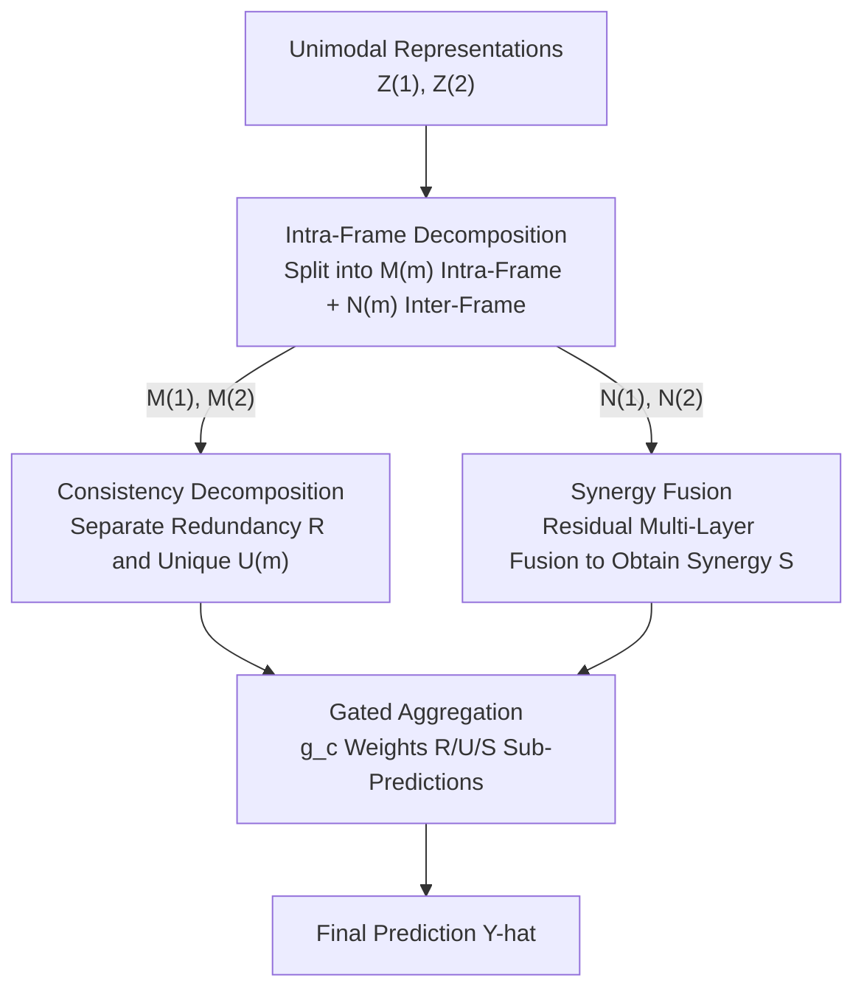

# Information-Theoretic Decomposition for Multimodal Interaction Learning

**Conference**: CVPR 2026  
**arXiv**: [2606.11614](https://arxiv.org/abs/2606.11614)  
**Code**: https://github.com/GeWu-Lab/DMIL (Yes)  
**Area**: Multimodal VLM  
**Keywords**: Multimodal Interaction, Information Decomposition, Redundancy/Uniqueness/Synergy, Variational Inference, Sample-level Adaptation

## TL;DR
This paper points out from an information-theoretic perspective that "multimodal interaction (Redundant R / Unique U / Synergistic S) varies dynamically per sample." It proves that conventional joint learning and modality ensembles are each only proficient in one type of interaction. The authors propose DMIL, which explicitly decomposes representations into R/U/S components using variational decomposition and specifically reinforces them through three-stage fine-tuning, achieving optimal performance across samples with different interaction compositions.

## Background & Motivation

**Background**: The essence of multimodal learning is to capture three types of information between modalities: **redundant (R, overlapping information provided by both modalities)**, **unique (U, information exclusive to one modality)**, and **synergistic (S, information that emerges only when the two modalities are combined)**. Liang et al. (PID framework) collectively refer to these as "multimodal interactions" and use information decomposition methods to quantify them for model selection and training data partitioning.

**Limitations of Prior Work**: Previous works almost exclusively treat interaction as a **dataset-level average** (e.g., "how much R/U/S a dataset has on average"), ignoring the critical fact that **interaction composition varies drastically sample-by-sample**. In the same task, some samples can be answered correctly by a single modality (U-dominant), while others require joint reasoning between both modalities (S-dominant, e.g., "Are there more red objects than small objects?" in VQA). Smoothing this sample-level heterogeneity into an average masks the model's true weaknesses.

**Key Challenge**: Existing paradigms handle interactions **implicitly** and are biased toward one type due to their inductive biases—what the authors call "interaction deficit." Specifically, **joint learning** projects modalities into a shared space for joint prediction, which is dominated by modality competition/imbalance. In scenarios rich in redundancy (e.g., ½U+½R), it is dominated by the strongest modality, suppressing others' contributions. **Modality ensembles** train single modalities separately and fuse them at the decision layer; while good at preserving single-modality information (redundancy), they are **structurally incapable of modeling the synergy** that emerges only upon union, leading to sharp performance drops in synergy-dominant scenarios (see Fig. 1).

**Goal**: ① Provide information-theoretic proof that "high-quality multimodal learning must cover the full spectrum of interactions"; ② Propose a paradigm capable of **sample-level adaptation** to learn from different interaction types.

**Key Insight**: The authors introduce a random variable $C$ to represent "interaction composition"—the specific combination of R/U/S in a sample—and derive a lower bound for the learned information $I(Z; Y)$ (Theorem 1):

$$I(Z; Y) \ge \mathbb{E}_c[I(Z; Y\,|\,c)] - H(C\,|\,Z) + I(Y; C).$$

This bound reveals two keys: the first term $\mathbb{E}_c[I(Z;Y|c)]$ requires the model to **perform well on average across all interaction compositions**; the $H(C|Z)$ term requires the representation $Z$ to **explicitly encode each sample's interaction composition** (by the Data Processing Inequality, $Z$ must retain input information related to the interaction as much as possible). This transforms "explicit decomposition + sample-level adaptation" from an intuition into a theoretical necessity.

**Core Idea**: Instead of letting the model learn interactions implicitly and unevenly, it is better to **explicitly decouple multimodal representations into R/U/S components** and then perform targeted reinforcement learning for each component. This allows the model to dynamically adjust its information processing strategy based on the true interaction composition of each sample.

## Method

### Overall Architecture
DMIL explicitly decomposes single-modality encoded representations $Z=(Z^{(1)},Z^{(2)})$ into four components: Redundant $R$, Unique $U^{(1)}/U^{(2)}$, and Synergistic $S$. These are then projected into the output space and dynamically weighted by a gating network for final prediction. The pipeline consists of **two-level decomposition + three-stage training** (Fig. 3, Fig. 4):

- **First Level—Intra-modality Decomposition (ID)**: For each modality, $Z^{(m)}$ is decomposed into an **intra-modality component $M^{(m)}$** (capable of independent target prediction) and an **inter-modality component $N^{(m)}$** (insufficient alone but serves as the basis for cross-modal synergy).
- **Second Level—Consistency Decomposition (CD)**: From the two $M^{(m)}$ components, it further separates **cross-model shared Redundancy $R$** and **modality-specific Uniqueness $U^{(m)}$**.
- **Synergy Construction**: The two inter-modality residuals $N^{(1)},N^{(2)}$ are combined through a multi-layer fusion mechanism to produce the **Synergistic component $S$**.
- **Gated Aggregation**: Each component $c\in\{R,U^{(1)},U^{(2)},S\}$ is linearly mapped to a sub-prediction $\hat y_c$. A gating network predicts weights $g_c$ for a weighted sum final output.

The logic for determining component types can be viewed as a decision tree (Fig. 4): Can information be acquired by a single modality? → If no, it is classified as Synergy $S$; if yes, is it consistent across modalities? → If consistent, it is Redundancy $R$, otherwise Uniqueness $U$.

### Key Designs

**1. Interaction Composition Theory and Lower Bound: Proving the Necessity of "Sample-level Adaptation"**

Addressing the pain point where dataset-level averages mask sample-level heterogeneity, the authors introduce the interaction composition variable $C$ to describe the specific R/U/S combination in a single sample, bringing macroscopic decomposition quantities ($\tilde R + \tilde U^{(1)} + \tilde U^{(2)} + \tilde S = I(X^{(1)},X^{(2)};Y)$) down to the sample level. Based on this, they prove the lower bound in Theorem 1: $I(Z;Y)\ge \mathbb{E}_c[I(Z;Y|c)] - H(C|Z) + I(Y;C)$. Its value lies not in being "just another bound" but in deriving the methodology: to maximize multimodal information, the model **must both learn well across all interaction types (first term) and enable the representation to explicitly encode the sample's interaction composition (small $H(C|Z)$)**. This provides the theoretical basis for the subsequent "explicit decomposition of R/U/S" and explains why joint learning/ensembles fall short—their implicit modeling cannot simultaneously minimize $H(C|Z)$ and cover the full spectrum. ⚠️ Refer to the original Appendix A for the specific derivation of the lower bound.

**2. Intra-modality Decomposition (ID): Separating "Independently Predictable" and "Synergy-only" Information**

To address the issue where synergistic information cannot be linearly extracted from a single modality, the ID module variationally decomposes $Z^{(m)}$ for each modality into $M^{(m)}$ (intra) and $N^{(m)}$ (inter). The optimization objective is:

$$\max\; I(Z^{(m)}; M^{(m)}, N^{(m)}) + I(M^{(m)}; Y) - I(Z^{(m)}; M^{(m)}) - I(Z^{(m)}; N^{(m)}),\quad m\in[2].$$

The intuition: $I(M^{(m)};Y)$ forces "directly useful" information for the target into $M^{(m)}$; the latter two terms minimize mutual information between $Z^{(m)}$ and each component to promote **decoupling**, allowing $N^{(m)}$ to settle residual information that "is insufficient for prediction alone but serves as a basis for cross-modal synergy." $N^{(m)}$ is not discarded but kept for constructing synergy $S$ later—exactly where modality ensembles fail (they isolate modalities, and the synergy potential in residuals is permanently lost).

**3. Consistency Decomposition (CD): Extracting Redundancy and Uniqueness from Predictable Information**

After obtaining two $M^{(m)}$, CD separates shared and specific parts:

$$\max\; 2\,I(M^{(1)}; M^{(2)}; R) - I(U^{(1)}; R) - I(U^{(2)}; R).$$

Maximizing the ternary mutual information term $I(M^{(1)};M^{(2)};R)$ enables $R$ to capture consensus information "consistently existing in both modalities." Minimizing $I(U^{(m)};R)$ pushes shared and modality-specific parts apart, such that $R$ models cross-modal consensus and $U^{(m)}$ retains predictive information that cannot be explained by the shared component. This step directly corresponds to the "is information consistent across modalities" branch in the Fig. 4 decision tree, cleanly stripping redundancy from uniqueness.

**4. Synergy Fusion + Gated Aggregation + Three-stage Training: Divide and Conquer then End-to-end Fine-tuning**

The synergistic component $S$ is constructed from two inter-modality residuals $N^{(1)},N^{(2)}$ via **multi-layer fusion**. The authors also designed a specific fusion paradigm for $S$ to transform complex synergistic interactions like XOR into linearly separable representations (details in Appendix B). After the four components are mapped to sub-predictions $\hat y_c$, a gating network dynamically predicts weights for aggregation:

$$\hat Y = \sum_{c\in\{R,U^{(1)},U^{(2)},S\}} g_c\,\hat y_c.$$

The gating weights $g_c$ are per-sample, implementing "adaptation according to each sample's true interaction composition"—synergy-dominant samples gift large weights to $S$, while single-modality dominant samples gift large weights to respective $U$ (verified in case studies). To stabilize training, a **three-stage** process is followed: Stage 1 trains the encoder + ID module to learn $M,N$; Stage 2 freezes Stage 1 to stabilize the representation space while training the CD module to extract $R,U$ and fuse $S$; Stage 3 performs full-parameter joint fine-tuning for end-to-end refinement while preserving the learned decomposition structure.

### Loss & Training
To translate the mutual information objectives into optimizable losses, three basic losses are defined: **Task Loss $L_t$** (proxy for $\max I(\cdot;Y)$, applied to $M^{(m)},R,U^{(m)},S$ and the final prediction $\hat Y$ to ensure task relevance), **Variational Loss $L_{Var}$** (approximates minimization of terms like $I(Z^{(m)};N^{(m)})$ and $I(U^{(m)};R)$ to promote latent factor decoupling), and **Alignment Loss $L_{Align}$** (applied to $R$ to force cross-modal consistency). The targets for the three stages are:

$$L_1 = \sum_{m\in[2]}\big[L_t(M^{(m)}) + L_{Var}(M^{(m)}, N^{(m)})\big],$$

$$L_2 = \sum_{c\in\{R,U,S\}} L_t(c) + \sum_{m\in[2]} L_{Var}(U^{(m)}, R) + \alpha\,L_{Align}(R),$$

$$L_3 = L_t(\hat Y) + \beta L_1 + \gamma L_2.$$

Where $\alpha,\beta,\gamma$ are weight hyperparameters. ⚠️ For specific variational upper/lower bound forms and hyperparameter values, refer to Appendix A.3 / B of the original text.

## Key Experimental Results

### Main Results
On 5 real multimodal datasets (CREMA-D audio-visual emotion, Kinetic-Sounds audio-visual action, UCF101 RGB+Optical Flow, KS-ViT, CMU-MOSEI vision+text emotion) over 5 runs, DMIL achieved the best performance across all datasets and both CNN/Transformer backbones (selected from Table 1, unit %):

| Dataset (Metric ACC) | Joint | Ensemble | MLB | MCR | **DMIL** |
|------|------|------|------|------|------|
| CREMA-D | 72.55 | 74.87 | 75.94 | 76.34 | **77.02** |
| Kinetic-Sounds | 85.07 | 85.86 | 85.52 | 86.41 | **86.72** |
| UCF101 | 79.33 | 83.63 | 83.25 | 82.81 | **85.01** |
| KS (ViT) | 67.81 | 71.80 | 71.22 | 69.51 | **74.20** |
| CMU-MOSEI | 79.42 | 79.18 | 79.56 | 80.77 | **81.12** |

The comparison groups cover conventional paradigms (Joint/Ensemble), regularization methods (OGM/PMR/AGM), and interaction modeling methods (MMTM/MMIB/QMF/FCL/MLB/MMML/MCR/I2M2). Key observation: Whether Joint vs. Ensemble is stronger **depends entirely on the dataset and architecture** (no universally optimal fusion), whereas DMIL leads consistently across settings due to explicit decoupling followed by targeted fusion. On KS-ViT, it outperformed the second-best (Ensemble 71.80) by **+2.4** ACC, one of the most significant Gains.

### Synergy Verification (Synthesis + Synergy indicator)
On synergy-dominant VQAv2 and CLEVR, the **Synergy indicator** (proportion of samples where the multimodal prediction is correct, but both single-modality predictions are incorrect) was used to quantify synergy capture capability:

$$\text{Synergy} = \frac{1}{N}\sum_{i=1}^N \mathbb{I}\big(\hat y_i = y_i \;\wedge\; \hat y_i^{(1)}\neq y_i \;\wedge\; \hat y_i^{(2)}\neq y_i\big).$$

| Method | VQAv2 ACC | VQAv2 Syn. | CLEVR ACC | CLEVR Syn. |
|------|------|------|------|------|
| Ensemble | 58.03 | 0.00 | 58.35 | 0.00 |
| Joint | 67.69 | 9.48 | 62.65 | 7.53 |
| **DMIL** | **70.08** | **11.44** | **63.08** | **9.69** |

Ensemble's Synergy is consistently 0 (structurally unable to learn synergy), confirming the motivation analysis; DMIL's Synergy score is the highest, indicating that performance gains indeed stem from stronger synergy capture capabilities.

### Ablation Study
Fig. 6 (ACC on CREMA-D / KS, %):

| Configuration | CREMA-D | KS | Description |
|------|------|------|------|
| **DMIL (Full)** | **77.0** | **86.7** | Variational Decomposition + ID + CD modules |
| DMIL-FC | 74.2 | 85.4 | Variational layers replaced by FC layers → verifies variational necessity |
| DMIL-ID | 75.3 | 86.2 | Only preserves Intra-modality Decomposition module |
| DMIL-CD | 73.7 | 84.5 | Only preserves Consistency Decomposition module |

### Key Findings
- **Variational methods are key to decoupling**: DMIL→DMIL-FC dropped 2.8 points on CREMA-D (77.0→74.2), indicating that interaction components cannot be effectively decoupled after replacing variational layers with standard FC layers.
- **Both decomposition modules are indispensable**: Retaining only ID (75.3/86.2) or only CD (73.7/84.5) yields significantly lower results than the full model. CD used alone is the worst variant on CREMA-D, verifying the necessity of the "two-level decomposition."
- **Scalable to three modalities**: By introducing DMIL-ID to three modalities (MOSEI V/A/T, UCF101 RGB/Flow/Frame-diff), ACC remains superior to Joint/Ensemble (Table 3, e.g., UCF101 85.81 vs Ensemble 84.76).
- **Stronger OOD Generalization**: When classes are split into disjoint ID/OOD sets, DMIL trained only on ID still leads on OOD (KS OOD 56.04 vs Joint 52.95). Explicitly learning interactions avoids overfitting to training correlations.
- **Interpretability**: In case studies, "Is the red object more frequent than small objects?" is assigned Synergy=1, while "Is the person left-handed?" relies primarily on text priors and is assigned higher unique weights for text. Gating weights align with human intuition regarding sample interaction types.

## Highlights & Insights
- **Proving "Sample-level Adaptation" as a Theoretical Necessity**: Theorem 1's bound simultaneously requires "covering the full spectrum of interactions" and "explicitly encoding interaction composition in representations." This provides a unified basis for both "explicit R/U/S decomposition" and "sample-level gated weighting," tightly coupling theory and methodology.
- **Residuals aren't Trash, they Build Synergy**: The ID module deliberately retains "unpredictable from single modality" inter-modality residuals $N^{(m)}$ to construct synergy $S$. This accurately targets the weakness of modality ensembles: "isolating modalities → permanent loss of synergy." This idea of "treating others' noise as treasures" is highly transferable.
- **Synergy Indicator = Direct Quantification**: The proportion of samples where "multimodal is correct, but both single modalities are wrong" is a clean synergy metric. The result where Ensemble is consistently 0 practically turns the motivation into experimental evidence.
- **Paradigm, Not Just a Module**: DMIL is not tied to a specific backbone (ResNet18, ViT, Transformer are all verified). It is an "interaction-centric" training paradigm that can be plugged into various architectures with low migration costs.

## Limitations & Future Work
- **Theory Limited to Two Modalities**: Defining R/U/S via information theory for ≥3 modalities involves high-order mutual information, which is an open problem. The three-modality experiment is an engineering expansion of DMIL-ID, not a full theoretical generalization (acknowledged by authors).
- **Heavy Pipeline**: Two levels of variational decomposition + three-stage training + multiple loss weights ($\alpha,\beta,\gamma$) result in significantly higher training complexity and tuning costs than single-stage joint learning. Comparison of training overhead/convergence was not provided. ⚠️ Refer to Appendix for computational cost details.
- **Synergy Fusion Details in Appendix**: The specific fusion paradigm transforming XOR-like synergy into "linearly separable representations" is only briefly mentioned in the main text; reproduction relies on the Appendix and code.
- **Untouched LLM Scenarios**: The authors list "capturing and explaining interaction mechanisms in MLLMs" as a future direction. Current experiments are on mid-sized classification/emotion/VQA tasks; whether this holds for large-scale generative multimodal models is unknown.

## Related Work & Insights
- **vs. PID Framework (Liang et al. [3])**: They use information decomposition to **quantify dataset-level** averages of R/U/S for model selection/data partitioning; Ours brings it down to the **sample level** (Interaction Composition $C$) and directly constructs a **learnable decomposition architecture**, moving from "measuring interaction" to "explicitly learning interaction."
- **vs. Joint Learning (OGM/PMR/AGM, etc.)**: These alleviate modality competition/imbalance in shared space through regularization but still handle interactions implicitly, dominated by strong modalities in redundancy-rich scenarios. DMIL divides and conquers after explicitly stripping R/U/S, fundamentally avoiding the suppression of redundancy utilization by modality competition.
- **vs. Modality Ensemble / I2M2**: Ensembles excel at preserving single-modality information (redundancy) but cannot structurally learn synergy (Synergy is consistently 0); DMIL explicitly adds synergy back by preserving and fusing inter-modality residuals.
- **vs. Interaction Modeling (MMIB/FCL/MCR/MLB)**: These methods perform differently across datasets and lack a universally optimal fusion. DMIL uses a unified "decomposition + gated adaptation" to lead consistently across all settings, emphasizing paradigm-level consistency over point-wise optimization.

## Rating
- Novelty: ⭐⭐⭐⭐⭐ First to analyze "sample-level interaction dynamics" via information theory and design an explicit decomposition paradigm accordingly; tight coupling of theory and method.
- Experimental Thoroughness: ⭐⭐⭐⭐⭐ 5 real-world datasets + synthesis synergy verification + ablation + 3-modality + OOD + case studies; broad coverage.
- Writing Quality: ⭐⭐⭐⭐ Motivation-Theory-Method logic is clear, but key details like synergy fusion are pushed to the appendix, leaving the main text slightly vague.
- Value: ⭐⭐⭐⭐⭐ Proposes an "interaction-centric" training paradigm applicable to multiple backbones, providing methodological inspiration for the multimodal fusion field.

<!-- RELATED:START -->

## Related Papers

- [\[AAAI 2026\] Information Theoretic Optimal Surveillance for Epidemic Prevalence in Networks](../../AAAI2026/multimodal_vlm/information_theoretic_optimal_surveillance_for_epidemic_prevalence_in_networks.md)
- [\[CVPR 2026\] Multi-speaker Attention Alignment for Multimodal Social Interaction](multi-speaker_attention_alignment_for_multimodal_social_interaction.md)
- [\[CVPR 2026\] Learning to Focus and Precise Cropping: A Reinforcement Learning Framework with Information Gaps and Grounding Loss for MLLMs](learning_to_focus_and_precise_croppinga_reinforcement_learning_framework_with_in.md)
- [\[CVPR 2026\] Parameter-Efficient Adaptation for MLLMs via Implicit Modality Decomposition](parameter-efficient_adaptation_for_mllms_via_implicit_modality_decomposition.md)
- [\[CVPR 2026\] From Weights to Concepts: Data-Free Interpretability of CLIP via Singular Vector Decomposition](from_weights_to_concepts_data-free_interpretability_of_clip_via_singular_vector_.md)

<!-- RELATED:END -->
