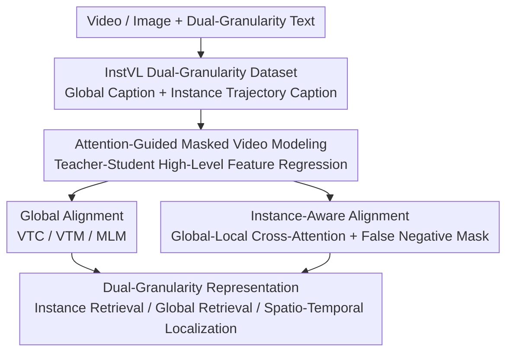

# InstAP: Instance-Aware Vision-Language Pre-Train for Spatial-Temporal Understanding

**Conference**: CVPR 2026  
**Paper**: [CVF Open Access](https://openaccess.thecvf.com/content/CVPR2026/html/Kumar_InstAP_Instance-Aware_Vision-Language_Pre-Train_for_Spatial-Temporal_Understanding_CVPR_2026_paper.html)  
**Code**: To be confirmed  
**Area**: Multimodal VLM  
**Keywords**: Vision-Language Pre-training, Instance-level Alignment, Spatio-Temporal Understanding, Video Retrieval, Cross-modal Contrastive Learning

## TL;DR
InstAP jointly optimizes "global alignment" and "instance-level alignment" in a single video-language pre-training objective. By fusing target bounding box features with full-scene context using cross-attention and then performing contrastive learning with corresponding instance descriptions, and utilising the self-constructed dual-granularity dataset InstVL, the model is capable of aligning entire videos with full sentences while precisely grounding terms like "red ball" or "jumping dog" onto their corresponding spatio-temporal trajectories. In doing so, it substantially outperforms existing VLP models in instance-level retrieval, while also achieving state-of-the-art (SOTA) performance on global zero-shot retrieval tasks (e.g., MSR-VTT, DiDeMo).

## Background & Motivation
**Background**: Vision-Language Pre-training (VLP) represented by CLIP has learned highly transferable representations over massive image-text pairs via contrastive learning, showing strong zero-shot generalization capabilities. When extended to the video domain, the mainstream approach (such as CLIP4Clip, UMT, and VideoPrism) still matches the **pooled embedding of the entire video** with the **entire caption**, which performs a coarse-grained global alignment.

**Limitations of Prior Work**: Global alignment naturally averages features, smoothing out fine-grained instance-level details. For instance, given the sentence "a child throws a red ball while a dog jumps", models trained solely on global alignment can capture the overall event but fail to determine which region in the frame represents the "ball" or the "dog". This directly limits downstream tasks requiring accurate grounding, such as fine-grained retrieval, spatio-temporal localization, and object-centric question answering.

**Key Challenge**: Learning instance-level representations is challenging due to deficiencies on both ends. On the **data** side, the vast majority of large-scale video-text datasets only contain high-level global descriptions, lacking grounded annotations that link words to regions or trajectories. Existing grounded datasets are either in the image domain (such as Visual Genome and Flickr30k), structured as closed-vocabulary predicates (such as `<subject, chase, object>` in VidOR), or only ground noun phrases to single frames (such as ActivityNet-Entities), all of which lack free-form sentences paired with temporally continuous trajectories. On the **objective** side, existing pre-training losses only reward global alignment; thus, models have no incentive to focus on instance details.

**Limitations of Prior Work**: Prior works mostly rely on "post-hoc grafting" of instance information—either feeding region labels using pre-trained object detectors (inheriting detector errors) or adding specialized instance segmentation heads (treating instance understanding as an auxiliary, specialized task). These signals act as external features and are not integrated into the core representation learning, falling short of true instance-level alignment.

**Goal / Core Idea**: The authors advocate that **instance-level understanding should be a core property of the representation itself, not an auxiliary task**. Consequently, instance awareness is directly embedded into the pre-training phase: while preserving global alignment, a new instance-level contrastive objective is introduced to force alignment between "specific text mentions" and "corresponding object-level visual features". To facilitate this training, they construct InstVL, the first large-scale, general-domain, free-form sentence-annotated dataset that simultaneously covers static regions and spatio-temporal video trajectories.

## Method

### Overall Architecture
InstAP employs a "one dataset + two-stage training" pipeline. On the data side, InstVL provides two sets of text for each image/video sample: a **global scene caption** and a set of **instance-level captions linked to specific regions/spatio-temporal trajectories**. On the training side, a two-step process is adopted: first, a spatio-temporal video encoder is trained from scratch using self-supervised masked video modeling (teacher-student); second, **dual-granularity (global + instance) alignment** is performed on this encoder. The global branch performs video-text contrast, matching, and masked language modeling as usual, while the instance branch crops each target box, fuses the crop tokens into the full-scene context via Global-Local cross-attention, and conducts contrastive learning with the corresponding instance descriptions. The final output is a unified representation encoding both global semantics and precise instance grounding, which can be directly transferred zero-shot to retrieval and localization tasks.

### Key Designs

**1. InstVL Dual-Granularity Dataset and Automatic Annotation Pipeline: Filling the Gap of Free-form Sentences + Spatio-Temporal Trajectories**

The fundamental bottleneck of instance-aware pre-training is the lack of suitable large-scale data. InstVL contains 2 million images and 50k videos, with each sample annotated at **dual granularities**: a global scene caption and a set of instance-level free-form sentence descriptions linked to specific visual regions (2D boxes for images) or spatio-temporal trajectories (bounding box sequences across frames for videos). The annotation pipeline is fully automated with a clear division of labor: training images are sourced from LAION-400M, and videos from processed HDVILA clips; the zero-shot test set is specifically sourced from COYO (no overlap with the training source, introducing distribution shift to verify generalization without memorizing the training distribution). AutoShot is first used for scene boundary detection/sharding, followed by GroundingDINO for open-vocabulary detection, SAM2 for instance tracking to obtain spatio-temporal trajectories, and finally, a large vision-language model is fed with regions/trajectories alongside visualized bounding box prompts to simultaneously generate global captions and fine-grained instance descriptions, followed by multiple rounds of manual prompt iteration. The evaluation suite is split into five mutually exclusive subsets (InstVL-1K/10K images, corresponding zero-shot images, and InstVL-1K video), where `img-zero` is derived from COYO while training images are from LAION, confirming through this distribution shift that performance is not simply inherited from the training distribution. This dataset serves as a prerequisite for the instance alignment objective to stand.

**2. Attention-Guided Masked Video Modeling: Pre-training a Strong Spatio-Temporal Encoder via Teacher-Student High-Level Feature Regression**

While masked autoencoders performing pixel-level reconstruction are data-efficient, low-level objectives often conflict with high-level alignment required by language tasks. InstAP instead utilizes a teacher-student framework to perform **high-level feature regression on visible tokens**: the video $V=\{I_1,\dots,I_T\}$ is divided into $L=TN$ patch tokens, and a frozen ViT is first used to compute a self-attention map $A\in\mathbb{R}^{L\times L}$. Token importance is computed as $s=\frac{1}{L}A\mathbf{1}$, and the $\lceil\rho L\rceil$ lowest-scoring tokens are masked (with a masking ratio as high as 80%). Only the visible token set $\Omega$ is fed into the student encoder $f_\theta$. The teacher $g$ computes features $h^T_l$ over all tokens as the regression targets, and the loss is the L2 distance of normalized features:

$$\mathcal{L}_{rec}=\frac{1}{|\Omega|}\sum_{l\in\Omega}\left\|\frac{h^S_l}{\|h^S_l\|_2}-\frac{h^T_l}{\|h^T_l\|_2}\right\|_2^2$$

This is effective because attention guidance ensures that the masked tokens are the most informative ones. The student must reconstruct the teacher's full context representation relying only on a small fraction of visible tokens. This challenging regression task forces stronger spatio-temporal representations. Meanwhile, the high-level feature target bypasses heavy reconstruction decoders and only processes visible tokens, yielding better GPU memory efficiency, faster convergence, and representations more suitable for cross-modal alignment. The encoder trained here (ViT-L, guided by a frozen CLIP-ViT-L teacher) achieves 87.84% top-1 accuracy under linear probing on Kinetics-400 and serves as the initialization for the second-stage alignment training.

**3. Instance-Aware Alignment with Global-Local Cross-Attention: Precisely Grounding Words to Trajectories and Masking Intra-Video False Negatives**

This is the core of InstAP. For each instance (box $b_{i,k}$ + description $T_{i,k}$) in each video, the cropped patch tokens of crop $C_{i,k}$ are first extracted through the video encoder. Then, **cross-attention** is employed where crop tokens act as Query to attend to full-scene features $V_i$ acting as Key/Value, injecting the global context into the instance features:

$$Z_{i,k}=\mathrm{XAttn}(C_{i,k},V_i),\quad z_{i,k}=\frac{1}{L_c}\sum_l Z_{i,k,l},\quad \tilde z_{i,k}=W_v z_{i,k}$$

The resulting "instance-aware embedding" preserves local object information while inheriting the global environment. It is then contrasted with the instance sentence embedding $\tilde s_{i,k}$. Here lies a crucial trap: **instance descriptions of different objects within the same video often have overlapping semantics** (e.g., multiple similar instances in a frame), and directly contrasting them will erroneously treat them as negative samples (false negatives). To address this, the contrastive loss in InstAP includes a mask $\mu_{n,m}$, where other instances $m$ originating from the same video/image as $n$ are excluded from the negative samples in the denominator ($\mu_{n,m}=0$), while others are kept ($\mu_{n,m}=1$):

$$\mathcal{L}^{inst}_{VTC}=-\frac{1}{N}\sum_n\log\frac{\exp(\tilde z_n^\top\tilde s_n/\tau_{inst})}{\sum_m\mu_{n,m}\exp(\tilde z_n^\top\tilde s_m/\tau_{inst})}-\frac{1}{N}\sum_n\log\frac{\exp(\tilde s_n^\top\tilde z_n/\tau_{inst})}{\sum_m\mu_{n,m}\exp(\tilde s_n^\top\tilde z_m/\tau_{inst})}$$

The instance branch is also equipped with an instance-level VTM (judging positive/hard negative pairs using a shared fusion transformer $m_\phi$) and an instance-level MLM (recovering masked words conditioned on the cross-attention visual context $Z_{i,k}$). Complemented by an independent, learnable instance temperature $\tau_{inst}$ and a separate loss weight, the sparse instance signals are properly balanced during large-scale mixed training—ablation studies reveal that this "independent temperature" contributes significantly. Why it works: cross-attention ensures instance embeddings are contextualized rather than isolated; the false-negative mask prevents self-contradiction in the contrastive objective; the independent temperature/weight prevents instance signals from being overwhelmed by global signals—together enabling true sentence-level grounding within the core representations instead of post-hoc grafting.

### Loss & Training
The global branch leverages three targets: bidirectional video-text contrastive loss $\mathcal{L}_{VTC}$ (with learnable temperature $\tau$), video-text matching loss $\mathcal{L}_{VTM}$ from the fusion transformer $m_\phi$ (binary classification for positive/hard-negative pairs), and masked language modeling $\mathcal{L}_{MLM}$. The instance branch mirrors these three metrics ($\mathcal{L}^{inst}_{VTC/VTM/MLM}$). Each set has independent weights for separate tuning:

$$\mathcal{L}_{global}=\lambda_{VTC}\mathcal{L}_{VTC}+\lambda_{VTM}\mathcal{L}_{VTM}+\lambda_{MLM}\mathcal{L}_{MLM}$$

$$\mathcal{L}_{inst}=\lambda^{inst}_{VTC}\mathcal{L}^{inst}_{VTC}+\lambda^{inst}_{VTM}\mathcal{L}^{inst}_{VTM}+\lambda^{inst}_{MLM}\mathcal{L}^{inst}_{MLM}$$

The total loss incorporates the masked video reconstruction loss: $\mathcal{L}=\mathcal{L}_{rec}+\mathcal{L}_{global}+\mathcal{L}_{inst}$. Training details: In the first stage, masked video modeling is trained for 800 epochs (8 frames of 224x224, AdamW, lr=1.5e-4, batch size 64, 80% mask ratio, on 320 H100 GPUs). In the second stage, alignment training runs for 15 epochs on a mixture of image-text pairs (CC3M/CC12M/SBU/VG/COCO/ShareGPT4V + 5M WebVid) and InstVL (2M images + 50K videos). The instance loss weight is set to $\lambda_{inst}=0.1$. Each clip samples 16 frames (experimentally found to be optimal; 32 frames slightly degrades performance). If captions are too long, a single sentence is randomly sampled per epoch, iterating through all candidate sentences across epochs. Training is conducted on 200 B200 GPUs.

## Key Experimental Results

### Main Results
Instance-level and global retrieval (T2V R@1) on the InstVL test sets. `UMT-L (InstVL; g)` only uses global captions, while `(g+i)` treats all captions as global descriptions. Both utilize the **exact same training corpus** as InstAP to isolate the "framework gains vs. data gains."

| Method | InstVL-10K(img) Instance | InstVL-1K(video) Instance | InstVL-1K(video) Global |
|------|------|------|------|
| OpenCLIP | 29.21 | 36.63 | 82.00 |
| SigLIP | 29.76 | 36.43 | 74.72 |
| UMT-L | 21.34 | 26.38 | 88.30 |
| UMT-L (InstVL; g) | 22.87 | 41.51 | 84.80 |
| UMT-L (InstVL; g+i) | 34.83 | 40.38 | 79.90 |
| **InstAP (Ours)** | **44.05** | **60.63** | **94.50** |

Under the same corpus, InstAP improves InstVL-10K (img) instance T2V R@1 from 34.83 (with `g+i`) to 44.05, and video instance from 40.38 to 60.63, demonstrating that gains stem from the instance-alignment framework rather than merely digesting dense annotations.

Zero-shot text-to-video retrieval (R@1) without additional fine-tuning:

| Method | MSR-VTT | DiDeMo | MSVD | ActivityNet |
|------|---------|--------|------|-------------|
| UMT-L | 39.7 | 47.0 | 47.0 | 44.3 |
| UMT-L (InstVL; g) | 35.4 | 44.1 | 43.7 | 39.8 |
| UMT-L (InstVL; g+i) | 34.0 | 42.7 | 41.3 | 37.1 |
| **InstAP (Ours)** | **41.1** | **54.0** | **49.2** | **50.7** |

Notably, directly fine-tuning UMT-L on InstVL (`g` or `g+i`) leads to a performance drop compared to the original UMT-L (due to task interference/domain shifts). In contrast, InstAP not only avoids degradation but also outperforms the original UMT-L on MSR-VTT and DiDeMo—indicating that instance-level pre-training indeed benefits global understanding.

### Ablation Study
Table 5 shows the cumulative effect of components added to the baseline containing $\mathcal{L}_{inst}$ (represented as mean recall, averaged over R@1/5/10 on both T2V and V2T):

| Configuration | InstVL-1K(img) | InstVL-1K(img-zero) | InstVL-1K(video) |
|------|------|------|------|
| Baseline | 59.10 | 46.37 | 45.48 |
| + Learnable Instance Temp | 67.19 | 54.90 | 55.22 |
| + Weighted Instance Loss | 68.17 | 56.00 | 58.16 |
| + Caption Subsampling | 71.65 | 58.42 | 58.97 |
| + Instance Trajectories (50K Videos) | 75.03 | 63.94 | **75.32** |

Another ablation study (Table 4) directly inspects the efficacy of $\mathcal{L}_{inst}$: removing it to use only $\mathcal{L}_{rec}+\mathcal{L}_{global}$ leads to a drop in InstVL-1K (video) instance mean recall from 75.32 to 57.71 ($-17.61$), and a drop in img-zero instance mean recall from 63.94 to 49.98 ($-13.96$). Global metrics of InstAP also degrade (video global 97.03 $\rightarrow$ 91.55, DiDeMo 70.01 $\rightarrow$ 65.98), demonstrating that $\mathcal{L}_{inst}$ is not only critical for instance capability but also enhances the robustness of global representations.

### Key Findings
- **Instance alignment loss $\mathcal{L}_{inst}$ is critical**: Removing it triggers a massive drop in instance retrieval (video instance decreases by $-17.61$), and global metrics deteriorate simultaneously. Fine-grained alignment and global understanding are not a trade-off but mutually beneficial.
- **Learnable instance temperature offers the most prominent contribution**: Adding it individually yields a $+8.09$ improvement on InstVL-1K (img), highlighting its critical role in balancing sparse instance signals.
- **The 50K video trajectory data yields the largest gain**: It contributes $+16.35$ on InstVL-1K (video), demonstrating that explicit pre-training on spatio-temporal trajectories is indispensable for spatio-temporal understanding. Continuous temporal grounding cannot be fully learned from image-level instance layouts alone.
- **Failure mode analysis**: Out of 1,500 instance retrieval errors, confusion among multiple instances in heavily occluded/cluttered scenes accounts for 44.6%; background dominance or lack of visual evidence in small crops accounts for 24.6%; and cross-sample semantic matching accounts for 13.1% (totaling 82.3%). This reveals that cluttered scenes and sparse visual signals remain primary challenges.

## Highlights & Insights
- **Embedding instance understanding as a "core representation property" rather than an auxiliary task**: Instead of grafting pre-trained detectors/segmentation heads post-hoc, an instance-level contrastive loss is directly embedded in the pre-training targets. This fundamentally bypasses the propagation of detector errors, distinguishing it from popular "grafted-on" approaches.
- **The false-negative mask $\mu_{n,m}$ is a simple yet vital engineering detail**: Semantic overlaps among similar instance descriptions within the same video can confuse contrastive objectives; a direct "same-source exclusion" mask elegantly resolves this contradiction. This concept is highly transferable to any fine-grained region-text contrastive scenarios.
- **Global-Local cross-attention prevents isolated instance features**: Treating crops as Queries to attend to the global scene preserves local objects while enriching them with environment cues, which is more stable than encoding cropped regions in isolation.
- **Counter-intuitive finding of "fine-grained grounding benefiting global representations"**: While joint fine-grained learning is often assumed to compromise global retrieval, it actually elevates performance to SOTA levels on MSR-VTT/DiDeMo and resolves the performance degradation observed when fine-tuning UMT-L directly on InstVL, strongly endorsing multi-granularity joint training.

## Limitations & Future Work
- **Failure modes concentrate on cluttered/occluded scenes**: Multi-instance confusion and insufficient visual evidence in small-scale crops account for approximately 69% of retrieval errors, indicating that grounding remains unstable under heavy occlusion and background-dominated contexts.
- **Heavy reliance on automatic annotation quality**: The instance captions in InstVL are derived from a cascaded pipeline of GroundingDINO + SAM2 + large VLMs. Although moderated by manual prompt iterations, cascading errors from detection, tracking, and description generation inevitably seep into the training data. The paper does not quantify the impact of annotation noise on final representations.
- **Prohibitively high computational requirements**: Phase one takes 320 H100 GPUs and phase two takes 200 B200 GPUs (180GB VRAM/GPU). Such replication costs are virtually inaccessible, limiting community validation and expansion.
- **Promising future directions**: Introducing explicit instance differentiation or ranking losses for occluded multi-instance scenarios; incorporating automatic consistency filtering to denoise the annotation pipeline; and exploring lighter instance branches to reduce alignment-phase computational overhead.

## Related Work & Insights
- **vs. UMT / VideoPrism (Teacher-Student Distillation)**: These approaches align a student with the **global representation** of a CLIP teacher, where instance cues only emerge implicitly and are never explicitly aligned with corresponding text mentions. InstAP borrows teacher-student masked modeling for encoder initialization but introduces an explicit instance-level alignment objective to turn "words $\rightarrow$ trajectories" into a supervisable signal.
- **vs. CLIP4Clip / CLIP-ViP (CLIP-paradigm Video Retrieval)**: These models align complete clip embeddings with whole sentences, averaging features and erasing instance details. InstAP supplements global alignment with a distinct instance branch.
- **vs. Grafted Detector/Segmentation-head approaches (e.g., using GroundingDINO for region labels or adding instance segmentation heads)**: These treat instance understanding as specialized auxiliary tasks and inherit detector errors. InstAP integrates instance awareness directly into the core pre-training representation. Note that while InstAP uses GroundingDINO+SAM2 to **build the dataset**, this is only done for offline grounding annotation and does not enter the inference path, avoiding coupling with runtime detector errors.
- **vs. Grounded Datasets (Visual Genome / Flickr30k Entities / VidOR / ActivityNet-Entities)**: Prior datasets are restricted to the image domain, structured short phrases/closed-vocabulary predicates, or only connect single-frame noun phrases. InstVL stands as the first large-scale, general-domain, free-form, and spatio-temporal video trajectory-mapped dataset resource.

## Rating
- **Novelty**: ⭐⭐⭐⭐ Establishing instance alignment as a core pre-training objective alongside the false-negative mask and the dual-granularity dataset provides a solid combination, though individual components (cross-attention, contrastive masking) are not entirely unprecedented.
- **Experimental Thoroughness**: ⭐⭐⭐⭐⭐ Isolating data vs. model gains on the UMT-L baseline, zero-shot benchmarks, grounding, structured ablations, and failure mode analyses are highly comprehensive.
- **Writing Quality**: ⭐⭐⭐⭐ Formulations and pipelines are clearly articulated, although the OCR notations are slightly unpolished, the overall logic remains sound.
- **Value**: ⭐⭐⭐⭐ Instance-level spatio-temporal grounding is a major bottleneck in VLP. Both the method and the dataset hold high potential for transferability, though the steep hardware requirements limit widespread reproduction.

<!-- RELATED:START -->

## Related Papers

- [\[CVPR 2026\] MMLandmarks: a Cross-View Instance-Level Benchmark for Geo-Spatial Understanding](mmlandmarks_a_cross-view_instance-level_benchmark_for_geo-spatial_understanding.md)
- [\[CVPR 2026\] TempR1: Improving Temporal Understanding of MLLMs via Temporal-Aware Multi-Task Reinforcement Learning](tempr1_improving_temporal_understanding_of_mllms_via_temporal-aware_multi-task_r.md)
- [\[CVPR 2026\] Grounded 3D-Aware Spatial Vision-Language Modeling](grounded_3d-aware_spatial_vision-language_modeling.md)
- [\[CVPR 2026\] Flat-Pack Bench: Evaluating Spatio-Temporal Understanding in Large Vision-Language Models through Furniture Assembly](flat-pack_bench_evaluating_spatio-temporal_understanding_in_large_vision-languag.md)
- [\[CVPR 2026\] HiSpatial: Taming Hierarchical 3D Spatial Understanding in Vision-Language Models](hispatial_taming_hierarchical_3d_spatial_understanding_in_vision-language_models.md)

<!-- RELATED:END -->
