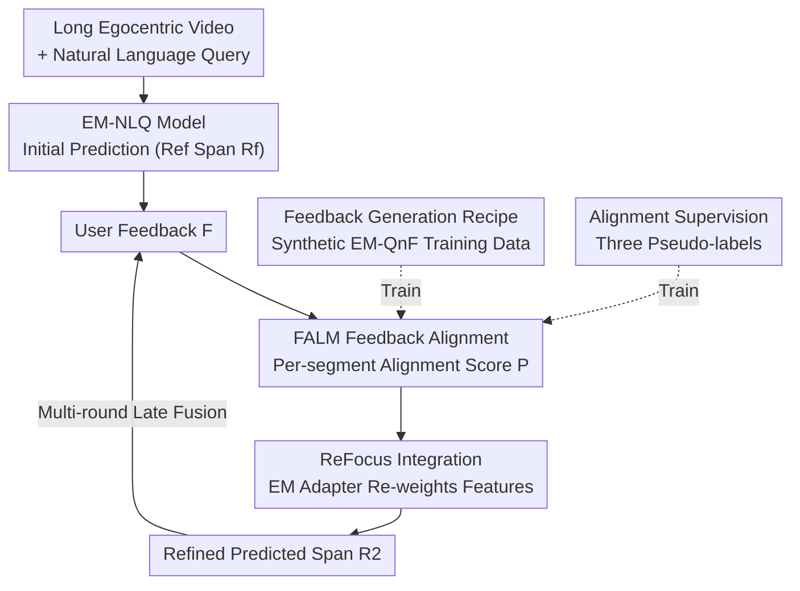

# Interactive Episodic Memory with User Feedback

**Conference**: CVPR 2026  
**arXiv**: [2604.24893](https://arxiv.org/abs/2604.24893)  
**Code**: https://nsubedi11.github.io/refocus (Project Homepage)  
**Area**: Multimodal VLM / First-person Video / Episodic Memory Retrieval  
**Keywords**: Episodic Memory, Natural Language Query Localization, User Feedback, Interactive Retrieval, Plug-and-play Module

## TL;DR
Addressing the challenge of "localizing the moment that answers a query in long egocentric videos" (EM-NLQ), which currently only provides one-shot results without error correction, this paper proposes the interactive EM-QnF task, a synthetic feedback data generation recipe requiring no human annotation, and the plug-and-play feedback alignment module FALM. FALM assigns "alignment scores" to each video segment and re-weights the original model features. This allows existing EM-NLQ models to shift focus to the correct segments based on user feedback without introducing heavy LLMs, achieving R1/R5 gains of up to +4.9/+5.4 across three benchmarks.

## Background & Motivation
**Background**: Episodic Memory + Natural Language Query (EM-NLQ) allows users to query ultra-long egocentric videos taken by wearable cameras (e.g., "Where did I put the cup?"). The model must localize the time window $\mathcal{R}=[t_s,t_e]$ that answers the question within unclipped long videos. Recent works mainly focus on performance, efficiency, and low-data generalization.

**Limitations of Prior Work**: All existing EM-NLQ methods are **one-shot** localization—given a query, one prediction is output, and the task ends. In reality, user queries are often **ambiguous or incomplete** ("The big blue cup or the white one?"), and models are likely to be wrong initially. Users naturally supplement or correct information after seeing incorrect results (e.g., "No, before this, when I started cooking"). Existing models are entirely unable to utilize such feedback.

**Key Challenge**: Large Vision-Language Models (LVLMs) seem naturally suited for interaction as they are trained on dialogue, instruction following, and user alignment. However, experiments in this paper find that fine-tuning LVLMs for video understanding **actually weakens their ability to respond to feedback** (many metrics show negative $\Delta$ after adding feedback). Furthermore, they rely on massive visual backbones, which are slow and heavy, making them unsuitable for on-device episodic memory. This creates a dilemma: task-expert models good at localization cannot use feedback, while linguistically capable LVLMs lack precise localization and are too heavy.

**Goal**: (1) Extend EM-NLQ into a new task, EM-QnF, permitting multi-round feedback error correction; (2) Create trainable data without existing feedback datasets or expensive human annotation; (3) Enable existing lightweight task-expert models to "learn" how to use feedback without stacking LLMs.

**Key Insight**: User feedback essentially tells the model "in which direction the answer should move." This can be converted into a **segment-wise alignment scoring** problem, which then re-weights the video features of the original model to non-intrusively "shift" its attention.

**Core Idea**: Use a plug-and-play Feedback ALignment Module (FALM) to predict "alignment scores for each segment," and then inject these scores via a lightweight adapter into any EM-NLQ model to re-weight features, allowing the model to "**ReFocus**" on segments consistent with user intent.

## Method

### Overall Architecture
The entire system is named **ReFocus**. It aims to enable off-the-shelf EM-NLQ models to understand user feedback and refine predictions. The inference flow is: long video + query are first processed by an off-the-shelf EM-NLQ model to provide an **initial prediction** (reference span $\mathcal{R}^f$, potentially incorrect); the user providing natural language **feedback** $\mathcal{F}$ regarding this span; FALM takes (video, query, reference span, feedback) inputs and outputs an **alignment score** $P_i\in[0,1]$ for each segment $C_i$; these scores, after being scaled and shifted by a lightweight EM Adapter, **re-weight** the original EM-NLQ model's video features, shifting focus to segments aligned with feedback to produce a refined span $\mathcal{R}_2$. For multiple rounds, each feedback is processed individually before late fusion. On the training side, a **synthetic feedback generation recipe** converts existing EM-NLQ datasets into EM-QnF data with feedback, extracting pseudo-labels to supervise FALM.

### Key Designs

**1. Synthetic Feedback Generation Recipe: Converting EM-NLQ data into trainable feedback data without human annotation**

The pain point is straightforward—developing interactive tasks requires "feedback on incorrect predictions," but having humans watch ultra-long egocentric videos to write meaningful feedback is extremely expensive, and no existing datasets exist. This paper uses a four-step recipe to "refurbish" existing EM-NLQ datasets into EM-QnF data: (1) **Reference Span Sampling**: Generating simulated "incorrect predictions" $\mathcal{R}^f$ for query $\mathcal{Q}$. Instead of only using failures from specific models (which would overfit to specific failure modes), two additional types are sampled—$\mathcal{R}^q$-similar spans (query-relevant but incorrect) and random spans (query-irrelevant) to ensure diversity; (2) **Segment Description**: Using a pre-trained LVLM to generate query-agnostic visual descriptions $\mathcal{D}_i$ for both ground truth $\mathcal{R}^q$ and reference spans $\mathcal{R}^f$ (using text-based LLM reasoning after description to save the cost of re-processing videos); (3) **Explanation Generation**: Generating an explanation $E_i$ for "why this span answers the query," used to constrain the feedback from directly leaking the answer; (4) **Feedback Construction**: Feeding $\mathcal{D}^q, \mathcal{D}^f, E^q$ and the relative timing of the spans to a reasoning LLM, prompting it to generate feedback containing any combination of: additional distinguishing details of the query object, comparative cues between $\mathcal{R}^q$ and $\mathcal{R}^f$, and temporal guidance.

The resulting feedback is diverse, ranging from simulated impatient phrases like "before this" to descriptive sentences with multiple cues, with an average length of 16 words. Crucially, models trained on synthetic feedback can process real human feedback during inference, and the performance gains are comparable.

**2. FALM: Converting "feedback should move the answer" into segment-wise alignment scores**

Existing models cannot use feedback because there is no mechanism to translate a natural language sentence into "increased or decreased interest in specific segments." The Feedback ALignment Module (FALM) fills this gap by segmenting the video into $m$ parts $\mathcal{V}=\{C_1,\dots,C_m\}$ and outputting an alignment vector $P\in[0,1]^m$. Architecturally, video is encoded using EgoVideo ViT-1B ($e_v$), and query/feedback are encoded using gte-Qwen2-7B-instruct ($e_q,e_f$); the reference span utilizes concatenated embeddings of its start, end, and mean frames $e_r=[e_v^s,e_v^e,e_v^\mu]$ to help the module understand feedback within the visual context. Subsequently, a two-layer Transformer encoder models interactions between $\{e_q,e_f,e_r\}$, and another captures full video context $e_v$. Finally, a two-layer Transformer decoder with cross-attention produces video-feedback alignment embeddings $e_a$, which an MLP head uses to produce scores.

Its effectiveness lies in reducing the interaction problem to a lightweight scoring network—without introducing LLMs or modifying the EM-NLQ backbone, it explicitly expresses the "want/don't want/temporal direction" intent on each segment.

**3. Alignment Supervision: Extracting three types of cues to generate pseudo-labels for training FALM**

FALM needs to learn scoring, but no per-segment labels for "does this segment align with feedback" exist. This paper uses an LLM to extract three cue types from each feedback sentence: **Contains** (what the correct answer should include), **Not Contains** (what should be avoided), and **Temporal** (search direction relative to reference). These are automatically converted into pseudo-labels. Specifically, segment-cue similarity is calculated using the EgoVideo encoder to get a "contains" score $S^c$ and a "not-contains" score $S^n$. After noise reduction via Gaussian smoothing and min-max normalization, the not-contains score is inverted ($S^k=1-S^n$). For binarization, the mean $S_\mu$ and standard deviation $S_\sigma$ of scores within the ground truth span $\mathcal{R}^q$ are used to set a threshold $\delta=S_\mu-3S_\sigma$, yielding labels $L^c,L^k$. Temporal labels $L^t$ are assigned based on the extracted direction. The final label is a logical AND combination $L=L^c\wedge L^k\wedge L^t$. The loss function is:

$$\mathcal{L}=\lambda\mathcal{L}_C(L,P)+\lambda_t\mathcal{L}_C(L^t,P^t)+\lambda_c\mathcal{L}_2(S^c,P^c)+\lambda_n\mathcal{L}_2(S^k,P^k)$$

where $\mathcal{L}_C$ is binary cross-entropy and $\mathcal{L}_2$ is $\|\cdot\|_2^2$ regression loss. This decomposition of "feedback semantics" into learnable segment-level signals allows training without manual segment-wise labels.

**4. ReFocus Integration & Multi-round Extension: Non-intrusive injection via scalar adapters**

Once FALM is pre-trained, it must be integrated into various EM-NLQ models without damaging their original capabilities. Instead of modifying the base models, the alignment scores $P$ are used to re-weight original segment features—emphasizing high-score segments and weakening others to "shift" the model's focus. To facilitate seamless cross-model adaptation, a lightweight **EM Adapter** is introduced: two learnable scalars $\alpha,\beta$ scale and shift FALM's scores as $\hat P = \text{clamp}(\alpha P + \beta, 0, 1)$, which are then fine-tuned alongside the host model. Multi-round feedback is handled via a simple late fusion expansion: multiple independent feedbacks $\{\mathcal{F}_1,\dots,\mathcal{F}_n\}$ for the same query are processed by ReFocus, and the cross-modal encoder features are averaged before entering the span decoder.

## Key Experimental Results

### Main Results
Localization with feedback was evaluated on three egocentric benchmarks (Ego4D-QnF / GoalStep-QnF / HD-EPIC-QnF). Metrics use R1/R5 at tIoU∈{0.3, 0.5}, reported as $X_{q+f}^{\Delta}$ where $\Delta$ is the gain over query-only performance.

| Method | Ego4D R1@.3 | GoalStep R1@.3 | HD-EPIC R5@.3 | Feedback Effectiveness |
|------|------|------|------|------|
| TimeChat (ZS, LVLM) | 1.6 ($\Delta$-0.2) | 2.3 ($\Delta$+0.9) | N/A | Majority of $\Delta$ are negative |
| UniTime (FT, LVLM) | 21.7 ($\Delta$-3.4) | 8.2 ($\Delta$-0.3) | N/A | Still fails feedback response after FT |
| OSGNet (Expert) | 29.6 ($\Delta$+0.4) | 30.2 ($\Delta$+0.6) | 37.7 ($\Delta$-0.1) | $\Delta\le1\%$, mostly ignores feedback |
| **ReFocus(OSGNet)** | **32.5 ($\Delta$+3.3)** | **31.9 ($\Delta$+2.0)** | **38.3 ($\Delta$+1.3)** | Consistent gains |
| GroundNLQ (Expert) | 29.6 ($\Delta$+0.6) | 23.3 ($\Delta$+0.2) | 33.8 ($\Delta$+0.9) | Mostly ignores feedback |
| **ReFocus(GroundNLQ)** | **33.1 ($\Delta$+3.3)** | **26.8 ($\Delta$+4.9)** | **39.6 ($\Delta$+5.4)** | Strongest results, max +4.9/+5.4 |

Core conclusion: LVLMs fail to utilize feedback even after fine-tuning (frequent negative $\Delta$); task experts trained directly on feedback data also show marginal movement ($\Delta\le1\%$); only ReFocus effectively utilizes feedback to achieve R1/R5 gains of up to +4.9/+5.4 while maintaining efficiency without LLMs.

### Ablation Study
Ablation on the Ego4D-QnF subset containing all three FALM cues (using GroundNLQ as the base model):

| Configuration | R1@.3 | R5@.3 | R1@.5 | Description |
|------|------|------|------|------|
| GroundNLQ | 29.56 | 56.42 | 21.63 | Baseline without feedback |
| **w. FALM (Full)** | **33.13** | **59.70** | **23.58** | Complete ReFocus |
| w. FALM$_C$ (Only contains) | 31.08 | 57.95 | 22.26 | Single cue |
| w. FALM$_N$ (Only not-contains) | 30.89 | 58.03 | 22.38 | Single cue |
| w. FALM$_T$ (Only temporal) | 32.29 | 59.41 | 23.23 | Strongest single cue |
| w. FALM w/o Adapter | 32.46 | 58.33 | 23.11 | Gain drops without EM Adapter |

### Key Findings
- **Three supervision cues are synergistic, temporal is most critical**: Each cue improves performance over the baseline, with the temporal cue alone raising R1@.3 from 29.56 to 32.29.
- **EM Adapter is essential**: Omitting the $\alpha,\beta$ scalar calibration drops performance, showing its importance for score calibration across different host models.
- **Multi-round zero-shot improvements**: Although trained on single rounds, late fusion allows performance to scale with additional feedback rounds.
- **Synthetic Feedback ≈ Human Feedback**: The recipe generates human-like feedback, allowing zero-shot transfer to real-world user inputs.

## Highlights & Insights
- **Dimensionality reduction of feedback to segment-wise scoring**: By not touching the original localization backbone and attaching a lightweight scorer instead, the model focuses its attention via re-weighting. This is key for plug-and-play compatibility and maintaining stability/efficiency.
- **Scalable synthetic feedback recipe**: Describing video first and then using an LLM to generate feedback is computationally efficient, prevents "answer leakage," and produces feedback relevant for training that transfers to human inputs.
- **Pseudo-labeling via decomposed cues**: Utilizing contains/not-contains/temporal signals allows for segment-level supervision without manual per-frame labels, a approach highly useful for other retrieval tasks.
- **Counter-intuitive finding**: LVLMs specialized in dialogue often lose the ability to use feedback for precise localization after video fine-tuning, suggesting a divergence between conversational and grounding capabilities.

## Limitations & Future Work
- **Human vs. Synthetic gap**: There is still a performance gap when comparing training on synthetic versus human feedback.
- **Simple multi-round modeling**: Current multi-round logic relies on late fusion. More sophisticated modeling of dialogue states and round dependencies remains future work.
- **Failure modes**: ReFocus struggles with complex spatial-logical reasoning (e.g., "outside the shop vs inside"). Visual similarity alone can still lead the model towards incorrect distractor segments.
- **Dependency on external encoders**: Pseudo-label quality is bounded by the LVLM descriptions and the EgoVideo encoder; noise in these components limits the potential of FALM.

## Related Work & Insights
- **vs One-shot EM-NLQ (GroundNLQ / OSGNet)**: These treat queries as fixed inputs. ReFocus adds interactive refinement while keeping original efficiency.
- **vs LVLM Grounding (TimeChat / UniTime)**: These rely on the LLM itself for timestamps, which is heavy and experimental data suggests they fail to utilize feedback effectively.
- **vs Other Feedback Modalities**: ReFocus provides the most natural language-based interface while systematically decomposing feedback into learnable directional signals.

## Rating
- Novelty: ⭐⭐⭐⭐⭐ First systematic introduction of interactive feedback to EM-NLQ with a complete framework.
- Experimental Thoroughness: ⭐⭐⭐⭐ Multi-benchmark, multi-model, cross-dataset, and human comparisons.
- Writing Quality: ⭐⭐⭐⭐ Clear task definition, methodology steps, and supervision strategy.
- Value: ⭐⭐⭐⭐ Highly practical for on-device egocentric episodic memory.

<!-- RELATED:START -->

## Related Papers

- [\[ICLR 2026\] IWR-Bench: Can LVLMs Reconstruct Interactive Webpage from a User Interaction Video?](../../ICLR2026/multimodal_vlm/iwr-bench_can_lvlms_reconstruct_interactive_webpage_from_a_user_interaction_vide.md)
- [\[CVPR 2026\] WeaveTime: Stream from Earlier Frames into Emergent Memory in VideoLLMs](weavetime_streaming_video_llm_memory.md)
- [\[CVPR 2026\] From Failure to Feedback: Group Revision Unlocks Hard Cases in Object-Level Grounding](from_failure_to_feedback_group_revision_unlocks_hard_cases_in_object-level_groun.md)
- [\[ACL 2025\] Sightation Counts: Leveraging Sighted User Feedback in Building a BLV-aligned Dataset of Diagram Descriptions](../../ACL2025/multimodal_vlm/sightation_counts_leveraging_sighted_user_feedback_in_building_a_blv-aligned_dat.md)
- [\[CVPR 2026\] VisMem: Latent Vision Memory Unlocks Potential of Vision-Language Models](vismem_latent_vision_memory_unlocks_potential_of_vision-language_models.md)

<!-- RELATED:END -->
## Related Papers

- [\[CVPR 2026\] IPR-1: Interactive Physical Reasoner](ipr-1_interactive_physical_reasoner.md)
- [\[CVPR 2026\] SpaceTools: Tool-Augmented Spatial Reasoning via Double Interactive RL](spacetools_tool-augmented_spatial_reasoning_via_double_interactive_rl.md)
- [\[CVPR 2026\] WeaveTime: Streaming from Earlier Frames into Emergent Memory in VideoLLMs](weavetime_streaming_from_earlier_frames_into_emergent_memory_in_videollms.md)
- [\[CVPR 2026\] WeaveTime: Stream from Earlier Frames into Emergent Memory in VideoLLMs](weavetime_streaming_video_llm_memory.md)
- [\[ACL 2025\] Sightation Counts: Leveraging Sighted User Feedback in Building a BLV-aligned Dataset of Diagram Descriptions](../../ACL2025/multimodal_vlm/sightation_counts_leveraging_sighted_user_feedback_in_building_a_blv-aligned_dat.md)

<!-- RELATED:END -->
