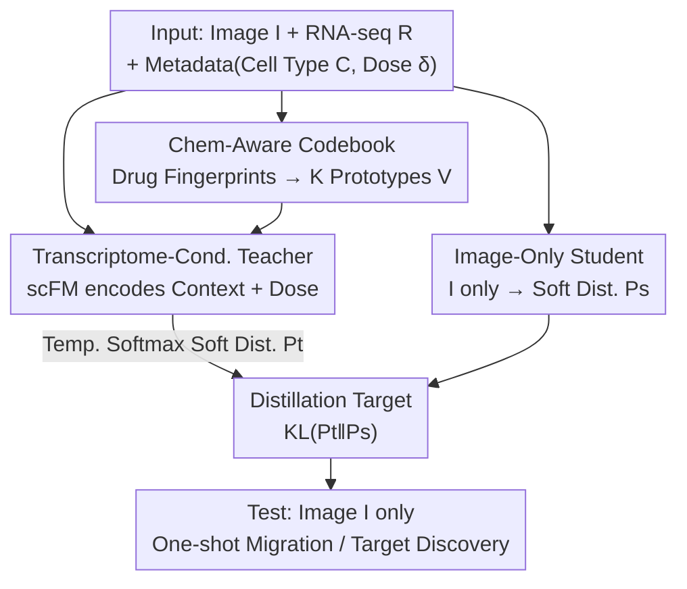

# Intervention-Aware Multiscale Representation Learning from Imaging Phenomics and Perturbation Transcriptomics

**Conference**: CVPR 2026  
**arXiv**: [2604.22832](https://arxiv.org/abs/2604.22832)  
**Code**: https://github.com/The-Real-JerryChen/BioMicroscopyProfiler (Available)  
**Area**: Multimodal VLM / Computational Biology / Representation Learning  
**Keywords**: Phenotypic Screening, Knowledge Distillation, Perturbation Transcriptomics, Drug Discovery, Weakly Paired Data

## TL;DR
Paired perturbation transcriptomics (RNA-seq) is utilized as "privileged information" during training to guide microscopy image encoders. Through a "transcriptome-conditional teacher → image-only student" distillation framework, mechanistic signals of drug actions are injected into image representations. This enables **one-shot migration to unseen drugs/genetic perturbations** and drug-target discovery at test time using only microscopy images, significantly outperforming self-supervised (MAE/DINO) and alignment-based (CLIP-style) baselines.

## Background & Motivation
**Background**: In drug discovery, there are two complementary cellular readouts: ① Microscopy imaging (e.g., Cell Painting) is inexpensive and scalable to thousands of compounds but only provides morphological outlines; ② Perturbation transcriptomics (e.g., LINCS L1000) measures gene expression changes and reveals which pathways are regulated, providing mechanistic depth but at high cost and low throughput. Currently, almost all image models rely on self-supervision (MAE, DINO) to extract morphological features.

**Limitations of Prior Work**: Self-supervised image features are "good at capturing morphology but decoupled from biological mechanisms"—they cannot identify which pathway perturbation lies behind a specific phenotype, leading to **failure when migrating to unseen perturbations**. Existing image-multimodal methods (aligning images with drug structures or RNA in a shared embedding space) suffer from a subtler issue: they use **drug identity** as the supervisory signal. This collapses differences of the "same compound at different doses/cell types" into "binary positive pairs," losing the "graded response" information essential for generalization.

**Key Challenge**: Real-world paired data is **weakly paired**—while images and RNA-seq share the same drug and cell line, **dosages often differ**, as do batches. Methods based on identity alignment incorrectly treat mismatched doses or cell types as "identical positive samples"; furthermore, these methods aim to learn better **drug/transcriptome** representations, treating images merely as auxiliary signals rather than the target modality for improvement.

**Goal**: How to use perturbation transcriptomics to **guide image representations** toward "mechanistic understanding" when only limited image-transcriptome paired data is available, ensuring that RNA is not required during inference.

**Key Insight**: Drug perturbations follow a structured causal path: chemical structure $D$ determines which targets are bound (target engagement state $Z$), $Z$ drives changes in transcriptomics $R$, which ultimately shapes morphology $M$. Morphology is then observed as image $I$ via the microscopy pipeline; cell type $C$ acts as a biological context modulating the entire cascade. Since $R$ carries pathway-level mechanisms invisible to $M$, $R$ should be treated as **privileged information** injected during training.

**Core Idea**: Reframe multimodal learning from "alignment by sample identity" to "alignment by intervention semantics"—using a transcriptome-conditional teacher to produce mechanistic soft labels for distilling an image-only student, with theoretical proof that this **tightens the risk upper bound** for image prediction.

## Method

### Overall Architecture
The framework is named **TIDE** (Transcriptome-Informed Distillation for image Encoding). The goal is to estimate $P(D\,|\,I,C)$—the posterior distribution of the drug (intervention) given cell image $I$ and cell type $C$. Paired transcriptomics $R$ is available during training, while only $I$ is used during testing (the student does not explicitly receive $C$, as cell type is encoded in morphology). The pipeline "organizes the drug space into a codebook ordered by chemical similarity, lets a teacher receiving Image + RNA + metadata produce a soft distribution over the codebook, and finally has an image-only student approximate this soft distribution."

Theoretically, Proposition 3.1 provides a risk upper bound: let the log-loss risk for a predictor depending only on $(I,C)$ be $\mathcal{L}[q]=\mathbb{E}_{(I,C,D)\sim P}[-\log q(D\,|\,I,C)]$, and let $S_T(D\,|\,I,C)=\mathbb{E}_{R\,|\,I,C}[T(D\,|\,I,R,C)]$ be a predictor that "receives RNA during training and marginalizes over $R$ during testing." Then:

$$\mathcal{L}[S_T]\le H(D\,|\,I,C)+\mathbb{E}_{(I,R,C)}\big[\mathrm{KL}\big(P(D\,|\,I,R,C)\,\|\,T(\cdot\,|\,I,R,C)\big)\big]$$

The second term on the right is the directly optimizable training objective. The intuition is: conditioned on RNA, the teacher can distinguish drugs with "similar morphology but different pathways." By distilling this mechanistic knowledge into the image student, the student learns representations aligned with biological mechanisms rather than surface visual patterns. ⚠️ Note that this bound holds for the **training distribution** and does not directly guarantee generalization to unseen drugs—the authors assume that "mechanistic features migrate to new compounds with similar mechanisms," which is validated experimentally.

### Key Designs

**1. Chem-Aware Codebook: Replacing "Hard Drug Identity" with "Mechanistically Transferable Soft Prototype Space"**

**Design Motivation**: Hard classification by drug identity cannot migrate to compounds unseen during training. This work extracts molecular representations (fingerprints) for $K$ training drugs, projects them via a lightweight MLP into the same embedding space as the teacher/student encoders, and applies $\ell_2$ normalization to obtain a prototype matrix $V\in\mathbb{R}^{K\times d}$. Each row $\mathbf{v}_k$ is a drug prototype on a unit hypersphere and is a **learnable parameter** updated via backpropagation. Thus, the model predicts a "soft distribution over prototypes" rather than hard drug IDs. New compounds can migrate by landing on nearby prototypes via chemical similarity. Furthermore, while prototypes are initially arranged by chemical similarity, they **drift during training** to cluster by mechanistic similarity—visualization shows two drugs with very different chemical structures (far apart in FCFP fingerprint space) that are both ATP-competitive tyrosine kinase inhibitors (BMS-536924 and WH-4-023) being pulled close in the learned codebook space.

**2. Transcriptome-Conditioned Teacher: Explicitly Decoupling Dose and Cell Type with Fine-tuned single-cell Foundation Models**

**Design Motivation**: In weakly paired data, image dose $\delta_I$ and RNA dose $\delta_R$ often mismatch; hard identity matching treats different doses as the same sample. The teacher $T_\theta$ intentionally **avoids directly encoding drug molecular structure**, forcing itself to infer pathway-level perturbation effects from observed cellular responses (morphology + transcriptomics), and then links the "inferred mechanism" back to drug chemistry via codebook supervision—avoiding the shortcut where the teacher degenerates into simple drug ID matching. It uses an **scFM (scGPT) fine-tuned** on perturbation response prediction: the model receives basal expression $R_\text{basal}$, drug representation, and dose $\delta_r$ to predict perturbed expression. After training, its encoder extracts two types of representations—cell type encoding $\mathbf{h}_C$ (from $R_\text{basal}$, providing stable biological context) and dose-decoupled transcriptome encoding. The teacher encodes three streams: Image + dose (using a FiLM-like conditional mechanism to peel $\delta_I$ from image features) to get $\mathbf{h}_I$, RNA + dose $\delta_R$ to get $\mathbf{h}_R$, and cell type $\mathbf{h}_C$. These are concatenated and fused via a projection network $f_t$: $\mathbf{h}_t=f_t([\mathbf{h}_I\|\mathbf{h}_R\|\mathbf{h}_C])$, followed by a temperature-scaled softmax against the codebook:

$$P_t=\text{Softmax}\!\left(\frac{V\cdot\mathbf{h}_t}{\tau\cdot|\mathbf{h}_t|_2}\right)\in\mathbb{R}^{K}$$

The teacher is trained using cross-entropy $\mathcal{L}_{teacher}$ against true drug labels. Because $\delta_I$ and $\delta_R$ are encoded **separately** within their respective modal features, the teacher can "explicitly reason about dose-dependent effects" in mismatched weakly paired data, producing soft targets reflecting the true dose context rather than binary labels.

**3. Pure-Image Student + KL Distillation: Reproducing Mechanistic Soft Labels via Morphology at Deployment**

**Design Motivation**: Deployment scenarios provide only microscopy images, with no RNA or explicit cell-type input. The student reuses the teacher's shared image encoder, followed by a projection head to get $\mathbf{h}_s$, producing codebook distribution $P_s$ from the image alone (cell type information is assumed implicit in morphological features, so the student does not explicitly receive $C$). Distillation aligns the student distribution with the teacher's via KL divergence:

$$\mathcal{L}_{\text{distill}}=\mathbb{E}_{(I,R,C,\delta)}\big[\mathrm{KL}(P_t\,\|\,P_s)\big]$$

This step is the implementation of "marginalizing over $R$" from Proposition 3.1: the teacher compresses pathway mechanisms into $P_t$, and the student learns the posterior $S_T$ (the expectation over $R$) by approximating $P_t$. The framework is compatible with any self-supervised method; $\mathcal{L}_{ssl}$ (e.g., DINO/MAE) is applied to all images (paired + unpaired) to leverage massive unpaired imaging data for general morphological features.

### Loss & Training
The total objective is a weighted sum of three terms:

$$\mathcal{L}=\mathcal{L}_{\text{distill}}+\alpha\cdot\mathcal{L}_{\text{teacher}}+\beta\cdot\mathcal{L}_{\text{ssl}}$$

The terms are distillation KL + teacher cross-entropy + self-supervision. Training runs for 400 epochs, with checkpoints selected via k-NN (k=20) on a held-out validation set (10 images per perturbation class). Task 1 splits train/val/test by **intervention** (not sample) to ensure true generalization assessment. Vision backbones include standard ViT and Channel-Agnostic ViT (CA-ViT) for cellular imaging, with model sizes matched to data scales (ViT-Small for CPG-Pilot/RxRx3, ViT-Base for CPG-12).

## Key Experimental Results

The dataset consists of three Cell Painting imaging datasets paired with L1000 transcriptomics (978 landmark genes), all weakly paired (same drug/cell line but often different doses):

| Dataset | Images | Paired RNA | Drugs | Overlap | Eval Interventions |
|--------|--------|----------|--------|--------|------------|
| RxRx3 | 61,690 | 3,682 | 1,662 | 235 | 736 |
| CPG-Pilot | 93,696 | 1,883 | 302 | 85 | 260 |
| CPG-12 | 916,721 | 22,066 | 30,340 | 6,989 | 121 |

### Main Results

**Task 1: One-shot migration to unseen interventions** (Top-1/Top-5 accuracy %, averaged over 50 runs; RxRx3/CPG-Pilot measure unseen genetic perturbations, CPG-12 measures unseen compounds). Table below uses ViT backbone:

| Method | RxRx3 Top-1 | RxRx3 Top-5 | CPG-Pilot Top-1 | CPG-Pilot Top-5 | CPG-12 Top-1 | CPG-12 Top-5 |
|------|------|------|------|------|------|------|
| MAE | 1.54 | 6.79 | 2.95 | 12.31 | 4.68 | 11.02 |
| DINO | 4.82 | 14.86 | 11.36 | 30.82 | 36.36 | 60.01 |
| CL(D) | 5.16 | 15.63 | 14.61 | 36.66 | 40.04 | 65.07 |
| CL(R) | 4.93 | 14.27 | 13.97 | 30.64 | 30.57 | 60.89 |
| **TIDE** | **5.62** | **16.86** | **16.01** | **39.12** | **42.09** | **71.07** |

TIDE is optimal in all settings. CL(D) (aligning drug molecules) is the second-best baseline, confirming that "incorporating perturbation information" is critical. CL(R) (aligning transcriptomics) slightly underperforms CL(D) due to sparse paired RNA. Within SSL, DINO significantly outperforms MAE due to richer signals from local/global crop augmentation.

**Task 2: Unsupervised drug-target discovery** (No explicit supervision, averaged over 100 seeds; RxRx3 reports dose-averaged AP/AUC, CPG-Pilot reports AP/Hit@5):

| Method | RxRx3 AP | RxRx3 AUC | CPG-Pilot AP | CPG-Pilot Hit@5 |
|------|------|------|------|------|
| MAE | 0.256 | 0.538 | 0.079 | 0.103 |
| DINO | 0.300 | 0.633 | 0.109 | 0.135 |
| CL(D) | 0.252 | 0.537 | 0.099 | 0.127 |
| CL(R) | 0.247 | 0.532 | 0.105 | 0.134 |
| **TIDE** | **0.317** | **0.640** | **0.119** | **0.149** |

This task is extremely difficult (cross-modal perturbation pairing signals are "only slightly above random"); most baselines perform just above random. TIDE maintains a significant lead, proving it indeed distills pathway-level mechanistic knowledge. Notably, unlike Task 1, CL(D) shows no clear advantage over DINO/CL(R) here, as identifying biological targets requires mechanistic understanding not directly encoded by chemical fingerprints.

### Ablation Study

**Dose/scFM Fine-tuning Ablation** (CPG-Pilot split by cell line, ViT; A549 has more paired compounds than U2OS):

| Task | Config | U2OS Top-1 | A549 Top-1 | U2OS AP | A549 AP |
|------|------|------|------|------|------|
| DINO Baseline | One-shot / Target | 12.8 | 12.1 | 0.084 | 0.133 |
| TIDE | One-shot / Target | 15.9 | 16.3 | 0.092 | 0.146 |

Under DINO, the two cell lines perform similarly (U2OS even slightly higher). With TIDE, **A549 (with more paired data) shows a larger gain** (Top-1 from 12.1 → 16.3, surpassing U2OS's 12.8 → 15.9), validating that "more paired transcriptomics enables more effective mechanistic distillation."

### Key Findings
- **scFM fine-tuning is indispensable**: Scanning paired samples per drug from 0 to 150 shows TIDE with fine-tuned scFM scales significantly; TIDE with only pretrained scFM weights barely improves (at 0 pairs, TIDE degenerates to DINO). Without "perturbation response prediction" fine-tuning, scFM encoders cannot decouple dose or encode cell-type-specific basal states.
- **The codebook learns mechanism, not chemical structure**: BMS-536924 and WH-4-023 are far apart in FCFP fingerprint UMAP space but are pulled close in the learned codebook space because both are tyrosine kinase inhibitors. End-to-end training + transcriptome guidance organizes the codebook by "how drugs perturb pathways" rather than "molecular structure."
- **CA-ViT is stronger with sufficient training**: ViT and CA-ViT are comparable in most methods, but CA-ViT's channel-agnostic patchification demonstrates higher representation capacity when paired with TIDE.

## Highlights & Insights
- **Optimal use of "Privileged Information Distillation"**: Placing expensive and scarce transcriptomics in the training phase as a teacher while marginalizing it at test time allows for mechanistic depth while maintaining image scalability. This is a successful application of the Learning Using Privileged Information (LUPI) paradigm in biological imaging, with theoretical support for tightening risk bounds.
- **Reframing Alignment Objective with "Intervention Semantics"**: Directly addresses the flaw of existing alignment methods (collapsing dose/cell-type differences) using the causal path $D\to Z\to R\to M\to I$.
- **Combinatorial strength of Learnable Codebook + Dose Decoupling**: The codebook provides "migration by chemical similarity," while dose decoupling provides "robustness to weakly paired data." These complementary strategies address specific pain points and are transferable to any "weakly paired, generalization-required" multimodal distillation scenario (e.g., pathology-genomics).

## Limitations & Future Work
- **Theoretical bounds apply only to training distribution**: The authors honestly admit Proposition 3.1 does not directly guarantee generalization to unseen drugs; "mechanistic feature migration" is an assumption supported indirectly by experiments.
- **Static Assumption**: The framework does not explicitly model temporal dynamics or multicellular interactions. Batch effects (multi-plate imaging, cross-lab RNA-seq) are not in the causal graph and are only mitigated as discussed in the appendix.
- **Low Absolute Performance**: Overall performance in drug-target discovery remains "modest" (baselines on RxRx3 are just above random), indicating the signal for this task is inherently weak. While TIDE leads relatively, it is far from practical utility.
- **Dependency on Paired Data Volume**: Ablation shows limited gains when paired samples are too sparse (0 pairs leads to DINO), making its applicability to new cell lines with extremely scarce pairs questionable.
- Future work: Incorporating batch effects and temporal dynamics into causal modeling; exploring the integration of single-cell (rather than bulk L1000) transcriptomics for higher mechanistic resolution.

## Related Work & Insights
- **vs. SSL (MAE / DINO)**: These learn only general morphological features decoupled from biological mechanisms; TIDE adds transcriptome distillation to align features with pathway-level mechanisms, significantly leading in unseen intervention migration (while still utilizing SSL via $\mathcal{L}_{ssl}$).
- **vs. CLIP-style Alignment (CL(D) drug alignment / CL(R) RNA alignment)**: These use drug identity as supervision, collapsing dose and cell-type differences into binary pairs, and prioritize improving drug/transcriptome representations. TIDE reverses this, targeting images as the primary modality and using intervention semantics as supervision to handle mismatches explicitly.
- **vs. Reverse Distillation (using image FMs to improve transcriptome representation, Bendidi et al. 2025)**: TIDE moves in the opposite direction—"using transcriptomics to guide images"—filling a neglected gap.
- **Insight**: When one modality is expensive and the other cheap, and only weakly paired data is available, "expensive modality as training-only teacher + learnable prototype codebook for label space + explicit decoupling of confounders (dose)" is a reusable recipe.

## Rating
- Novelty: ⭐⭐⭐⭐⭐ Combining "privileged info distillation + causal intervention semantics + learnable chem-codebook" for microscopy-transcriptomics weakly paired learning is a novel and well-motivated direction.
- Experimental Thoroughness: ⭐⭐⭐⭐ Three datasets × two backbones, two tasks, and thorough ablations on dose/scFM/sample efficiency; however, absolute values in target discovery are low, and comparison with the latest bio-foundation models is not fully comprehensive.
- Writing Quality: ⭐⭐⭐⭐ Causal paths and theoretical bounds are clear, and method components are well-layered; minor typographical errors in some formulas (e.g., KL notation in $\mathcal{L}_{distill}$).
- Value: ⭐⭐⭐⭐ Provides a provable, deployable path for "mechanism-level drug discovery using only cheap microscopy images," significant for virtual cells and high-throughput screening.

<!-- RELATED:START -->

## Related Papers

- [\[CVPR 2026\] Multi-Modal Image Fusion via Intervention-Stable Feature Learning](multi-modal_image_fusion_via_intervention-stable_feature_learning.md)
- [\[CVPR 2026\] Taxonomy-Aware Representation Alignment for Hierarchical Visual Recognition with Large Multimodal Models](taxonomy-aware_representation_alignment_for_hierarchical_visual_recognition_with.md)
- [\[CVPR 2026\] MOON2.0: Dynamic Modality-balanced Multimodal Representation Learning for E-commerce Product Understanding](moon20_dynamic_modality-balanced_multimodal_representation_learning_for_e-commer.md)
- [\[CVPR 2026\] Multi-Metric Representation Learning Strategy Based on Clustering for Fine-Grained Multimodal Sentiment Analysis](multi-metric_representation_learning_strategy_based_on_clustering_for_fine-grain.md)
- [\[NeurIPS 2025\] Structure-Aware Fusion with Progressive Injection for Multimodal Molecular Representation Learning](../../NeurIPS2025/multimodal_vlm/structure-aware_fusion_with_progressive_injection_for_multimodal_molecular_repre.md)

<!-- RELATED:END -->
