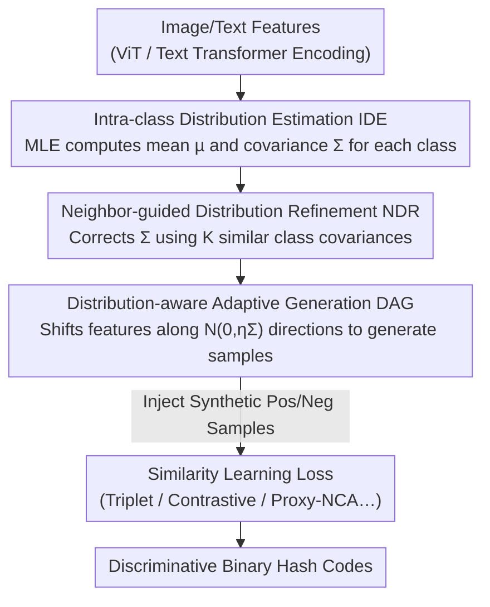

# Intra-class Distribution-guided Generative Hashing with Neighbor Refinement for Cross-modal Retrieval

**Conference**: CVPR 2026  
**Paper**: [CVF Open Access](https://openaccess.thecvf.com/content/CVPR2026/html/Sun_Intra-class_Distribution-guided_Generative_Hashing_with_Neighbor_Refinement_for_Cross-modal_Retrieval_CVPR_2026_paper.html)  
**Code**: https://github.com/QinLab-WFU/IDGH  
**Area**: Information Retrieval / Cross-modal Hashing / Sample Generation  
**Keywords**: Cross-modal Retrieval, Deep Hashing, Intra-class Distribution Estimation, Sample Generation, Covariance Refinement

## TL;DR
Instead of utilizing complex generators or simple interpolation to augment training samples for cross-modal hashing, IDGH directly estimates the "intra-class feature distribution" (mean + covariance) of each category. It then refines poorly estimated covariances using neighboring class information, and finally translates features along these distribution directions to generate semantically rich synthetic samples. This plug-and-play module enhances the discriminative power of hash codes with almost zero extra computational overhead.

## Background & Motivation

**Background**: Cross-modal hashing encodes images and texts into compact binary codes and uses Hamming distance for nearest-neighbor retrieval, serving as a mainstream paradigm that balances storage and speed under massive multimedia data. Mainstream training paradigms are divided into pair-wise (pulling similar pairs closer and pushing dissimilar pairs further) and triplet-wise (constraining the anchor to be closer to positive samples than to negative samples). To provide richer signals for similarity learning, recent works have begun to incorporate "sample generation" strategies to expand the training space.

**Limitations of Prior Work**: The sample generation approach itself suffers from two long-standing limitations. First, **interpolation-based methods** (e.g., Mixup, CMDA) perform deterministic, class-independent linear interpolation on existing samples in the latent space. Consequently, synthetic samples only lie within a small neighborhood around original data points, failing to capture the truly rich intra-class semantic variations, which limits diversity and leads to less discriminative codes. Second, **generative network-based methods** (e.g., HashGAN, diffusion augmentation) can generate heterogeneous samples but require a heavy, complex generator, making the model bulky and training unstable, which compromises both retrieval efficiency and accuracy.

**Key Challenge**: Interpolation is "lightweight but weak", while generative networks are "powerful but heavy". Neither explicitly characterizes "how a category inherently varies internally". If the intra-class variation of each category can be explicitly modeled by a computable statistic (distribution), one could generate samples that truly align with the intra-class semantic structure without introducing heavy models.

**Goal**: (1) How to reliably estimate the intra-class distribution of each category? (2) How to remedy the corrupted covariance estimation when some categories have extremely sparse samples? (3) How to use this distribution to generate both diverse and semantically controllable samples that can be seamlessly integrated into arbitrary loss functions?

**Key Insight**: The authors made a critical statistical observation: **categories with similar means also tend to have similar covariance structures** (with the Spearman rank correlation reaching up to 0.97 on MIRFLICKR-25K). In other words, "categories that look alike share similar internal patterns of variation." This implies that the distribution information of neighboring classes can be leveraged to refine the poorly estimated covariance of a target class.

**Core Idea**: Explicitly model intra-class variations using "intra-class distributions" (mean and covariance), refine these distributions reliably via neighboring classes, and adaptively generate samples by shifting features along the distribution directions—replacing heavy generators with statistical priors.

## Method

### Overall Architecture
IDGH is a **plug-and-play sample generation module** built on top of existing cross-modal hashing backbones (image/text Transformer encoders + tanh-relaxed hash function). It structures the pipeline into three consecutive stages: first, **Intra-class Distribution Estimation (IDE)** is performed on each class to obtain the mean and covariance; then, since the covariance of few-shot classes is difficult to estimate accurately, **Neighbor-guided Distribution Refinement (NDR)** corrects it using the covariances of similar classes; finally, **Distribution-aware Adaptive Generation (DAG)** samples and shifts features along the refined covariance directions to construct synthetic positive/negative samples, which are injected into triplet and other losses to enhance similarity learning. The entire module only adds covariance statistics and Gaussian sampling, introducing virtually no extra FLOPs or parameters.

### Key Designs

**1. Intra-class Distribution Estimation (IDE): Explicitly characterizing "how classes vary" using the mean and covariance of each class**

The fundamental limitation of interpolation-based methods is their lack of knowledge about the directional variations within a class, leading to blind interpolation around existing samples. IDGH directly utilizes Maximum Likelihood Estimation (MLE) to model the intra-class variation of each class $c$ as a feature distribution by calculating the mean and covariance of the relaxed codes $\tilde{b}_i$ for all samples belonging to class $c$:

$$\hat{\mu}_c = \frac{1}{n_c}\sum_{i\in S_c}\tilde{b}_i, \qquad \Sigma_c = \frac{1}{n_c}\sum_{i\in S_c}\big(\tilde{b}_i-\hat{\mu}_c\big)\big(\tilde{b}_i-\hat{\mu}_c\big)^{\top}$$

The covariance $\Sigma_c$ encodes the dispersion direction of features in class $c$, serving as a directional prior for subsequent sample generation. This step instrains "intra-class diversity" from an abstract concept into a computable and sampleable statistical metric, forming the foundation of the proposed method.

**2. Neighbor-guided Distribution Refinement (NDR): Leveraging similar class covariances to rescue poorly estimated distributions of few-shot classes**

IDE faces a major vulnerability on large-scale datasets—many classes have sparse samples, making the covariance estimation ill-posed, which produces noisy samples if used directly for generation. NDR is grounded in a statistically verified law: **the distance between means is highly correlated with the distance between covariances** (with Spearman correlation coefficients up to 0.98 across three datasets), meaning "classes with close means also share similar covariances." Thus, for the target class $c$, $K$ nearest neighbor classes $N_c$ are selected based on mean distances to perform weighted covariance aggregation:

$$\Sigma_{\text{neighbor}} = \Big(\sum_{i\in N_c} w_i\Sigma_i\Big)\Big/\Big(\sum_{i\in N_c} w_i\Big)$$

The weight $w_i$ accounts for both the sample size $n_i$ of the neighboring class, the mean distance, and the covariance distance, assigning larger weights to more similar classes:

$$w_i = n_i\cdot\exp\!\Big(-\frac{\|D_m(i,k)\|^2}{2\sigma_m^2}-\frac{\|D_{cv}(i,k)\|^2}{2\sigma_{cv}^2}\Big)$$

A global covariance $\Sigma_{\text{global}}$ (weighted by sample size across the entire dataset) is introduced to prevent overfitting. The final refined covariance is a convex combination of three parts:

$$\Sigma_c^{\text{NDR}} = (1-\alpha)\Sigma_c + \alpha\big[(1-\beta)\Sigma_{\text{neighbor}} + \beta\Sigma_{\text{global}}\big]$$

Crucially, $\alpha$ is **adaptive to the class sample size $n_c$**: $\alpha=(1+\log[1+\gamma(n_c-1)])^{-1}$ when $n_c\le\tau$, and $\alpha=0$ otherwise. That is, classes with more samples rely more on their raw estimates with virtually no calibration, whereas classes with fewer samples borrow more information from neighbors and the global scope. This allows refinement to occur "on-demand," avoiding misaligning the well-estimated massive classes.

**3. Distribution-aware Adaptive Generation (DAG): Feature translation along covariance directions to create semantically controllable and diverse samples**

Based on the reliable covariance, DAG avoids deterministic interpolation and instead translates each raw feature $\tilde{b}_i$ along a random direction of its corresponding category distribution to generate new samples—for the image modality:

$$\hat{b}_i^I \sim N\big(\tilde{b}_i^I,\ \eta\Sigma_{l_i}^I\big)$$

The same applies to the text modality. $\eta$ controls the intensity of intra-class variations (set to $[0.6, 1.0]$ and decayed across training epochs to enable broad exploration followed by convergence), and $M$ synthetic samples are generated for each original sample. Since the translation direction is guided by the covariance, the synthetic samples both cover the real semantic variation directions within the class and consistently fall within the class semantics, avoiding the "near-origin restriction" of interpolation and the "uncontrollability" of generative networks. These synthetic samples can be injected directly as positive/negative pairs into the loss function, such as the cosine triplet loss:

$$L_{\text{Trip}}^{\text{IDGH}} = \frac{1}{n}\sum_{i=1}^n\sum_{(j,k)\in\tilde{B}_i\cup\hat{B}_i}\big[s_{ij}-s_{ik}+\alpha\big]_+,\quad s_{ij}=\cos(\tilde{b}_i,\hat{b}_j)$$

Synthetic samples expand the candidate pool, allowing the construction of more informative triplets and providing stronger similarity learning signals. This is precisely why IDGH is "plug-and-play": it is only responsible for populating the candidate pool with high-quality samples, remaining non-intrusive to the loss functions.

### Loss & Training
IDGH itself is not coupled with any specific loss. The paper primarily uses the cosine triplet loss as an illustrative example (Eq. 15) and validates that it can be directly applied to four loss functions: Contrastive, Triplet, Multi-similarity, and Proxy-NCA. Hyperparameters: number of synthetic samples $M=3$, number of neighbor classes $K=20$, $\beta=\gamma=0.1$, $\sigma_m=\sigma_{cv}=1$, $\tau=40$, and $\eta \in [0.6, 1.0]$ decaying with epochs. The covariance matrix is updated every 5 epochs, and a diagonal covariance + 2-norm is adopted to reduce computational overhead.

## Key Experimental Results

### Main Results
Tested on four public datasets (MIRFLICKR-25K, NUS-WIDE, IAPR TC-12, XMediaNet) against 7 recent deep cross-modal hashing methods, using mAP@ALL as the metric. The table below excerpts representative results (I→T) on NUS-WIDE and the more challenging XMediaNet:

| Dataset (I→T) | Bits | IDGH | Runner-up (SOTA) | Description |
|--------------|------|------|-------------|------|
| NUS-WIDE | 64bits | **0.7451** | 0.7218 (BiLGSEH) | +2.3pt |
| NUS-WIDE | 128bits | **0.7565** | 0.7241 (DECH) | +3.2pt |
| IAPR TC-12 | 64bits | **0.6991** | 0.6926 (DPBE) | Outperforming |
| XMediaNet | 32bits | **0.5714** | 0.4640 (DECH) | +10.7pt, largest margin on difficult dataset |
| XMediaNet | 128bits | **0.7024** | 0.6141 (DECH) | +8.8pt |

IDGH consistently achieves optimal performance across all four datasets, two tasks (I→T / T→I), and four code lengths, with its advantage becoming more stable as code length increases. The improvement is most pronounced on the fine-grained XMediaNet, indicating that distribution-guided generation is particularly valuable in challenging scenarios.

### Ablation Study
Evaluated the NDR and DAG modules step-by-step (with the baseline being the triplet loss without any generation). The table below showcases the results on XMediaNet (I→T):

| Configuration | 16bits | 64bits | 128bits | Description |
|------|--------|--------|---------|------|
| baseline (no generation) | 0.1662 | 0.3401 | 0.4240 | IDE estimation only without refinement/generation |
| + DAG | 0.3928 | 0.6559 | 0.6986 | With generation, significant boost |
| + NDR + DAG (Full) | **0.4046** | **0.6591** | **0.7024** | Refinement provides further gain |

### Key Findings
- **DAG (generation) is the main contributor**: adding DAG alone boosts XMediaNet 16-bit performance from 0.166 to 0.393, offering the largest contribution; NDR further enhances performance on top of DAG (0.393 → 0.405), functioning to "provide more reliable covariances for DAG to guide generation," demonstrating an upstream-downstream collaborative relationship.
- **Plug-and-play capability verified**: incorporating the module into four different loss functions (Contrastive, Triplet, Multi-similarity, and Proxy-NCA) consistently yields performance boosts (Table 3). This indicates that the performance gain stems from the fundamental ability to "generate high-quality samples" rather than coupling with any specific loss.
- **Hyperparameter patterns**: increasing the number of synthetic samples $M$ first improves and then degrades performance; when $M>10$, noisy samples hinder training, leading to an optimal choice of $M=3$. A larger number of neighboring classes $K$ generally yields better results (providing more similar classes for refinement), with $K=20$ selected.
- **Almost zero overhead**: sharing the same backbone as the baseline, the FLOPs/parameters remain identical (5.578G / 151.29M). Training takes only 0.65h (close to the fastest Mixup at 0.58h), and generation time is 2.40s, significantly lower than HashGAN's 15.46s.
- **Benefit to few-shot scenarios**: In k-shot experiments, IDGH exhibits a particularly pronounced lead over the baseline under low-sample conditions, validating the value of distribution-guided generation in expanding diversity under weak supervision.

## Highlights & Insights
- **Replacing generators with statistical priors**: The most remarkable aspect is reducing "sample generation"—commonly framed as a task requiring heavy generative models—to "covariance estimation + Gaussian sampling." This yields superior performance compared to HashGAN/Mixup/HDML (Table 4) with virtually zero overhead, demonstrating that explicitly modeling intra-class distributions is more effective than forcefully training a generator.
- **Statistical foundation for neighbor-assisted few-shot recovery**: The proposed refinement is not heuristically designed. The authors first leveraged the Spearman correlation coefficient to establish that "closer means imply closer covariances" (on the order of 0.97), and designed NDR accordingly, offering a solid and transferable motivation.
- **Adaptive refinement coefficient $\alpha$**: Letting the calibration intensity decay automatically as the sample size per class increases (where sample-rich classes rely on their own estimates while sample-poor ones borrow from neighbors) provides an "on-demand calibration" paradigm that is highly transferable to any few-shot statistical estimation scenario.
- **Non-intrusive decoupled design**: By only injecting synthetic samples into the candidate pool, the module can be seamlessly integrated with almost any metric learning loss, making it highly engineering-friendly.

## Limitations & Future Work
- A diagonal approximation + 2-norm was used for the covariance (compromising for computational efficiency), discarding the correlations across feature dimensions, which theoretically might limit the expressiveness of the generated samples. Whether high-dimensional full covariance matrices are superior remains insufficiently discussed.
- The method relies heavily on the statistical assumption that "similar classes have similar covariances." On datasets where this assumption is weaker (e.g., IAPR TC-12's Spearman correlation is only 0.72), the performance gains are relatively narrower, and its generalizability to scenarios with highly heterogeneous class semantic structures remains to be verified.
- NDR/DAG introduces numerous hyperparameters such as $M,K,\alpha,\beta,\gamma,\sigma_m,\sigma_{cv},\tau,\eta$. Although default values are provided, tuning them across different datasets can incur non-negligible costs.
- The theoretical justification for DAG is deferred to the supplementary materials, leaving its rigorous proof on how it enhances discriminative capability unelaborated in the main text.

## Related Work & Insights
- **vs. Interpolation Method (Mixup / CMDA)**: These methods perform deterministic, class-independent linear interpolation, confining samples to a small neighborhood around the origin. In contrast, IDGH uses the intra-class covariance to guide the generation direction, covering true intra-class variations. It achieves comprehensive superiority in Table 4 while remaining equally lightweight.
- **vs. Generative Network-based Methods (HashGAN / Diffusion Decoupled Augmentation)**: These methods rely on auxiliary generators to create heterogeneous samples but are structurally heavy and slow to train. IDGH replaces this with statistical sampling, achieving a generation time of 2.40s vs. HashGAN's 15.46s, alongside higher retrieval accuracy.
- **vs. HDML**: Sharing a similar spirit of generating hard samples/distributions in metric learning, IDGH instantiates the "distribution" as a refineable intra-class covariance and incorporates neighbor-guided calibration, representing a more tailored solution for cross-modal hashing.

## Rating
- Novelty: ⭐⭐⭐⭐ Replacing the generator with intra-class distribution and neighbor refinement is an ingenious and solid entry point, supported by statistical observations.
- Experimental Thoroughness: ⭐⭐⭐⭐⭐ Extremely comprehensive evaluation across four datasets, two tasks, and four code lengths, covering loss generalizability, comparison with baseline generation methods, efficiency, few-shot performance, and ablation studies.
- Writing Quality: ⭐⭐⭐⭐ Well-structured with a clear "motivation-observation-methodology" logic, complete mathematical derivations, though some theoretical proofs are relegated to the supplementary materials.
- Value: ⭐⭐⭐⭐ Strong practicality provided by being plug-and-play, zero-overhead, and loss-agnostic, making it highly reusable for future works.

<!-- RELATED:START -->

## Related Papers

- [\[AAAI 2026\] Neighbor-aware Instance Refining with Noisy Labels for Cross-Modal Retrieval](../../AAAI2026/multimodal_vlm/neighbor-aware_instance_refining_with_noisy_labels_for_cross-modal_retrieval.md)
- [\[CVPR 2026\] Mask to Align, Weight to Disambiguate: Reliable Unsupervised Cross-Modal Hashing with Masked-Weight Contrast](mask_to_align_weight_to_disambiguate_reliable_unsupervised_cross-modal_hashing_w.md)
- [\[CVPR 2026\] Reevaluating the Intra-Modal Misalignment Hypothesis in CLIP](reevaluating_the_intra-modal_misalignment_hypothesis_in_clip.md)
- [\[CVPR 2026\] IsoCLIP: Decomposing CLIP Projectors for Efficient Intra-modal Alignment](isoclip_decomposing_clip_projectors_for_efficient_intramodal_alignment.md)
- [\[CVPR 2026\] POGA: Paraphrased and Oppositional Graph Alignment for Fine-Grained Cross-Modal Retrieval](poga_paraphrased_and_oppositional_graph_alignment_for_fine-grained_cross-modal_r.md)

<!-- RELATED:END -->
