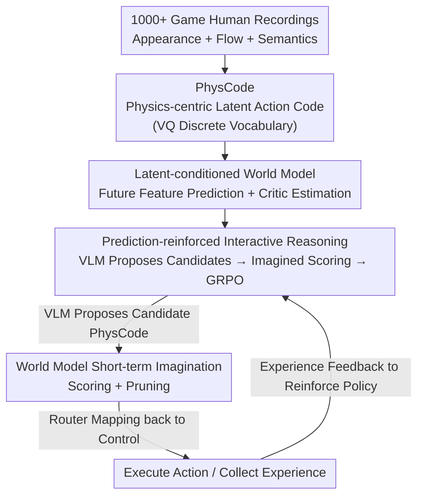

# IPR-1: Interactive Physical Reasoner

**Conference**: CVPR 2026  
**arXiv**: [2511.15407](https://arxiv.org/abs/2511.15407)  
**Code**: Project Page https://mybearyzhang.github.io/ipr-1 (Public repository not yet available)  
**Area**: Multimodal VLM / Physical Reasoning / World Models  
**Keywords**: Interactive Physical Reasoning, World Models, VLM agent, Latent Action Space, PhysCode

## TL;DR
IPR enables an 8B VLM to learn physics and causality across 1000+ heterogeneous games through a closed-loop "world model imagination rollout scoring $\rightarrow$ reinforced VLM strategy" paradigm. It utilizes a physics-centric latent action code, PhysCode, to align "semantic intent" with "visual dynamics" into a shared action space for both prediction and reasoning, achieving an overall competitiveness (average rank) that surpasses GPT-5.

## Background & Motivation
**Background**: There are currently three mainstream routes for enabling agents to learn "physical intuition + causal reasoning" in interactive environments: pre-trained VLM/VLAs (relying on large-scale semantic priors for open-loop planning), world models (learning latent dynamics and planning within imagination), and RL (optimizing policies directly from pixels and rewards).

**Limitations of Prior Work**: Each of the three routes has critical drawbacks. VLM/VLAs are capable of reasoning but lack "foresight"—they can perform semantic planning according to instructions but cannot predict the consequences of actions in the visual state space, failing to see upcoming dangers (e.g., spikes, moving enemies) during interaction. World models can "imagine" but often degenerate into mimicking surface visual correlations, short-sightedly chasing goals and accumulating errors in complex environments. RL suffers from low sample efficiency and relies on dense, task-entangled rewards, making it prone to overfitting task shortcuts rather than causal mechanisms, leading to failure when game interfaces change.

**Key Challenge**: These methods tend to **overfit surface visual details rather than capturing underlying invariant physical/causal mechanisms**. Robust migration between vastly different interactive environments requires decoupling "core mechanisms" from "visual appearance." A further complication is the action interface itself: the same key (e.g., UP) has completely different semantics across various games (tilting the camera up vs. moving the character up), causing "console alias" conflicts. Purely linguistic actions also fail to express precise visual magnitudes (how high to jump, how fast to dash).

**Goal**: (1) Create a testbed that exposes "shared physical mechanisms + large visual domain gaps"; (2) Design a learning paradigm where interactive experience can stably accumulate into physical reasoning capabilities that improve with experience and enable zero-shot transfer to unseen games.

**Key Insight**: The authors advocate for a mixed perspective with balanced proportions—avoiding full reliance on RL (exploration), world models (full-scene prediction), or VLMs (static priors). Instead, IPR leverages their respective strengths: VLMs provide semantic causal reasoning, world models provide rollout predictions, and RL optimizes decisions using imagined rewards. The key is to move the prediction target from **raw pixels to an abstract feature space**, filtering out task-irrelevant perceptual noise to force the model to capture the "essence of physics" rather than the "appearance of the world."

**Core Idea**: Use the world model's imagination rollout to score and reinforce the VLM policy, employing a physics-centric latent action code (PhysCode) as a shared action language for both prediction and reasoning.

## Method

### Overall Architecture
IPR decomposes "learning physical reasoning in interactive environments" into three stages of serial training plus an inference loop. First, it learns a discrete action vocabulary, PhysCode, from human recordings of 1000+ games (using VQ to compress "appearance + optical flow + semantics" into cross-game reusable physical action codes). Second, with this fixed vocabulary, a **feature-level** world model is trained to predict future features conditioned on PhysCode, accompanied by a critic for value estimation. Finally, the PhysCode tokens are integrated into the Qwen3-VL-8B vocabulary, allowing the VLM to output latent actions directly. The world model performs imagination rollouts to score candidates and calculate advantages, using GRPO to reinforce the VLM policy. During inference, a "prediction-in-the-loop" cycle is formed: "VLM proposes candidates $\rightarrow$ world model short-term imagination scoring/pruning $\rightarrow$ router maps selected PhysCode back to environment control."

### Key Designs

**1. PhysCode: Reconstructing "Actions" from Keys/Language into Physics-centric Latent Codes**

To address "console alias" (same key, different meaning) and the inability of language to describe precise dynamics, the authors abandon keys or natural language as the action space. Instead, they learn discrete latent actions based on a VQ codebook $\mathcal{C}=\{v_k\}_{k=1}^{K}$. Each code is determined by three cues: (i) domain-dependent visual appearance (DINOv3 features $\phi_{\mathrm{img}}(x_t)$), (ii) domain-independent motion (optical flow $\phi_{\mathrm{flow}}(\mathrm{Flow}(x_t,x_{t+1}))$), and (iii) T5-encoded lightweight semantic prompts $\phi_{\mathrm{sem}}(y_t)$. Training uses a standard VQ-VAE objective, requiring the decoder to reconstruct future features $\hat f_{t+\Delta}$ from $(f_t, c_{a_t})$:

$$\mathcal{L}_{\mathrm{LA}}=\big\|\hat f_{t+\Delta}-f_{t+\Delta}\big\|_2^2+\beta\big\|\mathrm{sg}[z_t]-c_{a_t}\big\|_2^2+\gamma\big\|z_t-\mathrm{sg}[c_{a_t}]\big\|_2^2$$

The ingenuity lies in the use of "privileged information": optical flow is only available during pre-training. The authors use modality dropout and gated sparse regularization to **distill the physical structure** shaped by optical flow into the encoder. During testing, the flow gate is closed, and the same discrete codes are retrieved using only appearance and semantics. The resulting codes cluster in physically similar environments and separate in physically different ones, naturally becoming a shared action interface for VLM reasoning and world model prediction—the structural foundation for cross-domain transfer.

**2. Latent-conditioned World Model + Critic: Imagining Consequences and Valuations in Abstract Feature Space**

Since VLMs lack "foresight," a module is needed to predict action consequences. Once the PhysCode vocabulary is fixed, a **feature-level** world model $P_\theta$ is trained. It takes the current feature $f_t$ and action embedding $e_{a_t}$ as input and outputs both a future feature prediction and a value estimate: $(\hat f_{t+\Delta}, V_\theta(f_t,a_t))=P_\theta(f_t,e_{a_t})$.

Predicting features instead of pixels avoids appearance variance and rendering noise, making the dynamics more "shareable" across different games and preventing the world model from degenerating into mimicking pixel appearances. Training involves two steps: first, learning dynamics via a feature prediction loss $\mathcal{L}_{\text{pred}}=\|\hat f_{t+\Delta}-f_{t+\Delta}\|_1$, then learning the critic using a Q-learning style objective $\mathcal{L}_{\text{value}}=\ell_{\text{Q}}(V_\theta(f_t,a_t),y_t)$, where $y_t$ is the target value calculated via TD backup from rollout returns. This critic valuation is what subsequently scores the VLM's candidate actions.

**3. Prediction-reinforced Interactive Reasoning: Reinforcing VLM with World Model Rollouts in a Shared Action Space**

With a shared action space and a world model capable of valuation, the final step is to close the loop. Using Qwen3-VL-8B as the backbone, the authors expand its tokenizer to include PhysCode tokens, allowing the VLM to **directly output discrete latent actions** while retaining its linguistic capabilities. First, supervised alignment (perception $\leftrightarrow$ action) is performed on $(f_t, c_t)$ pairs. Then, given the context and goal $g$, the VLM samples $B$ candidate PhysCode sequences $\{\mathbf{a}^{(b)}\}$. The world model runs short-term imagination rollouts for each sequence to provide predicted returns, from which advantages $A^{(b)}$ are calculated to update the policy via GRPO:

$$\mathcal{L}_{\text{GRPO}}=\frac{1}{B}\sum_{b=1}^{B}A^{(b)}\log\pi_\phi(\mathbf{a}^{(b)}\mid f_t,g)-\beta\,\mathrm{KL}(\pi_\phi\|\pi_0)$$

The difference from pure RL is that the reward signal does not come from sparse environment rewards but from **imagined predicted returns reflecting physical feasibility** generated by the world model. Thus, gradients can be provided for long-range behavior without dense rewards. Through repeated interaction, experiences from both imagined and real trajectories continually flow back to reinforce the VLM, steadily strengthening its interactive physical reasoning—the source of "more experience, stronger reasoning."

### Loss & Training
The three stages have distinct objectives: Stage 1 uses the VQ-VAE objective $\mathcal{L}_{\mathrm{LA}}$ (reconstruction + codebook commitment) combined with flow dropout and gated sparse regularization; Stage 2 uses $\mathcal{L}_{\text{pred}}$ (feature L1) + $\mathcal{L}_{\text{value}}$ (Q-learning); Stage 3 uses GRPO (with a KL constraint to the reference policy $\pi_0$). The backbone is Qwen3-VL-8B. Human recordings were captured at 60 FPS, 4 minutes per game, with pre-processing including time interval normalization, removal of non-interactive segments, and rebalancing of long idle periods.

## Key Experimental Results

The evaluation testbed comprises 1000+ heterogeneous games (863 open-source retro games via stable-retro + 134 HTML/Canvas lightweight games + 3 commercial games). Three levels of metrics are designed according to Maslow's hierarchy: **Survival** (length of survival, higher is better), **Curiosity** (breadth of state space exploration, measured by the area under the multi-scale magnitude curve of CLIP feature trajectories $E=\mathrm{AUC}(M(\tau))$), and **Utility** (Human Normalized Score for goal achievement $\mathrm{HNS}=\frac{m-m_{\text{rnd}}}{m_{\text{hum}}-m_{\text{rnd}}}$). Main comparisons were conducted across 200 games with 30 methods.

### Main Results
Table 2 key rows showing level means (normalized: random=0, human=1) and overall average rank (among 30 methods, lower is better):

| Method | Survival Mean ↑ | Curiosity Mean ↑ | Utility Mean ↑ | Overall Avg Rank ↓ |
|------|------|------|------|------|
| Human | 1.000 | 1.000 | 1.000 | 2.8 |
| Random | 0.000 | 0.000 | 0.000 | 26.9 |
| GPT-5@survival | 0.140 | 0.127 | 0.263 | 13.3 |
| GPT-5@utility | 0.108 | 0.185 | 0.371 | 16.8 |
| Qwen3-VL-8B w/o IPR | 0.105 | 0.325 | 0.176 | 18.2 |
| **Qwen3-VL-8B w/ IPR** | **0.252** | **1.173** | **0.493** | **4.9** |

IPR's overall average rank of 4.9 is second only to humans (2.8) among the 30 methods, significantly outperforming the same backbone without IPR (18.2) and all versions of GPT-5 (best approx. 13.3). In Survival, IPR achieved an average rank of 2.6, with 72.0% of games reaching the Top-3. In short: **the 8B backbone's overall competitiveness exceeds GPT-5**.

### Ablation Study
Table 3 decomposes the contributions of world model prediction and GRPO on the same Qwen3-VL-8B backbone (Note: this table uses a different normalization scale and cannot be directly compared with Table 2 magnitudes):

| Configuration | Survival | Curiosity | Utility | Description |
|------|---------|---------|---------|------|
| VLM (pretrained) | 0.62 | 2.14 | 0.89 | Pure pre-trained VLM |
| VLM + BC | 0.63 | 1.88 | 0.87 | Adding behavior cloning hurts exploration & utility |
| VLM + PPO | 1.00 | 1.79 | 1.23 | Highest Survival/Utility but suppresses curiosity |
| VLM + GRPO | 0.95 | 1.78 | 1.22 | Similarly sacrifices curiosity |
| VLM + BC + PPO | 0.57 | 1.86 | 0.77 | All three metrics decrease |
| **IPR** | 0.76 | **2.77** | **1.34** | Highest Curiosity & Utility; Survival remains strong |

### Key Findings
- **Prediction reinforcement is the key to long-range physical reasoning**: IPR achieves the highest scores in Curiosity (2.77) and Utility (1.34). While pure RL (PPO/GRPO) maximizes Survival, it suppresses Curiosity, suggesting that RL alone overfits short-term rewards. The "foresight" provided by world model prediction is the core driver for long-range reasoning.
- **Low-quality BC can override useful priors**: Adding BC barely changes Survival (0.62$\rightarrow$0.63) but drags down Curiosity and Utility; imitating poor demonstrations erases the VLM's inherent priors.
- **PhysCode Validation (Table 1)**: Key interfaces suffer from cross-game conflicts during joint training, whereas PhysCode exhibits the least degradation under physical offsets. In leave-10-out zero-shot transfer, PhysCode's pixel prediction FID (297.0) is significantly better than keys (315.0) and language (320.2), proving it learns reusable physical mechanisms rather than game-specific bindings.
- **Scaling and zero-shot transfer**: On 50 held-out games, zero-shot performance rises steadily as the number of training games $N$ increases (Survival grows fastest early on), confirming that "more interactive experience leads to more human-like transfer of physical priors."

## Highlights & Insights
- **"Imagined rewards instead of environment rewards" is clever**: Using predicted returns from world model rollouts as the GRPO advantage bypasses RL's dependence on sparse external rewards and injects the consequence prediction capability that VLMs lack. This is the key interface for balancing the three routes.
- **Optical flow as distilled privileged information**: Having flow during training but not during testing, and using dropout + gated sparse regularization to distill physical structure into the encoder, is a reusable trick for saving "expensive physical supervision" for the inference phase. This is transferable to any embodied scenario with "extra sensing during training, none during deployment."
- **Feature-level rather than pixel-level prediction**: Predicting consequences in an abstract representation filters out rendering noise and allows dynamics to be shared across domains, preventing the world model from becoming a mere pixel imitator. This shift in prediction target is broadly applicable to cross-domain world models.
- **Maslow's three-level evaluation**: Decomposing "physical intuition $\rightarrow$ goal reasoning" into a diagnostic spectrum directly exposes failure modes like the "strong exploration/weak goal" of world models or the "strong goal/weak exploration" of VLMs. The evaluation design itself is highly instructive.

## Limitations & Future Work
- The authors acknowledge that validation is currently limited to games and explicitly plan to extend this paradigm to real-world interactive environments and robotic tasks—whether physical consistency holds for sim-to-real remains to be tested.
- Physical taxonomy is somewhat "coarse": the authors admit that the coarse physics taxonomy may not perfectly align with the agent's internal abstractions (e.g., "inertia" might already be covered by "projectile/impulse"), so conclusions on physical condition transfer come with a caveat.
- The use of different normalization scales in the two main tables (Table 2 vs. Table 3 Utility) makes direct magnitude comparison difficult. IPR's Utility is still significantly lower than human levels (0.493 vs. 1.000 in Table 2), showing a remaining gap in "human-level goal reasoning."
- PhysCode relies on human recordings to construct the action semantic vocabulary. How to cold-start in environments entirely lacking human priors is an area worth exploring.

## Related Work & Insights
- **vs. World Models (DreamerV3 / V-JEPA2 / Genie)**: These learn latent dynamics for planning in imagination, showing strong exploration (Curiosity) but weak goal-following (Utility) and a tendency toward visual imitation. IPR demotes the world model to a "foresight prior for scoring VLM candidates," leaving the VLM in charge of goal-driven reasoning, thereby succeeding across all three levels.
- **vs. VLM/VLA agents (GPT-5 / Qwen3-VL / RT-2 / Gato)**: These rely on semantic priors for open-loop planning, possessing reasoning but lacking visual consequence prediction. IPR equips the VLM with world model consequence prediction and a PhysCode action space, allowing an 8B backbone to outperform GPT-5 overall.
- **vs. RL (PPO / DQN)**: RL is strong when reward shaping is good but unstable under sparse rewards or partial observability and overfits interfaces. IPR uses RL as an "optimizer" rather than the whole system, replacing sparse external rewards with imagined ones.
- **vs. Latent Action Spaces (VQ-VAE / Genie latent token)**: Existing latent codes often suffer from cross-domain entanglement and lack mechanisms to capture shared physical principles. PhysCode explicitly incorporates optical flow and semantics, clustering codes by dynamics rather than appearance to facilitate cross-game reuse.

## Rating
- Novelty: ⭐⭐⭐⭐⭐ The hybrid paradigm of "WM rollout reinforcing VLM + physics-centric latent action codes" and the G2U evaluation are fresh approaches.
- Experimental Thoroughness: ⭐⭐⭐⭐⭐ 1000+ games, 30 methods, three-level metrics + scaling + zero-shot transfer + ablations; very comprehensive.
- Writing Quality: ⭐⭐⭐⭐ Logically clear and well-motivated, though the different scales in the two tables may confuse readers.
- Value: ⭐⭐⭐⭐⭐ Provides a convincing paradigm and benchmark showing that interactive physical reasoning can continuously improve with experience.

<!-- RELATED:START -->

## Related Papers

- [\[CVPR 2026\] Interactive Episodic Memory with User Feedback](interactive_episodic_memory_with_user_feedback.md)
- [\[CVPR 2026\] PAI-Bench: A Comprehensive Benchmark for Physical AI](pai-bench_a_comprehensive_benchmark_for_physical_ai.md)
- [\[CVPR 2026\] SpaceTools: Tool-Augmented Spatial Reasoning via Double Interactive RL](spacetools_tool-augmented_spatial_reasoning_via_double_interactive_rl.md)
- [\[CVPR 2026\] AV-Reasoner: Improving and Benchmarking Clue-Grounded Audio-Visual Counting for MLLMs](av-reasoner_improving_and_benchmarking_clue-grounded_audio-visual_counting_for_m.md)
- [\[CVPR 2026\] PhyCritic: Multimodal Critic Models for Physical AI](phycritic_multimodal_critic_models_for_physical_ai.md)

<!-- RELATED:END -->
