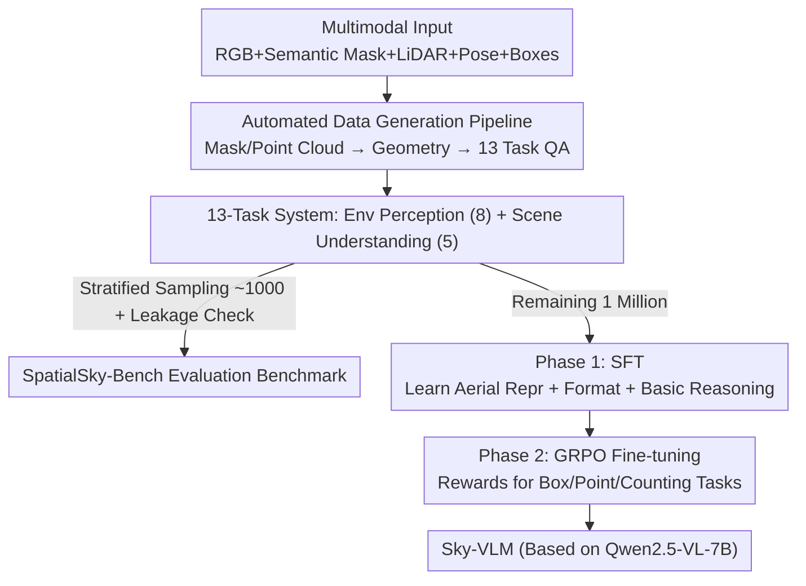

# Is your VLM Sky-Ready? A Comprehensive Spatial Intelligence Benchmark for UAV Navigation

**Conference**: CVPR 2026  
**Paper**: [CVF Open Access](https://openaccess.thecvf.com/content/CVPR2026/html/Zhang_Is_your_VLM_Sky-Ready_A_Comprehensive_Spatial_Intelligence_Benchmark_for_CVPR_2026_paper.html)  
**Code**: https://github.com/linglingxiansen/SpatialSKy  
**Area**: Multimodal VLM  
**Keywords**: UAV Navigation, Spatial Intelligence, VLM benchmark, SFT+GRPO, Aerial Perspective

## TL;DR
This work constructs the first spatial intelligence evaluation benchmark for Unmanned Aerial Vehicle (UAV) perspectives, SpatialSky-Bench (13 fine-grained tasks in 2 categories), accompanied by a 1-million-sample automatically generated training set SpatialSky-Dataset. By employing "SFT + GRPO reinforcement fine-tuning," the authors develop a specialized model, Sky-VLM, which achieves an average score of 53.30, surpassing the strongest baseline GPT-5 (23.07) by 139.6%.

## Background & Motivation
**Background**: With powerful visual perception and reasoning capabilities, VLMs have been widely applied to UAV navigation tasks such as search and rescue, infrastructure inspection, and precision agriculture. To support real-time flight decision-making, models must possess "spatial intelligence"—the ability to understand spatial relationships between objects, perform fine-grained scene parsing, and provide precise environmental perception.

**Limitations of Prior Work**: Existing VLM spatial evaluation benchmarks (VQA, GQA, VSI-Bench, MMSI-Bench, RefSpatial-Bench, RoboSpatial, etc.) are almost entirely built on **ground or first-person perspectives**, involving indoor scenes, street views, or handheld camera photos. The top-down or low-altitude aerial perspectives of UAVs introduce a new set of challenges: drastic variations in object scales, top-down occlusions, lack of depth information, and complex ground semantics. Ground-perspective benchmarks fail to measure the true capabilities of VLMs in the air.

**Key Challenge**: While UAV navigation has extremely high demands for spatial intelligence, there is neither a "high-precision" aerial perspective benchmark nor large-scale training data to "learn" aerial spatial capabilities. Off-the-shelf VLMs generally lack precise spatial perception in UAV scenarios.

**Goal**: (1) Create a benchmark that systematically covers UAV spatial capabilities; (2) Create a scalable training set; (3) Train a specialized VLM that truly possesses UAV spatial reasoning.

**Key Insight**: The authors found that UAV datasets (e.g., UAVScenes) inherently contain multimodal annotations such as pixel-level semantic masks, LiDAR point clouds, and poses. These annotations can be used to **automatically** derive supervision signals like bounding boxes, distances, altitudes, and spatial relationships. Thus, an automated pipeline can transform raw annotations into massive question-answering pairs.

**Core Idea**: A three-step process is proposed: "Automated QA generation from multimodal annotations → SFT to learn formats and basic reasoning → GRPO reinforcement fine-tuning with task-specific rewards for key localization tasks" to transform a general VLM into a UAV spatial expert.

## Method

### Overall Architecture
The work revolves around three products: the evaluation benchmark **SpatialSky-Bench**, the training set **SpatialSky-Dataset**, and the specialized model **Sky-VLM**. The workflow is as follows: first, QA pairs covering 13 tasks are automatically generated from aerial data with multimodal annotations (including manual review). Approximately 1,000 samples are stratified-sampled as the benchmark (with other QAs from the same images removed from the training set to prevent leakage). The remaining 1 million samples are used to train Sky-VLM: Phase 1 performs Supervised Fine-Tuning (SFT) on the full dataset to build foundations; Phase 2 performs GRPO reinforcement fine-tuning on 30,000 localization samples, designing task-specific rewards for tasks requiring pixel-level precision like bounding boxes, pointing, and counting.

### Key Designs

**1. SpatialSky-Bench: A UAV Spatial Capability System with 13 Tasks in 2 Categories**

Addressing the pain point that existing benchmarks are ground-perspective, the authors decompose the spatial intelligence required for UAV navigation into 13 fine-grained sub-tasks. **Environment Perception (8 items)**: Bounding box localization, object color recognition, distance estimation between objects, UAV-perspective altitude perception, forward pointing (output coordinates for target), reverse pointing (name object for coordinates), traversable space detection (navigable areas), and spatial relationship understanding. **Scene Understanding (5 items)**: Single-image scene description, multi-image temporal description, object functional reasoning, object counting under different scales/occlusions, and landing safety analysis (judging landing viability based on spatial cues). Each task is assigned task-specific metrics: boxes use mIoU (correct if IoU $\ge 0.5$, formula $\text{mIoU}=\frac{1}{N}\sum_i \frac{|B^i_{pred}\cap B^i_{gt}|}{|B^i_{pred}\cup B^i_{gt}|}$); pointing checks if predicted coordinates fall within the ground truth mask; multiple-choice/recognition use accuracy; open-ended tasks (distance, altitude, description, functionality, landing) use BLEU plus GPT-4o scoring (1–10 scale).

**2. Automated QA Generation Driven by Multimodal Annotations: Turning Geometric Annotations into Learnable Language Supervision**

Scaling to 1 million samples via manual labeling is infeasible. The authors' key approach is to **derive answers using geometric calculations** directly from UAVScenes' multimodal annotations: bounding boxes are converted from connected components of pixel-level semantic masks into axis-aligned boxes; colors are determined by clustering pixels within masks in HSV space and mapping them to descriptors like "light blue"; pointing/reverse pointing samples 5–8 pixel coordinates within masks; traversable space samples points from background connected components with area $> 500$ pixels; spatial relationships are calculated from the centroids $c_i, c_j$ of two object masks to determine directional angle $\theta_{ij}=\arctan\frac{\bar y_j-\bar y_i}{\bar x_j-\bar x_i}$ and distance $d_{ij}=\lVert c_i-c_j\rVert_2$ (categorized into eight directions like left/right/up when $d_{ij} > 50$ pixels); distance is calculated by projecting LiDAR point clouds onto the image plane for average depth $d_{obj}=\frac{1}{|P_{obj}|}\sum_{p_k\in P_{obj}} z^{cam}_k$; altitude uses the pose transformation matrix $T_{4\times4}$ to convert point clouds to world coordinates for absolute elevation. Each task uses 20+ VLM-generated question templates to prevent pattern matching, followed by expert review.

**3. Two-Stage Training (SFT + GRPO): Learning "Correct Format" First, then "Precise Localization"**

Based on Qwen2.5-VL-7B, the authors use a two-stage training strategy. **Phase 1: SFT** is conducted on the full 1 million samples, allowing the model to learn aerial visual representations distinct from ground views, master output formats like `<box>`/`<point>`/`<boxed>`, and acquire basic reasoning for 13 tasks. The loss is calculated only on answer tokens: $L_{SFT}=-\frac{1}{n-k+1}\sum_{i=k}^n \log P(t_i|V,t_1,\dots,t_{i-1};\theta)$, focusing learning on "generating answers" rather than "understanding questions." **Phase 2: RFT** uses GRPO on 30,000 localization samples to refine key tasks with rewards that directly measure prediction-ground truth deviation: pointing uses a binary reward (1 if L1 distance between prediction and nearest ground truth point $\le 50$, else 0), multiple-choice uses exact match rewards, and bounding boxes use continuous IoU as reward signals. Objective: $L_{GRPO}=-\mathbb{E}_{\pi_\theta}\big[R(y)\log\frac{\pi_\theta(y|x)}{\pi_{ref}(y|x)}\big]+\beta\,\text{KL}(\pi_\theta\Vert\pi_{ref})$, with KL ($\beta=0.01$) to prevent model drift.

### Loss & Training
SFT phase: 8×H200, AdamW, learning rate 1e-5, batch size 2 per card, 2-step gradient accumulation, 1 epoch. RFT phase: GRPO, learning rate 1e-6, weight decay 0.1, using SFT model as reference policy, KL coefficient $\beta=0.01$, 1 epoch.

## Key Experimental Results

### Main Results
Comparison on SpatialSky-Bench across closed-source, open-source general, and spatial-specific VLMs (average score across 13 tasks, representative tasks shown):

| Model | Params | Box(mIoU) | Color | Landing | Average↑ |
|-------|--------|-----------|-------|---------|----------|
| GPT-4o | - | 0.24 | 45.00 | 50.70 | 21.27 |
| GPT-5 | - | 1.13 | 47.00 | 50.50 | 23.07 |
| Gemini-2.5-Pro | - | 3.45 | 46.00 | 46.30 | 22.75 |
| Qwen2.5-VL-7B | 7B | 2.38 | 46.00 | 31.32 | 16.93 |
| SpatialVLM (Spatial) | 8B | 0.96 | 21.00 | 25.90 | 19.02 |
| **Sky-VLM (Ours)** | 7B | **42.68** | **79.00** | **61.40** | **53.30** |

Closed-source models averaged 20.11–23.07; open-source VLMs only 13.93–18.65. Even spatial-specific models (SpatialVLM 19.02 / SpaceR 12.61 / VILASR 13.45) failed to transfer to UAV perspectives. Sky-VLM reached an average of 53.30, surpassing GPT-5 by **139.6%**; specifically achieving 42.68 mIoU on boxes (473% higher than SpaceR) and reaching SOTA on all tasks.

### Ablation Study

| Configuration | Env Perception↑ | Scene Understanding↑ | Total Average↑ | Note |
|---------------|-----------------|---------------------|---------------|------|
| Sky-VLM-SFT | 52.53 | 41.52 | 48.29 | SFT Only |
| Sky-VLM-RL (Full) | 60.33 | 42.06 | 53.30 | SFT + GRPO |

Reward function ablation (removing rewards in GRPO): Removing **pointing reward** dropped environment perception from 60.33 to 53.77 (largest drop); removing box and choice rewards dropped total average to 49.72 and 50.27 respectively.

### Key Findings
- **GRPO reinforcement fine-tuning is key to localization**: SFT-only environment perception was 52.53, rising to 60.33 (+14.8%) with GRPO, whereas scene understanding (open semantics) remained nearly unchanged (41.52→42.06). This indicates RFT mainly supplements pixel-level structured localization.
- **Pointing reward is most critical**: Its removal caused the largest performance drop, confirming that "accurate coordinate prediction is the basis of spatial reasoning."
- **Off-the-shelf VLMs fail collectively in UAV perspectives**: Even GPT-5 and Gemini-2.5-Pro only scored ~23. Spatial-specific models could not transfer, highlighting a significant gap in UAV spatial intelligence.
- Data scale experiments (0K→1M) showed performance growth proportional to training data volume.

## Highlights & Insights
- **"Annotation as Supervision" Automated Data Engine**: By using geometric calculations on existing masks, LiDAR, and poses in UAV datasets, the authors derived answers for 13 task types, bypassing expensive manual spatial labeling to generate 1 million samples.
- **Simultaneous Delivery of Benchmark and Model**: The work provides the full loop of benchmark + dataset + model, with strict data leakage prevention by removing benchmark-related images from the training set.
- **Clear Two-Phase Division of Labor**: SFT handles "format and basic reasoning," while GRPO handles "precise localization." For tasks requiring structured coordinate outputs, the "imitate then reinforce" paradigm is highly effective.

## Limitations & Future Work
- The model is based on a single backbone (Qwen2.5-VL-7B); transferability to larger or different architectures was not verified.
- Open-ended tasks like landing safety rely on GPT-4o as an auto-judge, which may carry the judging model's biases.
- The training set is derived from UAVScenes (22 classes, 20k images), making scene diversity dependent on the source dataset.
- The impact of systematic errors in automated answers (e.g., color clustering, depth projection noise) inherited by the model was not quantified.

## Related Work & Insights
- **vs Ground Spatial Benchmarks (VSI-Bench / MMSI-Bench / etc.)**: These focus on ground or egocentric reasoning. This work targets UAV top-down views, addressing aerial-specific challenges like scale shifts and lack of depth.
- **vs Spatial-Specialized VLMs (SpatialVLM / SpaceR / etc.)**: These perform well on ground tasks but fail in UAV perspectives (<20 points), proving that UAV spatial intelligence requires dedicated data and training rather than simple reuse.
- **vs VLM in UAV Navigation (UAV-VLA / SoraNav / etc.)**: While those works use VLMs as planning/pointing interfaces, this work first systematically evaluates and strengthens the VLM's spatial perception as a foundation for decision-making.

## Rating
- Novelty: ⭐⭐⭐⭐ First UAV spatial intelligence benchmark + automated data engine.
- Experimental Thoroughness: ⭐⭐⭐⭐⭐ Covers 13 tasks across closed/open/spatial baselines with extensive ablations.
- Writing Quality: ⭐⭐⭐⭐ Clear task definitions and data pipeline; formulas are complete.
- Value: ⭐⭐⭐⭐⭐ Fully open-sourced benchmark, dataset, and model, directly promoting VLM deployment in UAV scenarios.

<!-- RELATED:START -->

## Related Papers

- [\[CVPR 2026\] SpatialScore: Towards Comprehensive Evaluation for Spatial Intelligence](spatialscore_towards_comprehensive_evaluation_for_spatial_intelligence.md)
- [\[CVPR 2026\] Scaling Spatial Intelligence with Multimodal Foundation Models](scaling_spatial_intelligence_with_multimodal_foundation_models.md)
- [\[CVPR 2026\] SpatialTree: How Spatial Intelligence Branches Out in MLLMs](spatialtree_how_spatial_intelligence_branches_out_in_mllms.md)
- [\[CVPR 2026\] Twin-T & TwintVQA: A Reliable Structure-Detail Separating VLM and a Comprehensive Benchmark for Chart and Table Tasks](twin-t_twintvqa_a_reliable_structure-detail_separating_vlm_and_a_comprehensive_b.md)
- [\[CVPR 2026\] PAI-Bench: A Comprehensive Benchmark for Physical AI](pai-bench_a_comprehensive_benchmark_for_physical_ai.md)

<!-- RELATED:END -->
