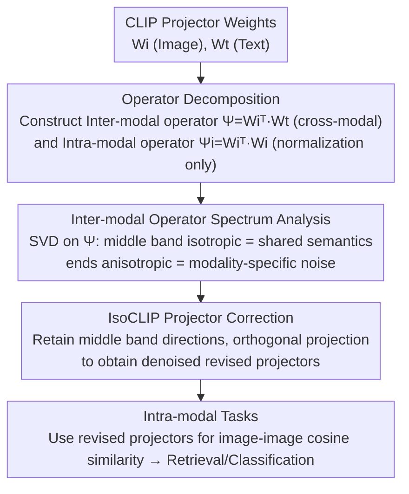

# IsoCLIP: Decomposing CLIP Projectors for Efficient Intra-modal Alignment

**Conference**: CVPR 2026  
**arXiv**: [2603.19862](https://arxiv.org/abs/2603.19862)  
**Code**: [https://github.com/simomagi/IsoCLIP](https://github.com/simomagi/IsoCLIP)  
**Area**: Multi-modal VLM / CLIP Analysis  
**Keywords**: CLIP, Intra-modal Alignment, Projector Analysis, SVD, Isotropic Subspace

## TL;DR

IsoCLIP theoretically analyzes the structure of CLIP projectors and discovers that the cosine similarity calculation implicitly involves an inter-modal operator $\Psi = W_i^\top W_t$ responsible for cross-modal alignment and an intra-modal operator $\Psi_i = W_i^\top W_i$ that only targets normalization without promoting intra-modal alignment. By applying Singular Value Decomposition (SVD) to $\Psi$, the study identifies an approximately isotropic alignment subspace; removing anisotropic directions significantly improves intra-modal retrieval and classification performance without requiring any training.

## Background & Motivation

1. **Background**: Vision-Language Models (VLMs) like CLIP are primarily designed for cross-modal tasks (e.g., zero-shot classification, image-text retrieval), but their image encoders are also widely utilized for intra-modal tasks (e.g., image-to-image retrieval, image classification).
2. **Limitations of Prior Work**: CLIP suffers from intra-modal misalignment—contrastive training focuses exclusively on optimizing cross-modal similarity while neglecting intra-modal similarity, leading to suboptimal performance in intra-modal tasks. Existing remedies like OTI/OVI require expensive per-query optimization.
3. **Key Challenge**: The CLIP training objective only accounts for cross-modal alignment, while intra-modal alignment is completely ignored.
4. **Goal**: To understand the root cause of intra-modal misalignment and propose an efficient, training-free restoration scheme.
5. **Key Insight**: Start from the mathematical structure of CLIP projectors to analyze the roles of operators within the cosine similarity and contrastive loss functions.
6. **Core Idea**: Identify the isotropic subspace where the two modalities are well-aligned by decomposing the inter-modal operator via SVD, then remove the anisotropic directions.

## Method

### Overall Architecture

This paper seeks to clarify why CLIP's image encoder consistently underperforms in intra-modal tasks such as image-to-image retrieval and how to fix this without retraining. IsoCLIP's approach involves no feature modification or optimization; it focuses purely on the weight matrices of the CLIP projectors. By combining the image projector $W_i$ and text projector $W_t$ into an inter-modal operator $\Psi = W_i^\top W_t$ and performing SVD $\Psi = U\Sigma V^\top$, it identifies the "middle band" of the singular value spectrum where the two modalities are most aligned. By suppressing the anisotropic ends that serve only single-modality characteristics, it derives a pair of revised projectors for intra-modal tasks. The methodology follows a linear pipeline: Weight Matrices $\to$ Operator Decomposition $\to$ SVD Spectrum Analysis $\to$ Middle-band Orthogonal Projection $\to$ New Weights, with no trainable components.

### Key Designs

**1. Mechanism: Inter-modal / Intra-modal Operator Decomposition**

To explain why CLIP fails in intra-modal tasks, the authors derive the gradient of the contrastive loss with respect to image features. The derivation reveals that the gradient splits into two parts: $\Psi = W_i^\top W_t$, which projects paired text features back into the image space to pull cross-modal representations closer, and $\Psi_i = W_i^\top W_i$, which acts only on the image features themselves to constrain the norm. Critically, during training, an image only interacts with text through $\Psi$, and the only point of contact between images is $\Psi_i$, which involves no cross-sample alignment signal. Consequently, the CLIP loss lacks signals for intra-modal alignment by design.

**2. Design Motivation: Spectrum Analysis of the Inter-modal Operator**

Since $\Psi$ carries the core cross-modal relationship, the authors analyze its singular value spectrum. Across various models (e.g., ViT-B/16, B/32) and datasets (OpenAI, DataComp), the spectra show a consistent pattern: the ends of the spectrum (largest and smallest singular values) are highly anisotropic, favoring one modality significantly over the other ("modality-specific"). The middle band is approximately isotropic, where both modalities are treated equally and are best aligned. Anisotropy is harmful because it pulls projected features toward modality-specific preferences, drowning out shared semantics and polluting intra-modal similarity.

**3. Function: IsoCLIP Projector Correction**

The correction involves sorting the singular values of $\Psi$ and retaining only the isotropic middle band $[k_t, r-k_b]$ (where $r$ is the rank, and $k_t, k_b$ are the number of truncated top and bottom directions). Rather than scaling singular values, the method uses the left/right singular vectors to span subspaces $\mathcal{S}_U$ and $\mathcal{S}_V$, forming orthogonal projection operators $U_{\mathcal{S}_U}U_{\mathcal{S}_U}^\top$ and $V_{\mathcal{S}_V}V_{\mathcal{S}_V}^\top$. The original projectors are then projected onto these subspaces: $\widehat{W}_i = W_i U_{\mathcal{S}_U}U_{\mathcal{S}_U}^\top$ and $\widehat{W}_t = W_t V_{\mathcal{S}_V}V_{\mathcal{S}_V}^\top$. This effectively zeros out extreme modality-specific directions. The revised $\widehat{W}_i$ flattens the spectrum of the intra-modal operator $W_i^\top W_i$, distributing similarity across more directions and enhancing intra-modal discriminative power. This requires only one SVD and one projection, with no training or inference overhead.

### Loss & Training

No training is required. IsoCLIP is a post-processing method that applies SVD and spectrum truncation to existing CLIP projector weights.

## Key Experimental Results

### Main Results

| Task/Dataset | Metric | CLIP Original | OTI (Optimization) | IsoCLIP | Gain vs CLIP |
|--------------|--------|---------------|-------------------|---------|--------------|
| CIFAR-100 I2I Retrieval | Recall@1 | 54.2 | 58.7 | 61.3 | +7.1 |
| CUB-200 I2I Retrieval | Recall@1 | 24.8 | 29.1 | 32.5 | +7.7 |
| STS-B T2T Retrieval | Spearman | 0.71 | 0.74 | 0.77 | +0.06 |

IsoCLIP significantly outperforms the original CLIP on both image-to-image and text-to-text retrieval tasks without requiring per-query optimization.

### Ablation Study

| Config | CIFAR-100 R@1 | Latency | Description |
|--------|---------------|---------|-------------|
| CLIP Original | 54.2 | 1x | Baseline |
| OTI (100 steps) | 58.7 | ~50x | Requires per-query optimization |
| OTI (500 steps) | 59.3 | ~250x | Slightly better but extremely slow |
| IsoCLIP (Middle 50%) | 60.1 | 1x | Retains 50% of singular values |
| IsoCLIP (Middle 70%) | 61.3 | 1x | Optimal truncation ratio |

### Key Findings

- IsoCLIP surpasses OTI, which requires 100+ optimization steps, while reducing latency by approximately 50x.
- The discovery of the isotropic subspace is consistent across different CLIP architectures (ViT-B/16, B/32) and pre-training datasets (OpenAI, DataComp).
- The truncation ratio has a mild impact on performance, with consistent gains observed between 50% and 70%.
- Improvements are also observed in classification tasks (e.g., few-shot), indicating that enhanced intra-modal similarity provides broad benefits.

## Highlights & Insights

- **Elegant Theoretical Analysis**: The root cause of intra-modal misalignment is rigorously derived from the mathematical structure of the CLIP contrastive loss and projectors, rather than being a purely empirical observation.
- **Discovery of Inter-modal Operator $\Psi$**: The structural insight that CLIP's cosine similarity essentially relies on the cross-modal mapping $W_i^\top W_t$ is profound.
- **Zero Additional Computation**: Since it only modifies the projector weight matrices, there is zero additional overhead during inference.

## Limitations & Future Work

- The linear projector assumption limits the scope of the analysis; non-linear projection heads may require different methodologies.
- The truncation ratio is a hyperparameter, and its optimal value might vary by model and task.
- Only CLIP-style models were analyzed; the projector structures of other VLMs like SigLIP might differ.
- Future work could explore asymmetric truncation strategies or adaptive methods for determining truncation ratios.

## Related Work & Insights

- **vs OTI/OVI**: While OTI addresses misalignment via optimization-based modal inversion, IsoCLIP directly modifies the projectors, offering far greater efficiency.
- **vs Modality Gap**: While previous works identified the modality gap, IsoCLIP provides a functional solution from the perspective of the projection head.
- **vs CLIP fine-tuning**: Unlike fine-tuning, which may degrade zero-shot capabilities, IsoCLIP improves performance without altering the backbone's fundamental parameters.

## Rating

- Novelty: ⭐⭐⭐⭐⭐ Deep theoretical analysis with original insights into inter/intra-modal operators.
- Experimental Thoroughness: ⭐⭐⭐⭐ Validated across multiple models and tasks.
- Writing Quality: ⭐⭐⭐⭐⭐ Clear theoretical derivations and sound experimental design.
- Value: ⭐⭐⭐⭐⭐ High practical utility for improving CLIP's intra-modal performance at zero cost.

<!-- RELATED:START -->

## Related Papers

- [\[CVPR 2026\] Reevaluating the Intra-Modal Misalignment Hypothesis in CLIP](reevaluating_the_intra-modal_misalignment_hypothesis_in_clip.md)
- [\[CVPR 2026\] DeAR: Fine-Grained VLM Adaptation by Decomposing Attention Head Roles](dear_fine-grained_vlm_adaptation_by_decomposing_attention_head_roles.md)
- [\[CVPR 2026\] CoV-Align: Efficient Fine-grained Cross-Modal Alignment with Cohesive Visual Semantics Priority](cov-align_efficient_fine-grained_cross-modal_alignment_with_cohesive_visual_sema.md)
- [\[CVPR 2026\] Intra-class Distribution-guided Generative Hashing with Neighbor Refinement for Cross-modal Retrieval](intra-class_distribution-guided_generative_hashing_with_neighbor_refinement_for_.md)
- [\[CVPR 2026\] Boosting Visual Reprogramming for CLIP with Dual Granularity Alignment](boosting_visual_reprogramming_for_clip_with_dual_granularity_alignment.md)

<!-- RELATED:END -->
