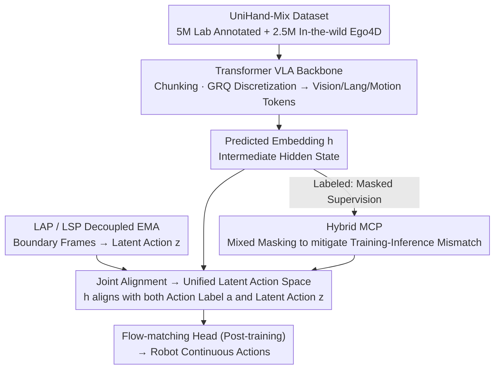

# Joint-Aligned Latent Action: Towards Scalable VLA Pretraining in the Wild

**Conference**: CVPR 2026  
**arXiv**: [2602.21736](https://arxiv.org/abs/2602.21736)  
**Code**: [https://research.beingbeyond.com/jala](https://research.beingbeyond.com/jala)  
**Area**: Multimodal VLM  
**Keywords**: VLA Pretraining, Latent Action, Human Video, Hand Motion, Robot Manipulation

## TL;DR
The JALA framework is proposed to construct a unified latent action space by jointly aligning predicted embeddings with latent actions generated via inverse dynamics. This allows Vision-Language-Action (VLA) models to learn from both annotated data and unlabeled in-the-wild human videos. Combined with the UniHand-Mix dataset containing 7.5M samples, it significantly improves the generalization of robot manipulation.

## Background & Motivation
**Background**: VLA models learn manipulation strategies by adapting vision-language models to robotic data. However, the scale and diversity of robotic data are far inferior to those in the vision and language domains.

**Limitations of Prior Work**: Utilizing human video data involves a trade-off between quality and diversity—laboratory data provides precise hand tracking but limited scenes, while in-the-wild videos offer rich diversity but lack action annotations.

**Key Challenge**: Previous latent action methods (e.g., LAPA) rely on inverse dynamics models (IDM) to infer latent actions and forward dynamics models (FDM) to reconstruct future frames. However, video reconstruction of fine-grained human manipulation is extremely difficult, and the quality bottleneck of FDM in turn contaminates the quality of latent actions.

**Goal**: To extract useful action signals for VLA pretraining from heterogeneous annotated and unannotated human videos without relying on visual reconstruction.

**Key Insight**: Humans learn manipulation through transferable action patterns rather than memorizing every visual detail. Latent actions should be predictable from context and consistent with inverse dynamics, but pixel-level reconstruction is unnecessary.

**Core Idea**: Joint Alignment is used to replace reconstruction: the intermediate hidden states (predicted embeddings) of the VLA are aligned simultaneously with action labels and latent actions inferred by the IDM.

## Method

### Overall Architecture
The core problem JALA addresses is how to enable a VLA to utilize both lab videos with precise hand annotations and in-the-wild videos like Ego4D without being dragged down by the "future frame reconstruction" bottleneck typical of LAPA. The strategy is to converge action signals into the VLA's own hidden states rather than reconstructing pixels.

A human video is first segmented into motion chunks. The Transformer backbone encodes visual frames, language instructions, and motion tokens together, performing masked prediction on motion chunks to learn action patterns. Simultaneously, a Latent Action Perceiver (LAP) infers the "latent action" of a segment from its start and end frames. The VLA’s hidden state at that step (termed predicted embedding) is then aligned with this latent action. Thus, the model is supervised by action tokens when labels are present and by visual dynamics when labels are absent, with both signals converging into the same hidden state. After pretraining, a flow-matching head is attached to translate predicted embeddings into actual robot actions, completing the transfer to manipulation tasks.

### Key Designs

**1. Joint Alignment: Replacing future frame reconstruction with embedding alignment to bypass FDM quality bottlenecks**

Methods like LAPA constrain the latent action space through "latent action inference via IDM + future frame reconstruction via FDM." However, fine-grained manipulation videos are nearly impossible to reconstruct accurately; if the reconstructor is distorted, it contaminates the latent actions. JALA chooses to abandon reconstruction: it subjects the hidden state $h_{i,k}$ of the $i$-th segment at the $k$-th step to two constraints—first, restoring the correct motion token $a_{i,k}$ via masked prediction, and second, aligning with the latent action $z_{i,k}$ generated by the LAP. The alignment loss uses the L1 distance:

$$\mathcal{L}_{Align} = \sum_{i,k} \|h_{i,k} - z_{i,k}\|_1$$

Masked prediction provides supervision only when action labels exist, while $z_{i,k}$ is computed from visual changes in any video independently of labels. These two signals complement each other, bringing annotated and in-the-wild data into a unified latent action space without the cost of "pixel reconstruction."

**2. Decoupled EMA Updates for LAP and LSP: Anchoring actions and predicting context through separate gradual convergence**

Generating and using latent actions are two distinct tasks: the LAP encodes "what action occurred" by looking at motion boundary frames $(v_t, v_{t+\delta})$, while the Latent Symmetrized Predictor (LSP) maps the VLA context into the same space to predict this action. They share the same Perceiver architecture, but training is unstable if the feature spaces of different vision encoders are directly linked. JALA uses asymmetric Exponential Moving Averages (EMA) to decouple them: backbone weights are passed gradually from LSP to LAP, while query weights are passed from LAP to LSP. This allows the backbone to focus on "understanding context" and the query to focus on "anchoring actions" without destabilizing each other.

**3. Hybrid Masked Chunk Prediction (Hybrid MCP): Eliminating training-inference mismatch caused by full masking**

Action supervision involves masked prediction at the chunk level. A naive approach masks the entire target chunk, which creates a context internal-external mismatch between training and inference. JALA adopts a hybrid strategy: a random chunk is selected as the primary prediction target; preceding chunks are kept as context, the target chunk is masked at a random ratio, and subsequent chunks are masked with a low 5% probability. During inference, multiple decodes of the same segment are ensembled to stabilize output. This maintains sufficient context alignment while avoiding the distribution shift of "full masking during training vs. partial masking during inference."

**4. UniHand-Mix Dataset: Combining "precise but limited" and "diverse but unlabeled" videos into a 7.5M pretraining pool**

The ability to learn from unlabeled videos requires a large and diverse video corpus. JALA constructs UniHand-Mix: over 5M indexed lab samples (with precise MANO hand tracking) paired with 2.5M in-the-wild Ego4D samples. The latter are filtered by hand detection, validated for activity by Gemini, and assigned instructions. Approximately 10% of these are further processed with HaWoR to estimate pseudo-hand poses (confidence $\geq 0.65$) as weak annotations. Covering over 2000 hours of video and 7.5M samples, it complements the diversity of previous datasets like UniHand.

### Post-training Transfer
The predicted embeddings from pretraining are not direct robot actions. In the post-training phase, a Diffusion Transformer-based flow-matching head is attached. It integrates manipulation priors learned during pretraining via cross-attention to translate the predicted embeddings into continuous robotic actions.

## Key Experimental Results

### Robot Manipulation (Libero Benchmark)

| Method | Parameters | LIBERO-Spatial | LIBERO-Object | LIBERO-Goal | LIBERO-Long | Average |
| :--- | :--- | :--- | :--- | :--- | :--- | :--- |
| OpenVLA | 7B | 84.7 | 88.4 | 79.2 | 53.7 | 76.5 |
| π0 | 3B | 76.9 | 96.0 | 89.4 | 68.2 | 82.6 |
| **JALA** | **~2B** | **Superior** | **Superior** | **Superior** | **Superior** | **Outperforms same scale** |

### Hand Motion Generation (Lab vs. In-the-wild)

| Method | Lab FID↓ | In-the-wild FID↓ |
| :--- | :--- | :--- |
| Being-H0 (Lab only) | Good | Poor |
| **JALA** | **Maintained** | **Significantly Improved** |

### Key Findings
- JALA generates more realistic hand motions in in-the-wild scenarios while maintaining lab performance.
- Compared to using lab data only, hybrid training consistently improves performance across Libero sub-tasks.
- Joint alignment is superior to using MCP or LAP individually.
- It performs exceptionally well in real-world robot tasks, especially in out-of-distribution (OOD) scenarios.

## Highlights & Insights
- **Bypassing FDM reconstruction** is a key innovation: aligning embeddings instead of pixels avoids the primary quality bottleneck.
- **Decoupled EMA updates** are elegantly designed: letting the backbone handle context and the query handle action anchoring leverages their respective strengths.
- UniHand-Mix (7.5M) is currently the largest pretraining dataset for human hand manipulation.
- The transfer path from human video to robot manipulation (pretraining → flow-matching post-training) is concise and efficient.

## Limitations & Future Work
- Pseudo-hand-pose annotation thresholds at 0.65 for in-the-wild videos may still introduce noise.
- MANO parameterization limits the modeling of non-hand manipulations (e.g., tool use).
- UniHand-Mix consists mostly of egocentric perspectives; third-person human manipulation videos are not included.
- There is room to expand the variety and scale of real-world robotic experimental tasks.

## Related Work & Insights
- **vs. LAPA**: LAPA constrains the latent action space via FDM reconstruction; JALA bypasses this via joint alignment.
- **vs. Being-H0**: Being-H0 uses only lab-annotated data; JALA extends to in-the-wild videos via LAP.
- **vs. OpenVLA/RoboVLM**: These methods train directly on robot data; JALA obtains richer manipulation priors through human video pretraining.
- The concept of latent action alignment can be generalized to other scenarios requiring learning from heterogeneous data.

## Rating
- Novelty: ⭐⭐⭐⭐⭐ The joint alignment paradigm renovates latent action learning.
- Experimental Thoroughness: ⭐⭐⭐⭐ Multidimensional validation across hand generation, simulation, and the real world.
- Writing Quality: ⭐⭐⭐⭐ Clear motivation and intuitive diagrams.
- Value: ⭐⭐⭐⭐⭐ Provides a key methodology for scalable VLA pretraining from human videos.

<!-- RELATED:START -->

## Related Papers

- [\[CVPR 2026\] From Observation to Action: Latent Action-based Primitive Segmentation for VLA Pre-training in Industrial Settings](from_observation_to_action_latent_action-based_primitive_segmentation_for_vla_pr.md)
- [\[CVPR 2026\] SIMPACT: Simulation-Enabled Action Planning using Vision-Language Models](simpact_simulation-enabled_action_planning_using_vision-language_models.md)
- [\[CVPR 2026\] Dictionary-Aligned Concept Control for Safeguarding Multimodal LLMs](dictionary_aligned_concept_control_for_safeguarding_multimodal_llms.md)
- [\[ICML 2026\] Vision-aligned Latent Reasoning for Multi-modal Large Language Model](../../ICML2026/multimodal_vlm/vision-aligned_latent_reasoning_for_multi-modal_large_language_model.md)
- [\[CVPR 2026\] Concept-Aware Batch Sampling Improves Language-Image Pretraining](concept-aware_batch_sampling_improves_language-image_pretraining.md)

<!-- RELATED:END -->
