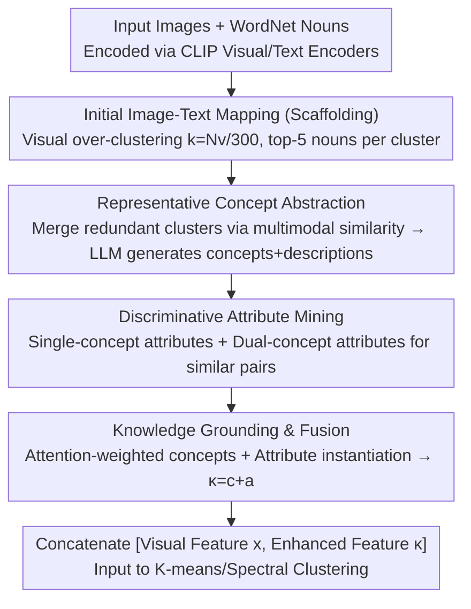

# KEC: Hierarchical Textual Knowledge for Enhanced Image Clustering

**Conference**: CVPR 2026  
**arXiv**: [2604.11144](https://arxiv.org/abs/2604.11144)  
**Code**: None  
**Area**: Multimodal VLM  
**Keywords**: Image Clustering, Textual Knowledge, Large Language Models, CLIP, Discriminative Attributes

## TL;DR
KEC utilizes LLMs to construct hierarchical concept-attribute structured textual knowledge to guide image clustering. Without training, it outperforms zero-shot CLIP on 14 out of 20 datasets, proving that discriminative attributes are more effective than simple class names.

## Background & Motivation

**Background**: Image clustering has evolved from geometric priors to deep representation learning and assistance from Visual-Language Models (VLMs). VLMs like CLIP enable the injection of textual knowledge into the clustering process.

**Limitations of Prior Work**: Existing methods either generate descriptions per image using VLMs (computationally expensive) or select shallow nouns from WordNet (semantic redundancy, inconsistent granularity). Simply introducing textual knowledge may even degrade clustering performance.

**Key Challenge**: Visually similar but semantically distinct categories (e.g., Corgi vs. Shiba Inu) cannot be distinguished by class names alone. Discriminative attributes (e.g., "Corgis have shorter and thicker legs") are required, but acquiring these requires expertise and is difficult to automate.

**Core Idea**: Use LLMs to distill abstract concepts from redundant nouns and automatically extract intra-concept and inter-concept discriminative attributes to build hierarchical knowledge for feature enhancement.

## Method

### Overall Architecture
KEC addresses how to introduce textual knowledge into training-free image clustering without being compromised by noise. It does not pass any images to the LLM. Instead, it performs "over-clustering" via k-means ($k=N_v/300$, significantly larger than the true number of classes) on CLIP visual features to select the top-5 closest WordNet nouns for each cluster, resulting in a set of raw but redundant candidate words. Then, the LLM merges and distills semantically overlapping clusters into a small set of clean **representative concepts** and automatically generates discriminative attributes for easily confused **concept pairs**. Finally, the CLIP text encoder encodes these concepts and attributes into vectors. Each image undergoes attention-based weighting and attribute instantiation to produce a "knowledge-enhanced feature" $\kappa$, which is **concatenated** with the original visual feature $x$ and fed into off-the-shelf clusterers like K-means or spectral clustering. In this pipeline, the LLM is only used for knowledge construction on the text side while the visual side remains CLIP-based, ensuring zero training and low cost.

### Key Designs

**1. Representative Concept Abstraction: Distilling redundant nouns into discriminative concepts**

Over-clustering yields far more visual clusters than actual categories, with each cluster assigned top-5 nouns. Consequently, semantically overlapping words like "car", "automobile", and "vehicle" are scattered across different clusters. Using them directly as clustering anchors would dilute inter-category discriminability. KEC first calculates a **multimodal similarity** $R_{i,j}=\alpha R^{\text{vis}}_{i,j}+(1-\alpha)R^{\text{text}}_{i,j}$ (a weighted sum of visual and textual centroid similarities) for each pair of clusters. It builds an adjacency graph based on a threshold $\beta$ and merges highly similar clusters using connected components. Finally, the LLM generates a **representative concept** and a textual description for each merged set. This step essentially uses LLM commonsense to converge "noun noise" into "concept signals," ensuring that subsequent attribute extraction is based on a set of non-overlapping concepts.

**2. Discriminative Attribute Mining: Expanding visually similar categories with contrastive information**

Concept names alone cannot distinguish visually similar categories like "Corgi vs. Shiba Inu." Humans distinguish them using discriminative attributes such as leg length, coat type, or ear shape. KEC uses the LLM to generate attributes in two ways: **Single-concept attributes** describe typical discriminative features of a concept; **Dual-concept attributes** compare two similar concepts and highlight their differences (e.g., "Corgi vs. Shiba Inu → Corgis have shorter and thicker legs"). To avoid enumerating all concept pairs, KEC sorts pairs by similarity and only extracts attributes for the most "confusable" neighbors. The "contrastive" information provided by the latter is key to distinguishing similar categories. CLIP's attention maps also confirm that these attribute descriptions guide the model's attention to the corresponding regions.

**3. Knowledge Grounding and Fusion: Mapping global knowledge to individual images**

The previous steps produce a set of global concept-attribute knowledge which must be grounded to specific images. For an image $x_i$, KEC calculates its similarity with each concept representation $\zeta_q=\phi_q+\psi_q$ (concept name features + description features) and applies softmax to obtain attention weights $\omega_{i,q}$. Attributes are "instantiated" by element-wise multiplication of each attribute feature $\xi_{q,l}$ with the image feature $\hat{\xi}=x_i\odot\xi_{q,l}$, and then averaged over concepts to obtain $\bar{\xi}^i_q$, imbuing attributes with the image's visual context. Finally, the same attention weights are used to aggregate concept and attribute features, which are summed to obtain the knowledge-enhanced feature:

$$c_i=\sum_q \omega_{i,q}\,\zeta_q,\qquad a_i=\sum_q \omega_{i,q}\,\bar{\xi}^i_q,\qquad \kappa_i = c_i + a_i$$

During clustering, the visual feature and knowledge-enhanced feature are **concatenated** $[x_i,\kappa_i]$ and fed into K-means or other algorithms (training-based methods like TAC treat them as complementary views for joint optimization). Since attention weights and attribute instantiation are calculated per image, two visually similar images with different attribute matches will receive different enhancement vectors, pushing them apart in the feature space—something naive labeling with the same set of nouns cannot achieve.

### Example: Distinguishing Corgis from Shiba Inus
When dog images are input, over-clustering scatters Corgis and Shiba Inus into several visual clusters, each assigned synonymous nouns like "dog," "corgi," or "shiba." Concept abstraction merges these clusters into two clean concepts: "Corgi" and "Shiba Inu." Attribute mining identifies these concepts as similar and generates specific differences like "leg length (Corgis are shorter and thicker)." During grounding, a Corgi image receives high attention weight for the "Corgi" concept and a high score for the "short/thick legs" attribute after instantiation. The resulting knowledge-enhanced feature $\kappa$ clearly biases towards the Corgi side. After concatenation with the visual feature, it is separated from Shiba Inu images in the feature space, preventing the downstream clusterer from mixing them.

### Loss & Training
KEC itself is training-free. It directly generates enhanced features to be fed into existing clustering algorithms (K-means, Spectral Clustering, etc.).

## Key Experimental Results

### Main Results

| Comparison | Metrics | KEC (Training-free) | Training-based Methods | Description |
|------|------|-------------|-----------|------|
| Avg. 20 Datasets | NMI | Better | 3% Lower | KEC excels without training |
| vs. CLIP zero-shot | Acc | Wins on 14/20 datasets | - | - |

### Ablation Study

| Configuration | NMI | Description |
|------|-----|------|
| KEC (Full) | Best | Concept + Attribute + Fusion |
| Naive Textual Knowledge | Decrease/Negative | Proves specialized knowledge is necessary |
| Concepts only, No Attributes | Moderate | Significant contribution from attributes |
| Single-concept Attributes only | Sub-optimal | Pairwise attributes provide further gain |

### Key Findings
- Naive introduction of textual knowledge (e.g., direct use of nouns) actually harms performance on some datasets, proving the necessity of structured knowledge.
- Discriminative attributes for concept pairs contribute more than single-concept attributes, showing that "contrastive" information is vital for distinguishing similar categories.
- KEC is insensitive to the choice of downstream clustering algorithms and exhibits good compatibility.

## Highlights & Insights
- **LLM as Knowledge Source**: KEC obtains sufficient discriminative knowledge via text-only interaction without image input to the LLM, maintaining extremely low costs.
- **Structure > Naiveness**: Demonstrates that "knowledge quality" is more important than "knowledge quantity."

## Limitations & Future Work
- Dependency on the quality of CLIP's text-image alignment.
- Potential biases in LLM-generated attributes.
- Has not been compared against specialized fine-grained methods on fine-grained datasets.

## Related Work & Insights
- **vs. SIC/TAC**: Uses shallow nouns or WordNet labeling, which suffers from severe semantic redundancy.
- **vs. VLM captioning**: Per-image description generation is computationally expensive and not scalable.

## Rating
- Novelty: ⭐⭐⭐⭐ Clear approach for hierarchical knowledge construction.
- Experimental Thoroughness: ⭐⭐⭐⭐⭐ Extremely comprehensive evaluation across 20 datasets.
- Writing Quality: ⭐⭐⭐⭐ Motivation and methodology are well-described.
- Value: ⭐⭐⭐⭐ Highly practical as it outperforms training-based methods without training.

<!-- RELATED:START -->

## Related Papers

- [\[AAAI 2026\] Harnessing Textual Semantic Priors for Knowledge Transfer and Refinement in CLIP-Driven Continual Learning](../../AAAI2026/multimodal_vlm/harnessing_textual_semantic_priors_for_knowledge_transfer_and_refinement_in_clip.md)
- [\[CVPR 2026\] Air-Know: Arbiter-Calibrated Knowledge-Internalizing Robust Network for Composed Image Retrieval](air-know_arbiter-calibrated_knowledge-internalizing_robust_network_for_composed_.md)
- [\[CVPR 2026\] Mimic Human Cognition, Master Multi-Image Reasoning: A Meta-Action Framework for Enhanced Visual Understanding](mimic_human_cognition_master_multi-image_reasoning_a_meta-action_framework_for_e.md)
- [\[CVPR 2026\] Proxy3D: Efficient 3D Representations for Vision-Language Models via Semantic Clustering and Alignment](proxy3d_efficient_3d_representations_for_vision-language_models_via_semantic_clu.md)
- [\[CVPR 2026\] TTL: Test-time Textual Learning for OOD Detection with Pretrained Vision-Language Models](ttl_test-time_textual_learning_for_ood_detection_with_pretrained_vision-language.md)

<!-- RELATED:END -->
