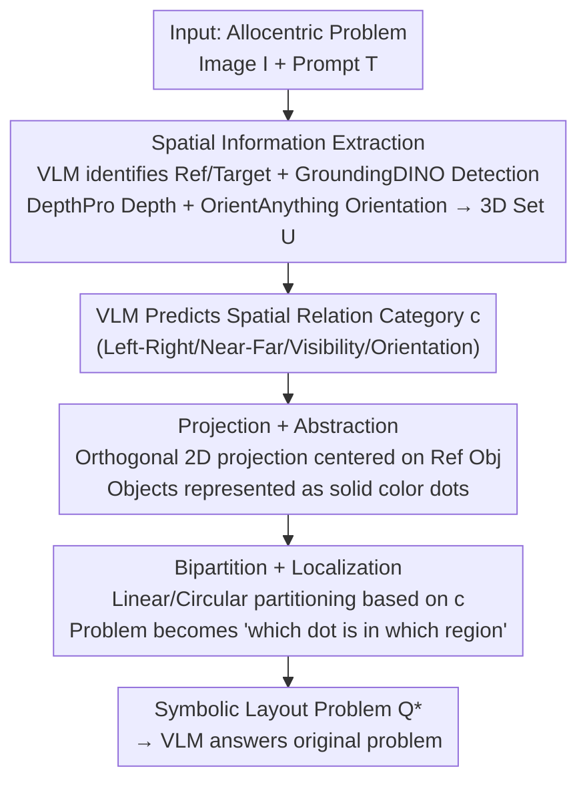

# Keep it SymPL: Symbolic Projective Layout for Allocentric Spatial Reasoning in Vision-Language Models

**Conference**: CVPR 2026  
**Paper**: [CVF Open Access](https://openaccess.thecvf.com/content/CVPR2026/html/Jang_Keep_it_SymPL_Symbolic_Projective_Layout_for_Allocentric_Spatial_Reasoning_CVPR_2026_paper.html)  
**Code**: https://airlabkhu.github.io/SymPL/ (Project Page)  
**Area**: Multimodal VLM / Spatial Reasoning  
**Keywords**: Allocentric Spatial Reasoning, Perspective Transformation, Symbolic Layout, Training-free, VLM Prompt Reconstruction

## TL;DR
SymPL identifies that VLMs struggle with "allocentric" spatial reasoning (reasoning from the perspective of an object in the scene). It proposes a training-free approach to extract 3D information and rewrite such problems into a "symbolic layout problem" (e.g., "which colored dot falls in the yellow region") using four factors: Projection, Abstraction, Bipartition, and Localization. This converts difficult perspective transformations into simple "color region localization" tasks where VLMs naturally excel, leading to significant performance gains in both allocentric and egocentric tasks.

## Background & Motivation

**Background**: While VLMs have made progress in egocentric (observer/camera perspective) spatial reasoning (aided by fine-tuning on 3D data like SpatialVLM, SpatialRGPT, and SpatialBot), spatial reasoning remains a general weakness.

**Limitations of Prior Work**: VLM performance drops sharply in **allocentric** reasoning (judging left/right, near/far, orientation, or visibility from the perspective of an object). Many baselines even perform below random guessing. The root cause is the strong egocentric bias in training data, causing models to struggle with perspective transformations.

**Key Challenge**: Existing solutions are suboptimal—training from scratch on allocentric data is non-scalable due to data scarcity and high compute; fine-tuning pre-trained VLMs leads to poor generalization or catastrophic forgetting; general reasoning aids (CoT, visual prompts like SoM/SCAFFOLD) do not directly address perspective shifts. The closest approach, APC, converts allocentric queries into egocentric ones but still fails to fully utilize the VLM's inherent reasoning potential.

**Goal**: To maximize the intrinsic capabilities of pre-trained VLMs by **rewriting allocentric reasoning problems into a format they already excel at**, without additional training.

**Key Insight**: The authors analyzed factors positively correlated with VLM accuracy and distilled four factors to make spatial reasoning more VLM-friendly: ① **Projection**: Orthogonal projection of spatial relationships onto 2D planes; ② **Abstraction**: Simplifying complex scenes into minimal symbolic markers to reduce interference; ③ **Bipartition**: Making relationships intuitive by dividing the reasoning space minimally; ④ **Localization**: Localization tasks like "is the object in the colored region" are more accurate than direction/distance queries.

**Core Idea**: Use these four factors to reconstruct allocentric problems as "symbolic layout problems" (an abstract colored-dot map + a query asking "which dot is in the yellow area"), allowing the VLM to indirectly solve perspective-dependent problems via color localization.

## Method

### Overall Architecture

Given an allocentric problem $Q$ (image $I$ + text prompt $T$), SymPL rewrites it into a symbolic layout problem $Q^*$ in two stages, then queries the VLM (Qwen2.5-VL was used in experiments) for the answer. Stage 1, **Spatial Information Extraction**: Identifies the reference viewer and target objects, estimating 3D coordinates and reference orientations using foundation models. Stage 2, **Problem Reconstruction**: The VLM predicts the spatial relationship category $c$ (left-right, near-far, etc.), then sequentially applies the four factors to generate an abstract colored-dot map and a corresponding localization query. The pipeline is shown below:

### Key Designs

**1. Spatial Information Extraction: Converting Images to Projectable 3D Coordinates**

To perform perspective transformation, the 3D position and orientation of objects must be known. Roles are identified in two steps: first, the VLM extracts all object names from the prompt $T$; second, it identifies the "reference viewer" $o_r$ (explicitly given in allocentric tasks; for egocentric tasks, the "camera" is the reference). This forms the set $O=\{o_r, o_i\}$. 3D coordinates are estimated using GroundingDINO for bounding boxes $B$ and DepthPro for the depth map $D$. For each object, pixels within the box are back-projected to 3D, and the **median** is taken as the 3D position $p_j=(x_j,y_j,z_j)$ (selecting points from high-density depth regions to exclude background outliers). Scale correction is applied when $x,y$ and $z$ scales differ significantly to prevent distortion. The orientation vector $v_r$ of the reference object is estimated by OrientAnything. This set $U=\{v_r, p_r, p_i\}$ serves as the geometric foundation.

**2. Projection + Abstraction: Orthogonal 2D Mapping and Symbolic Representation**

Addressing the difficulty of 3D reasoning under oblique views, the projection step selects an **external viewpoint centered on the reference and orthogonal to the plane of the spatial relation**: a top view for left-right/near-far/visibility/orientation, and a front view for above-below (height). Each $p_j$ is projected to 2D coordinates $d_j$, with the **reference orientation fixed as "up" and the reference position at the center**. This consistently maps allocentric perspectives to intuitive 2D relationships. The abstraction step represents each object at $d_j$ as a **solid colored dot, stripping away shape features**. This prevents distortion during reconstruction from interfering with recognition; object names are rewritten as "color-shape" symbolic markers. Ablations show that symbolic markers outperform segmentation masks, and correct orthogonal view selection is critical.

**3. Bipartition + Localization: Partitioning and Reducing Questions to Color Localization**

The final steps convert the abstract map into a localization task. The Bipartition step determines the boundary shape based on category $c$: direction classes (left-right, visibility) use **linear partitions** (vertical for left-right, horizontal for visibility/front-back), while distance classes (near-far, orientation) use **circular partitions**. The Localization step fills the regions with **colors contrasting with the dots** (e.g., yellow for left, black for right). Consequently, "left" is visualized as "yellow." The relative spatial relationship is reduced to a "which dot is in the yellow region" question, which VLMs answer reliably. Ablations indicate that partitioning is beneficial regardless of the number of partitions, though accuracy drops if too many color regions are used; "bipartition + two colors" was found to be optimal.

## Key Experimental Results

### Main Results

Allocentric COMFORT# and 3DSRBench (Subset categories, % Accuracy, higher is better):

| Method | COMFORT# L/R | Near/Far | Visibility | Orient. | 3DSR L/R | Visibility | Orient. |
|------|------|------|------|------|------|------|------|
| Random | 48.75 | 48.67 | 47.27 | 52.33 | 50.72 | 50.00 | 47.69 |
| Qwen2.5-VL | 48.17 | 72.33 | 51.17 | 51.33 | 36.25 | 48.40 | 65.03 |
| GPT-5 | 49.83 | 84.25 | 54.22 | 49.83 | 37.82 | 63.37 | 64.45 |
| APC-Vis (Prev. SOTA) | 43.75 | 54.08 | 49.77 | 30.92 | 61.75 | 71.37 | 64.60 |
| **SymPL (Ours)** | **69.00** | **97.33** | **91.41** | **91.50** | **79.94** | **75.00** | 70.95 |

Baselines hover around or below random chance on most allocentric tasks, with even GPT-5 only leading in "near-far." SymPL significantly outperforms across almost all categories (ranking second in 3DSRBench orientation behind Gemini-2.5-Flash at 72.25%).

Applying SymPL to **egocentric** COCOSPATIAL also proved effective: 89.83% for left-right and 94.33% for above-below, both exceeding best baselines.

### Ablation Study

Step-by-step addition of factors (Average of 5 general VLMs, COFORT# categories, standard deviation in parentheses):

| Configuration | L/R | Near/Far | Visibility | Orient. |
|------|------|------|------|------|
| Setting 1 (Original) | 46.60 | 63.80 | 52.00 | 52.80 |
| + Projection | 89.20 | 64.80 | 51.20 | 52.00 |
| + Abstraction | 96.40 | 81.00 | 90.80 | 100.00 |
| + Bipartition | 97.00 | 91.00 | 84.60 | 100.00 |
| **+ Localization (Full)** | **100.00** | **100.00** | **100.00** | **100.00** |

On visual illusions (COMFORT VI) and multi-view consistency (COMFORT Multi), SymPL achieved the highest scores: 95.38% for L/R and 100% for others in illusion scenes; 76.00 and 96.50 for multi-view L/R and near-far, significantly outperforming CoT/SoM/SCAFFOLD/APC.

### Key Findings
- **Synergy of Factors**: Accuracy rises continuously as factors are added. In the full version (Setting 5), all five VLMs achieved 100% across four classes with zero standard deviation, proving factors are complementary.
- **Optimal Conditions per Factor**: Projection view deviation hurts performance; symbolic abstraction is superior to segmentation masks; partitions are effective regardless of count; but too many color regions cause accuracy to plummet, making "bipartition + two colors" the optimal setup.
- **Errors are Front-end Dependent**: Manual analysis of 100 cases on 3DSRBench showed the most common errors were **orientation vector estimation**, followed by detection, 3D coordinates, and object naming. Reasoning within the symbolic layout itself almost never failed; the bottleneck is perception, not reasoning.

## Highlights & Insights
- **Problem Dimensionality Reduction**: The core insight is converting an "allocentric judgement" (a VLM weakness) into "color region localization" (a VLM strength). Instead of "teaching" the model to be better at perspective shifts, it rewrites the problem into a form the model has already mastered.
- **Evidence-Based Design**: The four factors were distilled from empirical analysis of VLM preferences (orthogonal projection, symbolic abstraction, minimal partitioning, color localization), rather than arbitrary design, with ablations validating each contribution.
- **Training-free and Plug-and-play**: Relies entirely on off-the-shelf foundation models (GroundingDINO/DepthPro/OrientAnything) and prompt reconstruction. It requires no parameter updates and generalizes across both egocentric and allocentric views.

## Limitations & Future Work
- **Dependency on Foundation Models**: The pipeline's accuracy is tied to the front-end (orientation estimation is the primary bottleneck). Replacing these with weaker models could lead to failure.
- **Complexity and Latency**: The system involves multiple external models and VLM calls, which may impact real-time performance and engineering overhead.
- **Sim-to-Real Gap**: While reaching 100% on synthetic COMFORT#, performance on real-world 3DSRBench is lower, indicating 3D estimation noise in real scenes is the main obstacle.
- **Future Directions**: Improving robustness of 3D and orientation estimation or modeling uncertainty to mitigate front-end errors.

## Related Work & Insights
- **vs APC (Prev. SOTA)**: APC converts queries but still relies on VLM spatial judging and often misinterprets camera orientations (dropping performance on egocentric COCOSPATIAL). SymPL is consistent across all views.
- **vs SoM/SCAFFOLD**: These use visual prompts like masks or dots on the original image but don't address perspective shifts. SymPL eliminates perspective difficulty at the source through orthogonal reconstruction.
- **vs Fine-tuning (SpatialVLM, etc.)**: Fine-tuning approaches are often limited to egocentric views and lack generalization. SymPL is training-free and universally applicable.

## Rating
- Novelty: ⭐⭐⭐⭐⭐ Transforming perspective shifts into color localization is a clean and unique insight.
- Experimental Thoroughness: ⭐⭐⭐⭐⭐ Five benchmarks (including illusions/consistency), four baseline groups, and detailed ablation/error analysis.
- Writing Quality: ⭐⭐⭐⭐ Clear methodology and rich illustrations, though the details of factors across different partitions/views require close attention.
- Value: ⭐⭐⭐⭐ Provides a training-free, transferable path for VLM spatial reasoning, clearly identifying the perception bottleneck.

<!-- RELATED:START -->

## Related Papers

- [\[CVPR 2026\] Hierarchical Process Reward Models are Symbolic Vision Learners](hierarchical_process_reward_models_are_symbolic_vision_learners.md)
- [\[CVPR 2026\] HOG-Layout: Hierarchical 3D Scene Generation, Optimization and Editing via Vision-Language Models](hog_layout_hierarchical_3d_scene_generation_optimization_and_editing.md)
- [\[CVPR 2026\] SpatiaLQA: A Benchmark for Evaluating Spatial Logical Reasoning in Vision-Language Models](spatialqa_a_benchmark_for_evaluating_spatial_logical_reasoning_in_vision-languag.md)
- [\[CVPR 2026\] Hear you are: Teaching LLMs Spatial Reasoning with Vision and Spatial Sound](hear_you_are_teaching_llms_spatial_reasoning_with_vision_and_spatial_sound.md)
- [\[CVPR 2026\] HandVQA: Diagnosing and Improving Fine-Grained Spatial Reasoning about Hands in Vision-Language Models](handvqa_diagnosing_and_improving_fine-grained_spatial_reasoning_about_hands_in_v.md)

<!-- RELATED:END -->
