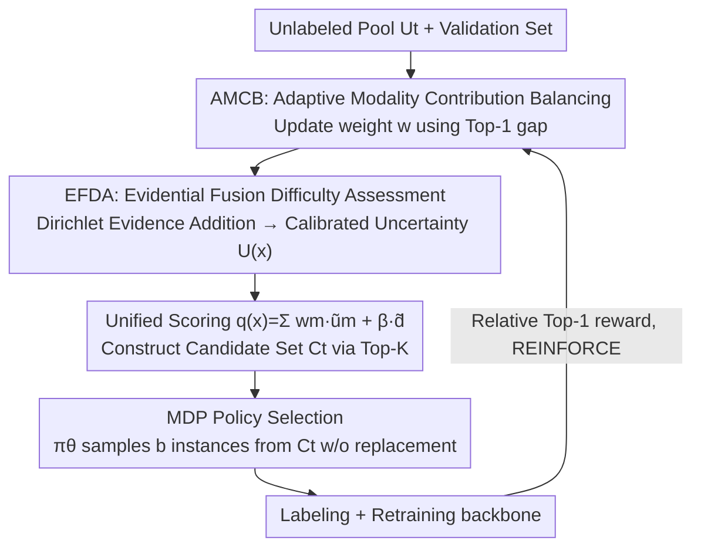

# Label What Matters: Modality-Balanced and Difficulty-Aware Multimodal Active Learning

**Conference**: CVPR 2026  
**Paper**: [CVF Open Access](https://openaccess.thecvf.com/content/CVPR2026/html/Zeng_Label_What_Matters_Modality-Balanced_and_Difficulty-Aware_Multimodal_Active_Learning_CVPR_2026_paper.html)  
**Code**: None  
**Area**: Multimodal VLM / Active Learning  
**Keywords**: Multimodal Active Learning, Modality Balance, Reinforcement Learning Sampling, Evidential Fusion, Difficulty-Awareness

## TL;DR
Addressing the issue in multimodal active learning where selection rules are fixed at the fusion stage and remain insensitive to dynamic shifts in modality value and sample difficulty, this paper proposes RL-MBA. By modeling each batch selection round as a Markov Decision Process (MDP), RL-MBA employs a reinforcement learning policy to adaptively rebalance modality contributions (AMCB) and target "informative hard samples" based on evidential uncertainty (EFDA). This simultaneously improves both classification accuracy and modal fairness under a lower annotation budget on Food101, KineticsSound, and VGGSound.

## Background & Motivation

**Background**: Multimodal learning has achieved superior performance over unimodal approaches by leveraging complementary information like images, text, and audio. However, it relies heavily on large-scale annotations, with joint annotation across multiple modalities being particularly expensive. Active learning (AL), which lowers costs by selecting only the "most informative" samples for labeling, is a mainstream approach to mitigate this challenge.

**Limitations of Prior Work**: Most multimodal AL methods still employ **fixed selection rules**, locking the sampling criteria at the fusion stage. This introduces two specific issues: (1) **Modality imbalance**—batches consistently favor samples dominated by "strong modalities," leaving weak modalities long neglected, which weakens cross-modal complementarity and hurts generalization; (2) **Insensitivity to dynamics**—the relative value of a modality and the difficulty of an individual sample drift as training progresses, which static rules cannot respond to between rounds, leading to suboptimal budget allocation.

**Key Challenge**: Prior approaches like BMMAL that attempt to mitigate modality bias rely on **static adjustments** during training, implicitly assuming that "modality importance remains stable across rounds"—an assumption that rarely holds as the model and the labeled pool constantly evolve. The root issue is that **the sampling rules should be updated based on feedback, rather than fixed after design**.

**Goal**: To make the selection rules adaptive along two axes: (i) reweighting modality contributions across rounds to leverage modalities that are becoming important while preventing decaying ones from monopolizing the budget; (ii) utilizing quantified uncertainty to target "challenging yet informative" samples, rather than merely picking extreme outliers.

**Key Insight**: Modeling the "updating of sampling policies from feedback at each round" naturally as an **MDP** optimizes the policy for long-term rewards. This allows the policy to respond dynamically to the current model state, the unlabeled pool distribution, and the time-varying value of distinct modalities.

**Core Idea**: A lightweight RL policy is used to replace fixed selection rules, allowing the "modality weights + sample difficulty" to co-evolve each round based on validation feedback, aiming for long-term and balanced gains under a fixed budget.

## Method

### Overall Architecture
RL-MBA models multimodal sample selection as a Markov Decision Process (MDP) and optimizes a lightweight selection policy using policy-gradient reinforcement learning. To address the issue where fixed fusion rules are insensitive to shifting modality values and sample difficulties, the core idea is to decompose an AL round into a closed loop: "adaptive fusion scoring $\to$ candidate set construction $\to$ policy-based batch selection $\to$ retraining $\to$ reward calculation & policy update," allowing subsequent rounds to benefit from feedback.

Specifically, during each active learning round $t$, six steps are executed: (1) Adaptive Modality Contribution Balancing (AMCB) is applied for multimodal fusion, and budget-constrained k-means++ clustering on fusion features is used to ensure diversity; (2) Evidential Fusion for Difficulty Awareness (EFDA) is utilized to estimate calibrated uncertainty and sample difficulty; (3) Modality-weighted uncertainty and diversity are combined into a unified score $q(x)$, and the top-$K$ samples are extracted to form a **compact candidate set** $C_t$; (4) The policy $\pi_\theta$ samples $b$ instances from the candidate set without replacement as the query batch for this round; (5) Query samples are labeled, merged into the labeled set $L$, and the backbone is retrained; (6) Relative validation Top-1 accuracy is used to compute the reward, and the policy is updated via REINFORCE. All evaluations are conducted on a fixed, stratified validation set. Unimodal prediction heads share a joint backbone, and evaluations on the validation set are performed each round to compute modality contributions and calibration statistics.

A key "coupling" design exists here: the same set of modality weights $w$ calculated by AMCB is simultaneously injected into **fusion, scoring, and policy states**, ensuring that "which modality is emphasized" shifts consistently across the entire pipeline as the task evolves.

### Key Designs

**1. AMCB: Replacing Fixed Fusion Weights with a Feedback-Adaptive Modality Contribution Simplex**

Fixed modality weights bias selection towards whichever channel happens to dominate at the moment, wasting other cues. A modality's true contribution depends on the current training context—which classes are over- or under-represented, the number of labels, and how well the model fits the data—which shifts round-by-round. Instead of fixed weights, AMCB represents modality contributions using a **feedback-updated probability simplex**. At each round, the current contribution of modality $m$ is quantified on a fixed validation set via the **Top-1 gap**:

$$\Delta_m = \text{Top-1}_m - \text{Top-1}_{mm}$$

representing the difference in accuracy between the "individual modality head" and the "multimodal head." A positive gap indicates the modality provides complementary signals beyond the joint head, while a negative gap indicates redundancy or noise. These are mapped to the simplex via a temperature softmax: $w = \text{softmax}(\Delta/\tau)$, satisfying $w_m\in[0,1],\ \sum_m w_m=1$. Smaller temperature $\tau$ enables faster weight transitions when a modality becomes informative. Optionally, a lower bound $\varepsilon$ is added to prevent modality weight collapse to 0. The benefits are: the fusion $f(x)=\sum_m w_m f_m(x)$ is a convex combination and thus scale-stable; when a single modality dominates, $w\to e_k$, and when modalities are balanced, $w$ is uniform, which avoids premature specialization. Crucially, the same $w$ is injected into fusion, scoring $q(x)$, and policy states, coordinating "who to focus on" across the entire pipeline.

**2. EFDA: Evidence-Level (Rather than Posterior-Level) Fusion to Obtain Calibrated Difficulty Signals**

Uncertainty should reflect both aleatoric uncertainty (inherent data noise) and epistemic uncertainty (insufficient evidence). Simply multiplying or averaging posteriors can lead to overconfidence when modalities have different calibration degrees or local failures. EFDA instead performs **additive, bounded, and AMCB-aligned fusion at the evidence level**: each modality head outputs Dirichlet evidence $\alpha_m(x)\in\mathbb{R}^C_{>0}$, which is summed with weights:

$$\alpha_f(x) = 1 + \sum_{m=1}^{M} w_m\big(\alpha_m(x)-1\big)$$

This interpolates the fusion prior $\alpha_f$ across modalities according to $w$—high-weight modalities contribute more evidence, while weak modalities neither dominate nor collapse the estimation. It preserves several elegant properties: when a single modality is fully trusted ($w=e_k$), it degenerates to $\alpha_f = \alpha_k$; confidence is explicitly bounded within $1\le\alpha_{f,c}\le 1+\sum_m w_m(\alpha_{m,c}-1)$, ruling out "runaway certainty"; and it degrades gracefully with small $w_m$ for weak or missing inputs. Based on $\alpha_f$, Dirichlet predictive variance serves as the difficulty proxy:

$$\text{Var}[p_c]=\frac{\alpha_{f,c}(\alpha_{f,0}-\alpha_{f,c})}{\alpha_{f,0}^2(\alpha_{f,0}+1)},\qquad U(x)=\frac{1}{C}\sum_{c=1}^{C}\text{Var}[p_c]$$

where $\alpha_{f,0}=\sum_c\alpha_{f,c}$. Samples with more dispersed posteriors (small $\alpha_{f,0}$ or balanced class masses) yield higher $U(x)$ and are prioritized. This naturally couples with AMCB: as a modality becomes more informative, $w_m$ increases, its evidence contributes more to $\alpha_f$, and the uncertainty of easy samples shrinks, thereby routing the budget to truly difficult samples.

**3. MDP Policy Selection: Candidate Set + REINFORCE, Delegate "Which Batch to Select" to a Learning Policy**

The first two components yield "modality-balanced fusion features" and "calibrated difficulty," but **how to select the actual batch** still requires a decision-maker that adapts to distribution evolution—simply taking Top-$b$ is too rigid. This method first combines informativeness and diversity into a unified score: budget-constrained k-means++ ($k=b$, $\le5$ iterations) is performed on fusion features to obtain the nearest centroid distance $d(x)$ to encourage coverage of under-represented areas, and then:

$$q(x)=\sum_{m=1}^{M} w_m\,\tilde{u}_m(x)+\beta\,\tilde{d}(x)$$

(where $\tilde{u},\tilde{d}$ are min–max normalized within the round). The top-$K$ samples based on $q$ ($K=\kappa b$, e.g., $\kappa=5$) form a compact candidate set $C_t$, rather than acting directly as actions. The MDP state $s_t=[g_t\,\|\,\phi_t\,\|\,\bar u_t\,\|\,\bar d_t\,\|\,\rho_t]$ is a fixed-length vector containing validation statistics (Top-1/NLL/ECE), modality contributions $\phi_t$ (Top-1 gap), aggregated uncertainty and diversity, and training diagnostics (loss slope, gradient norm). The action is to sample $b$ instances sequentially without replacement from $C_t$: the policy is a lightweight MLP that outputs logits over candidates, incrementally sampling via softmax and removing selected elements, with the batch probability being the product of step probabilities. The reward is calculated via **relative** Top-1 accuracy:

$$r_t=\text{Top-1}^{\text{RL-MBA}}_t-\frac{1}{|E|}\sum_{h\in E}\text{Top-1}^{(h)}_t,\quad E=\{\text{GCNAL, BADGE, BMMAL}\}$$

where baseline scores are **offline pre-computed constants** (run beforehand under the same protocol). No parallel training of baselines is required during reward calculation, resulting in almost zero extra overhead. An exponential moving average (EMA) smooths the rewards to stabilize training. Optimization uses one-step reward REINFORCE: $\nabla_\theta J=\mathbb{E}[\sum_t A_t\nabla_\theta\log\pi_\theta(a_t|s_t)]$, with advantage $A_t=r_t-b_t$ ($b_t$ is the moving average of historical rewards for variance reduction). Optionally, clipping $A_t$ stabilizes training. This allows the policy to adapt to the evolving data distribution while keeping the RL component lightweight. A policy is trained for each dataset/task.

### Loss & Training
The policy is optimized via REINFORCE, where the advantage $A_t = r_t - b_t$ reduces variance using a moving average baseline. The reward uses relative Top-1 accuracy smoothed with EMA. The backbone is retrained for $E$ epochs per AL round (ResNet-101+BERT-base for image-text tasks, 15 epochs/round, optimized via AdamW). The per-round complexity is near-linear: feature extraction takes $O(|U_t|F)$, scoring takes $O(|U_t|M)$, and sorting takes $O(|U_t|\log|U_t|)$. Candidate construction only adds sorting overhead, and the policy operates solely on the $K=\kappa b$ candidates, which is negligible compared to retraining.

## Key Experimental Results

### Main Results
Top-1 accuracy under a fixed annotation budget of 3,000 samples (representing 6.6% for Food101 / 20.4% for KineticsSound / 2.9% for VGGSound):

| Method | Food101 | KineticsSound | VGGSound |
|------|---------|---------------|----------|
| Random | 0.8470 | 0.4650 | 0.2173 |
| Entropy | 0.8480 | 0.4650 | 0.2043 |
| GCNAL | 0.8510 | 0.4600 | 0.2033 |
| CoreSet | 0.8422 | 0.4600 | 0.2013 |
| DeepFool | 0.8500 | 0.4680 | 0.1973 |
| BALD | 0.8450 | 0.4550 | 0.1993 |
| BADGE | 0.8420 | 0.4700 | 0.2023 |
| BMMAL (strongest baseline) | 0.8609 | 0.4745 | 0.2053 |
| **RL-MBA** | **0.8650** | **0.4841** | **0.2223** |

Compared to the strongest baseline BMMAL, RL-MBA shows consistent improvements across all three datasets, with a particularly pronounced gain on VGGSound (0.2053 $\to$ 0.2223), demonstrating better utilization of multimodal complementarity under low-annotation budgets.

### Ablation Study
Ablation of individual components under 3,000 labels (Top-1):

| Configuration | Food101 | KineticsSound | VGGSound | Description |
|------|---------|---------------|----------|------|
| BMMAL (baseline) | 0.8609 | 0.4745 | 0.2053 | Starting point |
| RL-MBA w/ AMCB | 0.8621 | 0.4771 | 0.2059 | Modality balance only |
| RL-MBA w/ EFDA | 0.8637 | 0.4802 | 0.2177 | Difficulty-aware only |
| RL-MBA (Full) | **0.8650** | **0.4841** | **0.2223** | Full model |

### Key Findings
- **AMCB and EFDA are complementary; both are essential**: Adding either component individually outperforms BMMAL, but the full configuration yields the best performance. EFDA (difficulty-awareness) brings higher improvements on KineticsSound and VGGSound (e.g., 0.2053 $\to$ 0.2177 on VGGSound), indicating that these datasets benefit more from "selecting the right difficult samples."
- **Modality weights shift dynamically**: Tracking Shapley contributions $\phi$ on Food101 from 1k to 7k labels shows that RL-MBA progressively shifts weight towards text and de-emphasizes images, whereas BMMAL, BADGE, BALD, and Random remain largely static. This validates that AMCB adjusts sampling based on evolving modality value.
- **Higher efficiency**: RL-MBA has the lowest total per-round time (884.39s), primarily driven by acceleration in the selection phase (Selection takes only 33.48s vs. 312.84s for BADGE and 310.12s for BMMAL), while the policy update takes only 0.23s, adding near-zero overhead.
- **Relative reward design is the most stable**: Comparing Relative, Absolute, and Incremental rewards, the relative reward design (with feedback normalization and higher adaptability) consistently performs best as the budget grows.
- **Interpretability patterns at the classification level**: On KineticsSound, RL-MBA performs better on audio-dominated classes (e.g., ripping paper, playing saxophone), while BMMAL is slightly better on video-dominated classes (e.g., clicking pen), indicating that RL-MBA leverages audio cues more effectively; video feature integration still has room for improvement.

## Highlights & Insights
- **"Updating sampling rules from feedback" pinpoints the core limitation of multimodal AL**: Grouping shifting variables like modality weights and sample difficulty into the MDP state allows the sampler to track training dynamics, which aligns better with the non-stationary nature of multimodal learning than any static heuristic.
- **The "one weight computed, used in three places" coupling is elegant**: Using a single set of AMCB weights to drive fusion, scoring, and policy states avoids internal inconsistencies, such as "fusion favoring one modality while scoring favors another." This technique of passing a singular signal across the entire pipeline can be transferred to other multimodal weighting scenarios.
- **Evidence-level additive fusion (Eq. 3) is a clean tool**: It is additive, bounded, degrades gracefully when only one modality is trustworthy, and prevents weak modalities from collapsing. It is more robust to overconfidence than posterior multiplication or averaging, and can be plugged directly into other tasks (e.g., hard sample mining in multimodal detection or segmentation).
- **Designing relative rewards with offline-constant baselines** provides the policy with a meaningful "performance relative to average opponent" signal without requiring online baseline training, which is key to applying RL in AL without exploding overhead.

## Limitations & Future Work
- The authors acknowledge that RL-MBA is slightly inferior to BMMAL on **video-dominated classes**, suggesting room for improvement in video feature integration.
- Modality contributions are estimated using Top-1 gap or Shapley values, which depend on a fixed stratified validation set. The representativeness and scale of this validation set directly affect the quality of $w$ estimation; in early low-budget phases, validation statistics may exhibit high noise *(Reviewer's Observation)*.
- Evaluation is restricted to three classification benchmarks (image-text, video-audio) with a small number of modalities $M$ (typically 2). Whether the additive evidence and simplex weights of AMCB/EFDA remain stable when extended to 3+ modalities or structured tasks (like detection/segmentation) remains unverified *(Reviewer's Observation)*.
- The reward model depends on pre-computed baseline curves. Changing protocols or datasets requires re-running these baselines offline, meaning the transfer cost is non-zero *(Reviewer's Observation)*.
- A policy must be trained for each dataset; cross-dataset or cross-task policy transfer and cold-start scenarios remain unexplored.

## Related Work & Insights
- **vs. BMMAL (strongest baseline)**: BMMAL also balances modalities through multimodal informativeness and diversity, but relies on **static adjustments** during training, implicitly assuming "modality importance remains stable across rounds." RL-MBA uses an RL policy to dynamically update weights from feedback round-by-round, consistently outperforming it across three datasets with faster selection speeds.
- **vs. Pure Uncertainty Methods (Entropy, BALD, DeepFool)**: These methods focus solely on model confidence or boundaries from a unimodal perspective, failing to balance modalities or distinguish between "difficult yet informative" and "difficult but noisy" samples. RL-MBA relies on evidential variance for calibrated difficulty and filters samples via its policy.
- **vs. Diversity Methods (CoreSet, BADGE)**: CoreSet and BADGE pursue coverage and gradient diversity but have limited adaptability to dynamic modality importance in multimodal settings. RL-MBA incorporates diversity $\tilde d(x)$ as only one term in $q(x)$, leaving the primary decision to the learnable policy.
- **vs. RL-based AL (RAL, DRAL, Policy-based AL)**: Previous RL-driven AL methods focus mostly on unimodal cases, lacking mechanisms to handle modality imbalance and difficulty awareness. RL-MBA fills this gap by jointly modeling modality balance and sample difficulty in a unified RL framework.

## Rating
- Novelty: ⭐⭐⭐⭐ The joint integration of "modality weights + difficulty" into an MDP, where a single set of weights spans fusion, scoring, and policy states, represents a novel coupling, though RL-for-AL and evidential fusion themselves are not entirely novel.
- Experimental Thoroughness: ⭐⭐⭐⭐ The evaluation over three datasets, component ablations, reward design analysis, modality contribution tracking, and efficiency analysis is comprehensive, although limited to 2 modalities and few budget points.
- Writing Quality: ⭐⭐⭐⭐ Clear motivation, complete formulas and algorithms, and well-managed naming conventions (AMCB/EFDA) and coupling relationships.
- Value: ⭐⭐⭐⭐ Improving both accuracy and modal fairness under low annotation budgets with faster selection speeds makes this highly practical for production scenarios sensitive to multimodal annotation costs.

<!-- RELATED:START -->

## Related Papers

- [\[CVPR 2026\] MOON2.0: Dynamic Modality-balanced Multimodal Representation Learning for E-commerce Product Understanding](moon20_dynamic_modality-balanced_multimodal_representation_learning_for_e-commer.md)
- [\[CVPR 2026\] Learning What Matters: Prioritized Concept Learning via Relative Error-driven Sample Selection](learning_what_matters_prioritized_concept_learning_via_relative_error-driven_sam.md)
- [\[CVPR 2026\] Similarity-as-Evidence: Calibrating Overconfident VLMs for Interpretable and Label-Efficient Medical Active Learning](similarity-as-evidence_calibrating_overconfident_vlms_for_interpretable_and_labe.md)
- [\[CVPR 2026\] Towards Dynamic Modality Alignment in Multimodal Continual Learning](towards_dynamic_modality_alignment_in_multimodal_continual_learning.md)
- [\[CVPR 2026\] BALM: A Model-Agnostic Framework for Balanced Multimodal Learning under Imbalanced Missing Rates](balm_a_model-agnostic_framework_for_balanced_multimodal_learning_under_imbalance.md)

<!-- RELATED:END -->
