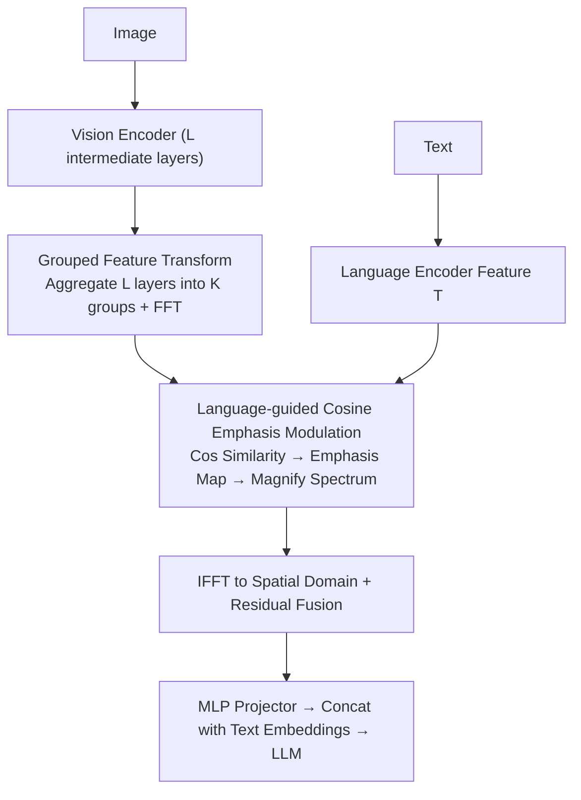

# Language-guided Frequency Modulation for Large Vision-Language Models

**Conference**: CVPR 2026  
**Paper**: [CVF Open Access](https://openaccess.thecvf.com/content/CVPR2026/html/Ouyang_Language-guided_Frequency_Modulation_for_Large_Vision_Language_Models_CVPR_2026_paper.html)  
**Code**: TBD  
**Area**: Multimodal VLM  
**Keywords**: Large Vision-Language Models (LVLMs), Frequency Domain Modulation, Language Guidance, Fourier Transform, Vision Refinement

## TL;DR
This paper proposes a plug-and-play LFM (Language-guided Frequency Modulation) that shifts vision refinement—before feeding features into the LLM—from the spatial domain to the **frequency domain**. It uses text features to compute "emphasis maps" that selectively enhance critical frequency bands (high frequency for local details, low frequency for global context). Without adding extra trainable parameters (except for a lightweight MLP projector), LFM consistently improves various LVLMs across benchmarks like GQA, MMB, and MathVista.

## Background & Motivation
**Background**: LVLMs typically employ a "vision refinement" stage (e.g., linear projection, Q-former, Dense Connector, or attention mechanisms) as a bridge between vision and language. These operations almost exclusively occur in the **spatial domain**.

**Limitations of Prior Work**: Different vision-language tasks vary greatly in their visual representation requirements—some need high-level global context (e.g., "how many players are in the picture"), while others require fine-grained local details (e.g., "the year on a calendar"). Spatial processing implicitly learns global and local features simultaneously, lacking an **explicit mechanism to distinguish high-frequency local details from low-frequency global context**. This makes fine-grained control and alignment with the hierarchical structure of language difficult.

**Key Challenge**: Language is naturally hierarchical (in "a yellow cup with patterns," "cup" is the global object, while "patterns/color" are local modifiers). In the frequency domain, high frequencies naturally map to local details and low frequencies to global shapes/regions. These two hierarchies could correspond, but spatial processing blurs them together, missing this alignment opportunity.

**Goal**: ① Introduce a mechanism for vision refinement that can **explicitly distinguish frequency bands**; ② Make this distinction **language-guided** via task-specific selective enhancement; ③ Ensure it is plug-and-play with near-zero extra parameters and overhead.

**Key Insight**: The frequency domain provides a natural mapping between language hierarchies and frequency hierarchies. Point-wise multiplication in the frequency domain is equivalent to dynamic convolution in the spatial domain (via the Convolution Theorem), allowing the modulation of the entire image with global operations and low redundancy.

**Core Idea**: Replace "implicit spatial refinement" with "language-guided frequency modulation." Visual features are transformed via FFT to the frequency domain, selective magnification of key frequency bands is performed using emphasis maps derived from text, and then transformed back via IFFT for the LLM.

## Method

### Overall Architecture
LFM is placed after the vision/language encoders and before the LLM. The vision encoder extracts intermediate features from $L$ layers. LFM divides these into $K$ groups, aggregates each group, and performs FFT to the frequency domain. It سپس computes cosine similarity between language features $T$ and the spectra of each group to generate "emphasis maps" for selective magnification. The magnified spectra are transformed back via IFFT to the spatial domain and fused with original features via residual connections. Finally, all groups are concatenated and passed through an MLP projector to the LLM's embedding space. Aside from the MLP projector, all frequency-related steps **introduce no additional parameters and require no training**.

### Key Designs

**1. Frequency Domain Modulation Principle: Equivalence to Language-Conditioned Dynamic Convolution**

This is the foundation of the paper. For a single-channel feature map $X(h,w)$, the Fourier Transform is $\hat{X}(u,v)=\frac{1}{\sqrt{HW}}\sum_{h,w}X(h,w)e^{-2j\pi(\frac{h}{H}u+\frac{w}{W}v)}$, where high/low frequency components are explicit and directly controllable. The authors introduce a filter generated dynamically by the spectrum and language features: $M(u,v)=f(\hat{X}(u,v),T)$. Point-wise multiplication in the frequency domain, $\hat{X}'(u,v)=\hat{X}(u,v)\odot M(u,v)$, is equivalent to $X'(h,w)=X(h,w)*\mathcal{F}^{-1}\{M(u,v)\}$ in the spatial domain. This provides a clear way to balance global/local information and allows each frequency band to be selectively enhanced according to language requirements, offering better interpretability.

**2. Grouped Feature Transformation: Allocating Frequency Bands to Visual Layers**

Visual encoder layers emphasize different signals (shallow layers focus on local features, deep layers on global context). LFM partitions $L$ layers into $K$ groups (default $K=3$). Within each group, features are aggregated by averaging: $V^{group}_k=\frac{1}{N_k}\sum_{j}\hat{V}_{l^j_k}$. Performing FFT on these grouped features ensures "broad participation of vision layers" while keeping computation low. Ablations show $K=3$ is optimal—significantly better than No-Group (last layer only).

**3. Language-guided Cosine Emphasis Modulation: Zero-Parameter Selective Enhancement**

To let language "direct" the enhancement, LFM computes the cosine similarity between spectrum $F_k$ and language feature $T$ to form an emphasis map $S_k=\mathrm{Cos}(F_k,T)\in\mathbb{C}^{P^2}$. The spectrum is selectively magnified as $\hat{F}^p_k=F^p_k\cdot(1+\alpha_k S^p_k)$, where $p$ is the patch index and $\alpha_k$ is the modulation coefficient. For global tasks, the emphasis map clusters toward low frequencies (center); for local tasks, it shifts toward high frequencies (edges). After IFFT and residual fusion $V^f_k=\frac{1}{N_k}\sum_j V_{l^j_k}+\beta\cdot\mathrm{Re}(\mathrm{IFFT}(\hat{F}_k))$, groups are concatenated for the MLP projector. Except for the MLP, the entire modulation adds zero parameters. Ablations confirm that frequency-domain cosine modulation (MMStar +2.18 / MMB +3.18) significantly outperforms spatial-domain modulation and cross-attention, with a **decreasing** strategy for $\alpha_k$ (larger coefficients for shallow groups) performing best.

### Loss & Training
LFM follows the standard two-stage training objective of the original LVLM:
1.  **Pre-training Phase**: Vision/Language encoders and LLM are frozen. Only the randomly initialized MLP in LFM is trained (1 epoch, batch 24/GPU, lr 5e-4).
2.  **Instruction Fine-tuning Phase**: Full parameter optimization (1 epoch, batch 64, lr 1e-5).
Training data includes LLaVA-1.5 (558K PT + 665K IT) / Mini-Gemini (1.2M+1.5M) / InternVL-1.2 SFT (1.2M).

## Key Experimental Results

### Main Results
| Method | LLM | SQAI | MMB | MMEp | MM-Vet | MathVista | GQA |
|------|-----|------|-----|------|---------|-----------|-----|
| LLaVA-v1.5 | Vicuna-13B | 71.6 | 67.7 | 1531 | 36.1 | 27.6 | 63.3 |
| Dense Connector | Vicuna-13B | 77.1 | 74.4 | 1579 | 47.8 | 36.5 | 64.6 |
| **Ours (LFM)** | Vicuna-13B (1.2M+1.5M) | **80.7** | **79.9** | **1648** | **50.2** | **38.7** | 65.7 |
| **Ours (LFM)** | Yi-34B(LoRA) | 83.9 | 81.1 | 1669 | 43.2 | 40.4 | 65.1 |

Within the LLaVA framework, LFM consistently outperforms linear projection and Dense Connector across various LLM backbones (2.7B to 34B). When integrated into SoTA LVLMs like InternVL2.5 and Qwen2.5-VL, LFM yields consistent gains across all scales (1B to 8B) on MME, MMB, and MathVista.

### Ablation Study
| Interaction Strategy | Training-Free | MMStar | MMB |
|------|--------|--------|-----|
| No Interaction (baseline) | ✓ | 55.36 | 78.49 |
| Spatial · Cross-Attention (w/ params) | ✗ | 56.58 (+1.18) | 80.02 (+1.53) |
| Spatial · Cosine Modulation | ✓ | 55.76 (+0.40) | 79.79 (+1.50) |
| Frequency · Dot-product | ✓ | 54.93 | 80.33 (+1.84) |
| **Frequency · Cosine Modulation (LFM)** | ✓ | **57.54 (+2.18)** | **81.67 (+3.18)** |

| Design Choice | Conclusion |
|------|------|
| Number of Groups $K$ | $K=3$ is optimal (better than No-Group or higher $K$) |
| $\alpha_k$ Strategy | Decreasing > Constant > Increasing (baseline 0.25, step 0.03) |

### Key Findings
-   **Frequency > Spatial**: Moving the same modulation from the spatial to the frequency domain improves MMStar from +0.40 to +2.18. This proves that explicit frequency band distinction is the key factor.
-   **Zero-Parameter Wins**: Training-free frequency cosine modulation outperforms parameter-heavy cross-attention (57.54 vs 56.58 on MMStar), showing that the gain stems from the "frequency alignment" structural prior rather than parameter count.
-   **Optimized Hierarchy**: Three groups with decreasing $\alpha_k$ (larger coefficients for shallow layers' local signals) perform best, aligning with the design that different depths manage different spectrum segments.

## Highlights & Insights
-   **Alignment of Language vs. Frequency Hierarchies**: Aligning "high freq = local, low freq = global" with language's progression from global semantics to local modifiers is an elegant and interpretable structural prior.
-   **Clever Use of Convolution Theorem**: The equivalence between point-wise frequency multiplication and language-conditioned dynamic convolution provides theoretical grounding for why global operations can be achieved with low overhead.
-   **Plug-and-Play**: The stability of gains across models (from CLIP-L to SigLIP-SO, Vicuna to Qwen2.5-VL) suggests LFM is a robust vision-bridge enhancement.

## Limitations & Future Work
-   **Language Dependency**: The emphasis map depends entirely on the language encoder's quality. If task intent is poorly captured in text features, modulation may be inaccurate.
-   **Manual Hyperparameters**: The choice of $K=3$, decreasing $\alpha_k$, and specific step sizes are empirical. An adaptive mechanism for these hyperparameters or learned frequency masks could be beneficial.
-   **Alignment Details**: The specific broadcasting method for $S_k \in \mathbb{C}^{P^2}$ (given $F_k \in \mathbb{C}^{P^2 \times D}$ and $T \in \mathbb{R}^D$) is briefly described; implementation requires careful reference to the original formulas.

## Related Work & Insights
-   **Vs. Linear / Q-former (LLaVA, BLIP-2)**: Traditional connectors learn global+local features implicitly in the spatial domain. LFM explicitly distinguishes frequencies with language guidance and fewer parameters.
-   **Vs. Dense Connector**: While DC utilizes multi-layer features, it uses spatial aggregation. LFM's frequency modulation significantly outperforms DC on benchmarks like MMB (79.9 vs 74.4 on Vicuna-13B).
-   **Vs. Visual Prompting/Attention Compression**: Instead of relying on visual markers or extra trainable attention layers, LFM achieves selective enhancement via frequency-domain structural priors.

## Rating
-   Novelty: ⭐⭐⭐⭐⭐ A rare and self-consistent frequency-domain perspective for vision bridging in LVLMs.
-   Experimental Thoroughness: ⭐⭐⭐⭐ Extensive validation across scales, but could include more direct comparisons with the newest specialized connectors.
-   Writing Quality: ⭐⭐⭐⭐ Logic regarding motivation and the convolution theorem is clear.
-   Value: ⭐⭐⭐⭐⭐ Plug-and-play, near zero-parameter, and stable gains make it highly practical.

<!-- RELATED:START -->

<!-- RELATED:END -->

## Related Papers

- [\[CVPR 2026\] Ego: Embedding-Guided Personalization of Vision-Language Models](ego_embedding-guided_personalization_of_vision-language_models.md)
- [\[CVPR 2026\] Diffusion Guided Chain-of-Vision for Large Autoregressive Vision Models](diffusion_guided_chain-of-vision_for_large_autoregressive_vision_models.md)
- [\[CVPR 2026\] FlashCache: Frequency-Domain-Guided Outlier-KV-Aware Multimodal KV Cache Compression](flashcache_frequency_kv_cache_compression.md)
- [\[CVPR 2026\] OmniZip: Audio-Guided Dynamic Token Compression for Fast Omnimodal Large Language Models](omnizip_audio-guided_dynamic_token_compression_for_fast_omnimodal_large_language.md)
- [\[ACL 2026\] Text-Guided Multi-Scale Frequency Representation Adaptation](../../ACL2026/multimodal_vlm/text-guided_multi-scale_frequency_representation_adaptation.md)

<!-- RELATED:END -->
