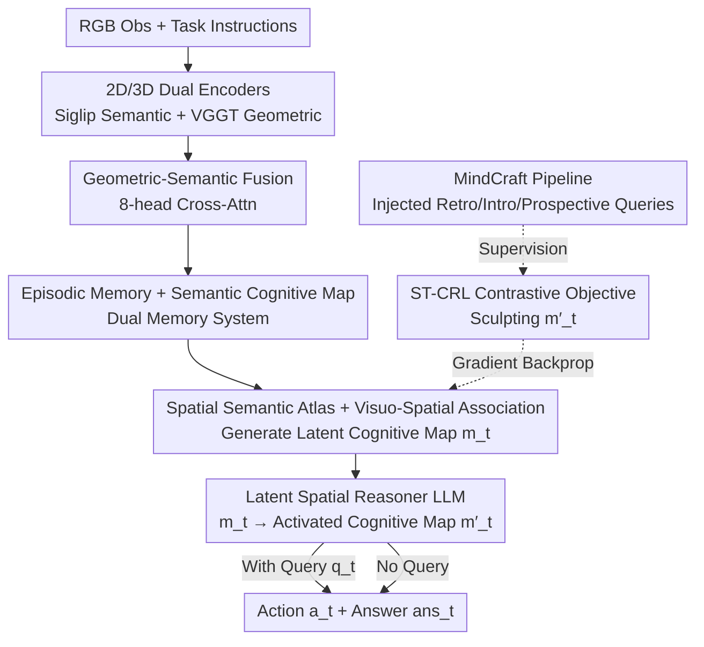

# LASAR: Towards Spatio-temporal Reasoning with Latent Cognitive Map

**Conference**: CVPR 2026  
**Paper**: [CVF Open Access](https://openaccess.thecvf.com/content/CVPR2026/html/Tang_LASAR_Towards_Spatio-temporal_Reasoning_with_Latent_Cognitive_Map_CVPR_2026_paper.html)  
**Code**: None  
**Area**: Multimodal VLM / Embodied AI  
**Keywords**: Embodied Navigation, Cognitive Map, Spatio-temporal Reasoning, Contrastive Learning, VLN

## TL;DR
LASAR equips an embodied agent with a "dual memory" system—frame-by-frame episodic memory plus a queryable latent cognitive map. A contrastive objective, ST-CRL, is used to "sculpt" the map into a high-level spatial representation capable of encoding topological, distance, and directional relationships, resulting in a 2%–3.5% performance gain in both navigation (VLN-CE) and zero-shot spatial reasoning (VSI-Bench).

## Background & Motivation

**Background**: Embodied AI is largely divided into two ends: action-oriented Vision-Language Navigation (VLN, moving to a target based on instructions) and reasoning-oriented Embodied Question Answering (EQA, answering questions about the environment). The former relies on imitation learning over massive vision-language-action pairs, while the latter depends on the linguistic priors and Chain-of-Thought of Large Language Models (LLMs).

**Limitations of Prior Work**: The authors point out a fundamental flaw shared by both ends—**the lack of a learning signal that forces the model to encode fine-grained spatial relationships (topology, distance, orientation) into its representations**. Imitation learning in VLN tends to "overfit the superficial statistical biases of expert trajectories," appearing to navigate without truly understanding space. Reasoning based on linguistic priors in EQA is "detached from a grounded world model," leading to failure in complex spatial tasks. Both excel only at local perception but struggle with spatial relationships over long-range, fragmented experiences.

**Key Challenge**: Agents receive an egocentric, fragmented stream of `{observations, actions}`. Constructing **globally consistent** high-level spatial representations from such local view streams remains an unsolved challenge.

**Goal**: To learn a **cognitive map** that transforms the raw experience stream into a queryable world model, providing a structured, high-level spatial logic foundation for spatio-temporal reasoning.

**Key Insight**: Unify action (VLN) and reasoning (EQA) by **concurrently** injecting cognitive questions and answers during the navigation process. These Q&As serve as high-level supervisory signals to shape spatial representations, rather than relying solely on action imitation or linguistic reasoning.

**Core Idea**: Use a dual-memory architecture consisting of "episodic memory + semantic cognitive map" to carry experience, and apply the contrastive objective ST-CRL (supervised by concurrent cognitive queries) to sculpt this map into a reasoning-aware latent spatial representation.

## Method

### Overall Architecture
LASAR (LAtent SpAtial Reasoner) is an LLM-based embodied agent. The inputs are RGB observations and task instructions at each step; the outputs are a navigation action $a_t$ and (if a cognitive query $q_t$ is present) a text answer $ans_t$. The pipeline consists of three stages: **Front-end Perception** (dual encoders + geometric-semantic fusion) → **Dual Memory** (episodic memory + latent cognitive map generated from a semantic atlas) → **LLM Reasoning Head** (unified vocabulary, outputting both action tokens and answer text). During training, the MindCraft pipeline injects cognitive queries into VLN-CE trajectories to supervise the core contrastive objective, ST-CRL.

### Key Designs

**1. Dual Memory System: Episodic Memory as "Evidence", Cognitive Map as "Index"**

To address the challenge of building globally consistent representations from fragmented egocentric streams, LASAR maintains two complementary memories. **Episodic Memory** $M_{epi,t}=(F'_{vis,0},\dots,F'_{vis,t})$ is a temporal sequence of all past geometric-aware visual features, preserving high-fidelity, uncompressed raw observations as "evidence" for fact-checking during reasoning. Each frame's features are encoded via a dual-stream process using frozen Siglip (2D semantic $F_{vis}$) and VGGT (geometric features $F_{geo}$ inferred from 2D), then fused via 8-head cross-attention: $F'_{vis,t}=F_{vis,t}+\text{CrossAttn}(F_{vis,t},F_{geo,t},F_{geo,t})$. **Semantic Memory** distills the episodic memory into a low-dimensional latent cognitive map vector $m_t$, providing the LLM with a low-cost global overview of "where I am and what is around," acting as a "cognitive index." The two complement each other across abstraction levels: the LLM uses $m_t$ to locate relevant spatio-temporal regions and refers back to $M_{epi,t}$ for detailed verification.

**2. Spatial Semantic Atlas + Visuo-Spatial Association: Mapping Experience into a Cognitive Map**

The cognitive map is not an explicit 3D geometric map but a real-time generated single-vector latent representation. Its foundation is a **learnable codebook** $E_{world}=\{e_1,\dots,e_{N_w}\}$ (termed the Spatial Semantic Atlas, $N_w=512$), which stores world primitives with semantic and spatial cues (e.g., "lamp near sofa," "sink in kitchen"). The generation process: first, the entire episodic memory $M_{epi,t}$ is aggregated into a context vector $z_t$ via attention pooling, which then serves as a query to perform cross-attention over the atlas: $m_t=\text{CrossAttn}(z_t,E_{world},E_{world})$. Thus, the map is the result of "retrieving general world primitives using current experience," making it both generalizable and compact. Compared to explicit geometric maps like SLAM, this models relationships entirely in the latent space, making it naturally compatible with LLM reasoning.

**3. ST-CRL Spatio-temporal Contextual Representation Learning: Sculping Spatial Logic via Cognitive Queries**

This is the core innovation. The pain point is that co-occurrence statistics alone cannot learn "fine-grained relationships." ST-CRL cleverly **constrains the LLM output $m'_t$ conditioned on the query** (called the Activated Cognitive Map), rather than directly constraining $m_t$. A special `[MAP]` token is added to the LLM vocabulary; during the forward pass, its embedding is deterministically replaced by $m_t$, and the hidden state at the `[MAP]` position from the last layer is extracted as $m'_t$—the "map seen through the lens of the query." InfoNCE contrastive learning is performed with $m'_t$ as the anchor: $\mathcal{L}_{crl}=\text{InfoNCE}(m'_t,m'_p,N_t)$. Positive samples are segments of experience that are semantically equivalent with identical answers. Negative samples are carefully designed as three types of hard negatives: **Spatial Hard Negatives** (equivalent query but different answer, pointing to different spatial states), **Semantic Hard Negatives** (same region ID but different query/answer), and **Irrelevant Distractors** (different region ID and query template). Since the constraint is on $m'_t$, gradients flow back through the LLM to update the atlas $E_{world}$ that produces $m_t$, forcing the map to evolve toward a structure optimal for downstream reasoning. Region IDs are privileged information provided by the simulator, used only during training.

**4. MindCraft Tasks and Data: Concurrent Cognitive Queries During Navigation**

To provide supervisory signals for ST-CRL, the authors define the MindCraft task: an **online concurrent query** mechanism layered on top of standard navigation—the policy $\pi(H_t,\mathcal{T},q_t)\to(a_t,ans_t)$ must output actions at any step and answers when encountering queries. Queries are categorized into three cognitive levels: **Retrospective** (testing memory of past observations, such as object attributes or temporal relations); **Introspective** (testing understanding of current state, such as self-localization or local spatial relations); and **Prospective** (testing prediction/planning abilities, such as topological adjacency or future landmark prediction). The dataset is generated via a procedural pipeline based on VLN-CE (Matterport3D environments).

### Loss & Training
The total objective averages the main task loss and three auxiliary losses per timestep, plus an episode-level loss:

$$\mathcal{L}_{total}=\frac{1}{T}\sum_{t=1}^{T}\big(\mathcal{L}_{MindCraft,t}+\lambda_c\,\mathbb{I}(q_t\neq\varnothing)\mathcal{L}_{crl,t}+\lambda_s\mathcal{L}_{sem,t}\big)+\lambda_r\mathcal{L}_{epi}$$

Where $\mathcal{L}_{MindCraft,t}=\mathcal{L}_{action,t}+\lambda_{qa}\mathbb{I}(q_t\neq\varnothing)\mathcal{L}_{QA,t}$ (imitation learning action loss + query-answer loss). Two auxiliary losses: **Semantic Atlas Learning** $\mathcal{L}_{sem}$ uses vector quantization to pull the nearest primitive $e_j$ toward $F'_{vis,t}$ with entropy regularization to avoid codebook collapse; **Episodic Discriminability** $\mathcal{L}_{epi}=\text{InfoNCE}(\cdot)$ pulls together representations from the same episode at the feature level to force the encoder to produce trip-specific features. Hyperparameters: $\lambda_{qa}=1.0$, $\lambda_c=0.1$ ($\tau=0.07$, 32 negatives = 8 spatial + 8 semantic + 16 irrelevant), $\lambda_s=0.2$, $\lambda_r=0.1$. The LLM backbone is Qwen2-7B, trained with AdamW (lr=$1\times10^{-4}$) for 2 epochs on 8×A100.

## Key Experimental Results

### Main Results
LASAR was compared across MindCraft-Test (dual-task reasoning), R2R/RxR (downstream navigation), and VSI-Bench (zero-shot spatial reasoning). The full LASAR model outperformed various baselines:

| Setting / Metric | Strongest Baseline | LASAR | Description |
|--------|------|------|------|
| MindCraft QA-Acc ↑ | 60.6 (IL+QA) | **65.3** | +4.7, Overall query accuracy |
| MindCraft GCA ↑ | 63.2 (IL+QA) | **70.4** | +7.2, QA accuracy on successful navigation paths |
| MindCraft CMC ↑ | 70.1 (IL+QA) | **75.8** | +5.7, Cognitive Map Consistency (answer consistency for same fact) |
| MindCraft SR@WA ↓ | 57.3 (IL+QA) | **35.2** | Nav success rate when reasoning fails; lower is more stable |
| R2R val-unseen SR ↑ | 54.8 (NaVILA) | **57.0** | +2.2 |
| R2R val-unseen SPL ↑ | 49.0 (NaVILA) | **53.9** | +4.9, Superior path quality |
| RxR val-unseen SR ↑ | 49.3 (NaVILA) | **52.1** | +2.8 |
| VSI-Bench Avg ↑ | 45.4 (Gemini-1.5 Pro) | **48.9** | Zero-shot, never trained on this, exceeds LLMs |

> Note: CMC (Cognitive Map Consistency) measures answer consistency for the same spatial fact under different phrasing; SR@WA is the navigation success rate on trajectories where at least one query was answered incorrectly; VSI-Bench Avg is the total score across multiple-choice (ACC) and numerical (MRA) questions.

### Ablation Study

| Configuration | QA-Acc ↑ | GCA ↑ | CMC ↑ | SR@WA ↓ | Description |
|------|---------|------|------|--------|------|
| LASAR (Ours) | 65.3 | 70.4 | 75.8 | 35.2 | Full model |
| w/o. Geo | 63.8 (−1.5) | 62.1 (−8.3) | 66.3 (−9.5) | 40.4 (+5.2) | Removed VGGT geometric features |
| w/o. Sem | 62.1 (−3.2) | 65.4 (−5.0) | 58.2 (−17.6) | 45.7 (+10.5) | Removed semantic cognitive map |
| w/o. Aux | 63.5 (−1.8) | 67.0 (−3.4) | 72.9 (−2.9) | 36.8 (+1.6) | Removed $\mathcal{L}_{sem}$ and $\mathcal{L}_{epi}$ |

Furthermore, the increment from ST-CRL is isolated by comparing LASAR (IL, imitation only, VSI-Bench Avg 37.8) and LASAR (IL+QA, naive query training without ST-CRL, 44.8) against the full LASAR (48.9).

### Key Findings
- **Semantic cognitive map contributes most**: Removing Sem (w/o. Sem) causes CMC to plummet by 17.6 points and SR@WA to worsen by 10.5 points, proving this latent map is the source of spatial consistency.
- **Geometric features critical for grounding**: Removing the VGGT geometric stream drops GCA and CMC by 8–9.5 points, confirming that 3D structural priors are vital for answering and moving correctly.
- **ST-CRL prevents query format overfitting**: IL+QA improves within MindCraft but only reaches 44.8 on VSI-Bench, suggesting overfitting to query templates; adding ST-CRL reaches 48.9 zero-shot, indicating the learning of more fundamental, transferable spatial concepts.

## Highlights & Insights
- **Concurrent reasoning queries as supervision is a clever design**: While VLN and EQA were previously separate, injecting cognitive queries into navigation trajectories via MindCraft effectively forces the agent to understand space while moving, applying supervision directly to high-level spatial relations.
- **Constraining $m'_t$ rather than $m_t$ allows gradients to flow through the LLM**: Injecting the map via the `[MAP]` token and taking the activation vector from the same position as a contrastive anchor—the "map through the query" trick—is ingenious. It lets the criteria for "how the map should look" be decided by the downstream reasoning itself.
- **Transferable construction of three hard negative types**: The negative sampling paradigm based on region IDs and query templates (Spatial Hard Negatives, etc.) is a valuable reference for any contrastive learning task requiring the distinction of fine-grained spatial relationships.

## Limitations & Future Work
- **Strong dependence on simulator privileged information**: Negative sampling and query generation rely on region IDs and expert trajectories from VLN-CE/Matterport3D. How to obtain such supervision in real robots or unlabeled environments remains an issue.
- **Cognitive map is a single-vector, low-dimensional representation**: $m_t$ compresses the entire space into one vector, which might limit expressiveness in complex, large-scale scenes. The paper does not fully discuss the capacity upper bound.
- **Heavy reliance on the Supplement (multiple `Supp. ??` in text)**: ⚠️ Key implementation details like training data construction and query generation are in the appendix, making the main text difficult to reproduce independently.
- **Modest performance improvements**: Navigation-side SR/SPL improvements are mostly in the 2%–5% range, and the zero-shot Avg is about 3.5 points higher than the next-best LLM—steady but not disruptive.

## Related Work & Insights
- **vs. Explicit Memory (SLAM)**: SLAM builds precise 3D geometric maps; Ours takes the latent cognitive map route, encoding spatial relations into a learnable codebook and single vector, sacrificing geometric precision for natural compatibility with LLM reasoning and generalization.
- **vs. Implicit Memory (RNN/Transformer state vectors)**: Traditional implicit memory compresses history into state vectors without explicit "spatial semantic structure"; Ours uses an atlas and contrastive objectives to explicitly sculpt relational structures, as verified by CMC consistency metrics.
- **vs. Self-supervised Spatio-temporal Representations (SSL Contrastive/Predictive)**: SSL supervision for egocentric video comes from raw sensory data and is agnostic to high-level cognitive states; ST-CRL uses high-level cognitive queries for supervision to shape representations directly for long-range spatial reasoning.

## Rating
- Novelty: ⭐⭐⭐⭐⭐ Dual memory + latent cognitive map + sculpting latent space with concurrent queries is a novel unification of VLN/EQA.
- Experimental Thoroughness: ⭐⭐⭐⭐ Coverage of three settings and detailed ablations, though key implementation details are in the appendix and gains are modest.
- Writing Quality: ⭐⭐⭐⭐ Motivation and methodology are clearly explained with good alignment between text and figures; however, frequent `Supp. ??` affects self-consistency.
- Value: ⭐⭐⭐⭐ Provides a transferable "cognitive map + contrastive supervision" paradigm for embodied spatio-temporal reasoning, with persuasive zero-shot generalization.

<!-- RELATED:START -->

## Related Papers

- [\[CVPR 2026\] VideoFusion: A Spatio-Temporal Collaborative Network for Multi-modal Video Fusion](videofusion_a_spatio-temporal_collaborative_network_for_multi-modal_video_fusion.md)
- [\[CVPR 2026\] Flat-Pack Bench: Evaluating Spatio-Temporal Understanding in Large Vision-Language Models through Furniture Assembly](flat-pack_bench_evaluating_spatio-temporal_understanding_in_large_vision-languag.md)
- [\[CVPR 2026\] ADSeeker: A Knowledge-Grounded Reasoning Framework for Industry Anomaly Detection and Reasoning](adseeker_a_knowledge-grounded_reasoning_framework_for_industry_anomaly_detection.md)
- [\[CVPR 2026\] SMAP: Semantic Route Planning with Map-Grounded Multimodal Alignment](smap_semantic_route_planning_with_map-grounded_multimodal_alignment.md)
- [\[CVPR 2026\] Geometrically-Constrained Agent for Spatial Reasoning](geometrically-constrained_agent_for_spatial_reasoning.md)

<!-- RELATED:END -->
