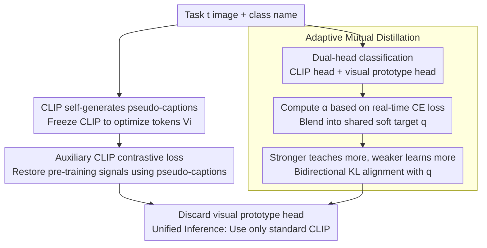

# Learning from Itself: Mining Internal Knowledge from Vision Language Models for Continual Learning

**Conference**: CVPR 2026  
**Paper**: [CVF Open Access](https://openaccess.thecvf.com/content/CVPR2026/html/Gong_Learning_from_Itself_Mining_Internal_Knowledge_from_Vision_Language_Models_CVPR_2026_paper.html)  
**Code**: https://github.com/jordangong/continual-learning ⚠️ Subject to the original paper  
**Area**: Multimodal VLM / Continual Learning  
**Keywords**: CLIP Continual Learning, Pseudo-captions, Self-distillation, Adaptive Mutual Distillation, Internal Knowledge Mining

## TL;DR
Addressing the dual challenges of the "text distribution gap" and the "vision/dual-encoder performance mismatch" in CLIP continual learning, this paper proposes Learning from Itself (LfI). LfI optimizes and generates individual "pseudo-caption" tokens for each image using a frozen CLIP to restore pre-training-like signals. It then adaptively distills knowledge between a temporary visual prototype classifier and the CLIP head—facilitating a mechanism where the stronger model teaches more and the weaker model learns more. At inference, only the original CLIP is retained. LfI achieves state-of-the-art (SOTA) performance across multiple continual learning benchmarks without relying on any external large models.

## Background & Motivation

**Background**: Vision-language models like CLIP have demonstrated powerful zero-shot recognition capabilities through image-text alignment. Adapting them for continual learning (class-incremental learning, where the model sequentially learns new classes from a stream of tasks without access to past task data) is a highly active research area. Mainstream approaches either treat CLIP as a conventional vision model by discarding the text encoder and applying traditional continual learning techniques, or introduce parameter-efficient fine-tuning via prompts, LoRA, or prototype classifiers. More aggressive approaches even call GPT-4 to generate text descriptions for classes (e.g., ENGINE).

**Limitations of Prior Work**: Through quantitative measurements on unfine-tuned CLIP, the authors reveal two specific overlooked issues.

First is the **text distribution gap**. CLIP pre-training relies on rich web-curated descriptions (e.g., "a golden retriever playing fetch in the park"), whereas continual learning provides only isolated class names (e.g., "dog"). On CIFAR-100, using only class names yields a text-image similarity gap between positive and negative pairs of only 0.06 and a contrastive loss as high as 1.51, which deviates significantly from natural image-text distributions like COCO Captions (gap 0.15, loss 0.38). This indicates severe distribution shift. Replacing them with descriptive captions generated by multimodal LLMs doubles the gap ($0.06 \rightarrow 0.11$), halves the loss ($1.51 \rightarrow 0.71$), and directly boosts accuracy after continual training by 2–3%. However, relying on external models to generate captions violates the principle that "a model should learn from its own capabilities."

Second is the **vision/dual-encoder performance mismatch**. The authors extract a pure vision classifier from the CLIP image encoder using SimpleCIL (training-free, averaging visual features to build prototypes). Surprisingly, it significantly outperforms the full CLIP on fine-grained datasets: 76% pure vision vs. 56% full CLIP on CUB-200, a massive 20% gap. Conversely, CLIP performs better on natural images like CIFAR-100 and ImageNet-R. This indicates that different components of CLIP contain **complementary knowledge**: the image encoder excels at fine-grained visual discrimination, while the text encoder excels at semantic relationships. Simple integration of both predictions is effective but disrupts the elegant monolithic architecture of CLIP and hinders downstream deployment.

**Key Challenge**: CLIP inherently contains the dual forms of knowledge required for continual learning (pre-training-like image-text alignment signals and complementary visual/semantic discriminability). However, typical fine-tuning pipelines neither restore the former nor allow the latter to interact, wasting this rich internal knowledge.

**Goal**: Without introducing external models or altering the CLIP architecture, the objective is to address both limitations solely by "mining and reorganizing CLIP's own internal knowledge."

**Key Insight**: Since external captions are effective and pure vision classifiers are powerful, is it possible to let CLIP generate its own captions and let its two components act as mutual teachers?

**Core Idea**: Let CLIP "learn from itself"—freeze CLIP to optimize learnable tokens that generate pseudo-captions for reconstructing pre-training-like signals, and then perform adaptive mutual distillation between the CLIP head and a temporary visual prototype head based on their real-time performance, retaining only the original CLIP for inference.

## Method

### Overall Architecture
The training of LfI simultaneously optimizes three complementary objectives for each task to mine and reintegrate CLIP's internal knowledge back into the model. The input consists of image-class name pairs for the current task, and the output is an enhanced standard CLIP (without any additional structure during inference). The pipeline is divided into three parts: **Before the task begins**, CLIP is frozen to optimize pseudo-caption tokens offline for each image (Token Generation). **During task training**, two classification heads are maintained—the original CLIP dual-encoder head and a prototype classifier head temporarily initialized from the vision encoder. Three loss functions (supervised classification, auxiliary CLIP contrastive loss using pseudo-captions, and adaptive mutual distillation between the two heads) are applied in parallel (Adaptive Mutual Training). **After the task ends**, the temporary vision classifier is discarded, and inference uses only the standard CLIP with class name templates (Unified Inference) to avoid train-test mismatch.

### Key Designs

**1. CLIP as an "Image Captioner": Self-Generating Pseudo-Caption Tokens to Bridge the Text Distribution Gap**

To address the pre-training vs. fine-tuning distribution shift caused by overly simplistic class names, the authors let CLIP generate its own "captions" for each image. This is conceptually similar to adversarial examples—but instead of finding image perturbations that fool the model, it finds the text embeddings that CLIP itself considers the best match for the image. For each image $x_i$ in the current task, $K$ learnable token embeddings $V_i=\{v_{i,1},...,v_{i,K}\}$ are created and inserted into a template retaining the class name: $s_i = \texttt{a photo of a [name}_c\texttt{] }[v_{i,1}]...[v_{i,K}]$, where the class name provides a semantic anchor. During optimization, **the entire CLIP is frozen, and only the tokens are optimized** to minimize the contrastive loss:

$$\mathcal{L}_{\text{CLIP}} = -\frac{1}{|B|}\sum_{i\in B}\log\frac{\exp(z^v_i\cdot z^l_i/\tau)}{\sum_{j\in B}\exp(z^v_i\cdot z^l_j/\tau)}$$

where the mixed batch $B=B_t\cup B_{\text{ref}}$ blends samples from the current task with samples from COCO Captions to provide rich negative samples for contrastive learning (continual learning tasks have too few classes per step, and optimization stalls without sufficient negative samples). This step essentially answers the question, "Using your pre-trained knowledge, what text description do you think fits this image?" The obtained tokens act as pseudo-captions fed into the auxiliary CLIP loss $\mathcal{L}^{\text{aux}}_{\text{CLIP}}$ during training, reconstructing a pre-training-like environment to smooth the distribution drift. Note that the pseudo-captions are only used as auxiliary signals during training; inference reverts to the standard class name templates.

**2. Anchor Initialization + Dual Regularization: Anchoring Tokens to Natural Language Space to Prevent Adversarial Degeneracy**

Purely contrastive optimization can easily push tokens into an adversarial mode that reduces loss but lacks semantic meaning, rendering pseudo-captions useless. This work introduces three constraints. First is **anchor initialization**: instead of random initialization, the token embeddings of the class name are cyclically copied as $v^{(0)}_{i,k} = \text{embed}(\text{name}_c)[k \bmod |\text{name}_c|]$, initiating optimization from a related semantic space (ablation shows removing this causes the most damage, as tokens degenerate into adversarial solutions, yielding a low CLIP loss of 1.45 but the worst performance). Second is the **supervised contrastive loss** $\mathcal{L}_{\text{SCL}}$, which pulls together text representations of the same class to ensure intra-class consistency. Finally, a **vocabulary alignment loss** is introduced: for each token, it finds the $M$ nearest neighbors in the vocabulary and minimizes:

$$\mathcal{L}_{\text{vocab}} = \frac{1}{|B_t|\cdot K}\sum_{i\in B_t}\sum_{k=1}^{K}\min_{w\in\text{top-}M(V,v_{i,k})}\big(1-\cos(v_{i,k},w)\big)$$

which anchors the tokens near the real word embedding distribution and prevents them from drifting into adversarial space. The total objective for token generation is $\mathcal{L}_{\text{gen}}=\mathcal{L}_{\text{CLIP}}+\lambda_{\text{SCL}}\mathcal{L}_{\text{SCL}}+\lambda_{\text{vocab}}\mathcal{L}_{\text{vocab}}$.

**3. Adaptive Mutual Distillation: Mutual Teaching/Learning Between the CLIP Head and Visual Prototype Head Based on Real-Time Performance**

Addressing the limitation where the visual and text encoders each have distinct strengths but cannot communicate, this paper employs two prediction heads during training: the CLIP head $p_{\text{clip}}$ using dual-encoder image-text alignment classification, and the vision head $p_{\text{vis}}=\text{softmax}(g_t(f_v(x))/\tau)$ using a task-specific cosine classifier $g_t$ initialized from pre-trained visual feature prototypes $\mu_c$ (discarded after the task ends). Traditional mutual learning uses symmetric bidirectional KL divergence, assuming both models are equally reliable. However, in pre-trained models, one is often stronger than the other. Symmetric distillation forces the stronger model to match the weaker one, degrading performance. Conversely, unidirectional distillation faces the challenge of "not knowing beforehand which head is stronger" (which varies wildly across datasets and even individual samples).

The proposed solution is to **construct a shared soft target dynamically mixed based on real-time quality**. First, cross-entropy is used to measure the current prediction quality of both heads: $\ell_{\text{clip}}=\text{CE}(p_{\text{clip}},y)$ and $\ell_{\text{vis}}=\text{CE}(p_{\text{vis}},y)$ (lower loss indicates better prediction). Then, they are mixed (with stop-gradient applied to both predictions before mixing to prevent both heads from collapsing into the same trivial solution):

$$q = \alpha\cdot\text{sg}(p_{\text{clip}}) + (1-\alpha)\cdot\text{sg}(p_{\text{vis}}),\quad \alpha = \sigma\!\left(\gamma\cdot\frac{\ell_{\text{vis}}-\ell_{\text{clip}}}{\ell_{\text{vis}}+\ell_{\text{clip}}+\epsilon}\right)$$

When the CLIP head is better ($\ell_{\text{clip}}<\ell_{\text{vis}}$), $\alpha>0.5$ and the soft target skews toward CLIP; otherwise, it skews toward the vision head. Both heads align with this shared target: $\mathcal{L}^{\text{vis}}_{\text{dist}}=D_{\text{KL}}(p_{\text{vis}}\|q)$ and $\mathcal{L}^{\text{clip}}_{\text{dist}}=D_{\text{KL}}(p_{\text{clip}}\|q)$. Because the weaker head's prediction is further from the target, its KL divergence is larger, leading to more learning. The stronger head is closer to the target, meaning its KL divergence is small, resulting in only minor fine-tuning. This forms a self-balancing system of "the stronger teaching more, the weaker learning more." This is key to boosting CUB-200 performance from 71.48% to 79.98% via mutual distillation on fine-grained tasks.

### Loss & Training
The total training objective integrates three components:

$$\mathcal{L}_{\text{total}} = \underbrace{\mathcal{L}^{\text{clip}}_{\text{CE}}+\mathcal{L}^{\text{vis}}_{\text{CE}}}_{\text{Supervised Classification}} + \underbrace{\beta_1\mathcal{L}^{\text{aux}}_{\text{CLIP}}}_{\text{Auxiliary Contrastive}} + \underbrace{\beta_2(\mathcal{L}^{\text{vis}}_{\text{dist}}+\mathcal{L}^{\text{clip}}_{\text{dist}})}_{\text{Mutual Distillation}}$$

In practice: during the token generation phase, CLIP is frozen, and $K=3$ tokens are optimized per sample. AdamW is used (lr $10^{-3}$, weight decay 0.2, batch size 1024 = 512 target + 512 COCO references) for 5 epochs with early stopping, where $\lambda_{\text{SCL}}=\lambda_{\text{vocab}}=1.0$, $M=5$. During the continual training phase, all CLIP parameters except temperature are unfrozen ($\tau\approx0.01$). SGD is used (lr $10^{-4}$, momentum 0.9, batch size 64) for 20 epochs, with mixing sharpness $\gamma=3$, $\beta_1=0.1$, $\beta_2=1.0$.

## Key Experimental Results

### Main Results
Across 5 datasets and multiple task configurations (e.g., 10-task / 6-task) using OpenCLIP ViT-B/16, LfI achieves state-of-the-art (SOTA) results, with particularly pronounced improvements on fine-grained tasks.

| Dataset (Protocol) | Metric | LfI | Prev. SOTA | Gain |
|--------|------|------|----------|------|
| CIFAR-100 (10-10) | last | 83.82 | 80.91 (Finetune) | +2.91 |
| ImageNet-R (20-20) | last | 83.57 | 81.29 (Finetune) | +2.28 |
| CUB-200 (20-20) | last | 81.74 | 80.20 (ENGINE) | +1.54 |
| Stanford Cars (20-20) | last | 91.42 | 90.08 (ENGINE) | +1.34 |
| Food-101 (20-20) | last | 89.44 | 87.48 (Finetune) | +1.96 |

Similar superiority is observed on OpenAI CLIP ViT-B/16: CIFAR-100 (82.69), ImageNet-R (83.97), and ImageNet-100 (80.68), all outperforming recent vision-language methods like MG-CLIP by 1-3 percentage points. An unexpected finding is that naive fine-tuning (Finetune) is surprisingly strong under the configuration of a fixed temperature and task-specific text templates (80.91 on CIFAR-100), implying that the dual-encoder architecture of CLIP requires different adaptation strategies compared to pure vision models.

### Ablation Study
Ablation of learning objectives (OpenCLIP ViT-B/16, 10-task, last accuracy):

| Configuration | CIFAR-100 | CUB-200 | Description |
|------|---------|---------|------|
| Zero-shot | 71.11 | 64.15 | Unadapted CLIP |
| Only $\mathcal{L}^{\text{clip}}_{\text{CE}}$ (Finetune) | 80.91 | 71.06 | Standard fine-tuning |
| Only $\mathcal{L}^{\text{aux}}_{\text{CLIP}}$ | 75.83 | 66.29 | Pure contrastive lacks class discriminability |
| $\mathcal{L}^{\text{clip}}_{\text{CE}}+\mathcal{L}^{\text{aux}}_{\text{CLIP}}$ | 82.73 | 74.12 | Pseudo-captions bridge distribution gap |
| + Vision head but w/o distillation | 81.22 | 71.48 | Only deep supervision, limited gain |
| + Mutual dist. (w/o aux contrastive) | 82.42 | 79.98 | Fine-grained performance surges |
| Full LfI | **83.82** | **81.74** | Optimal synergy of all three |

Ablation of the mutual distillation strategy (Tab. 4) further validates the necessity of adaptive bidirectionarity: symmetric mutual learning yields almost no gain (74.49 on CUB-200, as the stronger head is forced to match the weaker one); unidirectional "vision $\rightarrow$ CLIP" distillation is effective (76.51); letting the vision head train simultaneously is better (80.82); and the full adaptive bidirectional design achieves the best performance (81.74).

### Key Findings
- **Mutual distillation is the game-changer for fine-grained tasks**: Adding mutual distillation on CUB-200 directly boosts performance from 71.48% to 79.98%, as it transfers the fine-grained discriminative capability of the vision encoder to the CLIP head.
- **Anchor initialization is the most critical component of token generation**: Without it, optimization degenerates into adversarial tokens. The CLIP loss becomes exceptionally low (1.45), but performance is the worst (82.35), demonstrating that "low loss $\neq$ high-quality pseudo-captions."
- **Self-generated tokens closely approach external captions**: On CIFAR-100, self-generated tokens reduce the CLIP loss from 1.48 to 0.74 (compared to 0.68 from external captions), achieving 83.82% vs. 84.08% for external captions—almost matching performance without relying on any external large models.
- **The vision head serves only as training scaffolding**: Performing pure vision inference using assembled task classifiers or regenerated prototypes (Tab. 5) is inferior to standard CLIP inference (81.78/82.40 vs. 83.82). This proves that the knowledge was successfully distilled into CLIP, allowing the elegant monolithic architecture to be maintained at inference.

## Highlights & Insights
- **A clever paradigm of "letting the model generate its own training signals"**: The pseudo-caption tokens internalize the need for "external LLM-generated descriptions" into "self-optimizing tokens with a frozen CLIP". Similar to adversarial examples but searching for the best-matching text in reverse, it recovers pre-training-like signals while adhering to the principle of "not relying on more powerful external models."
- **The self-balancing design using real-time CE loss as distillation weights is highly transferrable**: The mechanism $\alpha=\sigma(\gamma\cdot\frac{\ell_{\text{vis}}-\ell_{\text{clip}}}{\ell_{\text{vis}}+\ell_{\text{clip}}})$ ("stronger teaches more, weaker learns more") combined with stop-gradient to prevent collapse can be generalized to any collaborative training scenario where two branches have asymmetric capacities that vary dynamically by sample (e.g., multi-teacher distillation, mixture of experts).
- **A diagnosis-first research paradigm**: The authors first quantitatively measure the two pathologies using the similarity gap and CLIP loss, and then propose targeted solutions. Every design perfectly corresponds to a quantified gap, making the overall logic highly compelling.
- **Zero additional inference cost**: All auxiliary mechanisms are restricted to the training phase. At inference, the model is simply the original CLIP, which is extremely deployment-friendly.

## Limitations & Future Work
- **Offline token generation introduces additional preprocessing overhead**: Optimizing $K=3$ tokens per image with a frozen CLIP and incorporating COCO negative samples is computationally expensive on large datasets. The paper does not provide comparisons of training time or GPU memory consumption.
- **Strong dependence on COCO Captions as a reference distribution**: Removing the reference dataset increases the CLIP loss from 0.743 to 0.960 and drops the intra-class gap to 0.067. This indicates that pseudo-caption quality heavily relies on this external image-text distribution—meaning it still indirectly depends on external data (even if not external models).
- **Evaluation is limited to ViT-B/16 and CLIP-based models**: The generalizability to larger backbones or non-CLIP VLMs (such as SigLIP) remains unverified. Performance under extremely large class spaces or severe domain shifts is still unknown.
- **Future directions**: Explore one-step or amortized token generation to reduce overhead, or extend the "self-generated pseudo-captions + adaptive mutual distillation" paradigm to continual learning for dense prediction tasks like object detection and segmentation.

## Related Work & Insights
- **vs ENGINE**: ENGINE injects external knowledge from GPT-4 to generate descriptions for classes. In contrast, LfI insists on mining only CLIP's internal knowledge, outperforming ENGINE by 1.3–1.5 percentage points on fine-grained tasks (CUB-200, Stanford Cars), proving that "self-sufficiency" can outperform "external assistance."
- **vs SimpleCIL / APER**: These methods demonstrate the strong zero-shot capabilities of CLIP's visual features using training-free prototype classifiers. LfI utilizes this prototype classifier as a temporary teacher during training to distill knowledge into CLIP, rather than directly using it for inference.
- **vs Continual-CLIP / Prompt-based methods (L2P, DualPrompt, CODA-P)**: The latter treat CLIP as a fixed feature extractor and learn prompts. LfI unfreezes CLIP and explicitly restores image-text alignment signals alongside dual-head mutual distillation, achieving comprehensive superiority (prompt-based methods even fail catastrophically on ImageNet-100, with CODA-P achieving only 34.76%).
- **vs Classic Deep Mutual Learning**: Conventional mutual learning is symmetrically bidirectional and assumes both networks are equally reliable. This paper points out that performance asymmetry in pre-trained models can cause symmetric distillation to fail, and instead adopts an adaptive single-target distillation based on real-time performance.

## Rating
- **Novelty**: ⭐⭐⭐⭐⭐ Both ideas—"letting CLIP self-generate pseudo-captions" and "adaptive mutual teaching between vision and text heads"—are elegant and complementary. The diagnosis-driven design is clean and logical.
- **Experimental Thoroughness**: ⭐⭐⭐⭐⭐ Comprehensive evaluation across two CLIP backbones, six datasets, and multiple protocols, with thorough ablations on loss components, distillation strategies, and inference strategies.
- **Writing Quality**: ⭐⭐⭐⭐ The motivation is quantitatively clear and the methodology is well-structured. There are minor typos/issues in some captions (e.g., "dameging" in original), and the code author's name needs to be cross-checked with the GitHub username.
- **Value**: ⭐⭐⭐⭐ Directly achieves SOTA without relying on external models and with zero inference overhead, making it highly practical for deploying CLIP continual learning.

<!-- RELATED:START -->

## Related Papers

- [\[CVPR 2026\] Enhancing Continual Learning of Vision-Language Models via Dynamic Prefix Weighting](enhancing_continual_learning_of_vision-language_models_via_dynamic_prefix_weight.md)
- [\[CVPR 2026\] PACT: Phase-Like Transition Constraints in Adapter-Based Continual Learning of Vision-Language Models](pact_phase-like_transition_constraints_in_adapter-based_continual_learning_of_vi.md)
- [\[CVPR 2026\] Towards Dynamic Modality Alignment in Multimodal Continual Learning](towards_dynamic_modality_alignment_in_multimodal_continual_learning.md)
- [\[CVPR 2026\] Octopus: History-Free Gradient Orthogonalization for Continual Learning in Multimodal Large Language Models](octopus_history-free_gradient_orthogonalization_for_continual_learning_in_multim.md)
- [\[CVPR 2026\] On Token's Dilemma: Dynamic MoE with Drift-Aware Token Assignment for Continual Learning of Large Vision Language Models](on_tokens_dilemma_dynamic_moe_with_drift-aware_token_assignment_for_continual_le.md)

<!-- RELATED:END -->
