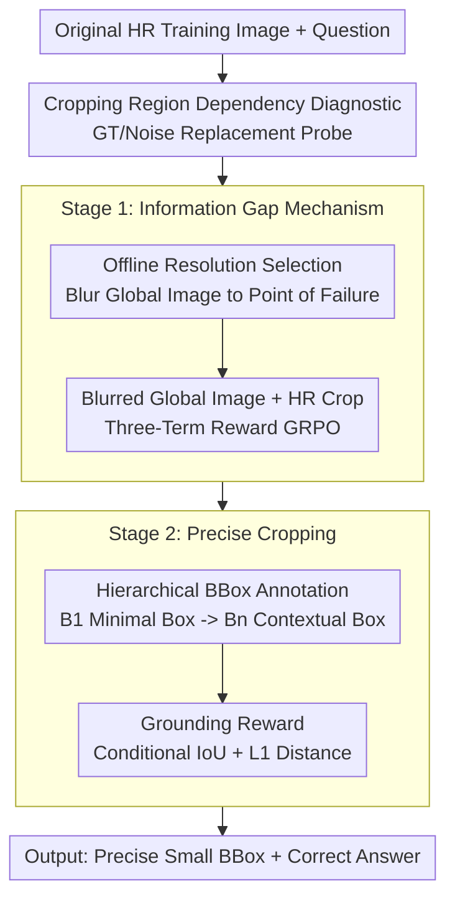

# Learning to Focus and Precise Cropping: A Reinforcement Learning Framework with Information Gaps and Grounding Loss for MLLMs

**Conference**: CVPR 2026  
**Paper**: [CVF Open Access](https://openaccess.thecvf.com/content/CVPR2026/html/Zhao_Learning_to_Focus_and_Precise_CroppingA_Reinforcement_Learning_Framework_with_CVPR_2026_paper.html)  
**Code**: https://github.com/XuanPu-Z/LFPC  
**Area**: Multimodal VLM  
**Keywords**: Multimodal Large Models, Agentic Cropping Tool, High-Resolution VQA, Reinforcement Learning, Information Gap Mechanism

## TL;DR
To address the chronic issue of agentic MLLMs "knowing how to use cropping tools but not actually looking at the cropped regions," this paper proposes a trajectory-free, two-stage pure RL framework. The first stage employs an "information gap mechanism" that blurs the global image, forcing the model to rely on high-resolution cropped patches to answer correctly. The second stage utilizes hierarchical bbox annotations and a grounding reward to align the cropping boxes precisely. On high-resolution VQA benchmarks such as HR-Bench and V\*, this approach outperforms competitor models using 16,384 tokens with only 1,024 visual tokens while being 4–10 times faster during inference.

## Background & Motivation
**Background**: In fine-grained perception tasks, MLLMs frequently fail to resolve small objects or targets obscured by complex backgrounds in a single inference pass. Consequently, a major recent trend is to equip MLLMs with a "cropping tool / zoom-in" to act as an agent—allowing the model to decide whether to zoom in on a specific region of interest (ROI) and feed the high-resolution crop back to answer the question. Training approaches generally fall into two categories: hybrid SFT+RL (first using a powerful teacher MLLM like GPT-4o to generate coordinate-containing reasoning trajectories for SFT, then applying RL) and pure RL (relying solely on image-question pairs, such as DeepEyes).

**Limitations of Prior Work**: SFT+RL depends heavily on massive teacher trajectories, which is both expensive and caps the student's performance ceiling below the teacher's. Conversely, while pure RL bypasses the teacher, it suffers from a more insidious flaw. Through empirical analysis, the authors reveal that models exhibit an "**answer first, crop later**" behavior: they frequently predict the correct answer prior to cropping, using the crop merely as a formality to confirm their existing conclusion without truly leveraging the fine-grained details within the cropped region for reasoning.

**Key Challenge**: The authors conduct a clean diagnostic experiment to verify this phenomenon (see Key Design 1)—replacing model-predicted bounding boxes with ground-truth boxes ("perfect cropping") or random noise ("invalid cropping"). Remarkably, the overall accuracy remains almost unchanged (especially for DeepEyes). This indicates that as long as the global image is sufficiently informative, the model takes a shortcut by answering directly from the global view, rendering the cropped patches redundant. The root cause lies in the fact that, during training, the **global image and the source image for cropping share the same resolution**. As a result, the cropped patch merely "removes irrelevant background" relative to the global view without providing any supplementary information, preventing the model from learning to rely on it.

**Goal**: To force the model to actively seek and utilize information within the cropped region without relying on trajectory supervision, while simultaneously outputting more precise cropping bounding boxes.

**Core Idea**: Manually construct an "information gap"—downsample and blur the global image fed to the model until it is "just insufficient to answer the question but still enough for localization," while extracting the cropped patch from the original high-resolution image. Consequently, the information from the high-resolution crop becomes indispensable. Then, use a grounding reward to calibrate the cropping box to the precise location.

## Method

### Overall Architecture
The model follows the interactive paradigm of agentic MLLMs: given a global image $I_0$ and a question $q$, the model can autonomously output an ROI coordinate. The system then crops this region into $I^{crop}$ and feeds it back to the model to continue reasoning until the final answer is generated. The step $t$ action is formulated as:

$$a_t \sim \pi_\theta(a \mid I_0, q, [r_1, I^{crop}_1], \dots, [r_m, I^{crop}_m])$$

where $r_i$ is the text response and $I^{crop}_i$ is the historical cropped patch. The entire training process is a two-stage pure RL (GRPO) framework designed to address the same core pathological issue through two steps: **Stage 1 (Learn to Focus)** first uses the information gap mechanism to force the model to "rely on cropped patches," and **Stage 2 (Learn to Crop Precisely)** then uses grounding rewards to teach the model to "crop accurately and tightly." Note that neither stage utilizes any teacher trajectories, relying solely on image-QA pairs (with a small number of manual bbox annotations added in Stage 2).

### Key Designs

**1. Cropping Region Dependency Diagnostic: Proving "The Model is Not Looking at Cropped Patches" Using Replacement Probes**

This serves as the empirical foundation of the paper's motivation and the starting point for the methodology. The authors design two control settings to quantify how much the model depends on the cropped regions: (1) **GT Cropping**—replacing the model's predicted bounding boxes with the ground-truth boxes to obtain a "perfect" high-resolution crop; (2) **Random Noise Cropping**—replacing the high-resolution cropped patch with random noise containing no useful information. The logic is straightforward: if the model truly utilizes the cropped patch, accuracy should rise significantly with GT boxes and drop sharply with noise. The results (Table 1) show that under both 16,384 and 1,024 token budgets, the change in accuracy for both replacements is negligible (particularly in the case of DeepEyes). This demonstrates that the model heavily relies on the global image, treating cropped patches as decorations. This diagnostic not only exposes the issue but also points directly to the cause—the identical resolution of the global image and the cropping source during training—paving the way for the "information gap" solution.

**2. Information Gap Mechanism & Offline Resolution Selection: Blurring the Global Image to the Point of Failure to Force Dependence on HR Cropped Patches**

To address the root cause of Limitation 1, the first stage no longer feeds the high-resolution original image directly to the model. Instead, it **downsamples the global image** while still extracting the **cropped patches from the original full-resolution image**, establishing an "information gap" between the low-resolution global view and the high-resolution local view. This makes the high-resolution crop essential for correct reasoning. The difficulty lies in determining the degree of blurring: if the blur is too light, the model still takes shortcuts using the global view (the flaw in DeepEyes); if the blur is too heavy, the model cannot even localize the rough region, rendering the problem unsolvable. 

The authors employ **Offline Resolution Selection** to find this critical threshold. Beginning with the original high-resolution image, they downsample it step-by-step. At each stage, the MLLM to be trained is evaluated on both the original image and the current blurred version. Once the answer from the blurred version begins to diverge from the original design, this resolution level is selected as the "optimal global image" for that sample. Consequently, each training image is tuned to a sweet spot that provides enough context for localization but is inadequate for direct reasoning. Each training data item is represented as a quadruple $(I_0, I_{ori}, q, answer)$, where $I_0$ represents the blurred optimal global image and $I_{ori}$ is the original high-resolution image used to extract crops.

The reward is the sum of three terms:

$$r = r_{acc} + r_{format} + \mathbb{I}_{r_{acc}>0} \cdot r_{tool}$$

where $r_{acc}$ evaluates whether the answer matches the ground truth, $r_{format}$ penalizes poorly-formatted outputs, and $r_{tool}$ represents the tool use reward—which is only granted if the answer is **correct and** the perception tool is called at least once (gated by the indicator function $\mathbb{I}_{r_{acc}>0}$). This prevents the model from invoking random crops to game the tool reward. Optimization utilizes GRPO:

$$A_i = \frac{r_i - \text{mean}(\{r_1,\dots,r_N\})}{\text{std}(\{r_1,\dots,r_N\})}$$

which updates the policy based on group-normalized advantages.

**3. Hierarchical BBox Annotation & Conditional Grounding Reward: Mitigating the BBox-Dilation Side Effect to Crop Accurately and Tightly**

The information gap mechanism introduces a new side effect: because the global image is blurred and only the cropped patches are in high resolution, the accuracy reward incentivizes the model to **predict increasingly larger bounding boxes $B_p$**. Larger boxes contain more high-resolution details, making it easier to answer correctly. However, oversized boxes create redundant computational overhead and introduce extraneous context that interferes with reasoning. The second stage addresses this with direct grounding supervision.

The authors observe that ROIs often exhibit a compositional/hierarchical structure. Thus, they annotate a set of **nested GT boxes** $B_1, B_2, \dots, B_n$ for each question-image pair, spanning from the minimal area required to answer the question ($B_1$, e.g., the text "Harbinger School") to a broader contextual area ($B_2$, e.g., the entire storefront sign), providing a more flexible and robust target for the model. The grounding reward $r_{geo}$ consists of an IoU reward and an L1 distance reward. The IoU reward encourages $B_p$ to overlap highly with one of the GT boxes. However, naively maximizing IoU could tempt the model to predict overly tight boxes that might fail to cover the minimal box $B_1$ entirely, thereby missing critical details. To prevent this, they introduce a **conditional IoU reward**: they first calculate the coverage of $B_p$ over $B_1$ as $overlap = \frac{Area(B_p \cap B_1)}{Area(B_1)}$, and grant the IoU reward only if the coverage exceeds a threshold $\tau=0.9$:

$$r_{IoU} = \begin{cases} \max_{i\in\{1,\dots,n\}} IoU_i & \text{if } overlap > \tau \\ 0 & \text{otherwise} \end{cases}$$

Since the conditional IoU reward suffers from sparse rewards in early training stages (where satisfying the coverage condition is difficult), an **L1 distance reward** is added to provide denser corrective gradients by measuring the normalized L1 distance between the four corners of the predicted box and the closest GT box, offering direction even when the IoU reward is zero:

$$r_{l1} = 1 - \min_{i\in\{1,\dots,n\}} d_{L1}(B_p, B_i)$$

Ultimately, the geometric reward is $r_{geo} = \omega \cdot r_{IoU} + (1-\omega) \cdot r_{l1}$.

### Loss & Training
The backbone is Qwen2.5-VL-7B-Instruct. The model is trained using GRPO on 8×A100 GPUs for 80 steps, with 256 samples per step and 16 rollouts per sample. The maximum response length is 2048, the learning rate is $1\times10^{-6}$, with no KL regularization or entropy penalty. Stage 1 training data comes from Pixelreasoner (2.7k) + CoF (2.1k) + ThinkLite-VL, but **only uses their images and QA pairs, discarding their SFT trajectories**. Stage 2 selects 256 harder samples from Mini-o3's VisualProbe and manually annotates them with precise bboxes.

## Key Experimental Results

### Main Results
Evaluations are conducted on HR-Bench 8K / 4K and V\* across two visual token budgets: 1,024 and 16,384 (cropped patches are always extracted from the original uncompressed image). "Trajectory-Free" indicates that no teacher trajectories were used.

**1,024 Token Budget (Overall)**:

| Method | Trajectory-Free | HR-Bench 8K | HR-Bench 4K | V\* |
|------|:--:|:--:|:--:|:--:|
| CoF-sft | ✗ | 58.9 | 66.0 | 72.8 |
| Pixel Reasoner | ✗ | 59.9 | 65.8 | 73.9 |
| Mini-o3 | ✗ | 66.0 | 70.7 | 80.1 |
| DeepEyes | ✓ | 62.0 | 63.9 | 75.9 |
| **Ours** | ✓ | **72.1** | **75.3** | **80.6** |

**16,384 Token Budget (Overall)**: Ours achieves 75.4 / 76.4 / 89.5, consistently outperforming DeepEyes (69.5 / 72.9 / 85.9) and Mini-o3 (65.6 / 69.0 / 88.0). Most notably, our results with a 1,024-token budget (72.1 / 75.3) already surpass those of most competitor methods using a 16,384-token budget, demonstrating highly efficient utilization of cropped details.

### Ablation Study
Incremental gains of the two-stage training (1,024 tokens, Overall Acc):

| Configuration | HR-Bench 8K | HR-Bench 4K | V\* | Description |
|------|:--:|:--:|:--:|------|
| Baseline (prior methods) | 61.0 | 67.9 | 72.3 | Same resolution for global and cropping source |
| + Stage-I (Information Gap) | 69.9 | 74.4 | 78.0 | Average +8.9 / +6.5 / +5.7 |
| + Stage-II (Grounding) | 72.1 | 75.3 | 80.6 | IoU metrics increase by another ~5%–9% |

Ablation of Stage 2 internal designs (Table 4, Overall):

| Configuration | HR-Bench 8K | Description |
|------|:--:|------|
| Stage-I | 69.9 | Stage-I baseline |
| + Original Data | 68.1 | Using the same data source as Stage I, showing a slight drop (model already solves most, yielding no gain) |
| + VP Data | 72.7 | Switching to harder VisualProbe + Conditional IoU, HR-8K +4.6 (hardest split) |
| + VP Data & L1 Reward | 72.1\* | Adding L1 dense reward, improving overall across all three benchmarks (i.e., Stage-II) |

Cropping dependency (Table 5, Acc drop/variance after replacing cropped patches; larger indicates higher dependency): The baseline registers only 4.5 / 0.5 / 3.2, whereas Stage-I increases significantly to 18.5 / 10.5 / 11.0. This directly quantifies and proves that the information gap mechanism forces the model to actually "look into" the cropped regions.

Efficiency (Table 6, Ours with 1,024 tokens vs others with 16,384 tokens): Ours achieves 72.1 Acc / 2.8s on HR-8K and 75.3 / 2.6s on HR-4K, vastly outperforming DeepEyes (12.4s / 9.3s) and Mini-o3 (27.8s / 21.4s) in both accuracy and speed.

### Key Findings
- The information gap mechanism is the primary source of improvement: Stage-I alone boosts results by 5.7–8.9 percentage points across the three benchmarks, and Table 5 directly proves that the model's reliance on cropped patches jumps from almost zero.
- Data selection in Stage-II is crucial: retraining with the same data source as Stage-I actually degrades performance (since the model has already learned those tasks). Switching to the harder VisualProbe dataset yields substantial improvements, validating that "challenging samples drive grounding learning."
- The L1 reward addresses the early sparsity issue of conditional IoU: it provides dense corrective gradients on challenging samples, outperforming Stage-I across all three benchmarks.
- Gains scale with input resolution: as the input image resolution increases, our method's margin over other models becomes more pronounced, showing that it fully leverages high-resolution cropped details.

## Highlights & Insights
- **The diagnostic design for 'answer first, crop later' is remarkably clean**: The dual-direction replacement probe (GT/noise) quantifies the ambiguous question of "whether the model actually uses the tool" into a comparable change in accuracy ($\Delta$ Acc). This is a sanity check that any tool-augmented agent should perform.
- **The information gap is a counter-intuitive yet highly precise remedy**: While others strive to feed higher resolution global images, this work does the opposite by "deliberately blurring" the global image. This information asymmetry transforms the tool from an "aesthetic accessory" into an "absolute necessity." Furthermore, Offline Resolution Selection calibrates the blurring on a per-sample basis, avoiding a blunt one-size-fits-all approach.
- **Conditional IoU + Coverage Gating is highly transferable**: directly maximizing IoU typically encourages overly tight boxes that might omit small details. The gating strategy of "first ensuring coverage of the minimal box $B_1$ before rewarding IoU" is broadly applicable to any localization-based reward design where tightness and completeness must be balanced.
- **Hierarchical nested bbox annotation** provides a flexible target for grounding, preventing overfitting to a single GT box, and keeps annotation costs low (only 256 samples).

## Limitations & Future Work
- The information gap is a double-edged sword: blurring the global image conversely incentivizes the model to expand the crop box (a side effect acknowledged in the paper). Consequently, a Stage 2 grounding reward is required to correct this, making the overall pipeline two-stage rather than end-to-end.
- Offline Resolution Selection requires running MLLM inference iteratively on each training sample to find the threshold resolution, which incurs non-trivial preprocessing overhead. This cost is not fully quantified in the paper.
- Evaluations are heavily focused on high-resolution, fine-grained VQA tasks (HR-Bench and V\*). Performance on non-high-resolution/small-object tasks (such as general VQA or document understanding) remains unverified. Additionally, a similar "blurred global image" setup is required during inference to replicate the efficiency benefits.
- Stage 2 requires manual nested bbox annotations (even though it is only 256 samples), which compromises the "zero-annotation" appeal of pure RL.

## Related Work & Insights
- **vs DeepEyes (Pure RL)**: DeepEyes also requires no teacher trajectories. However, because the global image and the cropping source share the same resolution during training, the cropped patches lack incremental information, allowing the model to take shortcuts. This work diagnoses and resolves this issue, making the cropped patch indispensable via the information gap mechanism.
- **vs Mini-o3 / Pixel Reasoner / CoF (SFT+RL)**: These methods rely on teacher MLLMs to generate supervisory trajectories, which are expensive and cap study performance at the teacher's capability. This work is trajectory-free (pure RL), yet surpasses their 16,384-token performance using only 1,024 tokens.
- **vs Attention Map / Region Tree Search High-Resolution VQA Methods**: Those methods involve complex pipelines and slow inference. In contrast, this work delegates the decision of "where to look" to a learned RL cropping policy, reducing inference time to 2–3 seconds per question.

## Rating
- Novelty: ⭐⭐⭐⭐⭐ The "information gap mechanism" counter-intuitively blurs the global image to force the model to use the tool, supported by a solid diagnostic from clean replacement probes.
- Experimental Thoroughness: ⭐⭐⭐⭐ Three benchmarks × two token budgets + two-stage ablation + data selection/L1 ablation + efficiency analysis. Quite comprehensive, though limited to fine-grained high-resolution VQA tasks.
- Writing Quality: ⭐⭐⭐⭐ The logical flow from motivation to diagnosis to solution is clear, and the figures map well to the text. Minor equation formatting/typos (e.g., $B_1$ should be $B_i$ in the definition of $IoU_i$) should be cross-referenced with the source text.
- Value: ⭐⭐⭐⭐ Provides a quantifiable diagnostic and effective solution to a common hidden flaw where "tool-augmented MLLMs do not actually use their tools." It drastically improves token efficiency, making it highly practical.

<!-- RELATED:START -->

## Related Papers

- [\[CVPR 2026\] TempR1: Improving Temporal Understanding of MLLMs via Temporal-Aware Multi-Task Reinforcement Learning](tempr1_improving_temporal_understanding_of_mllms_via_temporal-aware_multi-task_r.md)
- [\[CVPR 2026\] Explore with Long-term Memory: A Benchmark and Multimodal LLM-based Reinforcement Learning Framework for Embodied Exploration](explore_with_long-term_memory_a_benchmark_and_multimodal_llm-based_reinforcement.md)
- [\[CVPR 2026\] MM-ReCoder: Advancing Chart-to-Code Generation with Reinforcement Learning and Self-Correction](mm-recoder_advancing_chart-to-code_generation_with_reinforcement_learning_and_se.md)
- [\[CVPR 2026\] Information-Theoretic Decomposition for Multimodal Interaction Learning](information-theoretic_decomposition_for_multimodal_interaction_learning.md)
- [\[CVPR 2026\] SenseSearch: Empowering Vision-Language Models with High-Resolution Agentic Search-Reasoning via Reinforcement Learning](sensesearch_empowering_vision-language_models_with_high-resolution_agentic_searc.md)

<!-- RELATED:END -->
