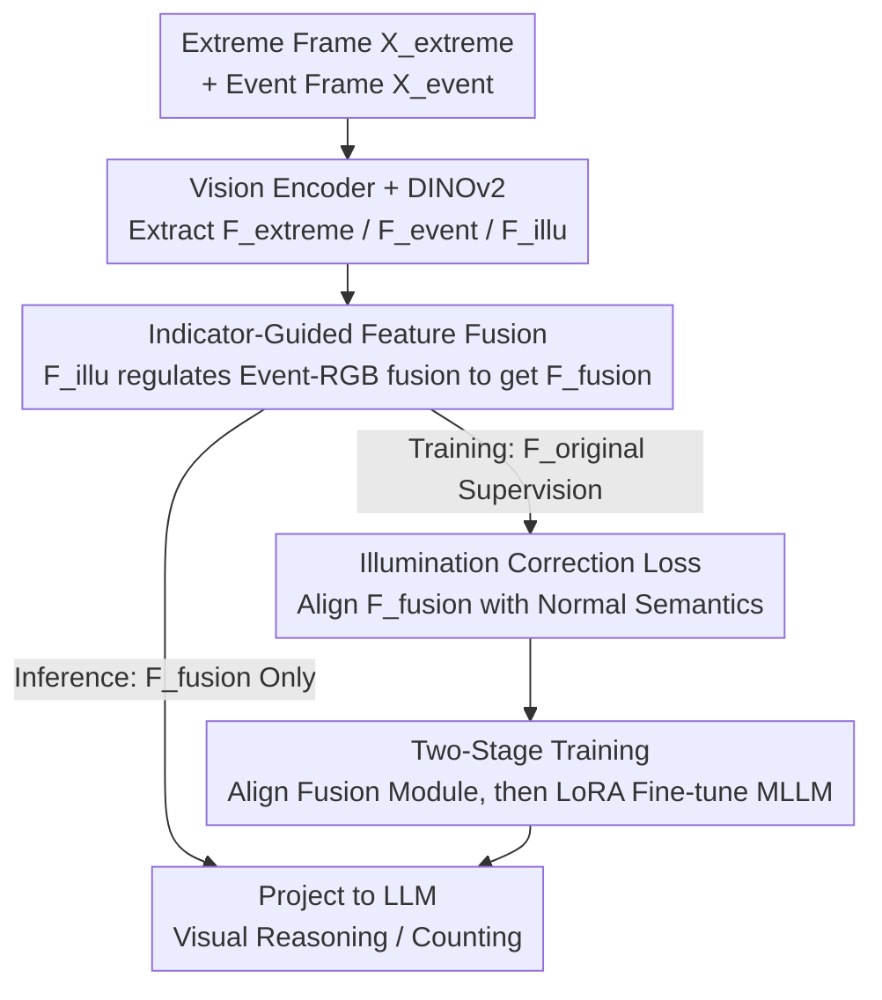

# Learning to See through Illumination Extremes with Event Streaming in Multimodal Large Language Models

**Conference**: CVPR 2026  
**Paper**: [CVF Open Access](https://openaccess.thecvf.com/content/CVPR2026/html/Zhang_Learning_to_See_through_Illumination_Extremes_with_Event_Streaming_in_CVPR_2026_paper.html)  
**Code**: TBD  
**Area**: Multimodal VLM  
**Keywords**: Event Camera, Extreme Illumination, MLLM, Adaptive Fusion, Feature Alignment

## TL;DR
To address the issues of irreversible RGB degradation and subsequent hallucinations in Multimodal Large Language Models (MLLMs) under overexposed/extremely dark conditions, Event-MLLM introduces event streams as a complementary modality. It utilizes an "illumination indicator" learned from a DINOv2 branch to adaptively regulate Event-RGB fusion, combined with an "Illumination Correction Loss" to align fused features with normal illumination semantics. This enables stable reasoning and counting across extreme brightness ranges from $0.05\times$ to $20\times$.

## Background & Motivation

**Background**: Multimodal Large Language Models (MLLMs) connect powerful visual encoders to Large Language Models, enabling a wide range of tasks such as open-ended QA and fine-grained visual reasoning. However, most models implicitly assume that inputs are clear RGB images under "ideal illumination."

**Limitations of Prior Work**: In extreme illumination such as overexposure or near-total darkness, RGB images suffer from **irreversible** structural and semantic information loss. Models fail to perceive key details and generate hallucinations (inventing non-existent objects), leading to a collapse in tasks like counting and localization. Existing mitigation strategies are largely "reactive": either using image enhancement pipelines first (which introduce artifacts/distort semantics), using MLLMs as controllers for external tools (indirect improvement without enhancing the model itself), or utilizing specialized low-light encoders (which cannot guarantee content-level understanding consistency).

**Key Challenge**: These methods attempt to **recover** degraded information rather than **actively preventing** information loss during MLLM inference. When RGB sensors saturate or underexpose, information is physically lost, making recovery impossible from RGB alone.

**Key Insight**: Event cameras work asynchronously with microsecond temporal resolution and a dynamic range exceeding 120 dB. They record **changes** in brightness rather than absolute intensity, retaining rich structural cues even when RGB sensors fail. While low-level vision (denoising, HDR) has proven the efficacy of RGB-event fusion, this paradigm has not yet been introduced to MLLMs for reasoning and instruction following.

**Core Idea**: Integrate event streams into MLLMs, allowing the model to learn "when and to what extent to rely on event information." This is achieved via a learnable illumination indicator for dynamic weighting and a feature-space correction loss that distills structures lost in extreme lighting by pulling fused features toward normal illumination semantics.

## Method

### Overall Architecture
Event-MLLM receives dual visual input streams: a degraded extreme illumination frame $X_{extreme}$ and its corresponding event frame $X_{event}$. The primary visual encoder $E_{vision}$ extracts high-level semantic features $F_{extreme}$ and $F_{event}$ respectively. A frozen DINOv2 encoder processes $X_{extreme}$ to obtain features $F_{illu}$ (the illumination indicator) characterizing the degradation pattern. During training, a normal illumination frame $X_{original}$ is introduced, with its features $F_{original}$ serving as a "supervision anchor." These features are fed into learnable MLPs, fused into a unified representation $F_{fusion}$ guided by the indicator, and supervised by the illumination correction loss. $F_{fusion}$ is then projected into the LLM space for end-to-end instruction tuning. **Normal frames are not required during inference**: the model adaptively fuses $F_{fusion}$ using only $X_{extreme}$ and $X_{event}$. Training occurs in two stages: feature alignment of the fusion module followed by LoRA fine-tuning of the MLLM.

### Key Designs

**1. Illumination Indicator-Guided Adaptive Fusion: Determining "When to Rely on Events"**

The limitation is that illumination degradation is spatially and temporally non-uniform, making fixed-weight fusion ineffective. The authors learn an illumination indicator $F_{illu} = F_A(E_{DINOv2}(X_{extreme}))$, which encodes global degradation patterns to regulate the intensity of event feature injection. The fusion is performed in two steps: first, $F_{illu}$ is concatenated with $F_{event}$ to bind robust event information with specific lighting conditions; then, this combined representation is concatenated with $F_{extreme}$ for the final MLP:

$$F_{fusion} = F_{fusion}(F_{extreme}, \text{Concat}[F_{illu}, F_{event}])$$

DINOv2 is chosen because its self-supervised features are sensitive to illumination patterns while being decoupled from specific content, expressing "exposure degradation degree" more purely than the main encoder.

**2. Illumination Correction Loss: Distilling Normal Semantics into Fused Features**

Guiding the model toward "information-rich semantics" rather than "redundant correlation" is difficult without clean references at inference. The authors provide supervision via normal illumination frames available during training. Features from the normal frame $F_{original} = E_{vision}(X_{original})$ are extracted via a frozen encoder, and the fused features are aligned using MSE:

$$\mathcal{L}_{IC} = \lVert F_{fusion} - F_{original} \rVert_2^2$$

Minimizing this reinforces the fusion module's ability to **reconstruct features consistent with normal lighting semantics**. This trains the model to actively compensate for RGB degradation using events rather than passively recovering pixels. Post-training, $X_{original}$ is discarded, and the model performs autonomous illumination correction.

**3. Two-Stage Training Strategy: Alignment before Instruction Tuning**

Mixing "feature fusion" and "instruction following" in one stage causes convergence issues as the LLM attempts to fit noisy features before the fusion module learns semantic alignment. The authors decouple this: ① **Adaptive Feature Fusion Stage**: Only the MLPs are trained using $\mathcal{L}_{IC}$ to distill normal semantics into $F_{fusion}$. ② **Instruction Fine-tuning Stage**: The vision features are frozen/aligned, and the entire Event-MLLM is fine-tuned via LoRA for downstream tasks.

### Loss & Training
The core objective is the Illumination Correction Loss $\mathcal{L}_{IC}$ (MSE). Stage one utilizes the Adam optimizer (LR 0.001) for 30 epochs to train the fusion MLPs. Stage two uses LoRA fine-tuning for 1 epoch. Architectures include Qwen-3B / Qwen-7B, with hardware including RTX 5090D and A800.

## Key Experimental Results

The dataset is the first "Normal + Extreme + Event" triplet instruction-following dataset, containing 2,241 samples and 10,129 QAs. Each sample includes 17 brightness levels ($0.05\times$ to $20\times$). Benchmarks include Multiple-Choice (scene understanding) and Object Counting.

### Main Results

| Method | Type | MC Acc.↑ | MC F1↑ | Count Acc.↑ | Count MAE↓ |
|------|------|-----------|----------|-----------|-----------|
| LLaVA-7B | General MLLM | 18.43 | 65.39 | 67.84 | 0.9957 |
| InternVL | General MLLM | 31.50 | 75.46 | 72.56 | 0.8641 |
| EventGPT | Event-only | 3.16 | 73.60 | 67.41 | 1.0015 |
| Q-Instruct | Illum-aware | 15.86 | 65.09 | 66.87 | 0.9803 |
| Baseline-7B (Qwen) | Event-aug | 44.71 | 81.95 | 72.73 | 0.5303 |
| **Ours-7B** | Event-aug | **53.13** | **85.43** | **74.66** | **0.4557** |

Ours-7B outperforms the next best baseline by 8.42% in MC Acc. and surpasses InternVL in counting tasks. Performance scales significantly from 3B to 7B models.

### Ablation Study

| Config (Qwen-7B) | MC Acc.↑ | MC F1↑ | Count Acc.↑ | Count MAE↓ |
|----------------|-----------|----------|-----------|-----------|
| Baseline (No components) | 44.71 | 81.95 | 72.73 | 0.5303 |
| + Illum. Correction Only | 51.90 | 84.83 | 74.23 | 0.4645 |
| Ours (IC + LoRA) | 53.13 | 85.43 | 74.66 | 0.4557 |

Fusion strategy comparison: Pixel-level Pre-fusion yields only 14.85% MC Acc. (worst), proving that pixel stacking produces unnatural images that standard encoders cannot process correctly. Feature-level Post-fusion reaches 32.24%.

### Key Findings
- Illumination correction and LoRA offer **progressive** gains, with larger gains in Qwen-7B, suggesting larger models benefit more from additional modalities and complex alignment.
- Pixel-level pre-fusion severely degrades performance, highlighting that fusion must occur at the feature/semantic level.
- t-SNE analysis shows that without correction, feature similarity drops from 0.98 to 0.65 under extreme light; with fusion, features under various brightness levels cluster near the normal illumination features.

## Highlights & Insights
- **Shift from "Post-hoc Recovery" to "Active Compensation"**: Injecting structural info via event streams during fusion bypasses the physical bottleneck of irreversible RGB degradation.
- **Decoupling Illumination Assessment from Content Encoding**: Using DINOv2 for degradation patterns avoids interference between illumination judgment and semantic understanding.
- **Anchor-based Training**: Transforming the need for "clean references" into an autonomous capability for inference is a clever design—achieving strong supervision without increasing inference-time requirements.

## Limitations & Future Work
- Fine-grained descriptions were generated by GPT-4o; though verified, they may inherit model biases. The dataset size (2,241) is relatively small for MLLM training.
- Extreme brightness is simulated via multiplicative scaling ($17$ levels), which may differ from the non-linear response and noise characteristics of real sensors.
- Inference requires spatio-temporally aligned event camera input, limiting deployment on standard RGB-only hardware.
- Synergistic benefits with larger models (>7B) or additional modalities (e.g., Depth) remain unexplored.

## Related Work & Insights
- **vs. Enhancement-based**: Avoids synthetic artifacts by performing compensation in the feature space rather than the pixel space.
- **vs. Tool-use MLLMs**: Internalizes robustness within the fusion module rather than relying on external controllers.
- **vs. Event-only (EventGPT)**: Event-only models underperform in normal lighting; this method maintains performance across all lighting conditions through dynamic fusion.
- **vs. Illumination-aware (Q-Instruct)**: While Q-Instruct uses instruction tuning on degraded data, it misses the reliability of event cameras in extreme conditions.

## Rating
- Novelty: ⭐⭐⭐⭐⭐ First to integrate event streams for extreme illumination MLLM reasoning.
- Experimental Thoroughness: ⭐⭐⭐⭐ Comprehensive brightness levels and baselines, though real-world event data validation could be broader.
- Writing Quality: ⭐⭐⭐⭐ Clear motivation and architecture; intuitive pipeline visualization.
- Value: ⭐⭐⭐⭐ Provides a new paradigm and benchmark for robust perception in adverse environments.

<!-- RELATED:START -->

## Related Papers

- [\[CVPR 2026\] Octopus: History-Free Gradient Orthogonalization for Continual Learning in Multimodal Large Language Models](octopus_history-free_gradient_orthogonalization_for_continual_learning_in_multim.md)
- [\[CVPR 2026\] RE-VLM: Event-Augmented Vision-Language Model for Scene Understanding](re-vlm_event-augmented_vision-language_model_for_scene_understanding.md)
- [\[CVPR 2025\] EventGPT: Event Stream Understanding with Multimodal Large Language Models](../../CVPR2025/multimodal_vlm/eventgpt_event_stream_understanding_with_multimodal_large_language_models.md)
- [\[CVPR 2026\] ROSE: Rotate Your Large Language Model to See](rose_rotate_your_large_language_model_to_see.md)
- [\[CVPR 2026\] Streaming Video Instruction Tuning (Streamo)](streaming_video_instruction_tuning.md)

<!-- RELATED:END -->
