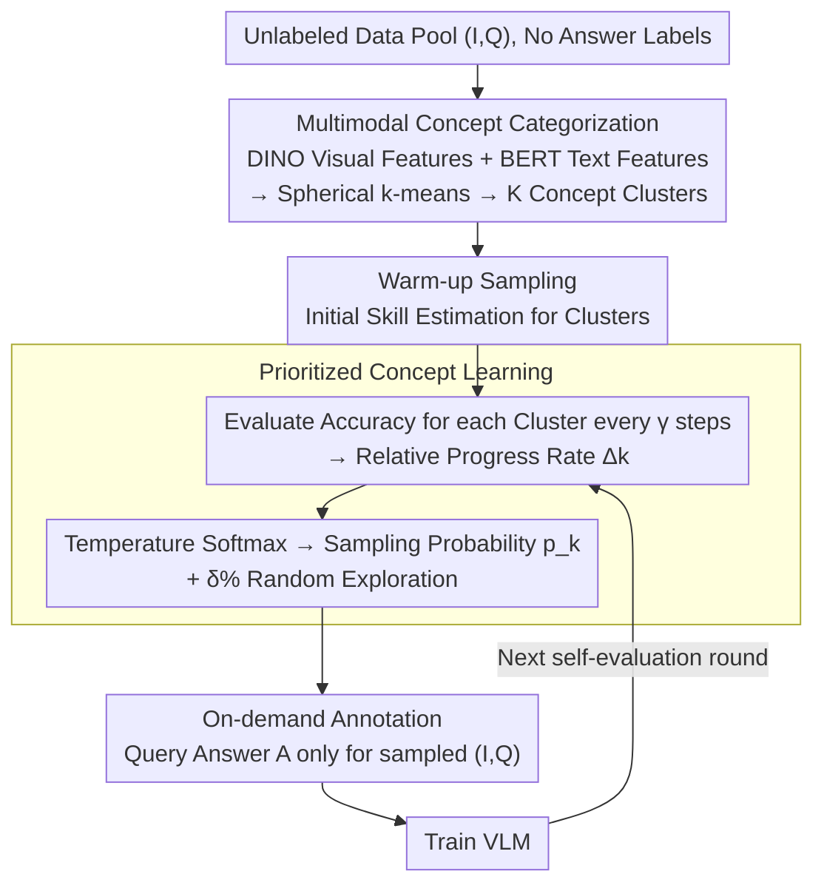

# Learning What Matters: Prioritized Concept Learning via Relative Error-driven Sample Selection

**Conference**: CVPR 2026  
**arXiv**: [2506.01085](https://arxiv.org/abs/2506.01085)  
**Code**: [https://mylittlechange.github.io/PROGRESS_web/](https://mylittlechange.github.io/PROGRESS_web/)  
**Area**: Multimodal VLM  
**Keywords**: Data-efficient learning, Instruction tuning, Curriculum learning, VLM training, Sample selection

## TL;DR
The PROGRESS framework is proposed to dynamically select the most informative training samples by tracking the VLM's learning progress on automatically discovered multimodal concept clusters. Using only 16-20% of labeled data, it achieves 99-100% of full-data performance with a shorter total training time.

## Background & Motivation
**Background**: Instruction tuning for VLMs relies on large-scale high-quality labeled data and significant computational power, making the process increasingly expensive.

**Limitations of Prior Work**: (a) Static selection methods (CLIP-Score, EL2N, Perplexity, etc.) cannot adapt to the model's learning progress after the initial selection; (b) Gradient-based methods (ICONS) involve enormous computational overhead (hundreds of GPU hours), contradicting the goal of efficient training; (c) COINCIDE requires additional pre-trained auxiliary VLMs, labels for the entire dataset, and manual inspection of activations.

**Key Challenge**: A large number of training samples are redundant or uninformative, but static methods cannot identify this during the training process.

**Goal**: Can a VLM dynamically determine "what to learn next" based on its own learning state and acquire labels only when necessary?

**Key Insight**: Inspired by curriculum learning and self-paced learning—the model should learn skills that are "not yet mastered but are progressing rapidly," avoiding budget waste on mastered or overly difficult samples.

**Core Idea**: Track the relative rate of change in learning progress $\Delta_k$ and prioritize sampling from concept clusters that show the fastest improvement.

## Method

### Overall Architecture
PROGRESS aims to solve the problem of "allowing the VLM to decide which samples to learn next without pre-labeling the entire data pool." The pipeline consists of two stages: first, partitioning the unlabeled data pool into semantic concept clusters, and then allowing the model to periodically evaluate itself during training to identify "rapidly progressing" clusters. Sampling distributions are updated based on these signals, and labels are queried only for sampled data. Unlike static methods, PROGRESS updates its sampling distribution according to the model's state, delegating the "easy-to-hard" curriculum to the model's own progress signals. This "evaluation → progress calculation → sampling → labeling → training" loop repeats every $\gamma$ steps until the budget is exhausted.

### Key Designs

**1. Multimodal Concept Categorization: Partitioning data into semantic clusters without labels**

To perform "prioritized learning by concept," one must first identify the concepts within the data pool while it is still unlabeled. PROGRESS extracts DINO visual features and BERT text features for each image-query pair $(I,Q)$, concatenates and normalizes them, and applies spherical k-means to obtain $K$ concept clusters. This process requires no labels, no auxiliary models, and no manual intervention. Using bimodal features ensures purer clusters that correspond to interpretable capabilities like "object localization," "OCR," "coding," or "multilingualism," making progress tracking meaningful.

**2. Prioritized Concept Learning: Sampling weights based on "relative progress" rather than absolute difficulty**

Static methods fail to perceive the model's current learning stage. PROGRESS evaluates the current accuracy $\text{Acc}_k^{(t)}$ for each cluster every $\gamma$ steps. Instead of absolute accuracy, it calculates the improvement relative to the previous evaluation:

$$\Delta_k = \frac{\text{Acc}_k^{(t)} - \text{Acc}_k^{(t-\gamma)}}{\text{Acc}_k^{(t-\gamma)} + \epsilon}$$

A higher $\Delta_k$ indicates a cluster that is "not yet mastered but is improving rapidly," representing the highest marginal gain. Mastered clusters (zero improvement) and currently unattainable clusters are automatically down-weighted. Sampling probabilities are derived via temperature-scaled softmax:

$$p_k = \frac{\exp(\Delta_k/\tau)}{\sum_j \exp(\Delta_j/\tau)}$$

The temperature $\tau$ balances informativeness and diversity: a low $\tau$ concentrates sampling on the fastest-improving clusters, while a high $\tau$ approaches uniform sampling. This mechanism delegates "what to learn" and "when to learn" to the model's internal feedback.

**3. On-demand Annotation: Spending budget only on sampled instances**

The data pool starts completely unlabeled. An answer $A$ is queried only when a pair $(I,Q)$ is selected by the sampler. This distinguishes PROGRESS from methods like COINCIDE, which require annotating the entire dataset beforehand. PROGRESS reduces annotation costs to cover only the 16-20% of samples actually used for training, providing significant cost savings.

### Training Strategy
The process begins with a warm-up phase using a simple sampler to establish reliable initial skill estimates for each cluster, preventing noise in the first $\Delta_k$ calculation. During formal sampling, a $\delta\%$ random exploration mechanism is maintained to prevent low-progress clusters from being completely ignored. The progress signal can be based on either accuracy or loss; both show similar performance in main experiments.

## Key Experimental Results

### Main Results (LLaVA-v1.5-7B, LLaVA-665K, 20% Sampling)

| Method | Requires Aux VLM? | VQAv2 | GQA | TextVQA | POPE | MMBench | Relative Score |
| :--- | :---: | :---: | :---: | :---: | :---: | :---: | :---: |
| Full-data Tuning | - | 79.1 | 63.0 | 58.2 | 86.4 | 66.1 | 100% |
| Random | ✗ | 75.7 | 58.9 | 55.3 | 84.7 | 62.2 | 95.0% |
| COINCIDE | ✓ | 76.5 | 59.8 | 55.6 | 86.1 | 63.1 | 97.8% |
| **PROGRESS (Acc)** | **✗** | **75.2** | **58.8** | **55.1** | **85.9** | **61.1** | **98.4%** |
| **PROGRESS (Loss)** | **✗** | **75.7** | **58.6** | **55.1** | **86.3** | **62.5** | **98.4%** |

### Cross-architecture/Scale Generalization

| Model | Data Ratio | Relative Performance |
| :--- | :---: | :---: |
| LLaVA-v1.5-7B | 20% | 98-99% |
| LLaVA-v1.5-13B | 20% | Similar |
| Qwen2-VL | 16% | 99-100% |

### Key Findings
- PROGRESS outperforms COINCIDE (which requires auxiliary VLMs and full labels) using only 20% data (98.4% vs 97.8%).
- Total training time (including self-evaluation overhead) remains shorter than full-data training.
- Learning curves show an emergent curriculum effect: the model learns simple concepts (single object recognition) before complex ones (OCR, reasoning).
- Choice of temperature $\tau$ is critical: too low leads to mode collapse, while too high becomes equivalent to random sampling.

## Highlights & Insights
- **No auxiliary models, no full annotation, no gradient computation required**: These features make PROGRESS exceptionally friendly for academic labs.
- Learning-progress-driven sampling combines the advantages of curriculum learning and active learning by automatically deciding "what" and "when" to learn.
- The temperature-softmax sampling strategy is a simple and elegant way to balance informativeness and diversity.
- Visualization of concept learning sequences provides new perspectives on VLM training dynamics.

## Limitations & Future Work
- The number of clusters $K$ must be predefined; different datasets may require different values.
- The self-evaluation frequency $\gamma$ is an additional hyperparameter.
- Progress signals are based on training set performance, which may not perfectly align with validation performance.
- Effectiveness has only been verified for instruction tuning; its impact on pre-training is unknown.

## Related Work & Insights
- **vs COINCIDE**: COINCIDE requires a pre-trained auxiliary VLM, full labels, and manual activation checks; PROGRESS is entirely self-sufficient.
- **vs ICONS**: ICONS uses gradient information requiring hundreds of GPU hours; PROGRESS uses internal accuracy change rates with nearly zero extra cost.
- **vs Curriculum Learning**: Traditional curriculum learning uses external difficulty rankings; PROGRESS uses the model's own feedback to drive the curriculum.
- This strategy could potentially be generalized to data mixture control in LLM pre-training.

## Rating
- Novelty: ⭐⭐⭐⭐ Progress-driven dynamic sampling is an effective new paradigm.
- Experimental Thoroughness: ⭐⭐⭐⭐⭐ Multiple datasets, architectures, and scales, with detailed ablations and visualizations.
- Writing Quality: ⭐⭐⭐⭐ Clear comparisons and intuitive visualizations relative to prior methods.
- Value: ⭐⭐⭐⭐⭐ Extremely practical for resource-constrained researchers, directly reducing training costs.

<!-- RELATED:START -->

## Related Papers

- [\[CVPR 2026\] Ramen: Robust Test-Time Adaptation of Vision-Language Models with Active Sample Selection](ramen_robust_test-time_adaptation_of_vision-language_models_with_active_sample_s.md)
- [\[ICLR 2026\] SpectralGCD: Spectral Concept Selection and Cross-modal Representation Learning for Generalized Category Discovery](../../ICLR2026/multimodal_vlm/spectralgcd_spectral_concept_selection_and_cross-modal_representation_learning_f.md)
- [\[CVPR 2026\] Anchor-Guided Gradient Alignment for Incomplete Multimodal Learning](anchor-guided_gradient_alignment_for_incomplete_multimodal_learning.md)
- [\[CVPR 2026\] No Hard Negatives Required: Concept Centric Learning Leads to Compositionality without Degrading Zero-shot Capabilities of Contrastive Models](no_hard_negatives_required_concept_centric_learning_leads_to_compositionality_wi.md)
- [\[CVPR 2026\] Concept-wise Attention for Fine-grained Concept Bottleneck Models](coat_cbm_concept_wise_attention.md)

<!-- RELATED:END -->
