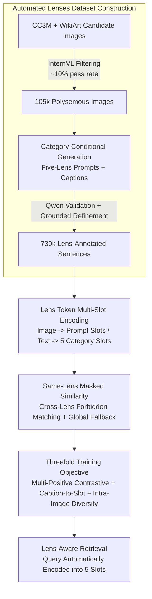

# Lenses: Toward Polysemous Vision-Language Understanding

**Conference**: CVPR 2026  
**Paper**: [CVF Open Access](https://openaccess.thecvf.com/content/CVPR2026/html/Alomari_Lenses_Toward_Polysemous_Vision-Language_Understanding_CVPR_2026_paper.html)  
**Code**: None  
**Area**: Multimodal VLMs  
**Keywords**: Polysemous image retrieval, cross-modal retrieval, lens slot embedding, non-literal semantics, multi-positive contrastive learning

## TL;DR
Challenging the dominant assumption that "an image has only a single literal meaning," this paper constructs Lenses, a dataset of 105k images and 730k sentences annotated with five types of "interpretive lenses" (Literal / Figurative / Abstract / Background / Emotional). It enables multimodal large models to produce a set of lens-aligned slot embeddings for both images and sentences, conducting retrieval through a similarity metric that "only permits matching within the same lens." This approach significantly outperforms baselines like CLIP, BLIP-2, and BGE-VL on both literal and non-literal retrieval tasks.

## Background & Motivation
**Background**: The mainstream paradigm of cross-modal retrieval relies on dual encoders combined with contrastive learning (such as CLIP, BLIP-2, and BGE-VL), which compress an image and a sentence into **a single global vector** respectively, and then compute cosine similarity. This paradigm works exceptionally well on corpora like COCO / Flickr30K that feature "one-image-one-literal-description," and easily scales to large-batch training.

**Limitations of Prior Work**: However, images are inherently polysemous. For example, an image showing a rotten apple mixed with good ones can be described literally as "rotten fruit," interpretively using an idiom like "one bad apple spoils the bunch," or analyzed through emotional, background, and abstract thematic lenses. Compressing these heterogeneous meanings into a single vector forces all interpretations to average out and contaminate each other, making the system highly fragile when facing queries with multiple interpretations. Although existing multi-embedding methods (e.g., PVSE, PCME, SetDiv, MaxMatch) learn multiple embeddings per sample, **they ultimately re-aggregate them into a single global similarity**. The extra embeddings act merely as "general semantic capacity" without being bound to any explicit interpretive dimensions. Furthermore, their training data consists of literal descriptions with different phrasing but identical meanings, lacking genuine polysemous supervisory signals.

**Key Challenge**: Image-text matching is inherently a **many-to-many, non-literal** alignment. However, current datasets, similarity functions, and evaluation metrics are all built upon the "monosemous, literal, one-to-one" assumption, causing models to overfit to literal details and severely under-represent diverse meanings.

**Goal**: (1) To construct a dataset with explicit annotations across multiple interpretive dimensions; (2) to design a model that generates "dimension-segregated" multi-embeddings for both images and texts without having these embeddings collapse into a single cluster; and (3) to propose an evaluation protocol that reflects how humans match images and texts across different dimensions.

**Key Insight**: Explicitly modeling the idea that "an image can have multiple meanings" into **five fixed interpretive lenses**—Literal, Figurative, Abstract, Background, and Emotional—where each lens corresponds to an independent embedding slot, and **forcing similarity computations to only permit matching between slots of the same lens**.

**Core Idea**: Replacing the "single global vector + global cosine similarity" paradigm with "lens-specific token -> multi-slot embeddings + masked same-lens similarity (with a global fallback)," thereby explicitly decomposing many-to-many non-literal alignments into five distinct, non-overlapping interpretive dimensions.

## Method

### Overall Architecture
The overall work consists of two major components: **first, automatically constructing a lens-annotated dataset, Lenses, using LLMs/VLMs; second, training a retrieval model capable of producing lens-aligned slot embeddings.**

Dataset side: Candidate images are sourced from CC3M (everyday scenes) and WikiArt (artworks). A frozen InternVL3.5-38B is used to filter out images that "support non-literal/contextual interpretations" (roughly 10% pass, resulting in 105k images). Subsequently, the model is prompted to generate multiple **image-side prompts** (short interpretive cue phrases) and **captions** (descriptions used for retrieval) for each image across the five lenses. Finally, Qwen2.5-32B-Instruct performs a secondary validation (visual grounding + lens fidelity), rewriting or discarding unqualified entries. Furthermore, the test set undergoes an additional grounding check.

Model side: Built on BGE-VL-MLLM (using LLaVA-1.6 Mistral-7B as the base model). Images are paired with their corresponding image-side prompts, with each prompt followed by a learned special token `<PROMPT>`. In a single forward pass, the model outputs a **visual slot embedding** for each prompt. For text, five lens category tokens are appended after the caption to generate five **textual slot embeddings** (only the slot corresponding to the caption's annotated lens is activated, while the remaining four are masked). During retrieval, a **masked smooth-Chamfer similarity over the same lenses** is used to compare the two sets of slots; if an image-text pair does not share any overlapping lens, the metric falls back to the cosine similarity of the global embeddings. Training is guided by three loss functions: multi-positive contrastive loss, caption-to-slot alignment loss, and intra-image slot diversity loss. During inference, users provide only a textual query without lens labels; the model automatically encodes the query into five slots and performs masked retrieval.

### Key Designs

**1. Five-Lens Dataset Lenses: Turning "Image Polysemy" into Playable Supervised Annotations**

Existing polysemous retrieval methods fail to perform well primarily because they lack genuinely polysemous supervised data—multiple captions in COCO/Flickr typically just rephrase the same salient objects. This work bridges this gap via a fully automated three-stage pipeline: ① **Image Pool Construction**: Candidate images are collected from CC3M and WikiArt (balancing everyday scenes with naturally polysemous artistic images). A frozen InternVL3.5-38B determines via binary classification "whether this image supports non-literal/contextual interpretation." Approximately 10% pass, yielding 105k images, which are then deduplicated using perceptual hashing and CLIP-space clustering. ② **Category-Conditional Generation**: Treating the large VLM as a structured annotator, it generates captions across the five lenses, enforcing three main constraints (visual grounding, lens fidelity—e.g., figurative must use idioms/metaphors, emotional must employ emotional language—and suitability for retrieval). For non-literal lenses, an idiom/metaphor phrase library is provided, requiring that any borrowed expression remains supported by the visual content. Simultaneously, the model generates image-side prompts (single-lens cue phrases focusing on specific visual elements, with variations in sentence structures and n-gram deduplication to prevent near-synonym repetitions). ③ **Validation and Refinement**: Qwen2.5-32B-Instruct validates the syntax, category alignment, and lens fidelity of each caption/prompt, rewriting or discarding substandard cases. The test set undergoes another pure grounding check via InternVL. The final dataset consists of 105k images and 732k sentences, balanced across the five lenses in each split. This "filter-generate-verify" strategy replaces expensive human multi-perspective annotation with scalable LLM/VLM generation while leveraging two distinct models for generation and verification to minimize noise.

**2. Lens Token Multi-Slot Embeddings: Generating Dimension-Segregated Vectors in a Single Forward Pass**

To represent polysemy, images and text can no longer be compressed into a single global vector. This work introduces **learned special tokens** for both images and texts to enable the MLLM to output multiple slots. On the image side, the input template is formatted as `⟨instruct⟩{task instruction} ⟨image⟩ {q^V_z} [EOS]`, where each query $q^V_z = p_z\,\texttt{<PROMPT>}$ appends the $z$-th image-side prompt $p_z$ (with lens label $c_z$) to a newly added `<PROMPT>` token in the tokenizer. The hidden state of the final layer at this token's position is extracted as the visual slot embedding for that prompt. All prompts are processed in parallel within **a single forward pass**; thus, these slots naturally share the same retrieval space while encoding distinct heterogeneous semantics. On the text side, five lens category tokens `<L><F><A><B><E>` are appended to the caption, and the hidden states of these five positions constitute the text slot set. A binary mask $m^T(t_k)$ is applied to activate only the slot **aligned with the caption's annotated lens $c_k$**, masking out the other four in all loss computations. This allows the MLLM to view the entire lens vocabulary as context, while restricting supervision exclusively to the annotated lens to prevent semantic leakage. Consequently, each sample simultaneously exposes a "global vector $g^V/g^T$" (taken from the final token) and a set of lens-aligned slot embeddings $E^V(I), E^T(t_k)$.

**3. Same-Lens Masked Similarity with Global Fallback: Set-to-Set Scoring Restricting Cross-Lens Matching**

With two sets of slots, a single global cosine similarity is insufficient, while classical set similarity metrics have distinct flaws: MIL (PVSE) only retains the best-matching pair, depriving other slots of supervision; average-pooling (PCME) has dense supervision but pushes all slots to overlap, leading to representation collapse; and SetDiv pulls every element towards every other element, where cross-lens averaging drifts the slots toward a single mode. The similarity metric proposed in this work **explicitly forbids cross-lens matching**—e.g., figurative prompts on the image side can only match figurative slots on the text side, and so forth. First, the normalized slot-to-slot cosine matrix $S_{b,n}=V_b T_n^\top$ is computed, followed by applying a mask:

$$B_{b,n}(i,j)=\mathbb{1}[\,m^V_{b,i}=1,\ m^T_{n,j}=1,\ \ell^V_{b,i}=\ell^T_{n,j}\,]$$

which sets the positions of "different lenses or inactive slots" to $-\infty$. Then, a smooth-Chamfer similarity is computed over the remaining valid terms ($\alpha>0$ controls the flatness of the max operator):

$$s(I_b,t_n)=\frac{1}{2\alpha Z_{I_b}}\sum_i \log\!\sum_j e^{\alpha S_{b,n}(i,j)}+\frac{1}{2\alpha Z_{t_n}}\sum_j \log\!\sum_i e^{\alpha S_{b,n}(i,j)}.$$

When an image-text pair **does not have any overlapping lenses** ($B$ is all zeros), the system falls back to the cosine similarity of the global embeddings $\langle g^V(I_b), g^T(t_n)\rangle$. This design ensures clear segregation between dimensions while preserving supervisory signals for pairs that occasionally lack overlapping lenses.

**4. Threefold Training Objective: Enforcing "Correct Lens Usage" and "Slot Diversity" Beyond Positive Alignments**

Simply using contrastive loss is insufficient: it guarantees only that matching image-text pairs score higher than mismatched ones, but leaves multi-lens slot outputs under-constrained—e.g., a figurative caption could mistakenly map to the image's literal slot without receiving a penalty. To resolve this, three losses are stacked. (a) **Multi-Positive Contrastive Loss** $L_{ret}=L_{i\to t}+L_{t\to i}$: applies InfoNCE, but averages all positive captions of the same image as positive targets (rather than treating them as negative samples). (b) **Caption-to-Slot Alignment Loss** $L_{cap\to slot}$: for image-text pairs with matching lens visual slots, this forces each caption to **preferentially align with the slot matching its own lens** among all activated visual slots (using a softmax over slot cosine similarities), strictly binding each caption to its respective slot. (c) **Intra-Image Slot Diversity Loss** $L_{div\text{-}img}$: computes pairwise cosine similarities $\gamma_b(i,j)$ across the activated visual slots of the same image, applying a hinge loss $\max(0,\gamma_b(i,j)-\alpha)$ to penalize overly close embeddings. This prevents slots of rarer lenses (like figurative) from drifting toward dominant ones (like literal), avoiding representation collapse. The total loss is formulated as $L_{total}=L_{ret}+\lambda_{slot}L_{cap\to slot}+\lambda_{div}L_{div\text{-}img}$. These three components govern "alignment, proper lens routing, and non-collapse" respectively; omitting any would cause the multiple slots to degenerate into disguised single embeddings.

### Loss & Training
The model is fine-tuned from BGE-VL LLaVA-Next-1.6 Mistral-7B, expanding the tokenizer to include a `<PROMPT>` token and five lens tokens. Hidden states at the `<PROMPT>` and lens token positions are extracted as slot embeddings, while the final token is used as the global embedding. Training is guided by the aforementioned $L_{total}$. During inference, users provide only the textual query without lens labels; the query is encoded into all five lens slots, and retrieval is executed using the same-lens masked similarity alongside the global fallback mechanism.

## Key Experimental Results

### Main Results
Recall@1/@5 (I→T and T→I) are reported across the five lenses on the Lenses test set. The table below highlights the performance for "All" (average across all lenses) and two representative non-literal lenses for I→T Recall@1:

| Model | All I→T R@1 | All T→I R@1 | Figurative I→T R@1 | Emotional I→T R@1 |
|------|-------------|-------------|--------------------|--------------------|
| BLIP-2 (Zero-Shot) | 12.63 | 9.32 | 13.80 | 12.63 |
| CLIP (Zero-Shot) | 13.52 | 10.98 | 18.73 | 13.52 |
| BGE-VL-MLLM (Zero-Shot) | 70.67 | 36.68 | 28.17 | 14.75 |
| BGE-VL-MLLM (Fine-tuned on Lenses) | 80.89 | 53.88 | 47.52 | 33.80 |
| **Lenses (Ours)** | **89.09** | **58.87** | **56.02** | **40.35** |

Key Takeaways: Zero-shot VLMs perform reasonably well only on literal captions, while their performance on non-literal lenses (figurative, emotional, abstract, background) drops sharply. Simply fine-tuning BGE-VL-MLLM on Lenses elevates "All" I→T Recall@1 from 70.67 to 80.89. The full model proposed in this work further reaches 89.09, showing the **largest gains on non-literal lenses**. For instance, figurative I→T Recall@1 nearly doubles compared to the strongest zero-shot baseline, and emotional/background retrieval gains over 15 absolute points, without sacrificing literal alignment performance. Similar benefits are observed on ArtEmis (human-authored emotional captions), where our model achieves 17.32/13.51 Recall@1, significantly outperforming the best zero-shot SigLIP-2 (5.52/4.84).

### Ablation Study

| Configuration | RSUM (All) | Description |
|------|-----------|------|
| Only $L_{ret}$ | 502.7 | Only multi-positive contrastive loss |
| + $L_{cap\to slot}$ | 510.6 | Adds caption-to-slot alignment |
| + $L_{div\text{-}img}$ | 513.3 | Adds intra-image diversity (Full Model) |

Supplementary lens-aware metrics (evaluated over 5500 images, reported @10 below):

| Model | LensCoverage@10 | AllLenses@10 | Lens DCG@10 | Caption DCG@10 |
|------|-----------------|--------------|-------------|----------------|
| BGE-VL-MLLM | 48.2 | 8.2 | 50.5 | 45.0 |
| BGE-VL-MLLM (Fine-tuned) | 66.5 | 21.4 | 65.8 | 60.0 |
| **Lenses** | **76.8** | **36.8** | **75.6** | **70.2** |

### Key Findings
- **Both regularizers yield positive contributions from distinct angles**: $L_{cap\to slot}$ (proper lens routing) improves RSUM from 502.7 to 510.6, while $L_{div\text{-}img}$ (collapse prevention) further drives it to 513.3, demonstrating that multi-slot representations degenerate when trained on contrastive loss alone.
- **Images are critical; text-only prompts are insufficient**: Pure text prompt-to-caption retrieval yields only 34.13 (P→C) and 32.73 (C→P) Recall@1—drastically lower than the image-present retrieval score of All Recall@1 > 80. This highlights that binding slots to "grounded visual lenses" is the key source of performance, rather than the text-level prompt semantics.
- **Performance gains do not stem merely from scaling the InternVL backbone**: Keeping the retrieval architecture fixed and changing only the backbone scale (4B to 14B) for the generating InternVL3.5 yields only minor fluctuations of 0.5–1.0 points in macro Recall@K. Conversely, incorporating lens prompts and the slot masked similarity with the 38B variant increases Recall@1 to 48.30/45.40 (a 3–4 point gain), proving that the performance boost resides within the lens-aware prompting and the slot objective itself.
- **Coverage metrics reveal representation collapse**: Our model achieves an AllLenses@10 of 36.8 (indicating the percentage of images where all annotated lenses fall within the top-10 retrieved results), substantially surpassing the fine-tuning baseline's 21.4. This proves that our model genuinely retrieves multiple interpretations of an image rather than overfitting to the single literal one.

## Highlights & Insights
- **Grounding "image polysemy" from an abstract observation into five supervised lenses**: Instead of allowing multi-embeddings to express semantic diversity unconstrained, this approach anchors each slot to an explicit semantic dimension (Literal, Figurative, Abstract, Background, and Emotional). This yields high interpretability, enables lens-segregated evaluation, and provides cleaner training signals.
- **"Masked same-lens similarity + global fallback" is an elegant trade-off**: Strictly prohibiting cross-lens matching ensures that semantic dimensions do not interfere, while the global fallback handles edge cases where no lens matches. This is much more stable than MIL (which loses supervision) or average-pooling (which causes collapse).
- **An efficient workflow dividing generation and verification across two different LLMs**: Utilizing InternVL for generation and Qwen for verification, supplemented by grounding checks on the test set, offers a highly reproducible and low-cost paradigm for constructing high-quality, multi-perspective annotations.
- **High transferability**: The underlying idea of using specialized tokens to coax MLLMs into outputting multiple, semantically independent slot embeddings in a single forward pass—combined with category-masked similarity—can be extended to any retrieval or matching task involving multi-faceted inputs (e.g., multi-intent search querying or multi-attribute product retrieval).

## Limitations & Future Work
- **The five lenses are fixed and manually predefined**: In practice, interpretive dimensions might be more extensive, finer-grained, or domain-specific. The fixed selection of five lenses might be both redundant and insufficient, and the authors do not discuss scaling to an open-ended lens vocabulary.
- **Text annotations rely fully on automated LLM generation**: Despite secondary checks, verifying the "fidelity" of subjective lenses like metaphor and abstraction is inherently coupled with the LLM's own inductive bias, which might introduce systematic biases. Human verification was conducted only on small-scale, stratified subsets.
- **Data sources are skewed toward artworks and CC3M**: The high proportion of WikiArt images biases the dataset toward images that are naturally suited for multi-faceted or non-literal interpretations. Its generalizability to more common photography domains (such as e-commerce or surveillance footage) remains unverified.
- **Inference requires generating five lens slots per caption**: Compared to single-vector retrieval, storing slot sets and executing set-to-set scoring incurs significantly higher computational costs. The paper lacks an in-depth analysis of retrieval efficiency and memory footprints at scale.

## Related Work & Insights
- **vs CLIP / BLIP-2 / BGE-VL (Single Global Vector Dual-Encoders)**: These models compress images and texts into a single vector using contrastive learning. While strong at literal retrieval, they flatten polysemantic details. This work preserves distinct slots for each interpretive lens and uses masked same-lens similarity to dramatically outperform them on non-literal retrieval without compromising literal matching capabilities.
- **vs PVSE / PCME / SetDiv / MaxMatch (Multi-Embedding Methods)**: These models also learn multiple embeddings, but aggregate them back into a single global score during training or inference (e.g., MIL only keeps the best-matching pair; average-pooling leads to representation collapse). Furthermore, their multiple embeddings act as "general semantic capacity" rather than representing specific dimensions. Our model binds each slot to a specific interpretive lens and explicitly prevents collapse using caption-to-slot alignment and intra-image diversity.
- **vs ColBERT / Late-Interaction Retrieval (Token-level Multi-Vector Matching)**: Late-interaction models operate at a fine-grained, token-level matching level rather than a high-level "semantic dimension alignment." Our slots align at the semantic lens level and enforce within-dimension matching, targeting polysemy rather than local token details.
- **Evaluation Insights**: The authors point out that traditional Recall@K implicitly assumes there is exactly one correct match per query, which suffers in polysemous contexts. They propose Lens-Specific Slot Retrieval alongside lens-aware metrics like LensCoverage, AllLenses, and Lens-DCG. Designing evaluation protocols that measure retrieval coverage across distinct semantic dimensions is a highly valuable concept.

## Rating
- Novelty: ⭐⭐⭐⭐⭐ Expressly formulating "image polysemy" as five lens slots with masked same-lens similarity re-orients the multi-embedding retrieval paradigm, accompanied by tailor-made datasets and evaluation metrics.
- Experimental Thoroughness: ⭐⭐⭐⭐ Includes lens-wise main results, loss ablation studies, raw text-only control groups, backbone scale analyses, and lens coverage metrics; quite comprehensive, though a retrieval efficiency or computational cost analysis is missing.
- Writing Quality: ⭐⭐⭐⭐ The logical flow from motivation, through methodology, to evaluation is clear, and equations and notations are meticulously detailed.
- Value: ⭐⭐⭐⭐ Offering a dataset, model, and evaluation trifecta, it directly advances non-literal, emotional, and figurative cross-modal retrieval.

<!-- RELATED:START -->

## Related Papers

- [\[CVPR 2026\] Understanding Counting Mechanisms in Large Language and Vision-Language Models](understanding_counting_mechanisms_in_large_language_and_vision-language_models.md)
- [\[CVPR 2026\] Understanding Task Transfer in Vision-Language Models](understanding_task_transfer_in_vision-language_models.md)
- [\[CVPR 2026\] UVU: Improving Multimodal Understanding via Vision-Language Unified Autoregressive Paradigm](uvu_improving_multimodal_understanding_via_vision-language_unified_autoregressiv.md)
- [\[CVPR 2026\] RE-VLM: Event-Augmented Vision-Language Model for Scene Understanding](re-vlm_event-augmented_vision-language_model_for_scene_understanding.md)
- [\[CVPR 2026\] HiSpatial: Taming Hierarchical 3D Spatial Understanding in Vision-Language Models](hispatial_taming_hierarchical_3d_spatial_understanding_in_vision-language_models.md)

<!-- RELATED:END -->
