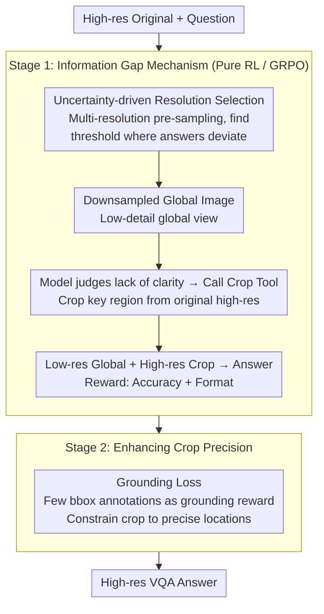

# LFPC: Learning to Focus and Precise Cropping for MLLMs

**Conference**: CVPR 2026  
**arXiv**: [2603.27494](https://arxiv.org/abs/2603.27494)  
**Code**: [https://github.com/XuanPu-Z/LFPC](https://github.com/XuanPu-Z/LFPC)  
**Area**: Multimodal VLM  
**Keywords**: Multimodal Large Language Models, Reinforcement Learning, Cropping Tool, Information Gap, High-Resolution VQA

## TL;DR

LFPC proposes a two-stage pure reinforcement learning framework that addresses the "answer-then-crop" fake tool usage problem in existing agent-based MLLMs. By using an "Information Gap" mechanism (reducing global image resolution to force dependency on high-resolution cropped regions) and grounding loss (enhancing cropping precision), it achieves SOTA performance on high-resolution VQA tasks.

## Background & Motivation

Fine-grained perception in complex visual scenes remains a challenge for MLLMs. Agent-based methods empower models with a "cropping tool" to actively zoom into regions of interest, but current training strategies suffer from critical issues.

**Core Finding**: The authors analyze RL-based models like DeepEyes and identify a concerning behavioral pattern—models form answers before executing the crop, using the cropping action merely to "confirm" preexisting conclusions. A specialized evaluation confirms this hypothesis: the models exhibit weak dependence on the content of the cropped regions.

**Key Challenge**: SFT+RL methods are limited by the upper bound of teacher model capabilities and the high cost of generating trajectories; while pure RL methods do not require teachers, the models often learn "performative" cropping behavior rather than truly utilizing the cropped information.

## Method

### Overall Architecture

LFPC addresses a counter-intuitive phenomenon: when MLLMs are equipped with cropping tools and trained via RL to "zoom in for details," they learn to guess the answer first and then randomly crop a region for appearances. The core idea of LFPC is to manipulate the input rather than the reward function—by making the global image "unclear," the model is forced to rely on the cropped region to answer correctly. The pipeline consists of two stages using pure RL (GRPO) without teacher trajectories: Stage 1 uses the "Information Gap" to transform cropping from optional to essential, with sample-specific blurring determined by "uncertainty-driven resolution selection"; Stage 2 employs minimal box annotations to refine cropping accuracy. Given a high-resolution image and a question, the model first identifies a lack of clarity in the downsampled global view, invokes the cropping tool to extract key regions from the original high-resolution image, and combines both views for the final answer.

### Key Designs

**1. Information Gap Mechanism: Making the global view "insufficient" to necessitate cropping**

This directly targets the "answer-then-crop" pain point. Previous methods provided full high-resolution images, making the global view sufficient for answering and rendering cropping performative. LFPC deliberately downsamples the input global image to create a low-detail view; however, if the model decides to crop, the region is extracted from the **original high-resolution** image, preserving all details. This creates an "Information Gap" between the low-res global and high-res local views—the answer is hidden in details visible only via cropping, forcing the model to genuinely utilize the cropping results. For example, in a high-res street view with multiple signs, a downsampled global view may be too blurry to read a distance sign, requiring the model to zoom in to provide the correct answer.

**2. Uncertainty-driven Resolution Selection: Sample-specific calibration of downsampling**

For the Information Gap to be effective, the degree of downsampling is critical: excessive blurring prevents comprehension, while insufficient blurring fails to force tool usage. LFPC allows the model to calibrate its own threshold by sampling answers across a range of resolutions to find the point where the answer **begins to diverge from high-resolution results**. This critical point defines the Information Gap boundary for each sample, ensuring the global view is just blurry enough to prevent an answer without losing overall scene context.

**3. Grounding Loss: Ensuring precise cropping placement**

Stage 1 ensures the model "wants" to depend on cropping, but the crop coordinates may not be precise. Stage 2 introduces a small number of bounding box annotations as grounding reward signals. The reward considers not only whether the tool was called but also whether the crop box aligns with the precise location relevant to the answer. This low-cost weak supervision refines the behavior from "cropping in that general direction" to "precisely framing the target."

### Loss & Training

The entire process uses pure RL based on the GRPO algorithm, independent of teacher-generated trajectories. The Stage 1 reward consists of accuracy and format rewards (under Information Gap inputs, accuracy rewards naturally drive the model toward genuine crop usage). Stage 2 adds a grounding reward based on few-shot box annotations to constrain cropping positions.

## Key Experimental Results

### Main Results

| Method | HR-Bench 4K | HR-Bench 8K | V* | Vision Tokens |
|------|------------|------------|-----|-----------|
| DeepEyes | 74.0 | 68.0 | 85.9 | 16384 |
| LFPC (16K tokens) | **SOTA** | **SOTA** | **SOTA** | 16384 |
| LFPC (1K tokens) | Outperforms most 16K | Outperforms most 16K | Competitive | **1024** |

LFPC achieves SOTA performance under both 16K and 1K vision token budgets.

### Ablation Study

| Configuration | Crop Dependency | Performance | Description |
|------|-----------|------|------|
| DeepEyes Baseline | Weak (Answer-then-crop) | Baseline | Cropping is a fake behavior |
| Stage 1 (Info Gap) | Strong | Significant Gain | Model genuinely utilizes crop info |
| Stage 1 + Stage 2 (Grounding) | Strong + Precise | SOTA | More accurate crop positioning |

### Key Findings

- The "Information Gap" mechanism fundamentally shifts the model's dependency on cropped regions from "confirmatory cropping" to "exploratory cropping."
- Under a 1K token budget, LFPC still outperforms some 16K token methods, suggesting that precise cropping is more important than high token volume.
- A small amount of bounding box annotations (Stage 2) yields significant improvements in cropping precision with minimal labeling cost.

## Highlights & Insights

- **Insightful Problem Diagnosis**: Identifying the "answer-then-crop" issue in RL-based agents and verifying it through specialized evaluation is a commendable research approach.
- **Clever Information Gap Design**: Inducing model behavior by controlling input information flow is more direct and effective than simply modifying reward functions. This principle is transferable to other agent tool-use scenarios.
- **Efficiency Advantages**: Surpassing 16K token methods with only 1K tokens proves that "what to look at precisely" is more critical than "how much to look at."

## Limitations & Future Work

- The resolution selection for the Information Gap requires pre-sampling, increasing preprocessing overhead.
- Currently, only single-step cropping is supported; multi-step iterative cropping might further improve performance.
- While minimal, the grounding loss still requires some level of annotation.
- Future work could explore agent scenarios with multiple tools (cropping, rotation, enhancement).

## Related Work & Insights

- **vs DeepEyes**: Both are pure RL methods, but LFPC addresses the fake cropping problem through the Information Gap mechanism.
- **vs SFT+RL Methods**: These require expensive teacher trajectories and are capped by teacher performance; LFPC is entirely teacher-independent.
- **vs Attention-guided Methods**: While attention maps identify important regions, they lack explicit cropping actions and guarantees of information utilization.

## Rating

- Novelty: ⭐⭐⭐⭐⭐ Insightful problem diagnosis and clever Information Gap design.
- Experimental Thoroughness: ⭐⭐⭐⭐ Strong benchmark performance, though further ablation details could be provided.
- Writing Quality: ⭐⭐⭐⭐ Clear motivation analysis and persuasive experimental findings.
- Value: ⭐⭐⭐⭐⭐ Significant implications for training tool-usage in agent-based MLLMs.

<!-- RELATED:START -->

## Related Papers

- [\[CVPR 2026\] Chart-FR1: Visual Focus-Driven Fine-Grained Reasoning on Dense Charts](chart-fr1_visual_focus-driven_fine-grained_reasoning_on_dense_charts.md)
- [\[CVPR 2026\] SPARROW: Learning Spatial Precision and Temporal Referential Consistency in Pixel-Grounded Video MLLMs](sparrow_learning_spatial_precision_and_temporal_referential_consistency_in_pixel.md)
- [\[CVPR 2026\] TempR1: Improving Temporal Understanding of MLLMs via Temporal-Aware Multi-Task Reinforcement Learning](tempr1_improving_temporal_understanding_of_mllms_via_temporal-aware_multi-task_r.md)
- [\[CVPR 2026\] R-4B: Incentivizing General-Purpose Auto-Thinking in MLLMs via Bi-Mode Annealing and Reinforce Learning](r-4b_incentivizing_general-purpose_auto-thinking_in_mllms_via_bi-mode_annealing_.md)
- [\[CVPR 2026\] Venus: Benchmarking and Empowering Multimodal Large Language Models for Aesthetic Guidance and Cropping](venus_benchmarking_and_empowering_multimodal_large_language_models_for_aesthetic.md)

<!-- RELATED:END -->
