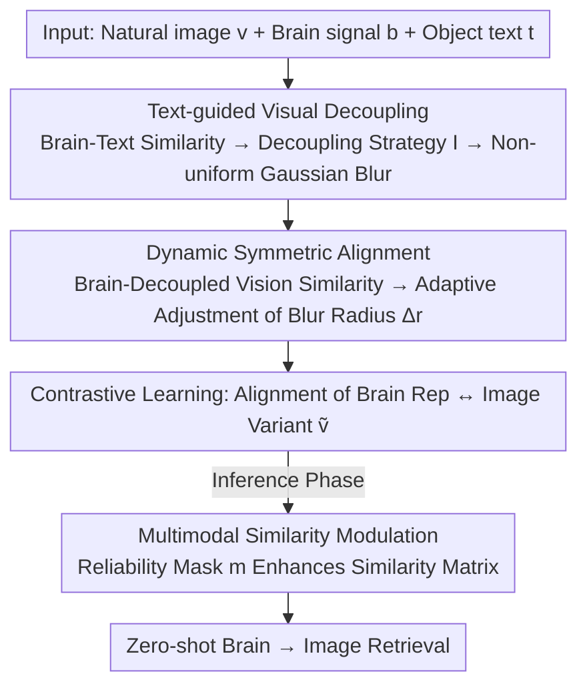

# Linguistic Priors for Visual Decoupling: Towards Symmetric Vision-Brain Alignment

**Conference**: CVPR 2026  
**Paper**: [CVF Open Access](https://openaccess.thecvf.com/content/CVPR2026/html/Liu_Linguistic_Priors_for_Visual_Decoupling_Towards_Symmetric_Vision-Brain_Alignment_CVPR_2026_paper.html)  
**Code**: https://github.com/TKQXX/BVSA  
**Area**: Multimodal VLM / Brain-Visual Decoding  
**Keywords**: Brain-Visual Decoding, Vision-Brain Alignment, Linguistic Priors, Visual Decoupling, Contrastive Learning

## TL;DR
Aiming at the "semantic information asymmetry" between brain signals and natural images, this work utilizes object-level text descriptions as linguistic priors to explicitly decouple foreground objects from background regions in images. This transforms asymmetric vision-brain alignment into symmetric semantic alignment, achieving new SOTA in zero-shot brain-to-image retrieval on THINGS-EEG / THINGS-MEG.

## Background & Motivation
**Background**: Brain visual decoding aims to identify or reconstruct visual content from brain signals such as EEG/MEG. Mainstream approaches utilize self-supervised contrastive learning to encode images and brain signals into a shared space, maximizing the similarity of paired samples (e.g., NICE, ATM-S, UBP) to establish vision-brain correspondences.

**Limitations of Prior Work**: These methods directly align "entire images" with "entire brain signal segments," ignoring the fundamental information mismatch between the two. Natural images contain both task-relevant central foreground objects and substantial task-irrelevant background regions. Conversely, in brain signals collected via the RSVP paradigm, despite subjects focusing on central targets, recorded signals are contaminated with task-irrelevant neural noise (individual physiological noise, attention fluctuations).

**Key Challenge**: Background redundancy on the image side and noise pollution on the brain signal side create bidirectional information redundancy. Direct alignment tends to learn spurious correlations—the model might establish correspondences based on background or noise rather than truly focusing on target objects, leading to semantic bias in the alignment.

**Goal**: To transform this asymmetric alignment into "symmetric semantic alignment," ensuring the model only aligns the target object semantics truly carried by both modalities at the feature level.

**Key Insight**: This work draws on the **dual-coding theory** from cognitive neuroscience—concrete concepts in the brain are represented simultaneously through visual and linguistic channels. Linguistic priors can shape and reinforce semantic representations derived from vision. Since object semantics in brain signals can be "cross-checked" by language, text can serve as a "judge" to determine the clarity of object semantics within the brain signals.

**Core Idea**: Introduce object-oriented text descriptions (e.g., "A photo of a [category]") as linguistic priors. Based on the similarity between brain signals and text, central objects in the image are dynamically decoupled from complex scenes, achieving symmetric alignment of the "target object" across both vision and brain modalities.

## Method

### Overall Architecture
The method addresses the alignment asymmetry caused by "image background redundancy and brain signal noise." The approach involves: first using text as a linguistic prior to evaluate the clarity of object semantics in brain signals, then decoupling the image into a variant with a "clear center and blurred periphery" based on this evaluation. The brain representation is then aligned with this decoupled image variant. Finally, during inference, retrieval similarity is further enhanced using text semantics. Inputs are image $v$, brain signal $b$, and object text $t$; the output is zero-shot brain-to-image retrieval results.

The visual encoder $G_V$ uses pre-trained CLIP (RN50/RN101/ViT-B/16/ViT-B/32 in experiments), while the brain encoder $G_B$ is trained from scratch. The basic training objective is the symmetric vision-brain contrastive loss $\mathcal{L} = \mathcal{L}_{V\text{-}B} + \mathcal{L}_{B\text{-}V}$, where $\mathcal{L}_{V\text{-}B} = -\log \frac{\exp(\phi(\mathbf{h}_v,\mathbf{h}_b)/\tau)}{\sum_{j}\exp(\phi(\mathbf{h}_v,\mathbf{h}_{b_j})/\tau)}$, $\phi$ denotes cosine similarity, and $\tau$ is the temperature.

### Key Designs

**1. Text-guided Visual Decoupling: Determining "how much central region to decouple" via Brain-Text Similarity**

This addresses the "background redundancy" on the image side. The authors avoid hard segmentation (binary foreground/background cutting) because human brain visual processing is not binary—the RSVP paradigm directs subjects to the image center, and the human fovea has the highest resolution, which decreases toward the periphery. Text description $t$ acts as a judge: compute $s_{bt}=\phi(G_B(b),G_T(t))$. Higher similarity indicates clearer object semantics in brain signals, warranting more preservation of the center and stronger decoupling. Specifically, $s_{bt}$ within a batch is approximated as a normal distribution $\mathcal{N}(\mu,\delta^2)$. Mean $\hat\mu$ and unbiased variance $\hat\delta^2$ are estimated via uncertainty quantification to construct a confidence interval $[\hat\mu - z_{\alpha/2}\hat\delta,\ \hat\mu + z_{\alpha/2}\hat\delta]$. The decoupling strategy is defined based on the position of sample $s_{bt}$:

$$\mathbb{I}=\begin{cases}1, & s_{bt}<\hat\mu - z_{\alpha/2}\hat\delta \\ -1, & s_{bt}>\hat\mu + z_{\alpha/2}\hat\delta \\ 0, & \text{otherwise}\end{cases}$$

An image variant $\tilde v = \mathbf{W}\odot v + (\mathbf{1}-\mathbf{W})\odot\mathcal{G}(v,\sigma)$ is synthesized using **non-uniform Gaussian blur**, where the spatial weight matrix decays with distance from the center and is modulated by $\mathbb{I}$: $\mathbf{W}(i,j)=(0.5-\mathbb{I}\cdot c)\cdot\exp\!\big(-\frac{\lambda\|(i,j)-(i_0,j_0)\|_2}{D}\big)$, where $(i_0,j_0)$ is the image center, $D$ is the maximum distance, and $c\in[0,0.5]$ adjusts central blur. When $\mathbb{I}=-1$, the center is sharper and the periphery is blurrier, effectively "decoupling" the central object at the feature level.

**2. Dynamic Symmetric Alignment: Fine-tuning Blur Radius via Brain-Visual Similarity**

Decoupling the image alone is insufficient, as the brain signal itself may not encode complete visual details. This step further evaluates the extent to which the brain signal carries the "decoupled visual features" $G_V(\tilde v)$ by computing $s_{bv}=\phi(G_B(b),G_V(\tilde v))$. Similarly, a confidence interval is built using a normal approximation. For outlier samples falling outside the interval, the final blur radius $r$ is dynamically adjusted through incremental changes ($\Delta r$). This adaptively narrows the information gap between the brain signal and the decoupled visual object, resulting in more robust symmetric matching. This works in tandem with Design 1: Design 1 decouples based on "how much the image should be blurred," while Design 2 adjusts based on "how many visual details the brain signal can support." Together, they drive the alignment toward symmetry.

**3. Multimodal Similarity Modulation: Boosting Retrieval via Reliable Brain-Text Semantics during Inference**

The trained framework further leverages linguistic benefits during inference. Given a batch of brain representations $\mathbf{H}_b$, visual representations $\mathbf{H}_v$, and text representations $\mathbf{H}_t$, the visual similarity matrix $\mathbf{M}_{bv}=\mathbf{H}_b\mathbf{H}_v^\top$ and semantic similarity matrix $\mathbf{M}_{bt}=\mathbf{H}_b\mathbf{H}_t^\top$ are computed. Taking the diagonal of $\mathbf{M}_{bt}$ yields semantic scores $s_{bt}=\mathrm{diag}(\mathbf{M}_{bt})$ for each brain-text pair. The confidence interval lower bound $s_{th}=\hat\mu_{bt}-z_{\alpha/2}\hat\delta_{bt}$ is estimated to construct a binary reliability mask $m_i=\mathbb{1}[s_{bt}^{(i)}\ge s_{th}]$. Finally, semantic enhancement is performed: $\mathbf{M}_{\text{enhanced}}=\mathbf{M}_{bv}+\mathbf{m}\mathbf{m}^\top\odot\mathbf{M}_{bv}\odot\mathbf{M}_{bt}$. The core idea: when a brain response is judged semantically reliable ($m_i=1$), its visual similarity with the corresponding image is amplified by semantic consistency—"amplifying reliable samples and suppressing noisy ones," enhancing the ability to capture key visual semantics from brain signals.

### Loss & Training
The basic objective is the symmetric vision-brain contrastive loss $\mathcal{L}=\mathcal{L}_{V\text{-}B}+\mathcal{L}_{B\text{-}V}$. Brain and image features are projected into a shared space (dimension determined by the image encoder). The optimizer is AdamW, batch size 1024, learning rate $1\times10^{-4}$, weight decay $1\times10^{-4}$. Temperature parameters are optimized directly as learnable scaling factors, consistent with CLIP. Hyperparameters: $c=0.5$, significance level 10%. Training for 50 epochs on a single RTX 3080.

## Key Experimental Results

### Main Results
200-way zero-shot brain-to-image retrieval on THINGS-EEG (10 subjects) and THINGS-MEG (4 subjects). Metrics are Top-1 / Top-5 retrieval accuracy (%, higher is better).

| Setting | Dataset | Metric | Ours | Prev. SOTA (UBP) | Gain |
|--------|------|------|------|----------|------|
| Intra-subject | THINGS-EEG | Top-1 / Top-5 | 58.2 / 89.1 | 50.9 / 79.7 | +7.3 / +9.4 |
| Inter-subject | THINGS-EEG | Top-1 / Top-5 | 15.8 / 39.4 | 12.4 / 33.4 | +3.4 / +6.0 |
| Intra-subject | THINGS-MEG | Top-1 / Top-5 | 32.5 / 62.9 | 26.7 / 55.2 | +5.8 / +7.7 |
| Inter-subject | THINGS-MEG | Top-1 / Top-5 | 5.4 / 13.6 | 2.2 / 10.4 | +3.2 / +3.2 |

*Note: Intra-subject refers to single-subject training and testing; Inter-subject refers to leave-one-subject-out cross-subject generalization (highly difficult, hence lower absolute values). The two settings should not be compared directly.*

### Ablation Study
Gradual addition of modules on THINGS-EEG (average Top-1 / Top-5):

| Configuration | Top-1 / Top-5 | Description |
|------|---------|------|
| Vanilla | 43.6 / 77.0 | Pure contrastive learning baseline |
| + Decouple | 54.9 / 87.7 | Added text-guided visual decoupling (+11.3 Top-1) |
| + Dynamic | 55.6 / 87.5 | Added dynamic symmetric alignment |
| + Enhancement (Full) | 58.2 / 89.1 | Added multimodal similarity modulation |

Sensitivity of central blur coefficient $c$ (THINGS-EEG, average):

| $c$ | Top-1 / Top-5 |
|------|---------|
| 0.1 | 56.2 / 86.5 |
| 0.2 | 56.8 / 88.1 |
| 0.3 | 56.7 / 88.3 |
| 0.5 (Default) | 58.2 / 89.1 |

### Key Findings
- The largest contribution comes from **text-guided visual decoupling**: jumping from Vanilla (43.6) to 54.9 (+11.3 Top-1) indicates that "decoupling before alignment" is the primary performance source, with the other two modules providing incremental gains of 0.7 and 2.6.
- Improvement on EEG (high temporal resolution) is more significant than on MEG. Although absolute values in cross-subject (inter-subject) scenarios are low, the model consistently outperforms UBP, demonstrating that symmetric alignment via linguistic priors has cross-subject generalization value.
- Robustness to hyperparameter $c$ is observed, with Top-1 only fluctuating between 56.2 and 58.2 for values 0.1 to 0.5.

## Highlights & Insights
- **Redefining brain visual decoding through "information asymmetry"**: Moving beyond competing on encoders or contrastive losses, this work identifies bidirectional asymmetry caused by image background redundancy and brain signal noise as the true bottleneck—a novel perspective.
- **Text as a "Judge" rather than an "Input"**: Text is not directly fed into the model for alignment; instead, brain-text similarity indirectly determines the intensity of image decoupling. This use of "linguistic priors to modulate visual processing" can be transferred to any cross-modal task requiring adaptive processing based on sample credibility.
- **Soft decoupling outperforms hard segmentation**: Non-uniform Gaussian blur (sharp center, blurred periphery) explicitly simulates foveal characteristics, offering a more biologically plausible approach for brain cognition than binary foreground/background segmentation. This trick is valuable for any "center-focus" paradigm data.

## Limitations & Future Work
- The method relies heavily on the RSVP "center-focus" paradigm and object-oriented text descriptions. Its validity for non-central attention, multi-object, or scene-level stimuli remains unverified.
- Absolute accuracy in cross-subject scenarios remains low (MEG inter-subject Top-1 is only 5.4%), indicating a gap before practical BCI application.
- The decoupling strategy $\mathbb{I}$ is currently discrete ($-1/0/1$) and depends on normal distribution assumptions within a batch for confidence interval estimation. This estimation might be unstable with small batches or skewed distributions; smoother continuous decoupling weights could be considered.
- ⚠️ Several formulas were derived with high contextual confidence; implementation should refer to official code (BVSA) to verify weight matrices and enhancement formula details.

## Related Work & Insights
- **vs UBP**: UBP uses uncertainty-aware "blur priors" to reduce systematic differences in brain-image representations through direct alignment. This work also employs uncertainty quantification but uses it to determine confidence intervals for brain-text similarity, driving text-guided visual decoupling. "Blurring" evolved from a heuristic regularizer to a semantically controlled symmetric alignment mechanism, significantly outperforming UBP.
- **vs NICE / ATM-S**: These rely on pure vision-brain contrastive learning or adaptive brain encoders while ignoring information asymmetry. This work introduces a linguistic channel for semantic symmetrization, marking a fundamental difference in motivation.
- **vs BraVL**: BraVL uses brain/vision/language trimodality with mutual information regularization, treating text as a third-party alignment target. In this paper, text is a "modulator" used to dynamically determine visual decoupling intensity, representing a different functional positioning.

## Rating
- Novelty: ⭐⭐⭐⭐⭐ Reframing brain visual decoding as "information asymmetry" and using linguistic priors for symmetrization is highly novel.
- Experimental Thoroughness: ⭐⭐⭐⭐ Two datasets + intra/inter settings + module-wise ablation + hyperparameter analysis, though it only covers retrieval without quantitative evaluation of reconstruction visualization.
- Writing Quality: ⭐⭐⭐⭐ Clear motivation chain, effective diagrams, though mathematical density is high.
- Value: ⭐⭐⭐⭐ Refreshing SOTA with transferrable linguistic prior modulation, though cross-subject absolute accuracy is still far from practical use.

<!-- RELATED:START -->

## Related Papers

- [\[AAAI 2026\] Recursive Visual Imagination and Adaptive Linguistic Grounding for Vision Language Navigation](../../AAAI2026/multimodal_vlm/recursive_visual_imagination_and_adaptive_linguistic_grounding_for_vision_langua.md)
- [\[AAAI 2026\] Aligning the True Semantics: Constrained Decoupling and Distribution Sampling for Cross-Modal Alignment](../../AAAI2026/multimodal_vlm/aligning_the_true_semantics_constrained_decoupling_and_distr.md)
- [\[CVPR 2026\] EgoMind: Activating Spatial Cognition through Linguistic Reasoning in MLLMs](egomind_activating_spatial_cognition_through_linguistic_reasoning_in_mllms.md)
- [\[CVPR 2026\] β-CLIP: Text-Conditioned Contrastive Learning for Multi-Granular Vision-Language Alignment](b-clip_text-conditioned_contrastive_learning_for_multi-granular_vision-language_.md)
- [\[CVPR 2026\] Boosting Visual Reprogramming for CLIP with Dual Granularity Alignment](boosting_visual_reprogramming_for_clip_with_dual_granularity_alignment.md)

<!-- RELATED:END -->
