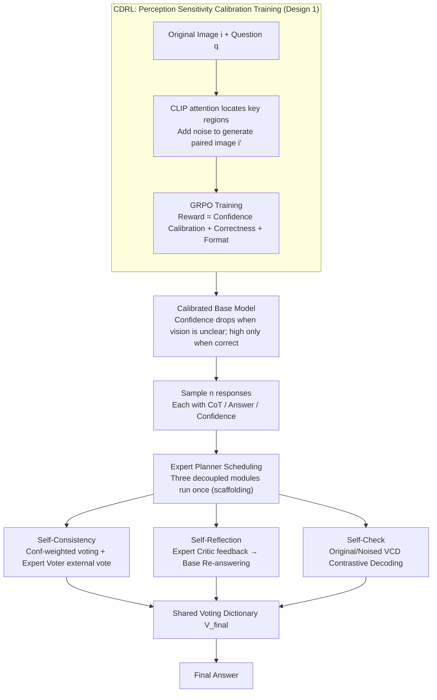

# Linking Perception, Confidence and Accuracy in MLLMs

**Conference**: CVPR 2026  
**arXiv**: [2603.12149](https://arxiv.org/abs/2603.12149)  
**Code**: [https://github.com/anotherbricki/CA-TTS](https://github.com/anotherbricki/CA-TTS)  
**Area**: Multimodal VLM  
**Keywords**: Multimodal Large Language Models, Confidence Calibration, Reinforcement Learning, Test-Time Scaling, Visual Perception

## TL;DR
The study reveals severe confidence miscalibration in MLLMs (where accuracy plunges during visual input degradation but confidence remains unchanged). It proposes CDRL (Confidence-Driven RL based on original-noise image pairs) for perception sensitivity training and utilizes the calibrated confidence to implement Adaptive Test-Time Scaling (CA-TTS), achieving an average improvement of 8.8% across four benchmarks.

## Background & Motivation
In recent years, MLLM research has primarily focused on enhancing visual perception to improve accuracy, yet a critical question remains overlooked: **Does the model know when it does not know?**

The authors designed a probing experiment by incrementally adding noise to key visual evidence while observing changes in model confidence and accuracy. The results revealed that while accuracy dropped significantly, confidence remained nearly unchanged. This exposes a severe confidence miscalibration in MLLMs—models maintain high confidence even when visual perception is severely degraded.

Existing confidence calibration methods for LLMs operate at the token level, whereas MLLM visual perception is global (persisting throughout the response), resulting in a granularity mismatch. Furthermore, LLM calibration methods do not account for the influence of visual components.

Core ideas: (1) Train RL using original-noise image pairs, enhancing perception sensitivity via confidence difference rewards while achieving calibration through accuracy-confidence alignment rewards. (2) The calibrated confidence naturally serves as a routing signal for test-time scaling—a "free lunch," as calibration itself provides TTS capabilities.

## Method

### Overall Architecture
This paper addresses the miscalibration problem where MLLMs remain confident despite "not seeing clearly," turning the calibrated confidence into a scheduling signal during inference. The framework consists of two stages: training via CDRL to make the model sensitive to visual degradation and highly confident only when correct; and inference via CA-TTS, which treats the calibrated confidence as a routing signal to adaptively schedule three decoupled verification modules. Specifically, CDRL first uses GRPO on "original-noise" image pairs to ensure confidence fluctuates based on the quality of visual evidence. During inference, the base model samples multiple responses, and three modules—Self-Consistency, Self-Reflection, and Self-Check—each produce votes, which are finally aggregated into the answer, coordinated by an Expert Model acting as Planner, Voter, and Critic.

### Key Designs

**1. Confidence-Driven Reinforcement Learning (CDRL): Teaching the model "don't be confident if you can't see"**

The probing experiment identified a "blindness" to visual degradation. CDRL uses CLIP attention maps to find key visual regions and adds noise to generate paired images $(i, i')$, running the same question on both "clean" and "degraded" versions. Confidence is measured via Negative Mean Log-Probability of the full sequence: $C = \frac{1}{T}\sum_{t=1}^T \text{Conf}_{\text{token}_t}$, where $\text{Conf}_{\text{token}} = -\frac{1}{k}\sum_{i=1}^k \log p_{(i)}$, where lower values indicate higher certainty. The reward is split into two terms:

$$R_{\text{Conf},j} = \underbrace{\alpha \tanh(\beta \cdot \Delta C)}_{\text{Perception Term}} + \underbrace{(2 \cdot R_{\text{Output},j} - 1) \cdot C_j^{norm}}_{\text{Calibration Term}}$$

The Perception Term rewards the confidence gap $\Delta C = C_j - C_j'$ between the original and noise images, forcing the model to be sensitive to visual degradation. The Calibration Term aligns confidence with correctness—rewarding high confidence for correct answers ($+C_j$) and penalizing high confidence for incorrect ones ($-C_j$).

**2. Self-Consistency: Allowing "confidently correct answers" to have higher weight**

Once calibrated, confidence is used as a voting weight. After sampling $n$ responses, internal votes are accumulated based on confidence: $V_{internal}[k] = \sum_{i=1}^n C_i \cdot \mathbb{I}(A_i = k)$. Additionally, an Expert Model acts as a Voter to provide an independent external confidence $C_{expert}$, which is combined with internal votes: $V_{final}[k] = V_{internal}^{norm}[k] + \tau_1 \cdot c_k$.

**3. Self-Reflection: Using external criticism to correct low-confidence predictions**

If a prediction has low confidence, it suggests the model is uncertain. An Expert Model acts as a Critic to generate a critique $Crit = M_{expert}^{Critic}(i, q, P_{critique})$, which is fed back into the base model to re-answer: $(CoT_{reflect}, A_{reflect}) = M_{base}(i, q, Crit)$. The reflected answer is added to the vote with weight $\tau_2$.

**4. Self-Check: Debunking "false confidence" at the visual level**

This step uses Visual Contrastive Decoding (VCD) to compare outputs from the original and noise images: $\log P_{VCD}(y|i,q) = (1+\alpha) \cdot \log P_\theta(y|i,q) - \alpha \cdot \log P_\theta(y|i',q)$. This amplifies real visual signals while suppressing "hallucinated confidence" that persists even in noised images. The resulting answer is added to the vote with weight $\tau_3$.

### Loss & Training
Using GRPO training, the total reward is $r_j = R_{\text{Conf},j} + R_{\text{Output},j} + R_{\text{Format},j}$. The base model is Qwen2.5-VL-7B-Instruct, fine-tuned on 8×H100 GPUs with 1,936 samples. The Expert Model is Gemini-2.5-Pro, with inference weights set to $\tau_1=\tau_2=\tau_3=0.5$.

## Key Experimental Results

### Main Results

| Method | Math-Vista | Math-Vision | MMStar | MMMU |
|------|-----------|------------|--------|------|
| Pass@1 (base) | 64.7 | 23.0 | 60.2 | 48.8 |
| Majority Voting | 69.8 | 30.1 | 69.0 | 57.5 |
| VL-Rethinker | 74.1 | 30.7 | 63.4 | 55.6 |
| We-Think | 73.3 | 29.7 | 65.1 | 55.7 |
| **Ours (CDRL+CA-TTS)** | **79.5** | **42.4** | **71.3** | **66.3** |

### Ablation Study

| Configuration | Math-Vision ALL | Description |
|------|----------------|------|
| Training-Free (Pass@1) | 22.96 | Baseline |
| CDRL only | 26.38 | Better calibrated state |
| CA-TTS only | 37.99 | Significant TTS improvement |
| CDRL + CA-TTS | **42.35** | Optimal synergy |

### Key Findings
- After CDRL training, the model's confidence drop during visual perturbation increased by 4-8x (e.g., Noised: -0.32 → -1.39), showing it truly "knows what it doesn't know."
- The scaling slope of CA-TTS ($\beta_1 = 3.65$) is 2.2x that of Majority Voting (1.64), indicating that calibrated confidence makes TTS more efficient.
- Even using Qwen2.5-VL-7B itself as the Expert provides significantly better results than Majority Voting.
- On MMMU, the model achieved 66.3% vs. VL-Rethinker's 55.6%, a gain of 10.7 percentage points.

## Highlights & Insights
- The probing experiment regarding "knowing when it doesn't know" provides a powerful and intuitive revelation of core MLLM flaws.
- The dual-reward design of CDRL is elegant: the Perception Term uses image pairs to enhance sensitivity, while the Calibration Term aligns confidence with accuracy.
- "Calibrated confidence is a free lunch"—training-time calibration translates directly into inference-time TTS capability without extra cost.
- The three modules of CA-TTS are fully decoupled and order-independent, making the architecture flexible and robust.

## Limitations & Future Work
- CA-TTS relies on an Expert Model (e.g., Gemini-2.5-Pro), introducing external API costs and latency.
- Training data was limited to 1,936 samples; scaling this up could further improve calibration quality.
- Self-Check's VCD requires additional inference on noise images, increasing computational overhead.
- The voting weights $\tau_1, \tau_2, \tau_3$ are currently fixed; adaptive weighting might be superior.

## Related Work & Insights
- DeepConf uses confidence for TTS but only for mathematical reasoning and lacks calibration training; this work completes the training loop.
- VCD, originally for mitigating hallucination, is integrated into the TTS framework as a visual self-check module.
- Compared to tree-search methods like ToT, the decoupled multi-stage verification in CA-TTS is more robust against single points of failure.

## Rating
- Novelty: ⭐⭐⭐⭐⭐ First systematic study of MLLM visual perception-confidence calibration; CDRL+CA-TTS framework is highly original.
- Experimental Thoroughness: ⭐⭐⭐⭐⭐ Comprehensive across four benchmarks, multiple ablations, scaling curve analysis, and sensitivity experiments.
- Writing Quality: ⭐⭐⭐⭐ Engaging introduction via probing experiments; framework descriptions are clear.
- Value: ⭐⭐⭐⭐⭐ Addresses fundamental MLLM issues with a systematic solution, yielding a major 8.8% average improvement.

## Key Terms
- **NMLP (Negative Mean Log-Probability)**: A sequence-level confidence measure; lower values mean higher certainty.
- **Perceptual Bluntness**: The phenomenon where a model is insensitive to the degradation of visual input.
- **VCD (Visual Contrastive Decoding)**: Decoding by contrasting logit differences between original and noised images.
- **Free Lunch**: The inherent improvement in TTS capability gained "for free" through calibration training.

<!-- RELATED:START -->

## Related Papers

- [\[CVPR 2026\] CodePercept: Code-Grounded Visual STEM Perception for MLLMs](codepercept_code-grounded_visual_stem_perception_for_mllms.md)
- [\[CVPR 2026\] CICA: Coupling Confidence-Aware Pretraining with Confidence-Informed Attention for Robust Multimodal Sentiment Analysis](cica_coupling_confidence-aware_pretraining_with_confidence-informed_attention_fo.md)
- [\[CVPR 2026\] MVLM: Template-Free Tracking via Vision-Language Margin Confidence and Memory-Gated Tracking](mvlm_template-free_tracking_via_vision-language_margin_confidence_and_memory-gat.md)
- [\[CVPR 2026\] DEVA: Fine-tuning Multimodal Large Language Models for Visual Perception Tasks](deva_fine-tuning_multimodal_large_language_models_for_visual_perception_tasks.md)
- [\[ICML 2026\] ACTIVE-o3: Empowering MLLMs with Active Perception via Pure Reinforcement Learning](../../ICML2026/multimodal_vlm/active-o3_empowering_mllms_with_active_perception_via_pure_reinforcement_learnin.md)

<!-- RELATED:END -->
