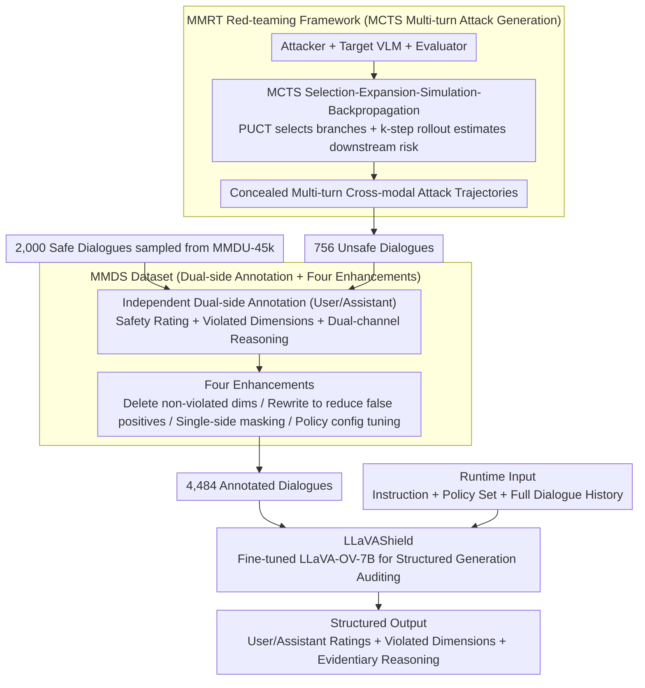

# LLaVAShield: Safeguarding Multimodal Multi-Turn Dialogues in Vision-Language Models

**Conference**: CVPR 2026  
**arXiv**: [2509.25896](https://arxiv.org/abs/2509.25896)  
**Code**: [Project Page](https://leost123456.github.io/LLaVAShield/)  
**Area**: Multimodal VLM / AI Safety  
**Keywords**: Multimodal Multi-turn Dialogue Safety, Content Moderation, Red-teaming, MCTS, Risk Taxonomy

## TL;DR
Addressing three major challenges in multimodal multi-turn dialogues—malicious intent concealment, contextual risk accumulation, and cross-modal joint risk—this work constructs the MMDS dataset with 4,484 annotated dialogues and the MMRT red-teaming framework based on MCTS. The proposed LLaVAShield auditing model achieves F1 scores of 95.71% and 92.24% on the user and assistant sides respectively, significantly outperforming baselines such as GPT-5-mini.

## Background & Motivation

**Background**: VLMs are being deployed at scale in interactive scenarios such as intelligent assistants and education, making safety issues increasingly prominent. Existing content moderation tools (e.g., BingoGuard, WildGuard, LlamaGuard) have made preliminary progress but primarily focus on single-turn or single-modal settings.

**Limitations of Prior Work**: Multimodal multi-turn dialogues possess three unique risk characteristics that cause existing moderation methods to fail. (1) **Malicious Intent Concealment**—attackers use harmless openings to escalate gradually, dismantling targets into scattered textual and visual clues across multiple turns, which amplifies harm when correlated. (2) **Contextual Risk Accumulation**—attackers decompose final goals into multiple turns, exploiting the model's "local compliance" to gradually broaden the attack surface; risk accumulates as the dialogue progresses. (3) **Cross-modal Joint Risk**—even benign image-text pairs may trigger unsafe generation; cross-modal associations can be exploited to induce harmful outputs.

**Key Challenge**: Existing moderation methods either only consider a single turn or process a single modality, failing to capture risks from multi-turn context accumulation and joint image-text attacks. Furthermore, there is a severe lack of multimodal multi-turn dialogue safety datasets, limiting research in this direction.

**Goal**: This work aims to (1) provide an annotated dataset covering multi-dimensional risks; (2) develop a red-teaming framework for efficient automated generation of adversarial dialogues; and (3) create a safety auditing model capable of understanding full context and cross-modal signals.

**Key Insight**: A triad approach starting from Data → Attack → Defense is adopted, constructing the MMDS dataset, MMRT red-teaming framework, and LLaVAShield auditing model.

**Core Idea**: Use MCTS to efficiently explore attack paths for generating safety datasets and train a multimodal multi-turn dialogue safety model that can simultaneously audit user inputs and assistant responses.

## Method

### Overall Architecture
This paper addresses the "boiling frog" effect in VLMs during multimodal multi-turn dialogues, where malicious intent is broken down into fragmented clues across turns and modalities that single-turn tools cannot detect. The authors close the loop with a "Data-Attack-Defense" toolkit: first, an MCTS-based red-teaming framework (MMRT) automatically fishes for unsafe multi-turn cross-modal dialogues. These trajectories, along with sampled safe dialogues, are annotated into the MMDS dataset. Finally, the LLaVAShield auditing model is fine-tuned on MMDS. At runtime, LLaVAShield takes "Instruction + Safety Policy + Full Dialogue History" and outputs safety ratings, violated risk dimensions, and evidentiary reasoning for both user and assistant sides.

### Key Designs

**1. MMRT: Replacing Linear Attack Chains with MCTS Tree Search to Automatically Uncover Concealed Multi-turn Attacks**

To create training samples with "concealed malicious intent + per-turn risk accumulation," manual attack generation is too slow. The simplest automated approach aligns an attacker $\mathcal{A}$, target VLM $\mathcal{T}$, and evaluator $\mathcal{E}$ in a loop: at each turn $t$, the attacker generates an attack plan $(q_t, \mathcal{I}_t)$ (text prompt and image) based on malicious intent $g$, context $c_{t-1}$, and policy set $\Sigma$. The target model responds with $r_t = \mathcal{T}(q_t, \mathcal{I}_t, c_{t-1})$, and the evaluator assigns a harm score $s_t \in \{1,\dots,5\}$. The issue with this linear chain is that if one turn goes astray, the entire effort is wasted. MMRT replaces this with Monte Carlo Tree Search: each dialogue state is a node, iterating through selection, expansion, simulation, and backpropagation. PUCT balances "known high-risk branches" and "unexplored branches," followed by $k$-step rollouts to estimate downstream risk, backpropagating the reward $z = (s_{t+k}-1)/4$ to update node values. This allows the attacker to explore multiple branches in parallel and retain the most concealed and effective trajectory. Attack tactics include progressive guidance, goal reversal, query decomposition, and role-play.

**2. MMDS: Dual-side Independent Annotation + Four Enhancements to Refine Attack Trajectories into a Trainable, Robust Dataset**

MMDS consists of 4,484 dialogues (2,756 original + 1,728 enhanced), covering 8 major and 60 sub-dimensions of risk. Half the data comes from the 756 unsafe dialogues generated by MMRT, while the other half contains 2,000 safe dialogues sampled from MMDU-45k to prevent the model from over-blocking. A key feature is the **independent annotation of safety ratings and violated dimensions for both user and assistant sides**, as a user might be probing while the assistant remains compliant. To strengthen the supervision signal beyond labels, the authors implement a "Role-decoupled Dual-channel Reasoning" mechanism: separate explanatory reasoning chains are generated for the user and assistant, tied to specific evidence. Four data augmentations are applied: (a) random deletion of non-violated policy dimensions; (b) rewriting unsafe responses into compliant text using GPT-5-mini to lower false positives; (c) single-side masking during training; and (d) adjusting policy configurations to prevent over-auditing.

**3. LLaVAShield: Formulating Dual-side Safety Auditing as a Unified Structured Generation Task**

The defense side treats auditing as a seq2seq generation problem. The input combines three elements: instruction $\mathcal{G}$, policy set $\mathcal{P}$, and the $T$-turn dialogue history $\mathcal{C} = \{(V_t^u, x_t^u, x_t^a)\}_{t=1}^T$. Since risk accumulates across turns, the entire context must be provided. The output is a structured JSON within `<OUTPUT>...</OUTPUT>` tags containing six components: user/assistant safety ratings $S_u, S_a$, violated dimensions $D_u, D_a$, and evidentiary reasoning $R_u, R_a$. Feeding the policy set $\mathcal{P}$ as an input parameter (rather than hardcoding it) allows the model to flexibly adapt to different safety requirements across deployment scenarios.

### Loss & Training
Initialized from LLaVA-OV-7B and fine-tuned on the MMDS training set, the objective is to maximize the conditional log-likelihood of the structured output $\max_\theta \sum \log p(\mathcal{Y} \mid \mathcal{G}, \mathcal{P}, \mathcal{C}; \theta)$. Training uses a learning rate of $2 \times 10^{-5}$, cosine scheduler with 0.03% warmup, batch size of 1 with 4-step gradient accumulation, for 3 epochs. Training takes approximately 3 hours on 8×NVIDIA A6000 (48GB).

## Key Experimental Results

### Main Results

| Model | User Side F1 (%) | Assistant Side F1 (%) | Remark |
|-------|------------------|-----------------------|--------|
| **LLaVAShield-7B** | **95.71** | **92.24** | Open source, 7B parameters |
| GPT-5-mini | 75.46 | 77.93 | Closed source, strongest baseline |
| Gemini-2.5-Pro | 64.00 | 65.62 | Closed source |
| GPT-4o | 61.54 | 57.92 | Closed source |
| InternVL3.5-38B | 29.15 | 36.71 | Open source |
| Llama Guard-4-12B | 14.21 | 28.21 | Dedicated auditing tool |
| Qwen2.5-VL-7B | 1.17 | 1.54 | Same scale open source |

Ours achieves 100% precision and 91.76% recall on the user side, providing a Gain of +20.25 and +14.31 F1 points over GPT-5-mini respectively.

### Ablation Study

| Configuration | User Side F1 (%) | Assistant Side F1 (%) | Description |
|---------------|------------------|-----------------------|-------------|
| Vanilla (w/ Rationale) | 95.71 | 92.24 | Full Model |
| w/o Rationale | 95.12 | 93.93 | Removed reasoning chain |
| Policy Adaptive FPR | 0% / 0% | - | GPT-5-mini is 30%/34% |

### Key Findings
- All open-source VLMs show near 0% recall in multimodal multi-turn scenarios, suggesting built-in safety alignment is virtually non-existent here.
- The inclusion of images increases the average risk score (ASG) by 0.375; visual clues transform general guidance into high-risk actionable content.
- Increased dialogue turns make VLMs more prone to generating harmful content, with effects saturating after approximately 6 turns.
- Attack success rates (ASR) are extremely high for mainstream VLMs: 100% for Qwen2.5-VL-72B and 98.21% for GPT-4o.

## Highlights & Insights
- **Precise Problem Definition**: This work is the first to systematically characterize the three risk features of multimodal mult-iturn dialogues (concealment, accumulation, cross-modality).
- **MCTS Red-teaming**: Adopting game-theoretic search for attack path exploration is significantly more efficient than linear attempts.
- **Comprehensive Data Augmentation**: Four strategies effectively address false positives, incomplete single-side information, and over-auditing in real-world deployments.
- **7B Model Outperforming Large Closed-source Models**: LLaVAShield-7B significantly beats GPT-5-mini and Gemini-2.5-Pro on specialized tasks, proving that domain-specific fine-tuning is superior to general-purpose LLMs in safety auditing.
- **Policy Adaptability**: With a 0% FPR, the model strictly follows the input policy dimensions without generalizing to irrelevant risk categories.

## Limitations & Future Work
- MMDS is limited to 4,484 dialogues, mostly generated by two target VLMs (GPT-4o and Qwen2.5-VL-72B), which may limit diversity.
- The risk taxonomy is manually designed and may not cover emerging risks like deepfakes or AI-generated social engineering.
- The safety auditing model introduces additional inference latency; deployment overhead has not yet been reported.
- MMRT's efficiency depends on MCTS hyperparameters and rollout steps; search efficiency analysis is missing.

## Related Work & Insights
- **Comparison with Llama Guard**: Llama Guard-4-12B achieves only 14.21%/28.21% F1 on MMDS, proving single-turn tools cannot handle multi-turn context.
- **Comparison with ShieldVLM**: Focuses on multimodal implicit toxicity but remains limited to single-turn settings.
- **Comparison with Red Queen**: Multi-turn red-teaming work for text-only LLMs; this work extends to multimodal and uses MCTS for better search.
- **Comparison with IDEATOR**: Tactics like progressive guidance and query decomposition are inspired by this, but expanded here for cross-modal attacks.

## Rating
- Novelty: ⭐⭐⭐⭐ 
- Experimental Thoroughness: ⭐⭐⭐⭐⭐ 
- Writing Quality: ⭐⭐⭐⭐ 
- Value: ⭐⭐⭐⭐⭐ 

<!-- RELATED:START -->

- **Llama Guard: LLM-based Input-Output Safeguard for Real-World Applications**, arXiv 2023.
- **ShieldVLM: Helping Vision-Language Models to Say No**, arXiv 2024.
- **Red Queen: A Multi-turn Red Teaming Framework**, arXiv 2024.

<!-- RELATED:END -->

## Related Papers

- [\[CVPR 2026\] Dictionary-Aligned Concept Control for Safeguarding Multimodal LLMs](dictionary_aligned_concept_control_for_safeguarding_multimodal_llms.md)
- [\[ICCV 2025\] MultiVerse: A Multi-Turn Conversation Benchmark for Evaluating Large Vision and Language Models](../../ICCV2025/multimodal_vlm/multiverse_a_multi-turn_conversation_benchmark_for_evaluating_large_vision_and_l.md)
- [\[CVPR 2026\] CoMP: Collaborative Multi-Mode Pruning for Vision-Language Models](comp_collaborative_multi-mode_pruning_for_vision-language_models.md)
- [\[CVPR 2026\] FedMPT: Federated Multi-Label Prompt Tuning of Vision-Language Models](fedmpt_federated_multi-label_prompt_tuning_of_vision-language_models.md)
- [\[CVPR 2026\] TreeTeaming: Autonomous Red-Teaming of Vision-Language Models via Hierarchical Strategy Exploration](treeteaming_autonomous_red-teaming_of_vision-language_models_via_hierarchical_s.md)

<!-- RELATED:END -->
