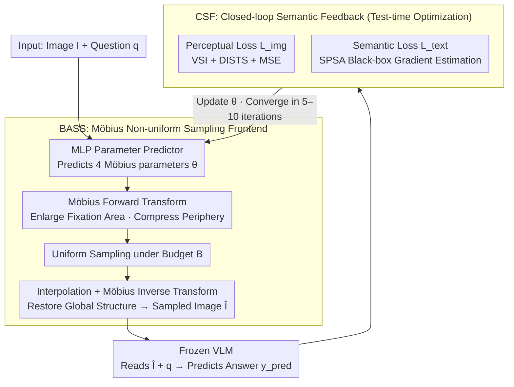

# LLMind: Bio-inspired Training-free Adaptive Visual Representations for Vision-Language Models

**Conference**: CVPR 2026  
**arXiv**: [2603.14882](https://arxiv.org/abs/2603.14882)  
**Code**: [https://empactlab.github.io/LLMind-CVPR-2026/](https://empactlab.github.io/LLMind-CVPR-2026/)  
**Area**: Multimodal VLM  
**Keywords**: Bio-inspired visual sampling, Möbius transformation, training-free, pixel budget, VQA

## TL;DR
Inspired by human foveal encoding and cortical magnification mechanisms, this paper proposes LLMind, a training-free adaptive sampling framework. It implements non-uniform pixel allocation via Möbius transformations and utilizes closed-loop semantic feedback to optimize sampling parameters at test-time, significantly outperforming uniform sampling under tight budgets of only 1%-5% pixels.

## Background & Motivation

**Background**: Current VLMs (e.g., Qwen, LLaVA) allocate uniform precision to all pixel regions during visual input processing. Consequently, even semantic-irrelevant background regions occupy equivalent computational resources. While dynamic tokenization partially mitigates redundancy, it still requires full-resolution input, making it unsuitable for edge devices.

**Limitations of Prior Work**: Uniform downsampling neither reflects biological resource allocation nor preserves critical global details in high-resolution images—semantic regions and irrelevant backgrounds are treated identically.

**Key Challenge**: A fundamental contradiction exists between efficiency and inference accuracy—under limited pixel budgets, uniform sampling cannot focus on task-critical regions.

**Goal**: To borrow from the biological foveal gaze strategy, enabling VLMs to achieve high accuracy even under extremely low pixel budgets.

**Key Insight**: The human eye captures maximal information at minimal cost through a mechanism of foveal high-resolution sampling combined with peripheral low-resolution context and rapid saccades. The authors map this to non-uniform sampling parameterized by Möbius transformations.

**Core Idea**: Use Möbius transformations to simulate cortical magnification, performing expanded sampling of task-relevant regions. Simultaneously, a closed-loop semantic feedback optimization for black-box VLMs is implemented using SPSA gradient estimation.

## Method

### Overall Architecture
This paper addresses the critical problem of maintaining accuracy for a frozen VLM when the pixel budget is compressed to 1%–5% of the original image. The entire pipeline revolves around "spending limited pixels where they matter most." Given an image $I$ and a question $q$, a lightweight MLP first predicts a set of Möbius transformation parameters $\theta$. The BASS module then performs non-uniform sampling to enlarge task-relevant regions and compress irrelevant backgrounds, producing a sampled image $\hat{I}$ within budget $B$ for the frozen VLM. Crucially, $\theta$ is not fixed: the CSF module calculates losses based on the VLM's response and image quality, iteratively adjusting $\theta$ at test-time to improve focus in subsequent rounds. This process optimizes the sampling layer during inference without modifying any VLM parameters.

### Key Designs

**1. BASS: Reversible Non-uniform Sampling via Möbius Transformation**

Uniform downsampling treats all pixels equally, washing away details when budgets are tight. BASS applies spatial remapping inspired by cortical magnification: image pixels are projected onto a complex plane via stereographic projection, where a Möbius transformation $z = (aw+b)/(cw+d)$ is applied to expand the fixation area and compress the periphery. Conventional uniform sampling is then performed on this warped plane before inverse-transforming back to original coordinates. This is equivalent to performing non-uniform sampling on the original image, where the fixation zone is sampled densely and the edges sparsely. Möbius transformations are chosen over cropping because they are conformal mappings, preserving global geometry and context while magnifying local areas.

**2. MLP Parameter Predictor: Encoding "Where to Magnify" into 4 Differentiable Reals**

The Möbius transformation is determined by only four real parameters $\theta \in \mathbb{R}^4$. The problem is reduced to predicting these four values given an image and question. A lightweight MLP generates these parameters within an end-to-end differentiable sampling chain:

$$\hat{I} = \mathcal{M}_\theta^{-1}\big(\mathcal{I}(\mathcal{S}_B(\mathcal{M}_\theta(I)))\big)$$

where $\mathcal{M}_\theta$ is the forward Möbius remapping, $\mathcal{S}_B$ is uniform sampling under budget $B$, $\mathcal{I}$ is interpolation, and $\mathcal{M}_\theta^{-1}$ is the inverse transform. Because this chain is differentiable with respect to $\theta$, the sampling strategy can be driven by downstream loss gradients without discrete enumeration of fixation points.

**3. Closed-loop Semantic Feedback (CSF): Tuning Sampling via VLM Performance**

The CSF module adds a closed-loop at test-time to evaluate sampling quality based on task performance. It utilizes a perceptual loss to ensure the sampled image remains coherent:

$$\mathcal{L}_{img} = \alpha \cdot \mathcal{L}_{VSI} + \beta \cdot \mathcal{L}_{DISTS} + \gamma \cdot \mathcal{L}_{MSE}$$

Simultaneously, a semantic loss monitors task effectiveness by encoding the VLM's predicted answer and the reference answer via Sentence Transformer to calculate cosine similarity: $\mathcal{L}_{text} = 1 - \cos(E(y_{pred}), E(y_{gt}))$. Since many VLMs are black-box models, gradients for $\mathcal{L}_{text}$ cannot be backpropagated directly. The paper employs SPSA (Simultaneous Perturbation Stochastic Approximation) to estimate gradients by applying random perturbations $\delta\Delta$ to $\theta$ over two forward passes:

$$\nabla_\theta \mathcal{L}_{text} \approx \frac{\mathcal{L}(\theta+\delta\Delta) - \mathcal{L}(\theta-\delta\Delta)}{2\delta}$$

This allows for direction estimation using only two calls (input image and read response) without accessing internal model weights. CSF is identified as the primary contributor to performance gains in ablation studies.

### Convergence Example at 5% Budget
In a VQAv2 instance with the question "What time does the clock on the wall show?": At iteration 0, the MLP predicts $\theta$, but the BASS fixation may land on a table in the center. The VLM fails, resulting in a high $\mathcal{L}_{text}$. CSF applies SPSA perturbations to estimate the gradient and shifts the fixation toward the wall. By iterations 1–2, the clock face is magnified while the background is further compressed. The VLM successfully reads the clock and $\mathcal{L}_{text}$ decreases. The process typically converges within 5–10 iterations.

### Loss & Training
The framework is entirely training-free; all optimizations occur at test-time through the iterative process described above. An additional adaptive question selection strategy uses exponential weighting for incorrect answers to prioritize hard cases, accelerating overall convergence.

## Key Experimental Results

### Main Results

| Dataset | Model | Pixel Budget | Uniform Sampling | LLMind | Gain |
|--------|------|----------|---------|--------|------|
| VQAv2 | Qwen2.5-VL | 5% | 59.94 | 73.54 | +22.68% |
| VQAv2 | SmolVLM | 5% | 59.06 | 76.46 | +29.46% |
| Seed-Bench | Qwen2.5-VL | 5% | - | - | +38%(avg) |
| A-OKVQA | Qwen2.5-VL | 5% | - | - | +37%(avg) |

### Retention Rate under Extreme Budgets

| Pixel Budget | VQAv2/Qwen2.5-VL Retention | Description |
|----------|------------------------|------|
| 1% | 63.31% | Only 1% of pixels |
| 3% | 75.17% | Retains most performance |
| 5% | 84.56% | Approaches full resolution |

### Ablation Study
- Static foveal sampling performs worse than uniform sampling (lacks adaptability).
- Sunflower and radial sampling also show poor performance.
- CSF closed-loop feedback is the key driver of performance gains.
- In region-guided VQA, LLMind even exceeds full-resolution accuracy at a 1% pixel budget.

### Related Work & Insights
- Static Foveated, Sunflower Inspired, and Radial Sampling are inferior to uniform sampling, proving that static foveal encoding cannot handle diverse tasks.
- The adaptive question selection strategy focuses optimization on hard cases via exponential weighting, accelerating convergence.

## Highlights & Insights
- Systematically introduces foveal encoding and cortical magnification mechanisms from neuroscience into VLM visual representation research for the first time.
- Completely training-free and plug-and-play, compatible with both white-box and black-box VLMs (including closed-source APIs).
- Retains 82% of full-resolution performance under an extreme 1% pixel budget, showing significant practical value.
- Conformal properties of the Möbius transformation ensure global structures are not destroyed.
- Performance retention on SmolVLM reaches 95.56% at a 5% budget, which is nearly lossless.

## Limitations & Future Work
- Test-time optimization requires multiple forward passes (approx. 5-10 iterations per image), increasing inference latency.
- SPSA gradient estimation may converge slowly in high-dimensional parameter spaces and is sensitive to the perturbation size $\delta$.
- Currently relies on a small amount of ground-truth answers for CSF optimization; its applicability in entirely zero-label scenarios requires further validation.
- Handling of multi-fixation scenarios (e.g., multiple key regions in complex charts) remains to be explored.
- A single Möbius transformation may be unable to simultaneously magnify multiple dispersed semantic regions.
- The phenomenon of exceeding full-resolution performance in region-guided VQA warrants deeper theoretical explanation.

<!-- RELATED:START -->

## Related Papers

- [\[CVPR 2026\] ZOO-Prune: Training-Free Token Pruning via Zeroth-Order Gradient Estimation in Vision-Language Models](zoo-prune_training-free_token_pruning_via_zeroth-order_gradient_estimation_in_vi.md)
- [\[CVPR 2026\] AdaptVision: Efficient Vision-Language Models via Adaptive Visual Acquisition](adaptvision_efficient_vision-language_models_via_adaptive_visual_acquisition.md)
- [\[CVPR 2026\] Proxy3D: Efficient 3D Representations for Vision-Language Models via Semantic Clustering and Alignment](proxy3d_efficient_3d_representations_for_vision-language_models_via_semantic_clu.md)
- [\[CVPR 2026\] TUNA: Taming Unified Visual Representations for Native Unified Multimodal Models](tuna_taming_unified_visual_representations_for_native_unified_multimodal_models.md)
- [\[CVPR 2026\] PAS: A Training-Free Stabilizer for Temporal Encoding in Video LLMs](pas_a_training-free_stabilizer_for_temporal_encoding_in_video_llms.md)

<!-- RELATED:END -->
