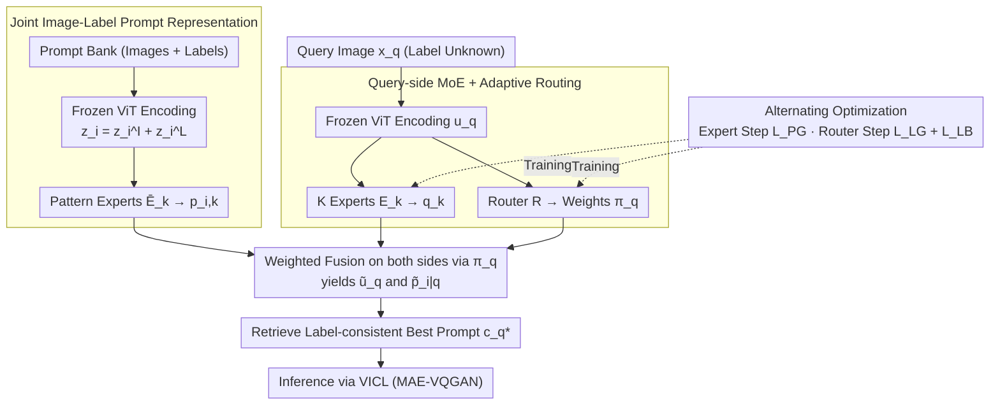

# Love Me, Love My Label: Rethinking the Role of Labels in Prompt Retrieval for Visual In-Context Learning

**Conference**: CVPR 2026  
**arXiv**: [2604.03657](https://arxiv.org/abs/2604.03657)  
**Code**: [https://github.com/luotc-why/CVPR26-LaPR](https://github.com/luotc-why/CVPR26-LaPR)  
**Area**: Multimodal VLM / Segmentation  
**Keywords**: Visual In-Context Learning, Prompt Retrieval, Label Consistency, Mixture-of-Experts, Contrastive Learning

## TL;DR

This work reveals that prompt retrieval in Visual In-Context Learning (VICL) often suffers from label inconsistency due to the neglect of label information. The proposed LaPR framework achieves label-aware prompt retrieval through joint image-label representations and a Mixture-of-Experts (MoE) mechanism, consistently outperforming SOTA on foreground segmentation, object detection, and image colorization tasks.

## Background & Motivation

**Background**: Visual In-Context Learning (VICL) enables vision foundation models to handle various tasks via demonstrative prompts (image-label pairs). Typical MAE-VQGAN models formulate VICL as pixel inpainting—inputting a 2×2 grid where the top-left is the prompt image, top-right is the prompt label, bottom-left is the query image, and bottom-right is the prediction target. Prompt selection significantly impacts VICL performance; existing works (SupPR, Partial2Global, RH-Partial2Global) focus on retrieval or re-ranking based on image similarity.

**Limitations of Prior Work**: Existing prompt retrieval methods focus solely on image similarity while ignoring label information. This leads to a typical issue: retrieved prompt images may be visually similar to the query, but their labels are inconsistent. For instance, if the query image contains a cat, a retrieved prompt might also contain a cat but have a label corresponding to a flower, leading to erroneous VICL inference.

**Key Challenge**: Experimental findings show that among visually similar prompts, query-prompt label consistency is positively correlated with VICL performance. This indicates that labels are a crucial yet overlooked signal in prompt selection. However, the challenge lies in the fact that the query label is unknown during inference, making direct label consistency comparison impossible.

**Goal**: (1) How to explicitly incorporate label information into prompt representations? (2) How to perceive and match label semantics when the query label is unknown?

**Key Insight**: Treat label information as a component of the prompt representation—construct label-aware embeddings by jointly encoding images and labels. For the query side, utilize a Mixture-of-Experts (MoE) mechanism where different experts capture distinct label patterns (e.g., long-tail, sharp corners); a router adaptively infers the implicit label based on the query.

**Core Idea**: Incorporate labels as auxiliary signals into prompt retrieval and estimate latent label patterns via an MoE mechanism when query labels are unknown to achieve label-consistent prompt selection.

## Method

### Overall Architecture

LaPR addresses a long-ignored problem in VICL: prompt retrieval based only on image appearance can lead to a mismatch between prompt labels and the query, misleading the model. The difficulty is that the query label $y_q$ is unknown during inference. The overall strategy of LaPR is to encode labels into the prompt representation and use a set of experts to "guess" the latent label pattern of the query. Specifically, given a prompt database $\mathcal{B}=\{(I_i^p, L_i^p)\}$ (image-label pairs) and a label-unknown query image $x_q$: first, a frozen ViT encodes the prompt image and label into a "label-aware" joint embedding; next, the query and prompts pass through $K$ experts to generate pattern-specific representations, which are fused using mixture weights calculated by a query-side router. Finally, the best label-consistent prompt $c_q^\star$ is retrieved in the fused space. During training, experts and the router are updated alternately, focusing on different supervisory signals.

### Key Designs

**1. Joint Image-Label Prompt Representation: Encoding "What is Labeled" into Embeddings**

Traditional retrieval only uses image embeddings $z_i^I$ for similarity, meaning prompts that "look like a cat but are labeled as a flower" might be incorrectly selected. LaPR incorporates labels into the representation: a frozen feature extractor $f$ (e.g., CLIP ViT) encodes the prompt image and label as $z_i^I = f(I_i^p)$ and $z_i^L = f(L_i^p)$ respectively, which are summed to form $z_i = z_i^I + z_i^L$. This is passed through pattern-specific experts $\bar{E}_k$ to yield prompt representations $p_{i,k} = \bar{E}_k(z_i)$. Thus, each prompt embedding carries both "visual appearance" and "semantic label" information.

**2. Query-side MoE + Adaptive Routing: Soft-estimation of Unknown Labels**

Since the query label $y_q$ is unavailable at inference, LaPR uses $K$ experts $E_k$ to map query features $u_q = f(x_q)$ to pattern-specific representations $q_k = E_k(u_q)$. A router $R$ outputs probability distribution $\pi_q = R(u_q) \in \Delta^K$ representing membership weights. Critically, these weights are applied to **both** sides:

$$\tilde{u}_q = \sum_k \pi_{q,k}\, q_k, \qquad \tilde{p}_{i|q} = \sum_k \pi_{q,k}\, p_{i,k}$$

The prompt representations are re-weighted using the same query-derived weights, making retrieval adaptive to the query's latent label. This "soft assignment" replaces hard label prediction, circumventing uncertainty.

**3. Alternating Optimization Strategy: Separate Supervisory Signals**

Jointly optimizing experts and the router in one loss function can lead to instability. LaPR splits each mini-batch into two steps. In the **Expert Step**, the router is frozen, and experts are trained with a performance-guided contrastive loss $\mathcal{L}_{PG}$. Positive/negative samples are determined by actual VICL inference scores—the top-5 performing prompts in the candidate pool are positives, and the bottom-5 are negatives. In the **Router Step**, experts are frozen, and the router is trained with a label-guided contrastive loss $\mathcal{L}_{LG}$ (based on actual prompt-query label matching) and a load-balancing loss $\mathcal{L}_{LB} = \mathrm{KL}(\bar{\pi}\,\|\,r)$ to prevent expert collapse.

### Loss & Training

**Expert Step Loss**: $\mathcal{L}_{PG}$ = InfoNCE contrastive loss, where positive samples are prompts with the highest VICL scores.  
**Router Step Loss**: $\mathcal{L}_R = \mathcal{L}_{LG} + \mathcal{L}_{LB}$, where $\mathcal{L}_{LG}$ is the label-matching guided contrastive loss and $\mathcal{L}_{LB}$ is the KL-divergence for load balancing.  
**Training**: SGD optimizer, learning rate 0.005, batch size 64, 200 epochs on a single A100. Number of experts $K=10$.

## Key Experimental Results

### Main Results

| Task | Metric | RH-Partial2Global | LaPR (Ours) | Gain |
|------|------|-------------------|-------------|------|
| Foreground Seg. (Avg. mIoU) | mIoU↑ | 39.02 | **41.36** | +6.0% |
| Object Detection | mIoU↑ | 30.94 | **32.01** | +3.5% |
| Image Colorization | MSE↓ | 0.56 | 0.60 | -7.1% |
| Seg. + Voting | mIoU↑ | 43.08 | 42.27 | -1.9% |
| Det. + Voting | mIoU↑ | 33.28 | **34.64** | +4.1% |

Note: LaPR leads comprehensively in non-voting settings. In detection with voting, it still maintains the lead. The colorization task shows a slight gap.

### Ablation Study

| Configuration | Seg. mIoU | Det. mIoU | Description |
|------|----------|----------|------|
| Full LaPR | 41.36 | 32.01 | Baseline |
| w/o Router (Uniform) | 38.20 | 29.69 | Adaptive routing is critical |
| w/o Prompt Labels | 39.19 | 30.94 | Label injection is effective |
| CLIP $\rightarrow$ DINOv2 | 41.39 | 32.06 | Good generalization across encoders |
| Single-stage Training | 39.86 | 31.21 | Alternating optimization is superior |
| w/o $\mathcal{L}_{PG}$ | 35.05 | 27.30 | Performance-guide is core supervision |
| w/o $\mathcal{L}_{LG}$ | 39.67 | 30.14 | Label-guide provides vital assistance |

### Key Findings

- **Cross-fold Transferability**: LaPR significantly outperforms baselines (Avg. mIoU 39.87 vs. SupPR 33.42, a 19.3% gain).
- **MoE Analysis**: Semantic-related categories (e.g., dog and horse) share similar expert activation distributions.
- **Visualization**: Confirms that prompts retrieved by LaPR are more label-consistent than those from SupPR.

## Highlights & Insights

- Systematically reveals the importance of labels in VICL prompt retrieval, filling a widely overlooked gap.
- The MoE + Router design elegantly solves the "unknown query label" problem via soft-mixture instead of hard prediction.
- The alternating optimization strategy ensures that experts and the router are trained stably under their respective objectives.
- Demonstrates strong generalization across different feature extractors (CLIP/DINOv2).

## Limitations & Future Work

- The number of experts $K=10$ is a fixed hyperparameter; optimal values may vary by task.
- Image-label fusion uses simple addition $z_i = z_i^I + z_i^L$; more complex strategies (e.g., cross-attention) could be explored.
- Limited improvement in colorization, likely because labels (colored images) are already visually similar to the source.
- Candidate pool construction still relies on top-50 retrieval from pre-trained features, potentially missing label-matched but visually distinct prompts.
- Training requires running MAE-VQGAN to score candidates, incurring high data preparation costs.

## Related Work & Insights

- SupPR introduced contrastive learning to VICL retrieval; LaPR extends this by introducing the label dimension.
- MoE mechanisms, previously used in NLP ICL (e.g., MOICL, MoD), are first applied here for visual ICL prompt retrieval.
- The discovery of label consistency's importance may inspire other ICL scenarios (e.g., few-shot retrieval in NLP) to re-evaluate the role of labels.

## Rating

- Novelty: ⭐⭐⭐⭐ First to focus on the role of labels in VICL retrieval with insightful problem identification.
- Experimental Thoroughness: ⭐⭐⭐⭐⭐ Comprehensive evaluation across tasks, cross-fold transfers, and feature extractors.
- Writing Quality: ⭐⭐⭐⭐ Clear motivation, systematic experimental design, and intuitive illustrations.
- Value: ⭐⭐⭐⭐ Provides a new perspective and framework for VICL prompt selection, applicable to other ICL settings.

<!-- RELATED:START -->

## Related Papers

- [\[CVPR 2026\] Rethinking BCE Loss for Multi-Label Image Recognition with Fine-Tuning](rethinking_bce_loss_for_multi-label_image_recognition_with_fine-tuning.md)
- [\[CVPR 2026\] Role-SynthCLIP: A Role-Play Driven Diverse Synthetic Data Approach](role-synthclip_a_role-play_driven_diverse_synthetic_data_approach.md)
- [\[ACL 2026\] WikiSeeker: Rethinking the Role of Vision-Language Models in Knowledge-Based Visual Question Answering](../../ACL2026/multimodal_vlm/wikiseeker_rethinking_the_role_of_vision-language_models_in_knowledge-based_visu.md)
- [\[CVPR 2026\] FedMPT: Federated Multi-Label Prompt Tuning of Vision-Language Models](fedmpt_federated_multi-label_prompt_tuning_of_vision-language_models.md)
- [\[CVPR 2026\] Adapting In-context Generation for Enhanced Composed Image Retrieval](adapting_in-context_generation_for_enhanced_composed_image_retrieval.md)

<!-- RELATED:END -->
