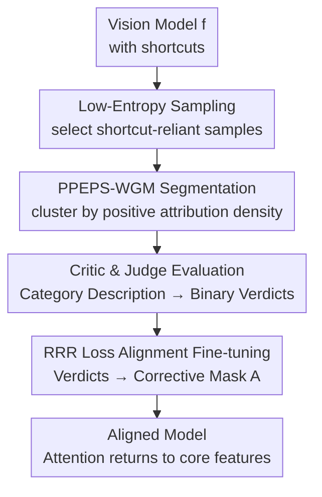

# LVLM-Aided Alignment of Task-Specific Vision Models

**Conference**: CVPR 2026  
**arXiv**: [2512.21985](https://arxiv.org/abs/2512.21985)  
**Code**: https://github.com/alexanderkoebler/LVLM-VA (Available)  
**Area**: Multimodal VLM / Explainable AI / Model Alignment  
**Keywords**: Spurious correlation, shortcut mitigation, LVLM critic, XAI, worst-group accuracy

## TL;DR
Using a Large Vision-Language Model (LVLM) as a "translator," this work translates explanation maps of small specific vision models into natural language and turns human category-level descriptions into per-sample error-correction masks. This allows small models to break free from reliance on spurious features (shortcuts) without requiring **fine-grained per-image annotation**, significantly improving worst-group accuracy on synthetic and real medical data.

## Background & Motivation

**Background**: In high-risk fields such as healthcare and manufacturing, small task-specific vision models remain irreplaceable—they have low computational requirements and benefit from mature XAI methods to explain their decisions. However, these explanations often reveal that models do not judge based on human domain knowledge but instead exploit shortcuts from spurious correlations (e.g., hospital tags in the corner of X-rays, colored bandages near skin lesions).

**Limitations of Prior Work**: To correct such shortcuts, traditional approaches fine-tune models based on human criticism of explanation maps (RRR-type methods), but these require **fine-grained annotation in the image space for every image** to specify which regions are spurious. For specialists like doctors, such per-instance feedback is unrealistically expensive. Non-human-centric methods (DFR / SUBG / JTT) do not require per-instance feedback but need "spurious feature" group labels for every image; moreover, they only aim to equalize group accuracy without truly aligning with human knowledge or providing interpretability.

**Key Challenge**: Human domain knowledge is naturally **category-level** ("deciding a malignant lesion should focus on the lesion itself, bandages are irrelevant"), whereas the supervision signals required to correct a model are **instance-level** (which pixels should be penalized in this specific image). The absence of a bridge between these two leads to either explosive annotation costs or the abandonment of alignment.

**Goal**: ① Automatically expand category-level human descriptions into instance-level corrective signals; ② Require no fine-grained feedback or group labels throughout the process; ③ Provide a bidirectional interface that explains model behavior to experts and injects expert knowledge back into the model.

**Key Insight**: The authors observe that modern LVLMs possess strong bidirectional translation and generalization capabilities between images and text, making them ideal "translators" between category-level knowledge and instance-level explanations.

**Core Idea**: Employs an LVLM as a bidirectional translator—translating model explanation maps into natural language to expose shortcuts, and translating human category-level specifications into per-image spurious region verdicts. Finally, masks generated from these verdicts are used via RRR loss to "correct" the model's behavior.

## Method

### Overall Architecture
LVLM-VA decomposes the correction of a vision model with shortcuts into **Detection** and **Alignment** steps. In the detection phase: low-entropy sampling is used to select samples from the training set most likely to rely on shortcuts. DeepLIFT SHAP is applied to generate pixel attribution maps, which are clustered by PPEPS-WGM into segments based on "positive predictive effect density." These segments, along with the original image, class labels, and human category descriptions, are fed to the LVLM-Critic. It performs Chain-of-Thought reasoning to judge whether each segment covers a relevant region. An LLM-Judge then compresses the Critic's free-text output into a binary verdict $R_j$ for each segment. In the alignment phase: binary verdicts are assembled into a corrective mask $A$ (marking only spurious segments). The original model is fine-tuned using Right for the Right Reasons (RRR) loss, penalizing gradients on spurious regions to force attention back to true core features. The Critic & Judge evaluation also serves as a bidirectional interface—experts can inject knowledge through category descriptions and few-shot judge examples, or evaluate the model by reading the Critic's natural language arguments.

### Key Designs

**1. Low-entropy sampling strategy: Targeting expensive LVLM resources on shortcut-reliant samples**

Running an LVLM on every sample across a large dataset is computationally prohibitive. Based on the hypothesis that "shortcuts are easier to learn than robust core features," the authors infer that the model exhibits lower output entropy on training samples where it relies on shortcuts. Thus, the alignment set $D_{\text{align}}$ is defined as the $N$ training samples with the **lowest** output entropy from model $f$. This step is entirely unsupervised and requires no group labels, yet it significantly increases the concentration of samples containing spurious features: in knee X-ray data, the low-entropy alignment set contains 56% spurious features, compared to 25% for random sampling and only 2% for high-entropy sampling—effectively doubling the efficiency of the subsequent expensive Critic & Judge evaluation.

**2. PPEPS-WGM (Positive Predictive Effect Probability Segmentation): Segmenting "where the effect lands" rather than "what is in the image"**

To let the LVLM accurately identify shortcuts, explanation maps must be partitioned into judgeable segments. Directly using SAM for image-content-based segmentation may merge spurious features with adjacent core structures (e.g., hospital tags and patella) into the same segment, obscuring the shortcut. The authors propose a "model-centric" segmentation: using DeepLIFT SHAP to obtain per-pixel attributions $\Phi_i(x)$, taking only the positive part $\Phi_i^+(x)=\max\{\Phi_i(x),0\}$, and normalizing it into a probability mass function $p_i(x)=\Phi_i^+(x)/Z^+(x)$, representing the "probability that one unit of positive predictive effect lands on pixel $i$." A weighted Gaussian Mixture Model is then fitted on pixel **spatial coordinates** $z_i\in[0,1]^2$, where weights $w_i=M\cdot p_i(x)$ are determined by the mass of the positive effect. The objective is weighted maximum likelihood:

$$\mathcal{L}(\Theta)=\sum_{i=1}^{M}w_i\log\Big(\sum_{j=1}^{J}\pi_j\,\mathcal{N}(z_i\mid\mu_j,\Sigma_j)\Big)$$

At optimality, the mixture weights $\pi_j=\sum_i p_i(x)r_{ij}=S_j$ exactly represent the "share of positive effect" captured by the $j$-th cluster. Pixels are then hard-assigned to clusters based on responsibilities $c_i=\arg\max_j r_{ij}$. Clusters formed this way are organized by "what drives the model's prediction," cleanly isolating spatially separate high positive attributions (i.e., potential shortcuts) from core features. Ablation shows that while its verdict accuracy is 0.87 (tied with SAM), $\Delta$WGA improves from 0.11 with SAM to 0.16, as it avoids mixing spurious features with core structures.

**3. Critic & Judge Dual LVLM Evaluation: Expanding category-level descriptions into per-segment verdicts**

Once segments are generated, an agent must judge "whether to trust this segment." The authors use a pair of LVLMs: the **Critic $g$** receives the original image, segmented explanation map $C$, an overlay of segments on the image, the ground-truth label $y$, and the human-written category description $\mathcal{V}_k$. It is guided by a Chain-of-Thought prompt through six steps: observing the image, locating regions belonging to class $y$, determining which parts of the original image each segment covers, synthesizing findings, explaining if a segment covers relevant regions, and providing a verdict. Category descriptions $\mathcal{V}_k$ serve as hooks to inject knowledge like "malignant lesions depend on the lesion itself." The **Judge $h$** (can be the same model as $g$) then compresses the Critic's free text into a binary verdict $R_j$ per segment. It uses a few-shot prompt with "Critic evaluation—Human binary verdict" pairs to align output format; experts can influence final verdicts by editing these examples. This pair of components replaces expensive per-instance annotation with "writing a few category descriptions." In user studies, agreement between participants and LVLM-selected spurious segments reached 88%, consistent with the 87% verdict accuracy across the alignment set.

**4. RRR Loss Alignment: Transforming binary verdicts into gradient constraints to penalize incorrect attention**

With per-segment verdicts, the model must be modified. Verdicts are assembled into a corrective mask $A=\sum_{j=1}^{J}R_j\cdot\mathbf{1}[C=j]$—only segments judged spurious are included. The RRR loss by Ross et al. is then applied:

$$L=\sum_{n}\sum_{k}-y_{nk}\log(\hat{y}_{nk})+\lambda\sum_{n}\sum_{i}\Big(A_{ni}\frac{\partial}{\partial x_{ni}}\sum_k\log(\hat{y}_{nk})\Big)^2+\gamma\sum_i\theta_i^2$$

The first "right answers" term is cross-entropy for classification; the second "right reasons" term suppresses input gradients on spurious regions marked by mask $A$, forcing the model to ignore them; the third is optional parameter regularization. During fine-tuning, alignment samples $x_a$ are mixed into every training batch at a fixed ratio, with oversampling for $x_a$ if necessary to prevent catastrophic forgetting of core features. The key is that it automates the "expert mask humans would have drawn per image" using the Critic & Judge output, retaining RRR’s correction power while eliminating its highest labor costs.

### Loss & Training
The alignment loss follows RRR: cross-entropy (right answers) + $\lambda$-weighted gradient penalty on spurious regions (right reasons) + optional $\gamma$ parameter regularization. $\lambda$ is the core hyperparameter—on synthetic DecoyMNIST, alignment and accuracy both rise with $\lambda$, peaking at $\lambda=10^5$ near the ground-truth mask upper bound, but accuracy drops sharply if $\lambda$ is too high as CE is overwhelmed. For real medical data, $\lambda=1$ is used. Iterations per epoch are determined by training sample size and batch composition, with oversampling for alignment samples as needed.

## Key Experimental Results

### Main Results
Three datasets with two types of shortcut settings: synthetic DecoyMNIST (gray blocks in corners, gray level varies by class in training but random in testing) using a two-layer MLP; real ISIC skin lesions (bandages) and knee X-rays (hospital tags L/R) using ResNet50. Metrics include change in worst-group accuracy ($\Delta$WGA) and change in average/overall group accuracy ($\Delta$AGA) relative to the original model (mean of 7 random seeds).

| Dataset | Metric | Ours (LVLM-VA) | Baseline Performance | Conclusion |
|--------|------|---------|--------------|------|
| Knee X-ray | $\Delta$WGA | Significant ↑ (e.g., $0.16\pm0.06$, p<0.05) | SUBG is higher but sacrifices overall accuracy; DFR is ineffective | Only method to raise WGA while maintaining overall accuracy |
| Knee X-ray | $\Delta$AGA | Maintained | SUBG significantly drops overall accuracy | — |
| ISIC Lesion | $\Delta$WGA | Significant ↑ | JTT rises slightly but is unstable; DFR is ineffective | Only method to raise WGA while maintaining overall accuracy |
| DecoyMNIST | Alignment $\mu_{Align}$ / Accuracy | Approaches upper bound of GT mask ($\lambda=10^5$) | Lower bound for unaligned | Attention shifts completely from boxes back to digits |

Alignment $\mu_{Align}=1-\frac{1}{N_t}\sum_n\frac{\sum_i A_{n,i}^{(GT)}|\Phi_i|}{\sum_i|\Phi_i|}$ measures the proportion of attribution mass falling outside ground-truth spurious regions (i.e., on digits).

### Ablation Study

| Configuration | Key Metric (Knee) | Description |
|------|------|------|
| Full LVLM-VA (PPEPS-WGM) | Verdict Acc 0.87 / $\Delta$WGA $0.16\pm0.06$ | Full model |
| Segmentation $\rightarrow$ SAM | Verdict Acc 0.87 / $\Delta$WGA $0.11\pm0.04$ | Acc ties but $\Delta$WGA drops 0.05; SAM merges spurious features with core structures |
| Critic/Judge: GPT-4o (Default) | Verdict Acc 0.87 / $\Delta$WGA $0.16\pm0.06$ | Used in main experiments; cost \$2.50/1M tokens |
| Critic/Judge: GPT-5 | Verdict Acc 1.00 / $\Delta$WGA $0.20\pm0.09$ | Stronger model gets all verdicts right; best effect and cheaper (\$1.25) |
| Critic/Judge: GPT-4o-mini | Verdict Acc 0.42 / $\Delta$WGA $0.09\pm0.02$ | Weak model verdict accuracy halved; performance drops significantly |
| Sampling: Low-Entropy / Random / High-Entropy | Spurious % in Align Set: 56% / 25% / 2% | Low-entropy sampling doubles the concentration of shortcut samples |

### Key Findings
- **Segmentation method is the bottleneck for shortcut mitigation**: PPEPS-WGM and SAM share the same verdict accuracy (0.87), but SAM often merges spurious features with core structures, causing $\Delta$WGA to drop from 0.16 to 0.11—segmenting "by effect" is clearly superior to "by content."
- **Performance improves and costs decrease as LVLMs advance**: Moving from GPT-4o-mini $\rightarrow$ GPT-4o $\rightarrow$ GPT-5, verdict accuracy rose 0.42 $\rightarrow$ 0.87 $\rightarrow$ 1.00, and $\Delta$WGA rose 0.09 $\rightarrow$ 0.16 $\rightarrow$ 0.20, while GPT-5 is cheaper.
- **User research showed 86–88% consistency** across three metrics, matching the 87% verdict accuracy on the alignment set, indicating LVLM judgments align well with human intuition.
- **SUBG exceeds this method in WGA on knee data but drastically sacrifices overall accuracy**, which is unacceptable for most applications; LVLM-VA is the only method to "raise WGA without dropping overall accuracy" across both datasets.

## Highlights & Insights
- **"Bidirectional Translator" is the core insight**: Positioning the LVLM as a bridge between category-level knowledge and instance-level explanations allows one end to explain model behavior and the other to convert human logic into masks. This bypasses "per-image expert annotation"—a workflow transferable to any scenario where knowledge is high-level but supervision must be low-level.
- **PPEPS-WGM as a probability measure for segmentation is clever**: Normalizing positive attributions as a PMF and clustering in spatial coordinates with a weighted GMM makes the mixture weights equal to the "share of positive effect." This is theoretically consistent and specifically optimized for shortcut detection rather than general content segmentation.
- **Low-entropy sampling is a high-ROI trick**: Based on the "shortcuts are easy to learn $\rightarrow$ low entropy" hypothesis, this unsupervised method filters shortcut-heavy samples, doubling the efficiency of the LVLM budget. It is reusable for any active sampling requiring scarce feedback.
- **Reusing RRR loss rather than reinventing the architecture**: By focusing innovation on "automatic mask generation," the alignment mechanism relies on the validated RRR framework, ensuring engineering stability.

## Limitations & Future Work
- **Reliance on verbalizable category-level descriptions**: The authors admit some core features are learned by experts through intuition and are hard to formalize into text, where the injection point would fail.
- **Entangled core/spurious features**: When the two are spatially entangled or boundaries are fuzzy, PPEPS-WGM’s spatial clustering may struggle. The paper mitigates this with differentiated strategies (describing spurious features for knee data vs core features for ISIC), but this requires humans to be able to describe at least one.
- **Strong dependency on LVLM quality**: When GPT-4o-mini's verdict accuracy was only 0.42, $\Delta$WGA was nearly halved; gains are limited in scenarios with weak models.
- **Future Directions**: Extending spatial clustering to hybrid representations with semantic features $z_i$ to handle spatially inseparable shortcuts; or using Critic uncertainty to fallback to human adjudication.

## Related Work & Insights
- **vs. Per-instance RRR / Explanation Correction (Ross et al. [27], Schramowski [29])**: Those methods use human-drawn fine-grained masks as supervision; this work uses Critic & Judge to automatically generate equivalent masks from category descriptions, maintaining the correction mechanism while removing per-instance labor.
- **vs. Group Accuracy Balancing (DFR [14] / SUBG [12] / JTT [23])**: These need per-image spurious group labels and only balance accuracy without seeking interpretable alignment; this work requires no group labels and provides natural language reasoning.
- **vs. LVLMs for Explaining Model Decisions (Gu et al. [8])**: They use LVLMs as unidirectional explainers; this work emphasizes a bidirectional interface that both translates behavior and injects expert knowledge.
- **vs. SAM Pre-segmentation for LVLM Positioning (Yang et al. [37])**: They use content-based segmentation to help LVLMs locate objects; this work switches to effect-based segmentation (PPEPS-WGM) for shortcut detection, which ablation proves superior for $\Delta$WGA.

## Rating
- Novelty: ⭐⭐⭐⭐ "LVLM as bidirectional translator + PPEPS-WGM effect segmentation" combo is novel; RRR alignment is reused.
- Experimental Thoroughness: ⭐⭐⭐⭐ Synthetic + two real medical datasets, four baseline categories, ablations on LVLM/sampling/segmentation, and an 18-person user study. However, some results are only in charts rather than tables.
- Writing Quality: ⭐⭐⭐⭐ Problem setup and formulas are clear; PPEPS-WGM derivation is rigorous.
- Value: ⭐⭐⭐⭐⭐ Directly addresses the "expert feedback is too expensive" bottleneck in high-risk domains; high practical potential for automating instance-level supervision.

<!-- RELATED:START -->

## Related Papers

- [\[CVPR 2026\] DeepAlign: Mitigating Modality Conflict through Modality-Specific Alignment](deepalign_mitigating_modality_conflict_through_modality-specific_alignment.md)
- [\[CVPR 2026\] CrossHOI-Bench: A Unified Benchmark for HOI Evaluation across Vision-Language Models and HOI-Specific Methods](crosshoi-bench_a_unified_benchmark_for_hoi_evaluation_across_vision-language_mod.md)
- [\[CVPR 2026\] Understanding Task Transfer in Vision-Language Models](understanding_task_transfer_in_vision-language_models.md)
- [\[CVPR 2026\] CADFS: A Big CAD Program Dataset and Framework for Computer-Aided Design with Large Language Models](cadfs_a_big_cad_program_dataset_and_framework_for_computer-aided_design_with_lar.md)
- [\[CVPR 2026\] AXG-Reasoner: Error Detection and Explanation in Long Task Videos with Vision-Language Models](axg-reasoner_error_detection_and_explanation_in_long_task_videos_with_vision-lan.md)

<!-- RELATED:END -->
