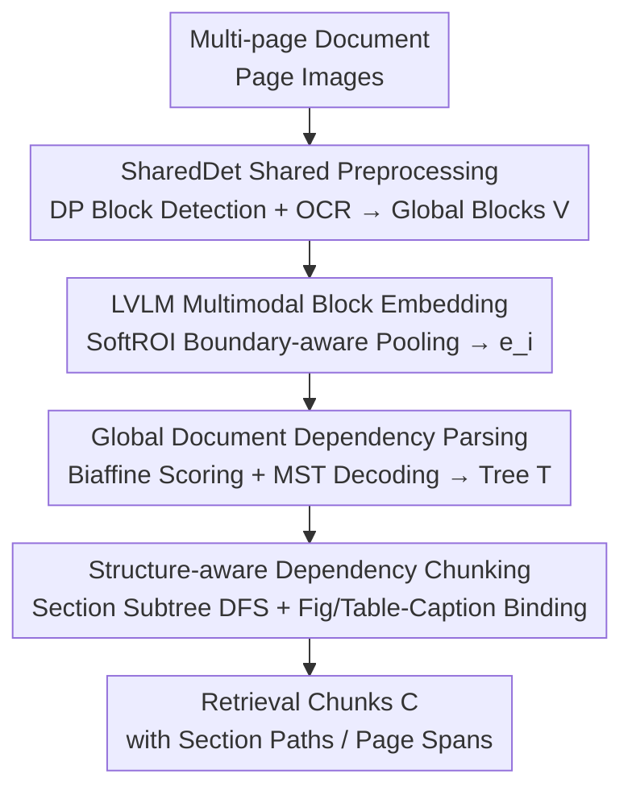

# M3DocDep: Multi-modal, Multi-page, Multi-document Dependency Chunking with Large Vision-Language Models

**Conference**: CVPR 2026  
**Paper**: [CVF Open Access](https://openaccess.thecvf.com/content/CVPR2026/html/Shin_M3DocDep_Multi-modal_Multi-page_Multi-document_Dependency_Chunking_with_Large_Vision-Language_Models_CVPR_2026_paper.html)  
**Code**: None  
**Area**: Multimodal VLM / Document Understanding / RAG  
**Keywords**: Document Chunking, Dependency Tree, Multimodal Document Parsing, LVLM, Retrieval-Augmented Generation

## TL;DR
M3DocDep utilizes a frozen Large Vision-Language Model (LVLM) to encode document layout blocks of long, multi-page industrial documents into multimodal representations. It first employs biaffine scoring and MST decoding to reconstruct a globally valid parent-child dependency tree, and then along this tree, chunks the document into retrieval units that preserve section hierarchies and figure/table-caption bindings. This simultaneously improves document RAG performance across hierarchy recovery (STEDS +28.5~39.6%), retrieval (nDCG +1.1~15.3%), and question answering (ANLS +4.5~15.3%).

## Background & Motivation
**Background**: Retrieval-Augmented Generation (RAG) enables large models to process long documents, but its effectiveness highly depends on "chunking"—how documents are segmented into semantic units directly determines retrieval precision and answer quality. Current mainstreams are text-centric chunkers (by length or semantics) or structured chunking based on document layout parsing (DP).

**Limitations of Prior Work**: Purely text-based chunkers are blind to visual and structural cues in scanned pages, multi-page PDFs, and complex industrial layouts. They also generate duplicate or ambiguous chunks when encountering OCR noise. Vision-driven DP can design robust boundaries for visually coherent regions like tables and text blocks, but fails to capture the semantic hierarchy of multi-page documents (e.g., the parent-child relationship of 1.2 → 1.2.1) due to insufficient global context modeling. Although some works combine DP+OCR+LLM for Document Hierarchy Parsing (DHP), the step of "converting pages into pure text to feed into LLMs" erases crucial visual cues such as color, font size, and layout emphasis, while remaining powerless for figures and tables.

**Key Challenge**: Even with LVLMs that naturally understand text and images jointly, Supervised Fine-Tuning (SFT) based methods still struggle to reconstruct a "globally consistent" hierarchy on long, multi-page documents. Cross-page references are unstable, visual cues are halved after text tokenization, and sequence generation itself does not guarantee tree constraints (single-rooted, single-parent, acyclic). This results in a recurring chain of failure in document RAG: inaccurate block dependency recovery → unreliable block boundaries → degraded retrieval precision and answer grounding.

**Goal**: To break down the problem into: (1) how to represent layout blocks while preserving visual cues; (2) how to recover a globally valid dependency tree across pages instead of fragmented local links; and (3) how to make chunking deterministically follow this tree.

**Key Insight**: Rather than resorting to the fragile approach of "autoregressively generating hierarchical text", document structures should be explicitly modeled as a "weighted dependency tree among blocks". The LVLM is responsible for generating strong multimodal features for blocks, while structure recovery is delegated to classic graph scoring and MST decoding to guarantee global consistency.

**Core Idea**: Follow a clear causal chain: **better block dependency recovery → better document tree → better block boundaries → better retrieval & QA**. That is, "parse-then-chunk".

## Method

### Overall Architecture
M3DocDep is a "parse-then-chunk" pipeline designed for long industrial documents. Its core is to recover block dependencies before constructing retrieval units, steering chunk boundaries toward the true document structure rather than surface-level text. The pipeline consists of four stages: (a) **SharedDet (DP+OCR)** converts a multi-page document into a shared canvas of "global document blocks" $V$; (b) **LVLM Multimodal Block Embedding** maps each block to a multimodal embedding $e_i$ using a frozen LVLM; (c) **Global Document Dependency Parsing** scores candidate parent-child edges and decodes a global tree $T$; (d) **Structure-aware Dependency Chunking** deterministically transforms $T$ into a set of chunks $C$ with section paths and page spans. The first two stages serve as a "scaffolding" shared by all compared methods (ensuring a fair comparison), while the core contributions lie in (c) dependency tree recovery and (d) tree-guided chunking.

### Key Designs

**1. SoftROI Boundary-aware Multimodal Block Embedding: Accurately Aggregating LVLM Text-Image Tokens into Block Features**

Layout blocks output by DP are merely bounding boxes, requiring dense features per block to feed into the dependency scorer. Directly performing average pooling on tokens inside the box accumulates noise from annotations and boundaries, while fully deformable RoI pooling is computationally heavy. M3DocDep first inputs each page image into a frozen LVLM (e.g., Qwen2.5-VL, LLaVA-OneVision), extracts hidden states at image token positions from the last decoder layer as "page multimodal tokens", and assigns document-level normalized coordinates to each token using token grid metadata. Then, for block $i$, it gathers all tokens $p \in \text{ROI}_i$ falling within its global box and pools them via boundary-aware weights:

$$w_p \propto \big(u_p(1-u_p)\big)^{\alpha}\,\big(v_p(1-v_p)\big)^{\alpha}, \quad \tilde{w}_p = \frac{w_p}{\sum_{q\in \text{ROI}_i} w_q}, \quad e_i = \sum_{p\in \text{ROI}_i} \tilde{w}_p\, z_p$$

where $(u_p,v_p)$ are the normalized coordinates of token $p$ inside the box, and $\alpha$ is a boundary-sharpening index. This assigns higher weights to tokens near the block center and lower weights to boundary tokens, making the embedding robust to minor annotation offsets. This mechanism adapts RoIAlign-style continuous sampling to the document token grid, respecting geometry while saving compute. Lastly, a compact type embedding $\tau_i$ is mapped from the normalized layout category, and passed along with $e_i$ into downstream scoring heads to inject layout priors.

**2. Biaffine Dependency Scoring + Head-centric Candidate Filtering: Reframing "Parent-finding" as Edge Scoring instead of Sequence Generation**

This serves as the core alternative to autoregressive SFT hierarchy generation. For each block $v$, a small parent candidate set $P(v)$ is constructed: prioritized towards titles and section heads, allowing upward connection with minor $y$-axis tolerance within the same column, restricting cross-page parents to the most recent $M$ pages, and retaining the top-$k$ based on vertical distance and "head priors". Consequently, each child block only needs to select its parent from "a few reasonable candidates + a virtual root $r$". For node $i$, the concatenated representation $x_i = [e_i; \tau_i]$ is fed into a small MLP to obtain $h_i$. The score of a candidate edge $u \to v$ is computed via a biaffine formulation:

$$s(u\to v) = [h_u;1]^\top U [h_v;1] + w_{geo}^\top \delta_g(u,v)$$

where $\delta_g(u,v)$ encodes pairwise geometric features (normalized relative offset, block size ratio, page distance, overlap indicators, etc.), and the score of the virtual root is defined as $s(\text{ROOT}\to v) = r^\top h_v + b_r$. During training, a $K{+}1$-way softmax is performed across "candidate parents + root" for each child block, which is optimized using cross-entropy against the ground-truth parent $p^\star(v)$:

$$P_\theta(p\mid v) = \frac{\exp s(p\to v)}{\sum_{q\in P(v)\cup\{r\}} \exp s(q\to v)}$$

This head-centric, type-aware candidate filtering eliminates impossible parents beforehand, centering the learning process on true attachments between headings, captions, and ROOT. Calibrated over multimodal block embeddings, biaffine scoring is significantly more robust than fragile token sequences.

**3. MST Global Tree Decoding: Assembling Local Scores into a Globally Valid Single-rooted Acyclic Tree**

Simply taking the highest-scoring parent independently for each child block (local argmax) during inference can lead to loops or contradictory links. M3DocDep treats all edge scores $s(p\to v)$ (including ROOT edges) as weights, feeding them to a global decoder based on the Maximum Spanning Tree (MST/Chu-Liu-Edmonds algorithm). It returns the highest-scoring tree $T$ that satisfies the constraints of being single-rooted, single-parent, and acyclic. Since the decoded tree guarantees logical consistency, downstream chunking is built on top of a coherent structure rather than localized, disconnected links—an interpretable hierarchy that SFT-based LVLMs struggle to recover. The paper retains local argmax as a baseline, which shows a significant drop in ablation studies.

**4. Structure-aware Dependency Chunking: Deterministically Chunking along the Tree, Preserving Section Continuity and Figure-Caption Bindings**

With $T$, chunking becomes a deterministic post-processing step rather than another learnable module. Formally, it proceeds in three steps: (i) **Section-root DFS**: Starting from heading and section-title nodes as structural anchors, DFS walks to gather their descendants, thereby forming section subtrees. Blocks spanning multiple pages but belonging to the same subtree are merged; (ii) **Figure-Text Binding**: If a figure/table node is connected to its caption node in $T$, they are forced into the same chunk $B_m$, falling back to the spatially nearest compatible pair if the edge is missing; (iii) **Chunk Emission**: Each retained subtree or merged figure-text group is emitted as a chunk $c_m=(B_m,\pi_m,[p_m^{\min},p_m^{\max}])$ accompanied by its path $\pi_m$ from the root to the section, page range, and list of blocks. This prevents arbitrary cutoffs of section continuations, preserves connections for cross-page evidence, and keeps figures paired with their captions. The emitted section paths and page ranges also disambiguate otherwise similar chunks during multi-document indexing. Chunk granularity can still be adjusted on the recovered tree deterministically through maximum chunk lengths and cutting policies, without any need to retrain the parser.

### An Example Walkthrough
Fig. 2 of the paper traces a 5-page industrial document: Inputting 5 pages → recovering dependency subtrees (e.g., nodes like `1:title → 17:section-title → 19:figure → 20:figure-caption`, indicating that figure 19 and its caption 20 are bound under a specific section heading) → emitting a structure-aware chunk: path `# Title > ## 1. Intro`, page number 2, combining the cropped figure and its caption text ("Fig. 1: Schematic of photon trajectory...") into a single retrieval unit. This pipeline blocks the common fragmentation problem of "figure-caption drifting across chunks" before chunking even starts.

## Key Experimental Results

### Main Results

**Hierarchy/Dependency Recovery (using the same GT layout blocks to isolate hierarchy recovery capabilities)**:

| Dataset | Metric | Ours (M3DocDep) | Prev. SOTA | Gain |
|--------|------|----------|----------|------|
| HRDS | STEDS | 76.52 | DSPS 59.57 | +16.95 |
| HRDH | STEDS | 71.65 | DSHP-LLM 51.34 | +20.31 |
| DocHieNet | STEDS | 70.83 | DSHP-LLM 53.49 | +17.34 |
| HRDS | F1 | 82.87 | DSPS 65.27 | +17.60 |

General-purpose LVLM baselines (GPT-5, Qwen2.5-VL, etc.) typically score between 9 and 26 in STEDS, far lower than M3DocDep. This indicates that relying solely on LVLM generation for producing hierarchies is insufficient.

**Retrieval Quality (macro average over 4 multi-page VQA corpora, averaged over 4 retrievers)**:

| Corpus | Metric | Ours (M3DocDep) | MultiDocFusion | Gain |
|------|------|----------|----------------|------|
| DUDE | nDCG | 27.81 | 25.05 | +2.76 |
| MP-DocVQA | nDCG | 24.52 | 21.31 | +3.21 |
| MOAMOB | nDCG | 75.54 | 65.54 | +10.00 |
| CUAD | nDCG | 89.12 | 88.19 | +0.93 |

**Downstream QA (ANLS, averaged over 3 LVLM readers)**: DUDE 21.43 (MultiDocFusion 18.59), MP-DocVQA 18.17 (16.15), CUAD 29.25 (27.38), MOAMOB 27.14 (25.96)—achieving a comprehensive lead across all four corpora. Gains are most prominent in corpora with abundant cross-page evidence, severe OCR noise, and graphical elements (e.g., MOAMOB, DUDE, MP-DocVQA), validating the premise that "chunk boundaries are most critical for these types of documents."

### Ablation Study

| Configuration | Avg F1 | Avg STEDS | Description |
|------|--------|-----------|------|
| Full | 78.88 | 73.00 | Full Model |
| MST → local argmax | 73.68 (−5.19) | 66.30 (−6.70) | Removing global tree constraints, independent parent selection |
| Disallow cross-page edges | 71.73 (−7.15) | 63.74 (−9.26) | Disallowing cross-page parent-child links |

(Macro average from HRDS/HRDH/DocHieNet; dataset-wise ablations of SoftROI, head priors, and candidate top-$k$ pruning are provided in the supplementary material.)

### Key Findings
- **Cross-page edges and global tree constraints are the two pillars**: Disallowing cross-page edges drops STEDS by 9.26 points, and replacing MST with local argmax drops it by 6.70 points. These are the two steepest drops among all configurations, reinforcing the core claim that "cross-page dependency + global consistency" is the lifeblood of long document hierarchy recovery.
- **Gains primarily stem from block boundaries, not metadata**: In a "metadata-free fair comparison" where section paths and page fields are omitted, M3DocDep still maintains a 2.3% nDCG advantage over MultiDocFusion, proving that the improvement is largely driven by better block boundaries rather than bloated metadata.
- **Robustness to LVLM Encoders**: Swapping Qwen2.5-VL / InternVL-3.5 / LLaVA-OneVision-1.5 for block embeddings yields stable DocHieNet parent-prediction F1 scores of 76.01 / 75.71 / 74.07, demonstrating that the method is not bound to a specific backbone.

## Highlights & Insights
- **Reframing "Document Hierarchy Recovery" from a Generation Problem to a Graph Decoding Problem**: Utilizing biaffine edge scoring + MST decoding instead of autoregressive generation automatically enforces single-root, single-parent, and acyclic structures. This elegantly circumvents the vulnerabilities of SFT-based LVLMs (unstable cross-page references and non-conforming tree outputs), marking a pivotal "Eureka" design shift.
- **SoftROI works as a lightweight yet intelligent trade-off**: Striking a balance between "coarse average pooling" and "heavy deformable RoIs" with a $(u(1-u))^\alpha$-shaped boundary-aware weight, it views the LVLM token grid as a continuous sampling surface. This approach is highly transferable to any region feature extraction scenario utilizing "bounding box + LLM tokens".
- **"Parse-then-chunk" causal chain runs throughout**: The evaluation pipeline across hierarchy, retrieval, and QA presents a consistent pattern. By executing controlled comparisons using unified SharedDet blocks, consistent chunk budgets, and the same retriever/reader, the authors cleanly isolate "chunk quality" from variances in parsers, budgets, or retrievers. This methodology is highly commendable.

## Limitations & Future Work
- **No joint training of LVLM and dependency head**: Currently, the LVLM is frozen and solely used for feature extraction, leaving joint training to future work. This implies block representations are not end-to-end optimal for the dependency task.
- **Dependency on external DP+OCR quality**: As an upstream scaffolding, errors in SharedDet (such as DP missing blocks or OCR misrecognitions) will propagate into the dependency tree. Although block-level operations possess some intrinsic robustness, parsing noise is not fundamentally solved at the root.
- **High cost of tree induction supervision**: Recovering dependency trees requires hierarchical annotations (DocHieNet, HRDH/HRDS). The authors admit that "large-scale, low-cost tree-induction supervision" is still an open challenge, limiting transferability to unannotated new domains.
- **Optimization required for latency-sensitive scenarios**: Multi-page LVLM inference and MST decoding are heavy for real-time industrial deployment. The authors tag "lightweight variants" for future exploration.

## Related Work & Insights
- **vs MultiDocFusion**: Also combines DP, OCR, and LLM for structured chunking, but relies on autoregressive generation for hierarchies, which is bounded by LLM context windows and discards visual cues during conversion to raw text. M3DocDep reconstructs hierarchies using multimodal block embeddings and global MST decoding, preserving figures/tables alongside captions in the tree, outperforming MultiDocFusion by 2.3% nDCG in a fair, metadata-free comparison.
- **vs DSHP-LLM / Qwen2.5-VL–DHP–SFT**: These DHP baselines rely on decoder-style SFT, which misaligns with tree constraints and typically only recovers partial heading hierarchies (filling the rest with heuristic rules). M3DocDep explicitly models document structures as weighted trees, achieving superior interpretability and global consistency (demonstrating massive leads in STEDS).
- **vs Pure Text-based Chunking (Length/Semantic/LumberChunker/Perplexity)**: Such chunkers are blind to visual layout and fail to capture hierarchies, leading to severe fragmentation in cross-page and graphic-heavy corpora. M3DocDep chunks along the tree to preserve section continuity and figure-text bindings.

## Rating
- Novelty: ⭐⭐⭐⭐⭐ Reformulating document hierarchy recovery from a generation task into a "multimodal block embedding + biaffine + MST" graph decoding problem is a clean approach that directly targets the crucial vulnerabilities of SFT-based LVLMs.
- Experimental Thoroughness: ⭐⭐⭐⭐ Evaluated across three dimensions (hierarchy, retrieval, QA) over multiple corpora and backbones with a rigorous, unified protocol. However, core ablations are brief, and fine-grained ablations (like SoftROI) are delegated to the supplementary material.
- Writing Quality: ⭐⭐⭐⭐⭐ The causal link of "dependency → tree → boundary → retrieval & QA" runs seamlessly throughout the paper. Methods are clearly elucidated stage-by-stage with well-aligned formulas and flowcharts.
- Value: ⭐⭐⭐⭐ Provides a highly practical chunking improvement directly applicable to long-document/industrial-document RAG, setting a baseline evaluation protocol for future fair comparisons.

<!-- RELATED:START -->

## Related Papers

- [\[CVPR 2026\] Multi-SpatialMLLM: Multi-Frame Spatial Understanding with Multi-Modal Large Language Models](multi-spatialmllm_multi-frame_spatial_understanding_with_multi-modal_large_langu.md)
- [\[CVPR 2026\] M3Grounder: Mask-Based Multi-Span and Multi-Granular Grounding for Document QA](m3grounder_mask-based_multi-span_and_multi-granular_grounding_for_document_qa.md)
- [\[CVPR 2026\] Hierarchical Attacks for Multi-Modal Multi-Agent Reasoning](hierarchical_attacks_for_multi-modal_multi-agent_reasoning.md)
- [\[CVPR 2026\] Point Cloud as a Foreign Language for Multi-modal Large Language Model](point_cloud_as_a_foreign_language_for_multi-modal_large_language_model.md)
- [\[ACL 2026\] SlideAgent: Hierarchical Agentic Framework for Multi-Page Visual Document Understanding](../../ACL2026/multimodal_vlm/slideagent_hierarchical_agentic_framework_for_multi-page_visual_document_underst.md)

<!-- RELATED:END -->
