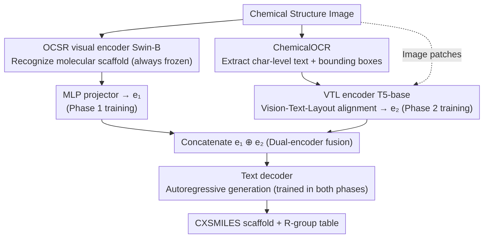

# MarkushGrapher-2: End-to-end Multimodal Recognition of Chemical Structures

**Conference**: CVPR 2026  
**arXiv**: [2603.28550](https://arxiv.org/abs/2603.28550)  
**Code**: [https://github.com/DS4SD/MarkushGrapher](https://github.com/DS4SD/MarkushGrapher)  
**Area**: Multimodal VLM / Document Understanding  
**Keywords**: Chemical structure recognition, Markush structures, multimodal encoding, patent document analysis, OCR

## TL;DR

MarkushGrapher-2 proposes an end-to-end multimodal chemical structure recognition model. By co-encoding image, text, and layout information through a dedicated chemical OCR module and combining a two-stage training strategy (adapting OCSR features then fusing multimodal encoding), it significantly outperforms existing methods in Markush structure recognition (M2S accuracy 56% vs 38%) while remaining competitive in molecular structure recognition.

## Background & Motivation

1. **Background**: Automatic extraction of chemical structures from documents is the foundation for large-scale chemical literature analysis. Current methods separately process molecular structures in images (OCSR) or chemical naming entities in text, but perform poorly on Markush structures—multimodal descriptions that combine images and text.

2. **Limitations of Prior Work**: Markush structures are critical in patent analysis (e.g., prior-art search, freedom-to-operate evaluations), but they are currently only available in two manually annotated proprietary databases, MARPAT and DWPIM. The previous MarkushGrapher-1 required pre-annotated OCR output (incapable of end-to-end processing), and its visual recognition accuracy needs improvement. General VLMs (GPT-5, DeepSeek-OCR) perform poorly on Markush recognition (GPT-5 achieves only 3% on M2S).

3. **Key Challenge**: The visual style of Markush structures varies significantly across different patent offices and publication years. Textual descriptions lack standardization and contain conditional or recursive descriptions. Furthermore, there is a lack of large-scale, real-world training data.

4. **Goal**: Build a unified end-to-end model to recognize both standard molecular and multimodal Markush structures.

5. **Key Insight**: Utilize a dual-encoder architecture (OCSR visual encoder + VTL multimodal encoder) for complementary fusion, paired with a dedicated chemical OCR module and a two-stage training strategy.

6. **Core Idea**: A dual-encoder pipeline fuses visual structural features with multimodal text-layout features to achieve end-to-end recognition of chemical Markush structures.

## Method

### Overall Architecture

This paper aims for the end-to-end recognition of Markush structures from chemical structural diagrams: providing both a graphical description of the scaffold (CXSMILES) and an R-group table (molecular fragments that can replace variable groups on the scaffold). The challenge lies in the hybrid nature of Markush structures—the scaffold is drawn, but the definitions of variable groups (R1, R2, etc.) are written in text.

To address this, the model adopts an encoder-decoder architecture with two complementary encoding pipelines. One is the vision-only route: images are fed into a frozen OCSR visual encoder (Swin-B ViT from MolScribe) to obtain visual embeddings $e_1$ via an MLP projector, specifically capturing the molecular scaffold. The other is the multimodal route: images pass through ChemicalOCR to extract character-level text and bounding boxes, which are then sent into a VTL encoder (T5-base) along with the image to produce embeddings $e_2$ that fuse text and layout information, specifically capturing Markush text descriptions. Finally, $e_1$ and $e_2$ are concatenated and passed to a text decoder to autoregressively generate CXSMILES and the R-group table. This architecture is effectively integrated using a two-stage training strategy: first adapting the decoder to visual features, and then introducing the multimodal encoder to fill the missing textual information (Phase 1 / Phase 2 labels in the diagram correspond to these steps).

### Key Designs

**1. ChemicalOCR Module: Replacing general OCR with domain-specific OCR**

Previous MarkushGrapher-1 required external pre-annotated OCR output and could not operate end-to-end. In Markush recognition, brackets, subscripts, and indices are critical textual clues for identifying variable groups; if the OCR fails, the downstream tasks fail entirely. Existing tools like PaddleOCR and EasyOCR are nearly unusable on chemical images—treating chemical bonds as minus or equals signs and failing to recognize abbreviations (F1 scores of only 7.7 / 10.2). Ours ChemicalOCR achieves 87.2 by fine-tuning a lightweight VLM, Smoldocling (256M parameters): first pre-trained on 235k synthetic chemical structures and then fine-tuned on 7k manually annotated IP5 patent structures.

**2. Dual-Encoder Fusion (OCSR + VTL): Complementing specialized encoders**

Markush structures contain both visual (scaffold) and textual (R-group definitions) information; any single encoder struggles with one or the other. OCSR encoders excel at scaffold recognition but cannot process Markush text. VTL encoders follow the UDOP paradigm, aligning spatially overlapping visual and text tokens to handle text features but often lack accuracy in molecular scaffolding. Ablation data clearly shows this complementarity: USPTO SMILES accuracy reaches 89.1% with only the visual pipeline but M2S is only 8%. Conversely, with only the multimodal pipeline, M2S reaches 39% while USPTO drops to 46%. Concatenating both routes into the decoder allows the fused model to master both domains.

**3. Two-stage Training Strategy: Adapting to visual features before multimodal fusion**

Jointly training both encoders and the decoder from scratch (Fusion only) results in only 44% M2S accuracy. This paper adopts a two-step approach. Phase 1 (Adaptation) freezes the visual encoder and trains only the projector and text decoder for standard SMILES prediction (243k real samples, 3 epochs) to adapt the decoder to the OCSR feature space. Phase 2 (Fusion) freezes both the visual encoder and projector while introducing ChemicalOCR and the VTL encoder. This phase trains the VTL encoder and text decoder end-to-end for CXSMILES + R-group table prediction (235k synthetic + 145k real samples, 2 epochs). Freezing the OCSR branch protects established visual features, allowing VTL to focus on missing Markush textual information, raising M2S accuracy to 50% (+6%).

### Performance Example

Consider a Markush diagram in a patent: a benzene scaffold with a variable site labeled "R1," and text stating "R1 = methyl or ethyl." In the visual pipeline, Swin-B encodes the benzene structure into $e_1$ but fails to process the "R1" label or the adjacent text. In the multimodal pipeline, ChemicalOCR extracts the "R1" on the diagram, the text description, and their bounding boxes. The VTL encoder spatially aligns the "R1" visual marker with its textual definition into $e_2$. After concatenation, the decoder uses $e_1$ to output the benzene scaffold CXSMILES and $e_2$ to fill the R-group table with "R1 → methyl / ethyl." Without the OCR step, the "R1" label and text are lost, meaning the scaffold might be recognized but the R-group table remains empty—explaining why M2S accuracy drops from 56% to 4% without OCR.

### Loss & Training

The model employs standard autoregressive cross-entropy loss: Phase 1 supervises SMILES prediction, and Phase 2 supervises CXSMILES + R-group table prediction. The model has 831M total parameters (744M trainable) and was trained on NVIDIA A100 GPUs.

## Key Experimental Results

### Main Results

| Method | M2S (CXSMILES Accuracy) | USPTO-M Accuracy | WildMol-M Accuracy | IP5-M Accuracy |
|------|-------------------|-----------|-------------|---------|
| MolParser-Base (Image) | 39 | 30 | 38.1 | 47.7 |
| MolScribe (Image) | 21 | 7 | 28.1 | 22.3 |
| GPT-5 (Multimodal) | 3 | — | — | — |
| DeepSeek-OCR | 0 | 0 | 1.9 | 0.0 |
| MarkushGrapher-1 | 38 | 32 | — | — |
| **MarkushGrapher-2 (Ours)** | **56** | **55** | **48.0** | **53.7** |

### Ablation Study

| Configuration | M2S Acc | M2S Acc_InChIKey | USPTO-M Acc | IP5-M Acc |
|------|-------|----------------|-----------|---------|
| Without OCR input | 4 | 39 | 3 | 15.4 |
| With OCR input | 56 | 80 | 55 | 53.7 |
| Single-stage (Fusion only) | 44 | 53 | — | — |
| Two-stage (Adapt + Fusion) | 50 | 68 | — | — |

### Key Findings

- The OCR module is the most critical component: without OCR, M2S accuracy drops from 56% to 4%, as textual information like brackets and indices is vital for Markush feature prediction.
- ChemicalOCR significantly outperforms general OCR: achieving an F1=86.5 on IP5-M compared to PaddleOCR’s 1.9 and EasyOCR’s 18.4.
- General VLMs fail completely at Markush recognition: GPT-5 achieved only 3%, and DeepSeek-OCR scored 0%.
- Two-stage training improves M2S scaffold accuracy by 15% (53% to 68%) over single-stage training.
- Competitive on standard molecular recognition (OCSR): achieving 96.6% on UOB (best) and 68.4% on WildMol.

## Highlights & Insights

- **Dual-Encoder Complementary Design**: Leveraging the scaffold recognition of a visual encoder alongside the multimodal fusion of a VTL encoder is a generalizable multimodal architecture pattern. It can be transferred to other tasks requiring processed structural vision and text (e.g., table understanding, circuit diagram analysis).
- **USPTO-MOL-M Data Generation Pipeline**: Automatically extracting real Markush training data from USPTO MOL files solves the issue of scarce annotated data. This approach of utilizing existing structured data to generate training samples is highly valuable.
- **Domain-Specific OCR**: General OCR is unusable for chemical images. However, high-precision domain OCR can be obtained with just 7k manual annotations and 235k synthetic samples, proving the necessity of domain adaptation for OCR.

## Limitations & Future Work

- **Overall accuracy remains modest**: Accuracy at 56% on M2S and 53.7% on IP5-M is still far from practical deployment, particularly for R-group table prediction (M2S table accuracy only 22%).
- **Heavily reliant on synthetic data**: With 235k synthetic vs. 145k real samples, the distribution of synthetic data might still differ from real patent documents.
- **OCR Error Cascading**: Errors in the OCR module directly impact downstream Markush recognition; these errors may amplify in complex structures.
- **2D structures only**: The model does not yet process 3D molecular conformation information.
- **Inference Efficiency**: The paper does not discuss whether the 831M parameter model is fast enough for large-scale patent scanning.

## Related Work & Insights

- **vs MarkushGrapher-1**: The previous version required pre-annotated OCR; this work achieves end-to-end processing while increasing accuracy from 38% to 56%.
- **vs MolParser**: MolParser only handles the image modality and supports limited Markush features, whereas this work handles multimodal data comprehensively.
- **vs GPT-5/DeepSeek-OCR**: The failure of general VLMs highlights the continued need for domain-specific methods in chemical structure recognition.

## Rating

- Novelty: ⭐⭐⭐⭐ The combination of dual-encoder fusion, two-stage training, and dedicated OCR is novel, though the individual components are established.
- Experimental Thoroughness: ⭐⭐⭐⭐⭐ Conducted across multiple benchmarks and baselines with detailed ablation studies and a new benchmark (IP5-M).
- Writing Quality: ⭐⭐⭐⭐ The structure is clear and the chemical context is well-explained, though some sections are verbose.
- Value: ⭐⭐⭐⭐ Fills a gap in end-to-end Markush recognition with significant practical value for cheminformatics and patent analysis.

<!-- RELATED:START -->

## Related Papers

- [\[CVPR 2025\] MarkushGrapher: Joint Visual and Textual Recognition of Markush Structures](../../CVPR2025/multimodal_vlm/markushgrapher_joint_visual_and_textual_recognition_of_markush_structures.md)
- [\[ACL 2026\] E2E-GMNER: End-to-End Generative Grounded Multimodal Named Entity Recognition](../../ACL2026/multimodal_vlm/e2e-gmner_end-to-end_generative_grounded_multimodal_named_entity_recognition.md)
- [\[AAAI 2026\] SpeakerLM: End-to-End Versatile Speaker Diarization and Recognition with Multimodal Large Language Models](../../AAAI2026/multimodal_vlm/speakerlm_end-to-end_versatile_speaker_diarization_and_recognition_with_multimod.md)
- [\[ICLR 2026\] WebDS: An End-to-End Benchmark for Web-based Data Science](../../ICLR2026/multimodal_vlm/webds_an_end-to-end_benchmark_for_web-based_data_science.md)
- [\[CVPR 2026\] RetFormer: Multimodal Retrieval for Enhancing Image Recognition](retformer_multimodal_retrieval_for_enhancing_image_recognition.md)

<!-- RELATED:END -->
