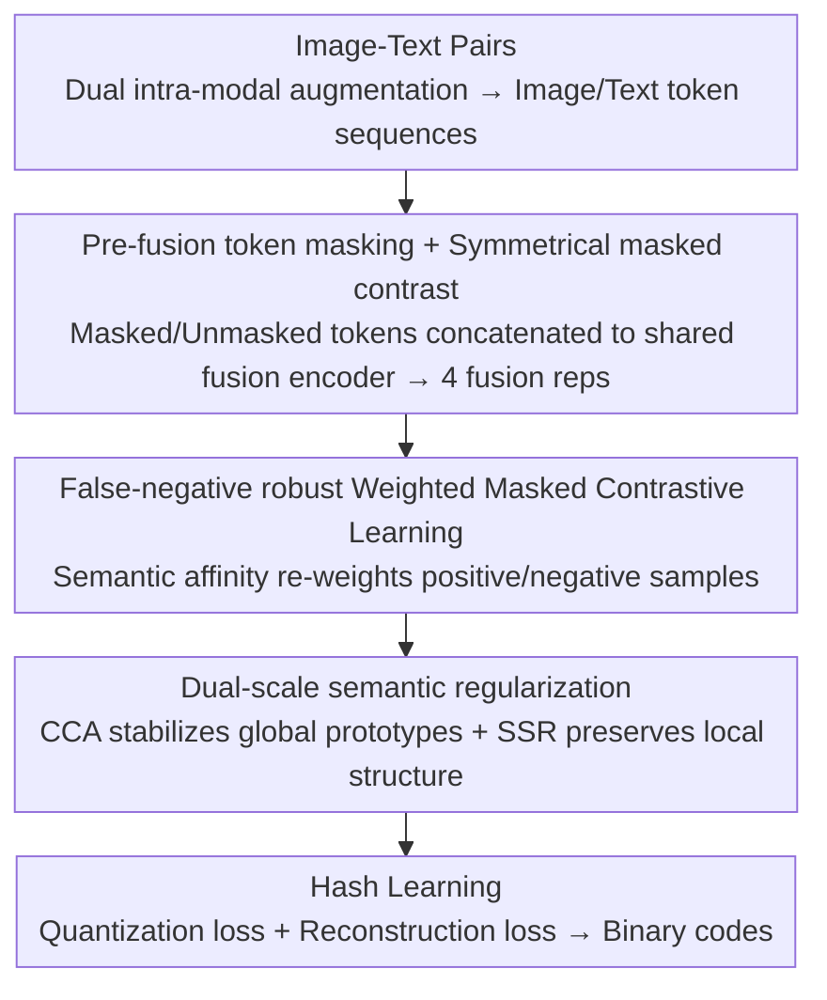

# Mask to Align, Weight to Disambiguate: Reliable Unsupervised Cross-Modal Hashing with Masked-Weight Contrast

**Conference**: CVPR 2026  
**Paper**: [CVF Open Access](https://openaccess.thecvf.com/content/CVPR2026/html/Yang_Mask_to_Align_Weight_to_Disambiguate_Reliable_Unsupervised_Cross_Modal_Hashing_CVPR_2026_paper.html)  
**Code**: None  
**Area**: Information Retrieval / Cross-Modal Hashing  
**Keywords**: Unsupervised cross-modal hashing, masked contrastive learning, false negatives, semantic structure regularization, binary codes  

## TL;DR
To address the "partial alignment + semantic ambiguity" issues in unsupervised cross-modal hashing, UWMCH performs token masking before fusion to force the model to learn complementary semantics. It then uses semantic affinity to re-weight contrastive losses to suppress false negatives, supplemented by dual-scale semantic regularization to stabilize the hashing space. It achieves the best mAP in 21 out of 24 settings across three retrieval benchmarks.

## Background & Motivation
**Background**: Cross-modal retrieval maps images and text into a shared representation space for efficient retrieval. Binary hashing is particularly suitable for large-scale scenarios as it compresses multi-modal data into compact hash codes and enables fast searches via Hamming distance. Recently, Transformers have become the mainstream backbone for cross-modal hashing due to their ability to model long-range dependencies and token-level interactions, with contrastive learning serving as the core training paradigm.

**Limitations of Prior Work**: Real-world multi-modal data is often only **partially aligned** and carries **semantic ambiguity**. This introduces three coupled problems: ① Strong token-level interaction does not guarantee global semantic geometric stability—while local alignment is achieved, drift may still occur at the class/cluster/centroid level, worsening hash space consistency; ② Contrastive optimization is sensitive to **false negatives**—semantically related samples in the same batch are indiscriminately treated as negative samples and repelled, while hard positives and ambiguous near-negatives remain indistinguishable; ③ Poor robustness under partial observation—when local evidence is missing or contaminated, the fusion process tends to over-rely on the dominant modality, producing unstable fusion representations and propagating misalignment to subsequent hashing learning.

**Key Challenge**: Prior works improved performance through semantic consistency penalties, Walsh domain structures, hypergraph associations, or concept mining. However, they **treated "partial feature robustness, false-negative mitigation, and semantic structure preservation" as separate issues**, lacking a unified framework to manage them simultaneously.

**Goal**: To resolve these three coupled issues within a single unsupervised framework.

**Key Insight**: Leveraging recent developments in masked interaction learning (InfMasking), the authors propose masking tokens **before fusion** to construct "partially observable" interactions. This breaks the model's shortcut dependency on complete token evidence, forcing the fusion encoder to excavate complementary clues from both modalities.

**Core Idea**: Coupling "pre-fusion masking + pairwise weighting guided by semantic priors" for contrastive learning, combined with dual-scale structural regularization, to integrate robust alignment, false-negative suppression, and geometric stability.

## Method

### Overall Architecture
The input to UWMCH (Unsupervised Weighted Masked Contrastive Hashing) is image-text pairs $(x^v_i, x^t_i)$, and the output is binary hash codes for retrieval. The pipeline functions as follows: each image-text pair undergoes two intra-modal augmentations to generate two views, each encoded into token sequences. In each view, original tokens are directly concatenated and fed into a **shared fusion encoder** to produce "unmasked fusion representations," while masked tokens are concatenated and fed into the same encoder to yield "masked fusion representations"—resulting in **4 fusion representations** across the two views. These are fed into Weighted Masked Contrastive Learning (WMCL) for cross-view masked↔unmasked alignment. Simultaneously, CCA and SSR perform regularization at the global prototype and local semantic structure levels, respectively. Finally, modality-specific hash heads produce binary codes.

### Key Designs

**1. Pre-fusion Token Masking + Symmetrical Masked Contrast: Breaking Shortcut Dependency via Partially Observable Interactions**

Directly concatenating complete tokens for fusion allows the model to take shortcuts—focusing only on the information-dense dominant modality, which fails under partial observation. The authors independently sample binary keep-masks $m^{v,(k)}_i, m^{t,(k)}_i$ for visual and textual tokens **before fusion**, retaining only a certain ratio $\rho$ of tokens (default $\rho=0.8$). These are element-wise multiplied and then concatenated for the shared fusion encoder $g(\cdot)$. Through two independent augmentations and the masked/unmasked dual-pathway, four representations are generated: unmasked $R^{(1)}_i, R^{(2)}_i$ and masked $\tilde{R}^{(1)}_i, \tilde{R}^{(2)}_i$ (all $\ell_2$ normalized). Since the two modal streams are perturbed **independently**, the model is forced to integrate cross-modal complementary clues. Alignment is performed using four symmetrically interacting InfoNCE terms: $L_{mask}=\mathbb{E}_M[\hat{I}_{NCE}(\tilde{R}^{(1)},R^{(2)})+\hat{I}_{NCE}(R^{(1)},\tilde{R}^{(2)})+\hat{I}_{NCE}(\tilde{R}^{(2)},R^{(1)})+\hat{I}_{NCE}(R^{(2)},\tilde{R}^{(1)})]$, ensuring bi-directional alignment between masked and unmasked views across augmentations for robustness.

**2. False-Negative Robust Weighted Masked Contrast: Softening Repulsion via Semantic Affinity**

In unsupervised settings, "unmatched pairs $\neq$ semantically dissimilar," but standard contrastive learning harshly repels semantically related samples in a batch, distorting the local semantic neighborhood. The authors construct a soft semantic prior to re-weight pairwise interactions. First, instance-level consistency is calculated as $S_{inst}(i,j)=\frac{1}{2}(\langle R^{(1)}_i,R^{(1)}_j\rangle+\langle R^{(2)}_i,R^{(2)}_j\rangle)$ and linearly scaled to $[0,1]$. Then, online mini-batch K-means yields prototypes to calculate soft assignments $q_i(k)$ and cluster consensus similarity $S_{clu}(i,j)=\sum_k q_i(k)q_j(k)$. These are fused into a unified semantic affinity $S_{sem}=\alpha S_{inst}+(1-\alpha)S_{clu}$ (default $\alpha=0.6$). For **positive samples**, larger weights are assigned to poorly aligned pairs $w_{pos}=(1-\langle u_i,v_i\rangle)^\gamma+\varepsilon$ to emphasize hard positives. For **negative samples**, higher affinity leads to weaker repulsion $W_{neg}(i,j)=(1-S_{sem}(i,j))^\eta+\varepsilon$, "soft-pressing" potential false negatives rather than flatly removing them. The resulting weighted masked InfoNCE $\hat{I}_{WMNCE}$ (which degrades to standard InfoNCE when $w_{pos}=1, W_{neg}=1$) forms $L_{WMCL}$, simultaneously achieving enhanced alignment, false-negative suppression, and mitigation of modality dominance.

**3. Dual-Scale Semantic Regularization: Stabilizing Prototypes Globally, Preserving Structures Locally**

Contrastive alignment only constrains cross-view matching and does not explicitly stabilize the semantic geometry of the fusion space, allowing class centroids to drift. The authors regularize across two complementary scales: **Cluster Consistency Alignment (CCA)** uses unmasked fusion features to construct current centroids $c_k$ and maintains an EMA prototype bank $c^{ema}_k$. InfoNCE is used to pull current centroids closer to their matching EMA prototypes and push them away from others ($L_{CCA}$), suppressing prototype drift. **Semantic Structure Regularization (SSR)** uses the transformed semantic prior $\hat{S}_{sem}=2S_{sem}-1$ to constrain the pairwise cosine similarity matrices of both unmasked and masked fusion features: $L_{SSR}=\|S_{cos}(\bar{R})-\hat{S}_{sem}\|_F^2+\|S_{cos}(\tilde{R})-\hat{S}_{sem}\|_F^2$. The first term manages the pairwise geometry under full observation, while the second maintains the same semantic geometry under masked perturbations, ensuring intra-class compactness and inter-class separation.

### Loss & Training
Two terms are added for hashing learning: **Quantization Loss** $L_{quan}=\frac{1}{B}\sum_i(\|y^v_i-b^v_i\|_1+\|y^t_i-b^t_i\|_1)$ pushes relaxed codes toward $\pm1$ to reduce the binarization gap; **Reconstruction Loss** $L_{recon}=\frac{1}{B}\sum_i(\|\hat{h}^v_i-h^v_i\|_2^2+\|\hat{h}^t_i-h^t_i\|_2^2)$ preserves semantic fidelity after binarization using lightweight decoders. The total loss is $L_{total}=\lambda_{wmcl}L_{WMCL}+\lambda_{cca}L_{CCA}+\lambda_{ssr}L_{SSR}+\lambda_{quan}L_{quan}+\lambda_{recon}L_{recon}$, with coefficients fixed at $\lambda_{wmcl}=1.0, \lambda_{cca}=\lambda_{ssr}=0.2, \lambda_{quan}=\lambda_{recon}=0.1$. Optimization uses Adam with a learning rate of $5\times10^{-4}$ ($0.1\times$ for the backbone), batch size 256, 50 epochs, and temperatures $\tau=0.08, t_c=0.2$.

## Key Experimental Results

### Main Results
Across three benchmarks (MIRFLICKR-25K, NUS-WIDE, MS COCO), two directions (I→T / T→I), and 4 code lengths (16/32/64/128 bits)—totaling 24 settings—UWMCH achieves the best mAP in **21 settings**. Representative results (mAP %) are shown below:

| Setting | Dataset | Ours (UWMCH) | Prev. SOTA | Gain |
|------|--------|-----------|------------------|------|
| I→T @16bit | NUS-WIDE | 84.76 | 83.48 (UCCH) | +1.28 |
| I→T @128bit | MS COCO | 89.30 | 90.07 (RSHNL) ⚠️ | -0.77 ⚠️ |
| I→T @128bit | NUS-WIDE | 89.30 ⚠️ | 88.91 (RSHNL) | +0.39 |
| T→I @128bit | MS COCO | 91.10 | 90.21 (RSHNL) | +0.89 |
| I→T @32bit | MIRFLICKR | 90.69 | 89.48 (RSHNL) | +1.21 |

> ⚠️ Some metrics in the MS COCO and NUS-WIDE columns for the 128-bit setting appear to have OCR alignment issues in the source cache (e.g., 89.30 appearing in multiple places); "Prev. SOTA" and "Gain" are based on Original Table 1. Explicitly stated gains include NUS-WIDE I→T +1.28 / +0.82 / +0.39 at 16/64/128 bits respectively, and MS COCO 128-bit I→T / T→I gains of +1.19 / +0.89.

The 8 compared baselines include DJSRH, JDSH, AGCH, CIRH, VLKD, UCCH, VTM-UCH, and RSHNL. UWMCH outperforms competitors across most Top-N precision and PR curves, with particularly significant advantages on the more challenging MS COCO dataset. t-SNE visualization shows more compact semantic clusters and better inter-class separation, with cross-modal samples aligned more effectively within each class.

### Ablation Study
Ablation of three objective terms on MIRFLICKR-25K (mAP %):

| Configuration | I→T@16 | I→T@32 | T→I@16 | T→I@32 | Description |
|------|--------|--------|--------|--------|------|
| $L_{WMCL}$ only | 87.43 | 88.24 | 86.28 | 87.40 | Weighted masked contrast is strong alone |
| + $L_{CCA}$ | 88.40 | 89.44 | 87.45 | 88.66 | Adds global centroid consistency |
| + $L_{SSR}$ | 88.16 | 89.67 | 87.19 | 88.51 | Adds local structure regularization |
| Full Model | 88.64 | 90.69 | 88.29 | 89.93 | All terms optimal at every code length |

### Key Findings
- **$L_{WMCL}$ is the foundation**: Using it alone yields strong results, indicating that the "pre-fusion masking + false-negative weighting" design provides the primary contribution.
- **$L_{CCA}$ slightly outperforms $L_{SSR}$**: While adding either term individually improves performance over WMCL, Global Cluster Consistency Alignment (CCA) provides slightly higher gains. The full objective is optimal across all code lengths, exceeding $L_{WMCL}$ alone by approximately **1.50** points on average.
- Iteration curves show rapid early improvement followed by stable convergence, indicating good optimization efficiency.

## Highlights & Insights
- **"Pre-fusion Masking" vs. "Post-fusion Masking"**: Masking modalities independently before token concatenation forces the model to extract complementary cross-modal semantics more effectively than perturbing fused representations, which directly eliminates the shortcut of focusing only on the dominant modality—this timing choice is critical.
- **"Soft-pressing" False Negatives instead of Deletion**: Reducing the weight of suspected false negatives via $W_{neg}=(1-S_{sem})^\eta$ rather than removing them prevents accidental deletion of true negatives while mitigating over-repulsion. This is more robust than hard-thresholding and transferable to other unsupervised contrastive scenarios.
- **Unified Hard-Positive & False-Negative Handling**: By emphasizing poorly aligned positives with $w_{pos}=(1-\langle u,v\rangle)^\gamma$ and down-weighting negatives via semantic affinity, both ends are synergized within a single weighted InfoNCE term, creating a clean, unified formulation.

## Limitations & Future Work
- The authors acknowledge the need to extend the method to **more scalable settings and richer multi-modal retrieval scenarios**, as it is currently validated on three standard image-text benchmarks.
- The method relies on online mini-batch K-means for prototype estimation and an EMA bank. There are numerous hyperparameters ($\rho, \alpha, \gamma, \eta, \lambda_s$), and the current analysis lacks a detailed sensitivity study for $\rho$ and $\alpha$, leaving the robustness boundaries unclear.
- In 3 out of 24 settings, it is non-optimal (slightly trailing RSHNL on certain code lengths in MS COCO/NUS-WIDE), suggesting its advantage over strong baselines is not entirely comprehensive on highly complex data.
- Future improvements could involve replacing prototype estimation with more stable hierarchical/hypergraph priors or making the mask ratio $\rho$ adaptive based on sample difficulty.

## Related Work & Insights
- **vs. InfMasking**: InfMasking also aligns masked and unmasked interactions to enhance semantic correspondence under partial visibility. Ours integrates this with **weighted contrast and structural regularization** into a unified framework and moves masking to before fusion.
- **vs. UCCH / RSHNL (Strong Contrastive Hashing Baselines)**: These focus on contrastive objectives and noise tolerance. Ours additionally explicitly handles false negatives (via semantic affinity weighting) and semantic geometric stability (CCA+SSR), surpassing them in most settings.
- **vs. MITH / CMCL (Fine-grained Interaction Contrast)**: These improve discriminability through fine-grained interaction modeling. The strength of Ours lies not in finer interaction, but in the joint handling of "partial observation robustness + false-negative mitigation + structure preservation."

## Rating
- Novelty: ⭐⭐⭐⭐ Pre-fusion independent masking combined with bi-directional semantic affinity weighting is a clean compositional innovation, though components reference prior work.
- Experimental Thoroughness: ⭐⭐⭐⭐ 24 settings across three benchmarks + ablation + t-SNE + iteration curves is comprehensive, but lacks critical hyperparameter sensitivity analysis.
- Writing Quality: ⭐⭐⭐⭐ Formulas and motivations are clearly explained; the three challenges are well-articulated.
- Value: ⭐⭐⭐⭐ Practical gains in unsupervised cross-modal hashing; the soft-pressing approach for false negatives is highly transferable.

<!-- RELATED:START -->

## Related Papers

- [\[CVPR 2026\] Intra-class Distribution-guided Generative Hashing with Neighbor Refinement for Cross-modal Retrieval](intra-class_distribution-guided_generative_hashing_with_neighbor_refinement_for_.md)
- [\[CVPR 2026\] CoV-Align: Efficient Fine-grained Cross-Modal Alignment with Cohesive Visual Semantics Priority](cov-align_efficient_fine-grained_cross-modal_alignment_with_cohesive_visual_sema.md)
- [\[ICML 2026\] Decentralized Instruction Tuning: Conflict-Aware Splitting and Weight Merging](../../ICML2026/multimodal_vlm/decentralized_instruction_tuning_conflict-aware_splitting_and_weight_merging.md)
- [\[AAAI 2026\] O3SLM: Open Weight, Open Data, and Open Vocabulary Sketch-Language Model](../../AAAI2026/multimodal_vlm/o3slm_open_weight_open_data_and_open_vocabulary_sketch-language_model.md)
- [\[ACL 2026\] Cross-Modal Masked Compositional Concept Modeling for Enhancing Visio-Linguistic Compositionality](../../ACL2026/multimodal_vlm/cross-modal_masked_compositional_concept_modeling_for_enhancing_visio-linguistic.md)

<!-- RELATED:END -->
