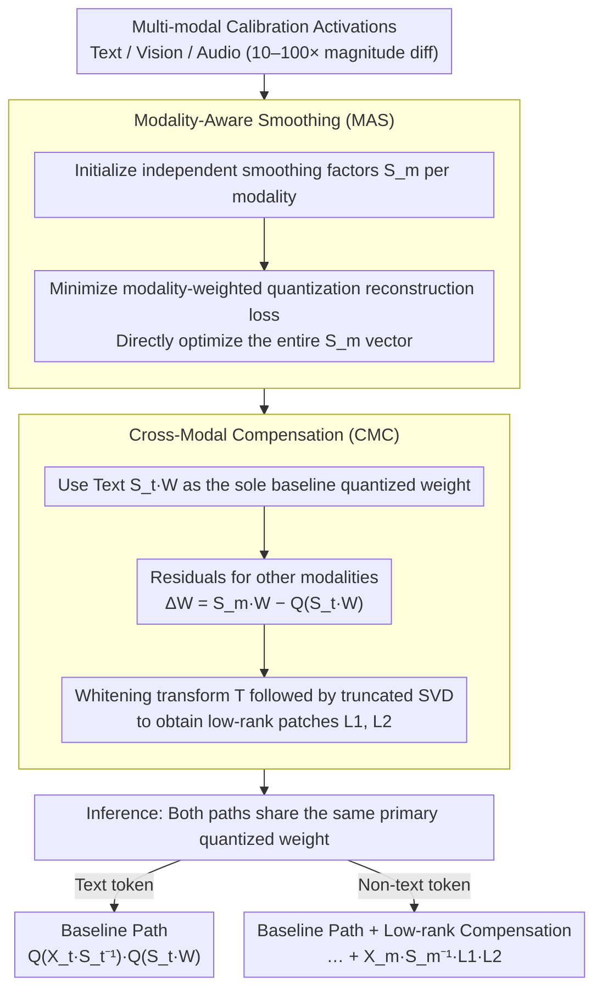

# MASQuant: Modality-Aware Smoothing Quantization for Multimodal Large Language Models

**Conference**: CVPR 2026  
**arXiv**: [2603.04800](https://arxiv.org/abs/2603.04800)  
**Code**: [https://github.com/alibaba/EfficientAI](https://github.com/alibaba/EfficientAI)  
**Area**: Multimodal VLM  
**Keywords**: Post-Training Quantization, Multimodal LLM, Smoothing Quantization, Cross-modal Compensation, Low-rank Decomposition

## TL;DR
This work reveals the "smoothing misalignment" problem when channel-wise smoothing quantization (e.g., SmoothQuant) is directly applied to MLLMs—where huge differences in activation magnitudes across modalities lead to over-smoothing of non-dominant modalities. MASQuant addresses this via modality-aware smoothing factors and cross-modal low-rank compensation based on SVD whitening.

## Background & Motivation

**Background**: Post-training quantization (PTQ) is a key technology for deploying large models. Channel-smoothing methods based on computational invariance (SmoothQuant, AWQ, etc.) perform excellently on text-only LLMs by redistributing activation outliers through channel scaling factors.

**Limitations of Prior Work**: When directly applying channel smoothing to MLLMs, the activation magnitude of visual tokens is typically 10-100 times larger than that of text tokens. A unified smoothing factor is determined by the dominant modality (usually vision), causing non-dominant modalities (text, audio) to be over-smoothed, signals to be compressed, and significant quantization errors—a phenomenon termed "smoothing misalignment."

**Key Challenge**: Learning independent smoothing factors for each modality solves misalignment but requires storing separate quantized weights for each modality, which contradicts the goal of quantization compression.

**Goal**: Can modality-aware smoothing quantization be achieved while maintaining a single set of quantized weights?

**Key Insight**: It is observed (and mathematically provable) that the weight differences after smoothing across different modalities are low-rank; thus, they can be compensated using lightweight low-rank matrices.

**Core Idea**: Learn modality-specific smoothing factors + store one set of quantized weights using the text modality as a baseline + compensate other modalities using low-rank decomposition with SVD whitening.

## Method

### Overall Architecture
MASQuant aims to solve the "smoothing misalignment" when migrating channel smoothing quantization to MLLMs: visual token activation magnitudes are 10–100× larger than text, causing a unified smoothing factor to be hijacked by the dominant modality, leaving non-dominant modalities like text or audio with almost no signal and exploding quantization errors. The solution involves two steps: first, eliminate misalignment at the source by learning optimal smoothing factors for each modality (Modality-Aware Smoothing, MAS); second, compress the per-modality weights back into a "single quantized weight + lightweight patches" using low-rank compensation (Cross-Modal Compensation, CMC). This achieves accuracy through modality awareness without sacrificing storage savings. The workflow establishes two components during calibration and executes two paths during inference:

### Key Designs

**1. Modality-Aware Smoothing (MAS): Learning optimal smoothing factors per modality instead of sharing one**

The root of misalignment is that a single smoothing factor $\mathbf{S}$ is dictated by the modality with the largest magnitude, forcing other modalities to adapt passively. MASQuant learns a separate set of smoothing factors $\mathbf{S}_m$ for each modality $m$: it starts with a classical initialization $s_i^m = \sqrt{\max_t|x_{t,i}^m| / \max_j|w_{j,i}|}$ and then directly minimizes the modality-weighted quantization reconstruction loss $\sum_{m} \lambda_m \cdot \mathcal{L}_{MAE}(\mathbf{S}_m, \mathbf{X}_m, \mathbf{W})$ to optimize the smoothing factors. Unlike SmoothQuant or AWQ which search for a scalar hyperparameter $\beta$, this method optimizes the entire smoothing factor vector, approaching the theoretical accuracy upper bound for channel smoothing. The SQNR degradation provides a quantitative explanation for requiring independent factors: under unified smoothing, the SNR of non-dominant modalities drops by

$$\Delta = 10\log_{10}\left(\frac{d\,(\min_i \alpha_i^2)}{\sum_i 1/\alpha_i^2}\right)$$

where $\alpha_i$ is the activation range ratio between modalities. Larger magnitude differences lead to a more negative $\Delta$ and more severe misalignment—quantifying the intuition that text is "drowned out" by vision.

**2. Cross-Modal Compensation (CMC): Compressing MAS weights back using a single quantized weight + low-rank patches**

While MAS recovers accuracy, it introduces a problem: a separate $\mathbf{S}_m$ for each modality implies distinct quantized weights $Q(\mathbf{S}_m\mathbf{W})$, neutralizing the storage benefits of quantization. CMC stores only the text modality set $Q(\mathbf{S}_t\mathbf{W})$ as a baseline, while other modalities use patches to recover differences. For vision, the residual against the baseline is $\Delta\mathbf{W} = \mathbf{S}_v \mathbf{W} - Q(\mathbf{S}_t \mathbf{W})$. Since $\Delta\mathbf{W}$ itself is not inherently low-rank, a whitening transform $\mathbf{T} = (\mathbf{P}\Lambda^{1/2})^\top$ is applied first. The transformed $\mathbf{T}(\Delta\mathbf{W})$ exhibits strong low-rank characteristics, allowing truncated SVD to approximate it with two thin matrices:

$$\Delta\mathbf{W} \approx \mathbf{L}_1 \mathbf{L}_2,\quad \mathbf{L}_1 = \mathbf{T}^{-1}\mathbf{U}_r,\ \ \mathbf{L}_2 = \Sigma_r \mathbf{V}_r^\top$$

The paper further proves that this "whitening + truncation" combination minimizes the output reconstruction error $\|\mathbf{X}_v \mathbf{S}_v^{-1}(\Delta\mathbf{W} - \mathbf{L})\|_F^2$. Thus, the compensation is not just an empirical trick but a theoretically guaranteed optimal low-rank approximation. Ultimately, non-text modalities only carry an extra pair of low-rank matrices, while the primary weight remains the unique quantized version.

### A Complete Example: Two types of tokens passing through the same layer

Consider a layer receiving both text and visual tokens. Text tokens follow the baseline path, completing smoothing, quantization, and multiplication:

$$\mathbf{Y} = Q(\mathbf{X}_t \mathbf{S}_t^{-1}) \cdot Q(\mathbf{S}_t \mathbf{W})$$

Visual tokens use their learned $\mathbf{S}_v$ to smooth activations but reuse the text-based quantized weight $Q(\mathbf{S}_t\mathbf{W})$. The missing part is recovered by the low-rank patch:

$$\mathbf{Y} = Q(\mathbf{X}_v \mathbf{S}_v^{-1}) \cdot Q(\mathbf{S}_t \mathbf{W}) + \mathbf{X}_v \mathbf{S}_v^{-1} \cdot \mathbf{L}_1^v \mathbf{L}_2^v$$

Both paths share the same primary quantized weight; the difference lies in using modality-specific smoothing factors and a lightweight low-rank multiplication for non-text modalities. This scales to triple-modality scenarios (e.g., adding audio) by adding another pair of $\mathbf{L}_1^m\mathbf{L}_2^m$, while only one set of primary weights is ever stored.

## Key Experimental Results

### Main Results (Qwen2.5-VL Series)

| Method | Bits | MMMU | OCRBench | ScienceQA | TextVQA | Avg |
|------|------|------|----------|-----------|---------|-----|
| FP16 | W16A16 | Baseline | Baseline | Baseline | Baseline | 100% |
| SmoothQuant | W8A8 | Significant Drop | Drop | Drop | Drop | - |
| MASQuant | W8A8 | **Optimal** | **Optimal** | **Optimal** | **Optimal** | SOTA |

### Cross-Architecture Validation

| Model Type | Description |
|---------|------|
| Dual-modal VLM | Consistently outperforms SmoothQuant and AWQ on Qwen2.5-VL-3B/7B |
| Tri-modal Omni | Equally effective on Qwen2.5-Omni-3B; audio modality also benefits |

### Ablation Study
- Using MAS alone significantly improves SQNR (verified by Theorem 1 in Figure 2).
- The low-rank approximation quality of CMC converges quickly as rank increases.
- The low-rank characteristic of residuals after whitening is far superior to direct SVD.

## Highlights & Insights
- First to formally define the "smoothing misalignment" problem in MLLM quantization and provide a theoretical SQNR analysis (Theorem 1).
- Mathematically proves the low-rank nature of cross-modal activation differences, providing theoretical guarantees for CMC (Theorem 2).
- The framework is applicable to both dual-modal (vision-text) and tri-modal (vision-text-audio) MLLMs.
- Maintains a single set of quantized weights with extremely low additional storage overhead (low-rank matrices only).
- Consistently outperforms existing channel-smoothing PTQ methods on Qwen2.5-VL and Qwen2.5-Omni.

### Ablation Study
- **MAS only (no CMC)**: Requires storing independent quantized weights per modality, but provides optimal quantization accuracy.
- **CMC only (no smoothing change)**: Limited patching effect because the underlying smoothing misalignment remains unresolved.
- **MAS + CMC (Full solution)**: Approaches the accuracy upper bound of MAS under the single-weight constraint.
- **CMC Low-rank Compensation**: A rank of 16-32 is usually sufficient to recover 90%+ of the accuracy gap.
- **Whitened $\mathbf{T}(\Delta\mathbf{W})$**: Singular values decay much faster than direct SVD, validating the low-rank hypothesis.

## Limitations & Future Work
- The calibration stage requires collecting data from each modality to optimize smoothing factors, increasing preprocessing complexity.
- Selecting the rank $r$ for low-rank compensation requires a trade-off between accuracy and additional storage.
- Only W8A8 and W4A8 settings are currently validated; performance for more aggressive low bit-widths (e.g., W2A4) is unknown.
- Inference for non-text modalities requires an additional matrix multiplication $\mathbf{X}_m \mathbf{S}_m^{-1} \cdot \mathbf{L}_1^m \mathbf{L}_2^m$, introducing minor latency overhead.
- Consider extending the modality-aware concept to rotation-based methods (e.g., QuaRot, SpinQuant).
- In scenarios with three or more modalities, the number of low-rank compensation matrices scales linearly, requiring memory management optimization.

### Implementation Details
- MAS optimization uses Adam, typically converging within 100-200 iterations.
- CMC low-rank matrices are stored in FP16, occupying negligible space compared to the full weight matrix.

<!-- RELATED:START -->

## Related Papers

- [\[CVPR 2026\] Fine-Grained Post-Training Quantization for Large Vision Language Models with Quantization-Aware Integrated Gradients](fine-grained_post-training_quantization_for_large_vision_language_models_with_qu.md)
- [\[CVPR 2026\] Direction-aware 3D Large Multimodal Models](direction-aware_3d_large_multimodal_models.md)
- [\[CVPR 2025\] MBQ: Modality-Balanced Quantization for Large Vision-Language Models](../../CVPR2025/multimodal_vlm/mbq_modality-balanced_quantization_for_large_vision-language_models.md)
- [\[CVPR 2026\] AutoTraces: Autoregressive Trajectory Forecasting via Multimodal Large Language Models](autotraces_autoregressive_trajectory_forecasting_via_multimodal_large_language_m.md)
- [\[CVPR 2026\] CoVFT: Context-aware Visual Fine-tuning for Multimodal Large Language Models](covft_context-aware_visual_fine-tuning_for_multimodal_large_language_models.md)

<!-- RELATED:END -->
