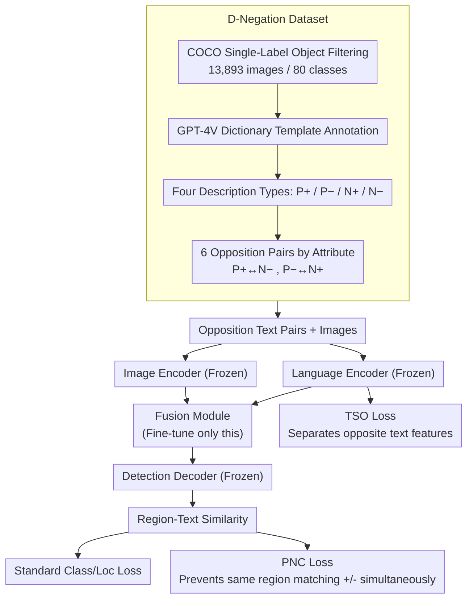

# Mastering Negation: Boosting Grounding Models via Grouped Opposition-Based Learning

**Conference**: CVPR2026  
**arXiv**: [2603.12606](https://arxiv.org/abs/2603.12606)  
**Code**: To be confirmed  
**Area**: Multimodal VLM  
**Keywords**: Visual Grounding, Negation Semantic Understanding, Opposition-Based Learning, Parameter-Efficient Fine-Tuning, Vision-Language Fusion, Negative Samples

## TL;DR

The authors propose the D-Negation dataset and Grouped Opposition-Based Learning (GOBL) fine-tuning mechanism. By utilizing semantic opposition pairs and two dedicated loss functions, the negation understanding of visual grounding models is significantly improved (up to +5.7 mAP) while fine-tuning less than 10% of parameters.

## Background & Motivation

**Negation is a fundamental component of natural language**: Humans frequently use negative expressions like "not a red cat" to describe objects. However, existing visual grounding (VG) models almost entirely ignore negation words, sometimes yielding completely opposite grounding results.

**Lack of negation training data**: Existing VG datasets (LVIS, Object365, Flickr30K, GQA) primarily contain positive descriptions or simple category names, lacking annotated data for negation semantics.

**Insufficient modifier understanding**: Correctly processing negation requires understanding attribute modifiers (color, position, state), which is a weak point for current models.

**Ineffectiveness of simple data augmentation**: Experiments show that fine-tuning with positive data like Flickr30k can even decrease negation performance, indicating the need for targeted training strategies.

**Fusion module as the bottleneck**: The authors discovered that while text encoders encounter negation during pre-training and detection decoders can handle positive references, the vision-language fusion module is where positive and negative features are truly confused.

**Practical demand for efficient fine-tuning**: Mainstream models (GLIP, Grounding-DINO, APE) are trained on millions of images. Full retraining is prohibitively expensive, necessitating parameter-efficient adaptation.

## Method

### Overall Architecture

The method is built upon standard visual grounding models (image encoder + language encoder + fusion module + detection decoder). The authors identified the **vision-language fusion module** as the primary bottleneck for feature confusion. Consequently, they only fine-tune the fusion module (<10% parameters), utilizing 6 groups of semantic opposition pairs from the D-Negation dataset for supervision. Alongside standard grounding losses, PNC and TSO constraints are introduced. The workflow involves: constructing the D-Negation dataset offline, feeding paired opposite text and images into frozen encoders, training only the fusion module, and outputting grounding results via the detection decoder with constraints applied at the text feature level (TSO) and region-text matching level (PNC).

### Key Designs

**1. D-Negation Dataset: Formulating Negation as Paired Opposition Supervision**

Existing VG datasets lack negation annotations. D-Negation filters images from COCO containing single-label objects (13,893 images, 80 categories) and uses GPT-4V to generate annotations in a strict dictionary format. For color, position, and state attributes, 12 descriptions per object are generated across four categories: P+ (positive-correct, "red cat"), P- (positive-wrong hard negative, "black cat"), N+ (negation-correct, "not a black cat"), and N- (negation-wrong hard negative, "not a red cat"). These are paired into 6 opposition groups (P+ vs N-, P- vs N+), totaling 139,980 text annotations.

**2. Fine-tuning Only the Fusion Module: Targeting the Bottleneck**

Full retraining is costly. Identifying the fusion module as the source of confusion, the authors freeze the text encoder, image encoder, and detection decoder, tuning only the fusion module (approx. <10% parameters). This process completes in about 10 hours (1 epoch, batch size 1). Ablations show fusion module tuning (+4.7/+5.7) significantly outperforms tuning the text encoder (+0.7), decoder (+1.2), or image encoder (-0.3).

**3. Positive-Negation Constraint (PNC) Loss: Preventing Simultaneous Matching**

For a single image region, the model calculates the similarity with both positive and negative descriptions. After normalization via softmax (temperature $\sigma=5$), it is matched against ground truth. This forces the model to distinguish opposite semantics by preventing the same region from matching both positive and negative descriptions.

**4. Text Semantic-Opposite (TSO) Loss: Expanding Features in Space**

The high similarity between positive and negative text features causes fusion confusion. TSO explicitly pushes apart semantic opposite text feature vectors in the feature space:

$$L_{\text{TSO}} = \frac{1}{N}\left(2 - \sum_{i=1}^{N} \|f_p - f_n\|_2^2\right)$$

Widening the gap between positive ($f_p$) and negative ($f_n$) features mitigates confusion at the source.

### Loss & Training

The total loss adds two opposition constraints to the standard classification and localization losses:

$$L_{\text{total}} = L_{\text{cls}} + L_{\text{loc}} + \alpha L_{\text{PNC}} + \beta L_{\text{TSO}}$$

Where $\alpha=0.5$ and $\beta=0.3$.

## Key Experimental Results

### Main Results: D³ Dataset (Negation Benchmarking)

| Method | Full | Presence | Absence |
|------|------|----------|---------|
| APE-C (baseline) | 27.8 | 27.9 | 27.3 |
| APE-C (+Ours) | **32.5** (+4.7) | **32.3** (+4.4) | **33.0** (+5.7) |
| APE-D (baseline) | 37.5 | 38.8 | 33.9 |
| APE-D (+Ours) | **38.6** (+1.1) | **39.8** (+1.0) | **35.0** (+1.1) |
| G-DINO-Base | 15.6 | 16.4 | 13.4 |
| G-DINO-Base (+Ours) | **17.8** (+2.2) | **17.4** (+1.0) | **19.0** (+5.6) |

- The Absence (negation) subset shows the most significant gains (+5.7 on APE-C, +5.6 on G-DINO-Base).
- Improvements in the Presence (positive-only) subset suggest better modifier understanding.

### D-Negation Test Set

| Method | Original | +Flickr30k | +Ours |
|------|----------|------------|-------|
| APE-D | 78.9 | 80.2 (+1.3) | **84.1** (+5.2) |
| APE-B | 80.5 | 78.9 (-1.6) | **83.7** (+3.2) |

- Fine-tuning with Flickr30k sometimes degrades performance, proving non-targeted data is ineffective.

### Ablation Study

**Data Type Ablation** (APE-C on D³):
- Positive only: Full +0.3, Absence -0.3
- Negative only: Full -0.4, Absence +0.6
- Combined: Full +0.9, Absence +1.8
- Combined + GOBL: Full **+4.7**, Absence **+5.7**
- Conclusion: Positive and negative semantics are complementary; the GOBL mechanism provides the primary gain.

**Fine-tuning Module Ablation**:

| Module | Full | Absence |
|------|------|---------|
| Text Encoder | +0.7 | +1.1 |
| Image Backbone | -0.3 | -0.7 |
| Decoder | +1.2 | +1.3 |
| **Fusion Module** | **+4.7** | **+5.7** |

- Confirms the fusion module is the key bottleneck for negation understanding.

### Key Findings

1. Improving negation also enhances positive semantic performance; modifiers show transferability across attributes.
2. Performance is stable across a wide range of hyperparameters ($\sigma, \alpha, \beta$).
3. Mixed training with Flickr30k can further reach Full +5.1 and Absence +6.2.
4. Positive performance on RefCOCO is maintained or slightly improved (APE-C: val +0.7, testA +1.0).

## Highlights & Insights

- **Precise Problem Definition**: First systematic study of negation in visual grounding, filling gaps in both data and methodology.
- **Extreme Efficiency**: Significant gains achieved with only 13K images and <10% parameters tuned over 1 epoch—hundreds of times more efficient than original training scales.
- **Validated Hypotheses**: Strict control experiments confirm that the fusion module is the bottleneck and that positive/negative semantics are complementary.
- **Practicality**: The method is plug-and-play for mainstream frameworks like GLIP, Grounding-DINO, and APE.

## Limitations & Future Work

- D-Negation is limited in size (13K images) and focuses on single-instance images, differing from multi-instance real-world scenes.
- Fine-tuning only the fusion module does not improve the image backbone's fine-grained attribute representation; failures still occur when visual discriminability is low.
- Attributes only cover color, position, and state, excluding materials, textures, or actions.
- Gains on the largest model (APE-D) are limited (+1.1), suggesting potential saturation effects.

## Related Work & Insights

- **Visual Grounding**: Frameworks like MDETR, GLIP, and Grounding-DINO are mainstream but do not model negation.
- **Negative Samples**: CREPE/NegCLIP introduce hard negatives; CLIPN/CoN-CLIP use negative prompts for classification/OOD, but these are restricted to classification granularity.
- **Opposition-Based Learning (OBL)**: Previously used for accelerating learning; this is its first application in vision-language grounding.

## Rating

- Novelty: ⭐⭐⭐⭐ — First negation VG dataset + OBL fine-tuning mechanism.
- Experimental Thoroughness: ⭐⭐⭐⭐⭐ — Multiple models and benchmarks with multi-dimensional ablations.
- Writing Quality: ⭐⭐⭐⭐ — Clear structure and logical chain.
- Value: ⭐⭐⭐⭐ — Identified a structural bottleneck and provides an efficient solution, though data scope is limited.

<!-- RELATED:START -->

## Related Papers

- [\[CVPR 2026\] Boosting Reasoning in Large Multimodal Models via Activation Replay](boosting_reasoning_in_large_multimodal_models_via_activation_replay.md)
- [\[CVPR 2026\] Grounding Everything in Tokens for Multimodal Large Language Models](grounding_everything_in_tokens_for_multimodal_large_language_models.md)
- [\[CVPR 2026\] Visual Grounding for Object Questions](visual_grounding_for_object_questions.md)
- [\[CVPR 2026\] VGent: Visual Grounding via Modular Design for Disentangling Reasoning and Prediction](vgent_visual_grounding_via_modular_design_for_disentangling_reasoning_and_predic.md)
- [\[CVPR 2026\] Small Object, Great Challenge: A Benchmark for Small Object Visual Grounding](small_object_great_challenge_a_benchmark_for_small_object_visual_grounding.md)

<!-- RELATED:END -->
