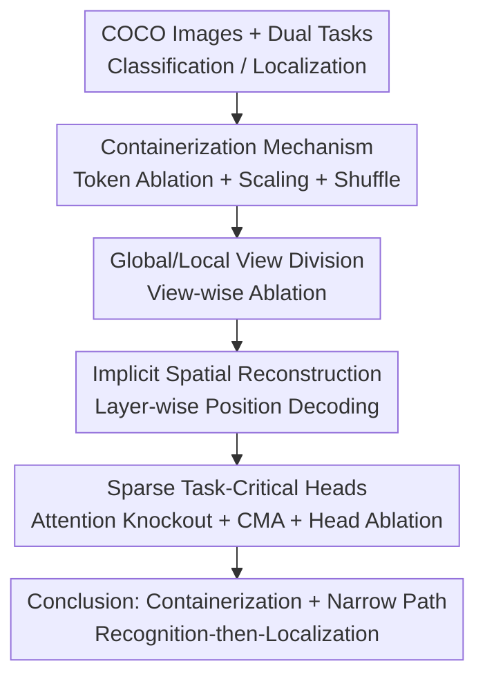

# Mechanisms of Object Localization in Vision-Language Models

**Conference**: CVPR 2026  
**arXiv**: [2605.19792](https://arxiv.org/abs/2605.19792)  
**Code**: https://github.com/t9s9/vlm-loc-mechanisms (Available)  
**Area**: Multimodal VLM / Mechanistic Interpretability  
**Keywords**: Mechanistic Interpretability, Object Localization, Causal Mediation Analysis, Attention Knockout, Containerization  

## TL;DR
The authors use a suite of mechanistic interpretability tools (token ablation, attention knockout, causal mediation analysis) to dissect "how" LLaVA-1.5 and InternVL-3.5 internally localize objects. They find that localization relies on a "containerization" mechanism—where a collective set of object-region tokens defines the spatial extent regardless of their internal semantic arrangement. Furthermore, the causal chain is carried by a few sparse attention heads, with nearly non-overlapping sets of specialized heads for classification vs. localization, and localization causally depends on intermediate classification results in a "recognition-then-localization" sequential computation.

## Background & Motivation
**Background**: Mainstream VLMs follow the `ViT → MLP → LLM` paradigm: a visual encoder extracts patch features, a multimodal projector maps them into the language space, and the LLM processes them alongside text. This architecture is powerful for VQA and captioning and can answer localization questions like "where is the object."

**Limitations of Prior Work**: Despite their capabilities, VLMs frequently fail at basic visual tasks, such as misclassification or inaccurate localization. Crucially, while the internal mechanisms of "classification" have been studied, "localization" remains largely a black box: where, at which layer, and via which components the model calculates a bounding box is unknown.

**Key Challenge**: Most VLM visual features are inherited from CLIP, which is trained with global image-text contrastive supervision and naturally lacks pixel-level precision. Theoretically, such "weakly-grounded" features should not support precise localization, yet VLMs can localize. This implies the model must be "reconstructing spatial structure from weakly-grounded representations" within the LLM. How this reconstruction occurs is the question this paper answers.

**Goal**: To provide a **layer-wise and head-wise** mechanistic explanation of VLM object localization. Specifically, it addresses: In which tokens is localization information encoded? Is spatial structure brought in by the backbone or reconstructed by the LLM? Which layers and heads concentrate the task processing? Are classification and localization shared or separated?

**Key Insight**: Instead of proposing a new model, the authors treat the model as a "dissection subject." They use mechanistic interpretability tools (token ablation, perturbation, position decoding, attention knockout, causal mediation) to dig deeper, comparing the simpler LLaVA-1.5 with the state-of-the-art InternVL-3.5 (featuring token compression and multi-view).

**Core Idea**: Utilize causal intervention (rather than mere correlation probes) to narrow down the localization mechanism to a narrow computational path of "containerization + sparse specialized heads + recognition-before-localization."

## Method

### Overall Architecture
This is a **mechanistic analysis** paper; it does not propose a new model. The "method" is a carefully designed causal intervention pipeline. Inputs are cleaned images from the COCO validation set, each paired with two prompts—classification (listing objects) and localization (providing a bounding box, with accuracy measured as the mean success rate at IoU thresholds 0.5/0.7/0.9). Targets include LLaVA-1.5 (7B/13B) and InternVL-3.5-8B. The approach narrows down from coarse to fine: identifying **which tokens** encode localization (token ablation), which **view** is responsible in InternVL (dual-view ablation), who **reconstructs** spatial structure (position decoding), and finally identifying **specific layers and heads** (attention knockout → causal mediation analysis → head ablation).

To ensure the analysis targets "real object evidence" rather than background context, the authors constructed an **object-removal control set**: using LaMa to remove the target object and inpaint the background, keeping only pairs where the model recognizes the original but not the inpainted version (2,248 annotations across 1,720 images).

### Key Designs

**1. Containerization Mechanism: Localization relies on collective token boundaries, not internal semantics.**

The authors first ask where localization info resides. They perform token ablation at the LLM input (after projection, before PE), replacing selected visual tokens with a global average visual embedding (preserving statistics but erasing content). Comparing four strategies—object tokens (mask-projected), register tokens (high-norm), Integrated Gradients tokens, and random tokens—erasing **object tokens** caused the sharpest drop (LLaVA-7B localization $35.34\to5.92$, classification $58.10\to19.44$). 

Two further perturbation experiments provide the "aha" moment. First, expanding the object mask with $p$ layers of padding and filling them with randomly copied object tokens—which **expands spatial range but disrupts internal structure**—caused the predicted boxes to **expand accordingly**. Second, shuffling only tokens within the object mask caused negligible drops in localization (LLaVA-7B ↓0.0), while shuffling all tokens crashed performance (↓33.4). Together, this shows models treat a cluster of object tokens as a **"container" to define spatial extent**, where the box size is determined by "where the object tokens are," not the correctness of their internal semantic arrangement.

**2. Global/Local View Division: Global view for space, local view for semantics.**

InternVL uses Pixel Shuffle and dynamic high-resolution (global thumbnail + local high-res crops). The authors ablated object tokens in global vs. local views separately. A clear **division of labor** emerged: removing global object tokens dropped localization by $-36.4\%$, compared to only $-9.7\%$ for local tokens. Classification dropped in both but by less. Small objects were sensitive to both views, while large objects relied mainly on global views for localization (removing local crops even slightly improved performance by $+6.5\%$).  
Conclusion: **The global view is the primary spatial carrier for localization, while local crops provide classification details especially for small objects.**

**3. Implicit Spatial Reconstruction: LLMs reconstruct the 2D grid from 1D sequences.**

If CLIP-like backbones lose spatial precision as depth increases, where does the 2D structure come from? The authors trained linear classifiers for each layer to predict the row/column position of each token. While spatial info disappears in the backbone's final layers, **LLM position decodability starts low but peaks in middle layers** (LLaVA-7B Layer 12, InternVL Layer 7).  
The multimodal projector preserves strong signals for the **four image corners**. These corners act as **structural anchors**, allowing the LLM to infer "line breaks" and reorganize the 1D sequence back into a grid.

**4. Sparse Task Heads + Sequential Mechanism: Few heads carry the causal effect.**

Using **attention knockout** (blocking attention to object tokens by layer groups), they found LLaVA relies on early-mid layers and InternVL on mid-late layers. Both tasks share early layers, but localization requires extra task-specific processing, hinting at a "recognition-then-localization" sequence.  
**Causal Mediation Analysis (CMA)** further localized this to individual heads by patching activations from a "source" run (object present) into a "base" run (object inpainted), calculating the Mediation Fraction (MF):

$$\text{MF} = \frac{P_{\text{base}} - P_{\text{patched}}}{P_{\text{base}} - P_{\text{src}}}$$

Results showed extreme **sparsity**: only a few heads have high MF. In LLaVA, dominant heads were in layers 11–16; in InternVL, layers 16–22. The top heads for the two tasks **barely overlap**. However, ablating "classification-critical heads" significantly crippled **localization**, confirming that localization causally relies on intermediate classification representations.

### Loss & Training
This is an analytical study using frozen VLMs. The only "training" involved was for the linear position classifiers used in decoding (10 epochs on ImageNet 50k train / 10k test) and the activation patching for CMA using 50 source/base image pairs.

## Key Experimental Results

### Main Results
Token Ablation (Table 1, excerpt). Conclusion: Erasing object tokens causes a cliff-like drop; localization is more sensitive than classification.

| Model | Ablation Strategy (token%) | Loc (%) | Class (%) |
|------|------|------|------|
| LLaVA-7B | Baseline (0%) | 35.34 | 58.10 |
| LLaVA-7B | Object tokens (8%) | 5.92 ↓29.4 | 19.44 ↓38.7 |
| LLaVA-7B | +2 padding (21%) | 0.34 ↓35.0 | 10.59 ↓47.5 |
| LLaVA-7B | Random (8%) | 35.09 ↓0.2 | 56.58 ↓1.5 |
| InternVL-3.5-8B | Baseline (0%) | 72.64 | 83.30 |
| InternVL-3.5-8B | Object tokens | 11.27 ↓61.4 | 33.19 ↓50.1 |

Token Shuffle (Table 2, excerpt). Conclusion: Shuffling all tokens crashes localization, but shuffling within the object mask has almost no effect.

| Model | Perturbation | Loc (%) | Class (%) |
|------|------|------|------|
| LLaVA-7B | Baseline | 35.34 | 58.10 |
| LLaVA-7B | Global shuffle | 1.90 ↓33.4 | 62.42 ↑4.3 |
| LLaVA-7B | Intra-object shuffle | 35.30 ↓0.0 | 58.44 ↑0.3 |

### Ablation Study
InternVL view-wise ablation (Table 3, excerpt).

| View | Config | Loc (%) | Class (%) |
|------|------|------|------|
| Global | Object token ablation | 36.20 ↓36.4 | 73.80 ↓9.5 |
| Local | Object token ablation | 62.93 ↓9.7 | 76.65 ↓6.6 |

### Key Findings
- **Containerization Confirmed**: Intra-object shuffle does not affect localization (LLaVA-7B ↓0.0). Localization is determined by "where" object tokens are, not their internal semantic order.
- **LLM-Reconstructed Space**: Backbone spatial info vanishes at the end, but LLM decodability peaks in middle layers. Image corners serve as anchors.
- **Extreme Sparsity & Task Separation**: A few heads carry almost all causal effect. Top-10 heads for classification vs. localization share only 1–2 heads.
- **Sequential Dependence**: Ablating classification heads cripples localization, proving a "recognition-then-localization" causal order.
- **View Specialization**: Global views carry spatial signals; local views complement classification details for small objects.

## Highlights & Insights
- **"Containerization" is a vivid discovery**: Proving that localization relies on range rather than semantic arrangement via padding and shuffling experiments is more convincing than simple probing because it uses causal intervention.
- **Inpaint Control Design**: Using LaMa to create anti-factual base images for CMA removes "contextual hallucination" as a confounding factor, ensuring conclusions are based on actual object evidence.
- **Causal Evidence for Sequential Logic**: Instead of correlation, the "classification head ablation" experiment proves that localization depends on classification outputs, providing a direction for targeted fine-tuning.
- **View Synergy**: Defining global/local views as "complementary rather than redundant" has direct engineering implications for calculating optimal crop counts for power vs. accuracy.

## Limitations & Future Work
- **Limitations**: The study uses a filtered COCO subset (single target per query). Analysis is focused on attention heads and frozen models; MLP components and training dynamics were not explored.
- **Generalization**: Results are based on LLaVA and InternVL families; whether they extend to more complex architectures or tasks (segmentation, video) remains to be seen.
- **Future Directions**: Targeted fine-tuning of localization heads or grounding-aware attention supervision could enhance performance without full model retraining. Dynamic tiling based on task/object size is also proposed.

## Related Work & Insights
- **vs. Previous VLM Interpretability**: Unlike prior works focusing on high-level reasoning or hallucination, this paper specifically targets localization and achieves head-level causal granularity.
- **vs. VLM Failure Mode Research**: While others document systematic weaknesses (counting, spatial reasoning), this work explains "where and how" these representations emerge.
- **vs. Grounding Enhancement (e.g., Qwen-VL)**: While those models use more data to improve grounding, their internal mechanics remain black boxes. This paper explains the mechanism, allowing for more informed architecture or supervision design.

## Rating
- Novelty: ⭐⭐⭐⭐⭐ First head-level mechanistic explanation for VLM localization.
- Experimental Thoroughness: ⭐⭐⭐⭐ 5 types of interventions across 3 models; however, limited to single-target COCO.
- Writing Quality: ⭐⭐⭐⭐⭐ Logical progression from coarse to fine; intuitive perturbation designs.
- Value: ⭐⭐⭐⭐ Insights directly inform future head-tuning and dynamic tiling strategies.

<!-- RELATED:START -->

## Related Papers

- [\[CVPR 2026\] Understanding Counting Mechanisms in Large Language and Vision-Language Models](understanding_counting_mechanisms_in_large_language_and_vision-language_models.md)
- [\[CVPR 2026\] VLM-Loc: Localization in Point Cloud Maps via Vision-Language Models](vlm-loc_localization_in_point_cloud_maps_via_vision-language_models.md)
- [\[ICLR 2026\] Visual Symbolic Mechanisms: Emergent Symbol Processing in Vision Language Models](../../ICLR2026/multimodal_vlm/visual_symbolic_mechanisms_vlm.md)
- [\[CVPR 2026\] Boosting Vision-Language Models Towards Cross-Domain Incremental Object Detection](boosting_vision-language_models_towards_cross-domain_incremental_object_detectio.md)
- [\[CVPR 2026\] ORIC: Benchmarking Object Recognition under Contextual Incongruity in Large Vision-Language Models](oric_benchmarking_object_recognition_under_contextual_incongruity_in_large_visio.md)

<!-- RELATED:END -->
