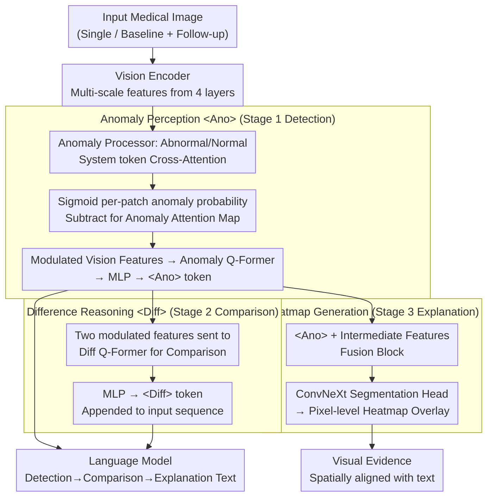

# Medic-AD: Towards Medical Vision-Language Model's Clinical Intelligence

**Conference**: CVPR 2026  
**arXiv**: [2603.27176](https://arxiv.org/abs/2603.27176)  
**Code**: [https://github.com/AIDASLab/Medic-AD](https://github.com/AIDASLab/Medic-AD)  
**Area**: Multimodal VLM  
**Keywords**: Medical VLM, Anomaly Detection, Longitudinal Tracking, Explainability, Heatmap

## TL;DR

Medic-AD upgrades general-purpose medical VLMs into clinical intelligence models capable of lesion detection, symptom tracking, and visual explainability through a three-stage progressive training framework involving an anomaly detection token (`<Ano>`), a temporal difference reasoning token (`<Diff>`), and visual heatmaps. It achieves SOTA performance across multiple medical tasks.

## Background & Motivation

Medical VLMs have progressed rapidly, but most optimize for "broad medical knowledge coverage" rather than "actual clinical application." Real-world clinical workflows require three critical capabilities: (1) accurate lesion detection, (2) reliable longitudinal symptom tracking, and (3) transparent visual explainability.

**Key Challenge**: Existing medical VLM training relies on long-text descriptions, OCR instructions, and CoT reasoning. While these enhance generalized reasoning, they neglect the precise perception and verifiable reasoning processes required in clinical settings.

**Goal**: Design a VLM training paradigm that follows the clinical diagnostic workflow: "Detection → Comparison → Explanation."

## Method

### Overall Architecture

Medic-AD addresses the gap where off-the-shelf medical VLMs lack precision in clinical tasks: locating lesions, comparing changes over time, and providing visual evidence. It decomposes these into a "Detection → Comparison → Explanation" diagnostic pipeline, trained progressively in three stages on the Lingshu baseline. Each stage introduces a specialized token and module, with subsequent stages reusing representations learned previously. Stage 1 enables the model to identify "where the anomaly is" via the `<Ano>` token; Stage 2 compares two scans to produce the `<Diff>` token; Stage 3 restores anomaly representations into spatial heatmaps. Modules from prior stages are frozen to ensure ability retention.

### Key Designs

**1. Anomaly Perception token `<Ano>`: Explicitly modeling "what is abnormal" instead of implicit guessing.**

Vision features in general VLMs are learned for "describing images" and are insensitive to subtle local anomalies like lesions. Stage 1 introduces an anomaly processor using two learnable system tokens (Abnormal and Normal). These interact with multi-scale features from four intermediate layers of the vision encoder via cross-attention to calculate per-patch "abnormal-like" and "normal-like" responses. Critically, Sigmoid is used instead of Softmax for patch-wise anomaly probability; while Softmax forces competition between patches, Sigmoid allows multiple lesion patches to maintain high values simultaneously, reflecting real-world cases with multiple lesions. The difference between the two responses forms an Anomaly Attention Map, which modulates vision features element-wise (amplifying lesion areas and suppressing normal ones). The modulated features are compressed into an `<Ano>` token via 2D global pooling, an Anomaly Q-Former, and a two-layer MLP. This ensures anomaly information enters the LLM as a compact, interpretable semantic bottleneck.

**2. Difference Reasoning token `<Diff>`: Enabling the model to read "between" two scans.**

The difficulty of longitudinal tracking lies in the fact that simply concatenating features from baseline and follow-up scans results in two sets of static features, making it hard to distinguish between "deterioration, improvement, or stability." Stage 2 feeds the modulated features of both images into a Diff Q-Former to explicitly compare and isolate lesion-specific change patterns. The projected vision tokens of each image serve as keys/values, while learnable queries in the Diff Q-Former extract differences. The output is processed by an MLP into a `<Diff>` token appended to the sequence. The model no longer needs to infer changes from raw features but utilizes a dedicated "change vector" for explicit reasoning.

**3. Heatmap Generation: Restoring abstract anomaly representations into physician-readable evidence.**

Clinical utility requires visual evidence justifying the model's judgment. Stage 3 reuses the `<Ano>` token from Stage 1, combining it with intermediate vision encoder features in a fusion block. This is fed into a lightweight ConvNeXt segmentation head to generate pixel-level heatmaps overlaid on the original image. Since the heatmap is derived from the same `<Ano>` representation, it is spatially aligned with the textual reasoning, ensuring the model "speaks" and "draws" about the same region.

### A Complete Example

Using a brain MRI follow-up: A clinician provides baseline and follow-up scans and asks if the lesion has progressed. **Stage 1** processes both images; the anomaly processor identifies high anomaly probabilities in the right temporal lobe of the follow-up scan, amplifying that area to produce an `<Ano>` token. **Stage 2** compares the modulated features in the Diff Q-Former, detects the expanded lesion area, and outputs a `<Diff>` token. The LLM then answers "The lesion has increased compared to baseline, suggesting progression." **Stage 3** takes the `<Ano>` token of the follow-up scan through the ConvNeXt head to render a heatmap on the right temporal lobe. The clinician can immediately verify that the model is looking at the correct area.

### Loss & Training

Progressive three-stage training is employed, freezing previous modules at each step to stack capabilities without catastrophic forgetting. Stage 1 uses anomaly detection datasets (BMAD, ChestX-Det) and medical VQA data. Stage 2 utilizes MIMIC-Diff-VQA longitudinal data. Stage 3 uses subsets of BMAD and ChestX-Det with pixel-level segmentation masks.

## Key Experimental Results

### Main Results

| Model | Brain MRI F1 | Head CT F1 | COVID-19 F1 | Avg F1 |
|------|-------------|-----------|-------------|--------|
| GPT-4o | 74.1 | 65.5 | 44.4 | 62.4 |
| Citrus-V (8B) | 90.2 | 88.1 | 70.9 | 84.2 |
| Lingshu (7B) | 88.4 | 92.8 | 84.2 | 88.7 |
| **Medic-AD (7B)** | **91.5** | **93.3** | **89.4** | **91.2** |

### Ablation Study

| Config | Anomaly Detection | Symptom Tracking | Explainability | Notes |
|------|---------|---------|---------|------|
| Baseline Lingshu | 88.7 | Low | None | No clinical specialization |
| + Stage 1 (`<Ano>`) | 91.2 | Improved | None | Enhanced anomaly perception |
| + Stage 2 (`<Diff>`) | 91.2 | SOTA | None | Enhanced temporal reasoning |
| + Stage 3 (Heatmap) | 91.2 | SOTA | SOTA | Full clinical capability |

### Key Findings

- The introduction of the `<Ano>` token provides the most significant improvement in anomaly detection, suggesting explicit anomaly modeling is more effective than implicit reasoning.
- Stability and clinical credibility were validated using real-world longitudinal hospital data.
- The 7B open-source model outperforms closed-source models like GPT-4o and Claude-3.5 on these specialized tasks.

## Highlights & Insights

- **Clinical Workflow Alignment**: The "Detection → Comparison → Explanation" design maps directly to a physician's diagnostic process, making this task-driven paradigm more effective than purely data-driven ones.
- **Special Tokens as Information Bottlenecks**: The `<Ano>` and `<Diff>` tokens force the model to compress rich visual information into compact semantic representations, providing interpretable intermediate states and avoiding information overload.
- **Real-world Clinical Validation**: Validation on actual hospital workflow data increases the credibility and practical value of the research.

## Limitations & Future Work

- Three-stage training requires diverse types of annotated data, leading to high total data demand.
- Heatmap precision is limited by the segmentation head; it may lack granularity for extremely small lesions.
- Generalization to other modalities (e.g., pathology slides) beyond MRI/CT/X-ray requires further testing.
- Future work could explore end-to-end joint training as an alternative to progressive training.

## Related Work & Insights

- **vs Lingshu/Citrus-V**: While these models focus on general medical knowledge, Medic-AD specializes in core clinical capabilities.
- **vs AnomalyGPT**: While AnomalyGPT focuses on industrial anomaly detection, Medic-AD is specifically architected for medical scenarios.
- **vs Traditional Medical Image Analysis**: Unlike traditional modularized methods, Medic-AD unifies these capabilities within a single VLM framework.

## Rating

- Novelty: ⭐⭐⭐⭐ The three-stage design and special token mechanism are innovative, though the overall framework follows standard progressive patterns.
- Experimental Thoroughness: ⭐⭐⭐⭐⭐ Comprehensive evaluation across multimodal tasks, including real clinical data.
- Writing Quality: ⭐⭐⭐⭐ Clear structure with well-defined clinical motivations.
- Value: ⭐⭐⭐⭐⭐ Significant potential to drive the actual clinical deployment of medical AI.

<!-- RELATED:START -->

## Related Papers

- [\[ICML 2025\] MMedPO: Aligning Medical Vision-Language Models with Clinical-Aware Multimodal Preference Optimization](../../ICML2025/multimodal_vlm/mmedpo_aligning_medical_vision-language_models_with_clinical-aware_multimodal_pr.md)
- [\[CVPR 2026\] Abstract 3D Perception for Spatial Intelligence in Vision-Language Models](abstract_3d_perception_for_spatial_intelligence_in_vision-language_models.md)
- [\[CVPR 2026\] RNED: Rotary Number Encoding and Decoding for Medical VLMs](rned_rotary_number_encoding_and_decoding_for_medical_vlms.md)
- [\[CVPR 2026\] Sparse Spectral LoRA: Routed Experts for Medical VLMs](sparse_spectral_lora_routed_experts_for_medical_vlms.md)
- [\[CVPR 2026\] µVLM: A Vision Language Model for µNPUs](mvlm_a_vision_language_model_for_mnpus.md)

<!-- RELATED:END -->
