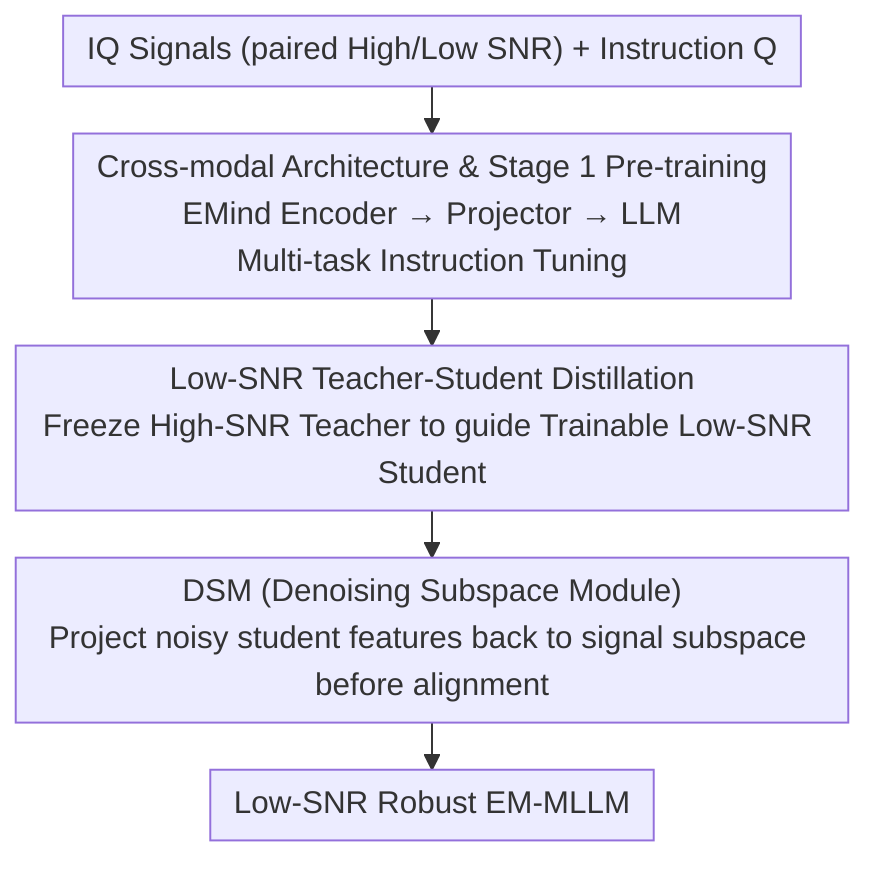

# MERLIN: Building Low-SNR Robust Multimodal LLMs for Electromagnetic Signals

**Conference**: CVPR 2026  
**Paper**: [CVF Open Access](https://openaccess.thecvf.com/content/CVPR2026/html/Shen_MERLIN_Building_Low_SNR_Robust_Multimodal_LLMs_for_Electromagnetic_Signals_CVPR_2026_paper.html)  
**Code**: Project Page https://em-merlin.github.io (Code TBD)  
**Area**: Signal & Communications / Multimodal VLM  
**Keywords**: Electromagnetic Signals, Multimodal LLM, Low-SNR Robustness, Knowledge Distillation, Subspace Denoising

## TL;DR
MERLIN translates the "native MLLM" paradigm to the electromagnetic (IQ) signal domain. The authors first construct a dataset of 134,000 signal-text pairs (EM-134K) and the EM-Bench benchmark covering perception and reasoning. They then propose a two-stage distillation framework ("High-SNR Teacher → Low-SNR Student") featuring a Denoising Subspace Module (DSM) that projects noisy features back into the signal subspace. This ensures robustness in noisy environments where the Signal-to-Noise Ratio (SNR) is below 0 dB, significantly outperforming general large models like GPT-5 and Claude-4 on EM-Bench.

## Background & Motivation

**Background**: Scenarios such as radar, communications, and navigation require precise perception and reasoning of electromagnetic (EM) signals. While deep learning has succeeded in specific EM tasks (e.g., modulation recognition), introducing the MLLM paradigm is seen as a promising path to "multi-task generalization" — aligning raw signal features with the semantic space of an LLM to handle diverse tasks with a single model. Pioneering works like RadioLLM, Spectrum-LLM, and WirelessLLM have laid the groundwork.

**Limitations of Prior Work**: The authors note that existing EM multimodal works often **deviate from the end-to-end native MLLM paradigm**, instead adopting pipeline-based or task-specific architectures. These either "textify" signal features before feeding them to the LLM (lacking true multimodal fusion) or use dual-input non-generative architectures with shallow fusion tied to specific tasks. Consequently, these models lack semantic alignment with language, remain trapped in unimodal spaces, and exhibit poor generalization across signal sources.

**Key Challenge**: Directly applying native MLLMs to the EM domain faces three unique obstacles: (1) **Data Scarcity**: EM signals are inherently confidential and complex, resulting in a lack of large-scale signal-text pairs; (2) **Lack of Standard Benchmarks**: Without unified evaluation, it is impossible to fairly compare different architectures and training strategies; (3) **Low-SNR Vulnerability**: Standard "encoder-LLM" architectures collapse when the SNR is below 0 dB (where noise power exceeds signal power), as noise contaminates low-level signal features and amplifies the semantic gap between signals and text.

**Goal**: To address the sub-problems of data, benchmarks, and models, establishing a foundation for MLLMs in the EM domain.

**Key Insight**: The authors made two critical observations. First, simply adjusting the ratio of low/high SNR data during training yields marginal gains and fails to substantially improve low-SNR performance, indicating the problem lies at the **feature level**. Second, visualization reveals that embeddings of low-SNR signals overlap heavily across categories (feature collapse); however, if noisy embeddings are **linearly interpolated** toward their clean versions, generative performance recovers dramatically (accuracy increases from ~45% to ~65% as the interpolation rate goes from 0 to 1, as per Fig. 5c). These points suggest a solution that directly counters noise in the feature space.

**Core Idea**: Use "High-SNR Teacher" to guide "Low-SNR Student" via knowledge distillation, transferring the structural characteristics of clean signals to the noisy student. A Denoising Subspace Module (DSM) is designed to project noisy features back into the signal subspace before alignment, forcing the student to learn **noise-invariant** representations.

## Method

### Overall Architecture
MERLIN aims to create an EM MLLM that remains robust at low SNR. It employs a two-stage training process: **Stage 1** uses EM-134K for multi-task instruction fine-tuning to establish cross-modal links between signals and language. **Stage 2** freezes the Stage 1 model as a "High-SNR Teacher" and trains a "Low-SNR Student." Through a three-way distillation loss (where feature distillation passes through the DSM), the teacher's clean representations are transferred to the student. The base architecture consists of three components: an EMind signal encoder to map raw IQ signals into high-dimensional latent representations, a lightweight Projector (two-layer MLP + GELU) to project signal features into the LLM's embedding space, and the LLM (Qwen3-4B-Instruct) for autoregressive answer generation.

### Key Designs

**1. Cross-modal Architecture and Stage 1 Multi-task Pre-training**

To address the lack of semantic alignment, the first stage unifies tasks into a multi-task, instruction-following generative problem. Given a signal $S$ and a question/instruction $Q$, the model autoregressively generates the answer text $A$. The training objective is the standard next-token prediction loss:

$$\mathcal{L}_{\text{pretrain}}(\Theta) = -\sum_{i=1}^{M} \log P(a_i \mid a_{<i}, Q, S; \Theta)$$

where $\Theta = \{\theta_{\text{enc}}, \theta_{\text{proj}}, \theta_{\text{llm}}\}$ are the trainable parameters. This stage integrates over ten sub-tasks—including modulation recognition, protocol identification, parameter estimation, interference identification, and strategy generation—into a single framework, enabling the LLM to "read" IQ signals and answer in natural language.

**2. Low-SNR Teacher-Student Knowledge Distillation**

Since performance collapses below 0 dB and data augmentation alone is insufficient, the second stage introduces a distillation framework. Both teacher and student are initialized with Stage 1 weights. The **teacher is frozen** and only receives High-SNR signals as static references, while the **student is fully trainable** and receives Low-SNR signals. Using paired tuples $(I_{\text{high}}, I_{\text{low}}, Q, A)$, the student is optimized with a composite objective:

$$\mathcal{L} = \mathcal{L}_{\text{task}} + \lambda_{\text{logits}} \mathcal{L}_{\text{logits}} + \lambda_{\text{feat}} \mathcal{L}_{\text{feat}}$$

where $\mathcal{L}_{\text{task}}$ is the standard cross-entropy on low-SNR inputs; $\mathcal{L}_{\text{logits}}$ is logit-level distillation minimizing the KL divergence between teacher/student softened logits: $\mathcal{L}_{\text{logit}} = T^2 \mathrm{KL}(\mathrm{Softmax}(z^{\text{Student}}/T), \mathrm{Softmax}(z^{\text{Teacher}}/T))$; and $\mathcal{L}_{\text{feat}}$ is feature-level distillation. This design uses the "clean version of the same signal" as a teacher to provide clear supervision for feature recovery while preserving general multi-task capabilities through data replay.

**3. DSM (Denoising Subspace Module)**

Directly aligning noisy student features $f_{\text{Student}}$ with clean teacher features $f_{\text{Teacher}}$ is unstable. Assuming the signal and noise subspaces are approximately orthogonal, DSM learns a projection matrix $P = U U^{T}$ to span the signal subspace. Student embeddings are projected before the distillation loss is calculated:

$$\Phi(f_{\text{Student}}) = P f_{\text{Student}}, \qquad \mathcal{L}_{\text{feat}} = \lVert f_{\text{Teacher}} - \Phi(f_{\text{Student}}) \rVert_2^2$$

By removing components belonging to the "noise subspace" at the feature level, DSM stabilizes optimization and allows the student to reconstruct robust features from degraded inputs. It essentially automates the observation that "interpolation toward clean directions" restores performance.

### Loss & Training
Both stages use AdamW with a cosine learning rate, up to 8 epochs per stage, a global batch size of 256, and an initial LR of 5e-5. Early stopping is applied based on the validation loss of a 10% hold-out set. Training is conducted on 8×A100 (80GB). Low-SNR pairs are generated by injecting Gaussian noise into EM-134K signals, mixed with the original pre-training set for replay. Signals are sampled at 20 MHz, with SNR uniformly distributed from -20 to 20 dB, and fixed at 1024 points.

## Key Experimental Results

> **Metric Descriptions**: **Perception tasks** use Multiple Choice Question (MCQ) accuracy (including a "cannot answer" option for confidence assessment); **Reasoning tasks** use Rouge-L / BLEU for open-ended strategy generation; **Low SNR** refers to SNR < 0 dB.

### Main Results
Comparison on EM-Bench against general closed-source/open-source LLMs (Baselines use "textified" signals without dedicated encoders). Perception results are accuracy (%), Reasoning results are Rouge-L/BLEU:

| Model | Perception Avg.(%) | Mod. Recog. (MOD) | Radar Jamming (RJR) | Reasoning Anti-CJ (Rouge/BLEU) |
|------|------|------|------|------|
| GPT-5 | 23.20 | 28.00 | 14.00 | 0.01 / 0.00 |
| Claude-4-Sonnet | 32.35 | 30.00 | 25.17 | 0.11 / 0.00 |
| Gemini-2.5-Pro | 29.92 | 24.00 | 17.20 | 0.10 / 0.00 |
| EMind (Discriminative Baseline) | — | 23.23 | 55.87 | — |
| **MERLIN (Ours)** | **78.27** | **44.97** | **82.77** | **0.45 / 0.15** |

General models show some basic capability but fail in precise parameter estimation and reasoning (Rouge/BLEU near 0). MERLIN achieves new SOTA levels for both perception and reasoning.

### Ablation Study
Stepwise addition of distillation components on EM-Bench MCQ (Accuracy %):

| Configuration | Feature KD | DSM | Logits | Low-SNR | Overall |
|------|:---:|:---:|:---:|------|------|
| Stage-1 (Baseline) | × | × | × | 59.7 | 71.8 |
| + Stage-2 (Fine-tuning only) | × | × | × | 62.9 | 77.6 |
| + Feature KD | ✓ | × | × | 64.2 | 77.9 |
| + DSM | ✓ | ✓ | × | 64.4 | 78.0 |
| **MERLIN (Full)** | ✓ | ✓ | ✓ | **65.1** | **78.6** |

### Key Findings
- **Specialized Stage-2 is Vital**: Moving from Stage-1 to Stage-2 (fine-tuning on target data) increases Low-SNR accuracy from 59.7 to 62.9, confirming the need for a dedicated adaptation phase.
- **Feature KD Validates Core Hypothesis**: Adding feature distillation improves Low-SNR performance to 64.2, supporting the argument that the model must be taught how to represent signals for noise robustness.
- **DSM and Logit KD Add Value**: DSM pushes Low-SNR to 64.4, and Logit distillation brings it to 65.1. Guiding the student at both the feature and output distribution levels provides synergistic benefits.
- **Data vs. Feature Level**: Adjusting training data SNR ratios yields marginal gains, whereas feature-space interpolation restores performance dramatically—this empirical finding is the cornerstone of the proposed method.

## Highlights & Insights
- **"Feature Collapse + Recovery via Interpolation" is a brilliant diagnosis**: Instead of just stacking modules, the authors use interpolation experiments to prove the degradation is a feature-level issue. This "diagnosis before treatment" approach is transferable to any multimodal alignment task with noisy inputs.
- **DSM as a Learnable Projection**: Using $P=UU^T$ to explicitly remove noise components is more stable than direct L2 alignment, effectively grafting subspace denoising principles from signal processing into deep distillation.
- **Triple Contribution (Data+Benchmark+Model)**: EM-134K and EM-Bench (4,200 expert-verified QAs across 3 levels and 14 sub-tasks) are valuable reusable infrastructures for the EM-MLLM research community.

## Limitations & Future Work
- Evaluation is primarily based on simulated/synthetic data (the majority of EM-134K is simulated); performance in real-world environments (multipath, non-Gaussian noise) requires further validation.
- The Low-SNR pairs rely on **Gaussian noise injection**, which may differ from real-world channel noise distributions; the assumption of signal/noise subspace orthogonality may not hold under complex real-world interference.
- Distillation requires paired high/low SNR data, which may not be available for pure real-world datasets; self-distillation or unpaired robustification paths could be explored.
- Reasoning tasks are evaluated using Rouge/BLEU, which are weak measures of actual strategy effectiveness; absolute scores (e.g., Rouge-L 0.45) should be interpreted alongside human evaluation.

## Related Work & Insights
- **Vs. RadioLLM / Spectrum-LLM / WirelessLLM**: These use Q-Formers or new encoding strategies but often remain pipeline-based or shallow in fusion. MERLIN follows an end-to-end native MLLM path and specifically addresses the low-SNR collapse.
- **Vs. Pure Data Augmentation**: Simply increasing low-SNR data ratios offers marginal gains; MERLIN’s feature-level approach via distillation and DSM is empirically superior.

## Rating
- Novelty: ⭐⭐⭐⭐ Introducing the native MLLM paradigm + subspace denoising distillation to the EM domain is innovative, though the teacher-student framework is mature.
- Experimental Thoroughness: ⭐⭐⭐⭐ Strong comparison with top-tier LLMs and clear ablation; however, real-world data and non-Gaussian noise testing are relatively limited.
- Writing Quality: ⭐⭐⭐⭐ Clear motivation-method loop and comprehensive charts.
- Value: ⭐⭐⭐⭐⭐ Providing the dataset, benchmark, and framework simultaneously creates a solid foundation for future EM MLLM research.

<!-- RELATED:START -->

## Related Papers

- [\[CVPR 2026\] ChartNet: A Million-Scale, High-Quality Multimodal Dataset for Robust Chart Understanding](chartnet_a_million-scale_high-quality_multimodal_dataset_for_robust_chart_unders.md)
- [\[CVPR 2025\] Breaking the Low-Rank Dilemma of Linear Attention](../../CVPR2025/signal_comm/breaking_the_low-rank_dilemma_of_linear_attention.md)
- [\[ICLR 2026\] Enhancing Instruction Following of LLMs via Activation Steering with Dynamic Rejection](../../ICLR2026/signal_comm/enhancing_instruction_following_of_llms_via_activation_steering_with_dynamic_rej.md)
- [\[AAAI 2026\] Balancing Multimodal Domain Generalization via Gradient Modulation and Projection](../../AAAI2026/signal_comm/balancing_multimodal_domain_generalization_via_gradient_modulation_and_projectio.md)
- [\[ICML 2025\] Deep Electromagnetic Structure Design Under Limited Evaluation Budgets](../../ICML2025/signal_comm/deep_electromagnetic_structure_design_under_limited_evaluation_budgets.md)

<!-- RELATED:END -->
