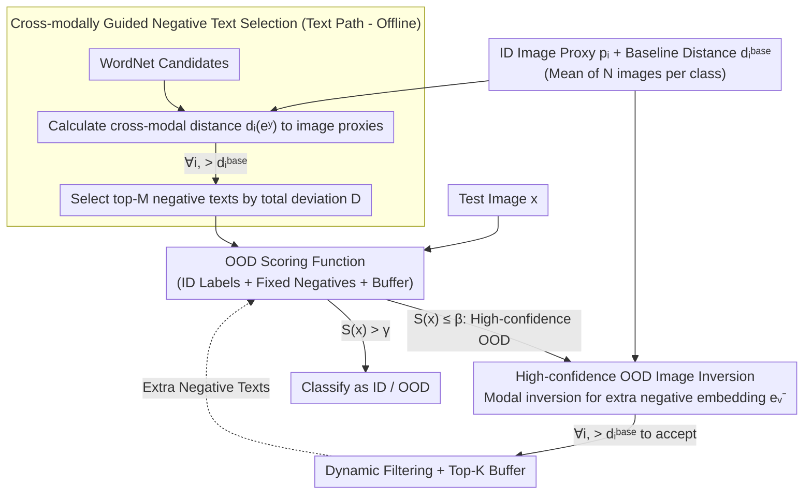

# Mind the Way You Select Negative Texts: Pursuing the Distance Consistency in OOD Detection with VLMs

**Conference**: CVPR 2026  
**arXiv**: [2603.02618](https://arxiv.org/abs/2603.02618)  
**Code**: [https://github.com/ZhikangXu0112/InterNeg](https://github.com/ZhikangXu0112/InterNeg)  
**Area**: Multimodal VLM  
**Keywords**: OOD Detection, CLIP, Cross-modal Distance, Negative Text Selection, Zero-shot

## TL;DR
This paper points out that existing VLM-based OOD detection methods use intra-modal distances (text-text or image-image) to select negative texts, which is inconsistent with the cross-modal distance optimized by CLIP. It proposes InterNeg to systematically utilize cross-modal distance from both textual and visual perspectives, achieving a 3.47% reduction in FPR95 on ImageNet.

## Background & Motivation

**Background**: VLMs (e.g., CLIP) demonstrate strong performance in OOD detection. The NegLabel method mines negative texts from WordNet that are distant from ID labels in the text space to approximate OOD labels. This simple yet effective approach has inspired several subsequent works (CLIPScope, CSP, AdaNeg).

**Limitations of Prior Work**: NegLabel and its successors use intra-modal distance (distance to ID labels in the text space) when selecting negative texts and use image-to-image distance when generating image proxies. However, CLIP is optimized for cross-modal distance (image-text pairs)—a large intra-modal distance does not guarantee a large cross-modal distance.

**Key Challenge**: The inconsistency between intra-modal and cross-modal distances leads to two types of ID misclassifications: (1) Max-OOD dominated—the cross-modal distance between a negative text and an ID image is actually smaller than that of the ID label; (2) Sum-OOD dominated—the aggregated score of multiple negative texts exceeds the ID score.

**Goal**: How to ensure that the entire OOD detection pipeline utilizes cross-modal distances consistent with CLIP's optimization objective?

**Key Insight**: Define an ID cross-modal baseline distance $d_i^{base} = 1 - \cos(\mathbf{e}_i, \mathbf{p}_i)$, and use this baseline to filter and select negative texts.

**Core Idea**: Unify the use of cross-modal distance from both the textual perspective (cross-modally guided negative text selection) and the visual perspective (reverting high-confidence OOD images into extra negative text embeddings).

## Method

### Overall Architecture
The core problem InterNeg addresses is that CLIP's similarity is optimized in a cross-modal (image-text) space, yet existing OOD detection methods use intra-modal distance (text-text) to select negative texts. This misalignment means "pseudo-OOD labels" might not be far from ID in the actual scoring space of CLIP. InterNeg aligns the measurement throughout the pipeline to cross-modal distance via two paths: the text path picks WordNet negative texts offline using image proxies for distance measurement; the vision path "translates" test images that are clearly OOD back into new negative text embeddings and dynamically adds them to a buffer. The negative texts from both paths are combined into a NegLabel-style scoring function to determine ID/OOD status for test images, requiring no training on ID or external data.

### Key Designs

**1. Cross-modally Guided Negative Text Selection: Measuring "Distance" via Image Proxies Instead of Text-Text Distance**

Methods like NegLabel select words distant from ID labels in the text space, but distance in text space does not equate to distance in cross-modal space during CLIP scoring. InterNeg first randomly samples $N$ images for each ID class and averages their embeddings to obtain an image proxy $\mathbf{p}_i$. It then calculates a cross-modal baseline distance $d_i^{base} = 1 - \cos(\mathbf{e}_i, \mathbf{p}_i)$—representing the standard cross-modal distance of a sample belonging to its class's center. For each candidate negative text $y$, its cross-modal distance $d_i(\mathbf{e}^y)$ to all ID image proxies is calculated. It is only retained if it is further than the baseline for **all** ID classes ($\forall i,\ d_i(\mathbf{e}^y) > d_i^{base}$). Candidates are then ranked by total deviation:

$$D(\mathbf{e}^y) = \sum_{i=1}^{C} \big(d_i(\mathbf{e}^y) - d_i^{base}\big)$$

and the top-$M$ are selected. This ensures negative texts are truly distant from every ID distribution in the space CLIP actually uses, preventing Max-OOD misclassifications.

**2. High-confidence OOD Image Inversion: Turning OOD Test Images into Extra Negative Texts**

Fixed WordNet negative texts cannot cover the actual OOD distribution encountered during testing. Thus, InterNeg harvests them during inference: when a test sample's OOD score is low enough ($S(\mathbf{x}) \le \beta$) to be high-confidence OOD, its image embedding is projected back into the text space via modal inversion to obtain an extra negative text embedding $\mathbf{e}_v^-$. Crucially, this path uses the same yardstick: the extra embedding must satisfy $\forall i,\ d_i(\mathbf{e}_v^-) > d_i^{base}$ to be accepted, filtering out noisy samples close to ID classes. Accepted embeddings enter a fixed-capacity buffer ($K$), where only the top-$K$ by deviation are kept. This allows the negative text set to grow dynamically with the test stream, which is particularly effective for Near-OOD samples.

**3. OOD Scoring Function: Using NegLabel's Logic on a Cleaner, Growing Negative Set**

The final score combines ID labels, filtered fixed negative texts, and extra negative embeddings from the buffer. While the formula structure follows NegLabel, the inputs are significantly improved: all contributing negative texts are filtered by cross-modal baselines, resulting in higher quality and dynamic expansion, which provides greater resistance to Sum-OOD misclassifications.

## Key Experimental Results

### Main Results (ImageNet-1K, CLIP ViT-B/16)

| OOD Dataset | Metric | NegLabel | AdaNeg | InterNeg | Gain |
|-----------|------|----------|--------|----------|------|
| Avg. of 4 Datasets | AUROC↑ | Baseline | Second Best | **Best** | +0.77% |
| Avg. of 4 Datasets | FPR95↓ | Baseline | Second Best | **Best** | -3.47% |

### Near-OOD Challenge Benchmark

| Benchmark | AUROC Gain | FPR95 Reduction |
|------|-----------|-----------|
| Near-OOD | +5.50% | -2.09% |

### Ablation Study
- **Cross-modally Guided Negative Selection**: Significantly reduces both Max-OOD and Sum-OOD misclassifications.
- **Extra Negative Embeddings**: Provides the most significant boost in Near-OOD scenarios.
- **Dynamic Filtering**: Successfully excludes interference from noisy OOD images.
- **Hyperparameter Robustness**: Shows stable performance regarding negative text count $M$ and buffer size $K$.

## Highlights & Insights
- First work to explicitly identify the intra-modal/cross-modal distance inconsistency in VLM OOD detection.
- Method is simple (no training, no extra data) but effective, reducing FPR95 by 3.47%.
- Unifies textual and visual perspectives using cross-modal distance for theoretical consistency.
- Achieves the greatest improvement in the most challenging Near-OOD scenarios (AUROC +5.50%).
- The analysis framework for Max-OOD and Sum-OOD provides a clear diagnostic perspective.

### Ablation Study
- **Cross-modal vs. Intra-modal Selection**: Max-OOD misclassification rate drops by approximately 40%, and Sum-OOD rate also decreases significantly.
- **Contribution of Extra Negative Embeddings**: Most effective in Near-OOD (AUROC +3.2%) where separation is harder.
- **Dynamic Filtering**: Performance drops without filtering, proving that noise from OOD samples is non-negligible.
- **Robustness**: Performance is insensitive to $M$ (500-2000) and $K$ (50-500).
- **Backbone Consistency**: Consistent gains observed across different CLIP backbones (ViT-B/16 and ViT-L/14).

## Limitations & Future Work
- Requires a small number of ID training samples to calculate image proxies ($N$ samples per class, not fully zero-shot).
- Quality of high-confidence OOD image inversion depends on the test data distribution.
- Realization of modal inversion (e.g., mapping network architecture) can be further optimized.
- Buffer update strategies in streaming scenarios require more research.
- The cross-modal distance consistency principle could be extended to other VLM downstream tasks like retrieval or classification.
- Computational overhead for baseline distances increases when ID classes are massive (e.g., ImageNet-21K).

### Experimental Thoroughness
- Achieves optimal AUROC on the iNaturalist dataset, demonstrating effectiveness for fine-grained categories.
- Achieves comparable or better results compared to fine-tuning methods (e.g., LoCoOp) without any training.

<!-- RELATED:START -->

## Related Papers

- [\[CVPR 2026\] ANTS: Adaptive Negative Textual Space Shaping for OOD Detection via Test-Time MLLM Understanding and Reasoning](ants_adaptive_negative_textual_space_shaping_for_ood_detection_via_test-time_mll.md)
- [\[ICCV 2025\] NegRefine: Refining Negative Label-Based Zero-Shot OOD Detection](../../ICCV2025/multimodal_vlm/negrefine_refining_negative_label-based_zero-shot_ood_detection.md)
- [\[CVPR 2026\] Activation Matters: Test-time Activated Negative Labels for OOD Detection with Vision-Language Models](activation_matters_test-time_activated_negative_labels_for_ood_detection_with_vi.md)
- [\[CVPR 2026\] TTL: Test-time Textual Learning for OOD Detection with Pretrained Vision-Language Models](ttl_test-time_textual_learning_for_ood_detection_with_pretrained_vision-language.md)
- [\[AAAI 2026\] Cross-modal Proxy Evolving for OOD Detection with Vision-Language Models](../../AAAI2026/multimodal_vlm/cross-modal_proxy_evolving_for_ood_detection_with_vision-lan.md)

<!-- RELATED:END -->
