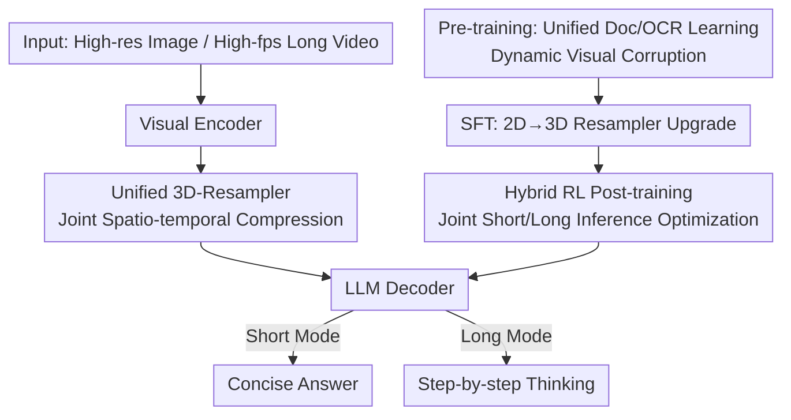

# MiniCPM-V 4.5: Cooking Efficient MLLMs via Architecture, Data and Training Recipes

**Conference**: CVPR 2026  
**Paper**: [CVF Open Access](https://openaccess.thecvf.com/content/CVPR2026/html/Yu_MiniCPM-V_4.5_Cooking_Efficient_MLLMs_via_Architecture_Data_and_Training_CVPR_2026_paper.html)  
**Code**: Available (MiniCPM-V Code and Model, Official Open Source)  
**Area**: Multimodal VLM / MLLM Efficiency  
**Keywords**: Efficient MLLM, 3D-Resampler, Unified Document/OCR Learning, Hybrid Reinforcement Learning, Long Video Understanding

## TL;DR
MiniCPM-V 4.5 utilizes a "Unified 3D-Resampler for visual token compression + Unified Document/OCR learning via dynamic corruption + Short-long dual-mode hybrid RL" approach to build a highly efficient and powerful 8B MLLM. It outperforms GPT-4o-latest and Qwen2.5-VL 72B with a score of 77.0 on OpenCompass, while requiring only ~10% of the inference time on VideoMME.

## Background & Motivation
**Background**: Multimodal Large Language Models (MLLMs) are advancing rapidly, but training and inference costs (VRAM, compute, data engineering) skyrocket with capability. Efficiency has become the core bottleneck for model scalability and accessibility. The authors decompose efficiency into three components: architecture, data, and training.

**Limitations of Prior Work**: (1) **Architecture**—High-resolution encoding generates massive visual tokens, especially for videos (e.g., a 6s, 2fps, 448×448 video requires 1,536 tokens in Qwen2.5-VL), leading to prohibitive costs. (2) **Data**—Modern MLLMs rely on high-quality document knowledge (PDFs), but current methods use fragile external parsers to convert PDFs into interleaved sequences, often causing layout errors (e.g., placing captions before images) which leads to incorrect learning or heavy manual cleaning. (3) **Training**—RL improves complex reasoning but introduces extreme verbosity, where even simple tasks trigger long CoT sequences, reducing efficiency.

**Key Challenge**: There is a systematic trade-off between capability enhancement and efficiency—higher resolution, more document knowledge, and stronger reasoning usually imply more tokens and longer outputs.

**Goal**: Achieve three goals simultaneously at the 8B scale: high visual token compression, parser-free document/OCR learning, and controllable reasoning without verbosity.

**Key Insight**: Rather than making individual components complex, the authors use simplified, unified designs to eliminate redundancies (spatio-temporal redundancy in video, intermediate parsing steps in documents, and repetitive training in reasoning).

**Core Idea**: A unified architecture (3D-Resampler for both image and video) + a unified learning objective (predicting original text from corrupted document images) + a hybrid RL (joint short/long mode optimization) are used to resolve efficiency bottlenecks.

## Method

### Overall Architecture
MiniCPM-V 4.5 is an 8B MLLM consisting of three modules in inference: a **lightweight visual encoder** (pixels to features) → a **unified 3D-Resampler** (compressing images/videos into compact tokens) → an **LLM decoder** (understanding content and generating text, switchable between "short" and "long" reasoning modes). The 3D-Resampler provides up to 16× compression for images and an additional 6× for videos.

**Mechanism**: The training "recipe" includes **Pre-training** (~620B tokens, progressive unfreezing, with unified document/OCR learning) → **SFT** (90B tokens, upgrading 2D-Resampler to 3D-Resampler) → **Hybrid RL Post-training** (658k prompts, joint short/long mode optimization).

### Key Designs

**1. Unified 3D-Resampler: Compressing Images and Videos via Shared Weights**

Visual token count is the primary bottleneck. The 2D-Resampler (based on LLaVA-UHD slicing) is extended to a 3D-Resampler. For images, learnable queries with 2D spatial encodings produce fixed-length sequences (64 tokens for 448×448). For videos, frames are grouped into "packages." Cross-attention re-samples frame features in each package using queries with both **spatial and temporal encodings**. This achieves an additional 6× temporal compression. A 6s, 2fps video requires only **128 tokens**, 12×–24× lower than representative MLLMs. This simple architecture enables 2D-to-3D upgrading during SFT with minimal video data and outperforms specialized methods like QuicksViewer.

**2. Unified Document/OCR Learning: Merging Recognition and Understanding via Dynamic Corruption**

To eliminate fragile PDF parsers, the authors observe that the difference between document knowledge acquisition and OCR lies in the **visibility of text**. They unify these into a single objective: **predicting original text from corrupted document images**. Different intensities of corruption are applied: ① **Low Corruption (Enhanced OCR)**—Text is recognizable; ② **Medium Corruption (Fusing Reasoning)**—Single characters are blurred, forcing the model to fuse noisy visual cues with context; ③ **High Corruption (Knowledge Learning)**—No character cues remain, forcing the model to rely on multimodal context and internal knowledge. This avoids data engineering or "guessing" hallucinations caused by pure OCR enhancement.

**3. Hybrid RL Post-training: Jointly Optimizing Short and Long Reasoning Modes**

To prevent RL-induced verbosity, the model is trained for both **Short Inference Mode** (concise) and **Long Inference Mode** (explicit CoT), controlled by prompts. During GRPO training, the model randomly switches between modes. The reward is a composite of accuracy $R_{acc}$, format $R_{format}$, repetition penalty $R_{rep}$, and preference reward $R_{rm}$:

$$R = R_{acc} + R_{format} + R_{rep} + \tfrac{1}{2}\tilde{R}_{rm},$$

where $\tilde{R}_{rm}$ is the standardized preference score among sampled responses. Reward quality is controlled via manual inspection, rule-based verification for short answers, and RLPR (probabilistic rewards) for complex natural language. This hybrid strategy allows cross-mode generalization and reaches better performance using only **70.5%** of the training tokens required by a pure long-reasoning strategy.

### Loss & Training
Pre-training uses a Warmup-Stable-Decay schedule ($5\times10^{-5}$ to $1\times10^{-5}$); SFT uses cosine decay ($1\times10^{-5}$ to $1\times10^{-6}$); Long-CoT and 3D-Resampler stages continue from SFT checkpoints; RL uses GRPO without entropy or KL penalties. Pre-training follows a three-stage progressive unfreezing: resampler-only → visual encoder included → full-parameter end-to-end training.

## Key Experimental Results

### Main Results

Single-image and comprehensive capabilities (Sampled from Table 1):

| Model | Scale | OpenCompass↑ | OCRBench↑ | MMHal-Score↑ |
|------|------|------|------|------|
| GPT-4o-latest | — | 75.4 | 86.7 | 4.2 |
| Qwen2.5-VL | 72B | 76.1 | 89.5 | 4.2 |
| GLM-4.1V | 9B | 76.6 | 84.2 | 4.6 |
| Qwen3-VL Thinking | 8B | 77.5 | 85.8 | 4.7 |
| **MiniCPM-V 4.5** | **8B** | **77.0** | **87.4** | **5.0** |

Inference Efficiency (Table 3, measured on 8×A100):

| Task | Model | Scale | Score↑ | Time↓ | Mem↓ |
|------|------|------|------|------|------|
| OpenCompass | GLM-4.1V-thinking | 10.3B | 76.6 | 17.5h | — |
| OpenCompass | **MiniCPM-V 4.5** | 8.7B | **77.0** | **7.5h** | — |
| Video-MME | Qwen2.5-VL-7B | 8.3B | 71.6 | 3.00h | 60G |
| Video-MME | **MiniCPM-V 4.5** | 8.7B | 73.5 | **0.26h** | **28G** |

MiniCPM-V 4.5 outperforms GLM-4.1V while using only **42.9%** of the time. On Video-MME, it reduces inference time from 2.63h to 0.26h (~10× speedup) with the lowest VRAM usage.

### Ablation Study

| Configuration | Key Metric | Description |
|------|---------|------|
| SFT Baseline | OpenCompass 73.6 | No RL |
| Only Long RL | 77.0 (4.4B RL tokens) | Strong but training-intensive |
| Hybrid RL (Eval: Long) | 77.1 (3.1B RL tokens) | Best performance, **~30% token saving** |
| External Parser | MMMU 49.0 / AI2D 74.9 | Prior paradigm |
| Unified Learning | MMMU 51.4 / AI2D 76.5 | Knowledge and OCR both improved |
| 3D-Resampler | VideoMME 67.3 | Highest under same token budget |

### Key Findings
- **Hybrid RL enables efficiency**: It achieves top long-reasoning results while cross-improving short-mode performance. It requires ~30% fewer training tokens than training for long reasoning alone.
- **Probabilistic Rewards (RLPR)**: Surpasses rule-based verification in complex natural language scenarios, providing more stable signals for training.
- **3D-Resampler outperfoms specialized methods**: At the same token budget, it beats methods like QuicksViewer, proving that simple architectures can be more scalable.
- **Unified document learning avoids noise**: Directly learning from images bypasses parsing errors, leading to concurrent gains in knowledge and OCR benchmarks.

## Highlights & Insights
- **OCR as Extreme Corruption**: Viewing OCR and document understanding as points on a "text visibility" spectrum is ingenious. The dynamic corruption objective covers the entire spectrum and eliminates the heavy data engineering required to fix parser errors.
- **Shape-agnostic Resampler**: By making the resampler insensitive to input shape, 2D-to-3D upgrading is almost "free," demonstrating how unified architectures lower the cost of multimodal expansion.
- **Controllable Reasoning Mode**: Prompt-controlled modes combined with hybrid optimization effectively tackle the "prolixity" issue common in RL models.

## Limitations & Future Work
- **Reliance on massive high-quality data**: The recipe requires 620B pre-training and 90B SFT tokens, representing a high barrier to entry for reproduction.
- **Selection of 3D-Resampler hyperparameters**: Package size and frame rates rely on random augmentation for robustness; systematic selection criteria for different scenarios are still needed.
- **Hallucinations**: While improved (MMHal-Score 5.0), video hallucinations remain a persistent challenge explicitly acknowledged by the authors.

## Related Work & Insights
- **vs Qwen2.5-VL / InternVL3**: While others use thousands of tokens for video, this work uses 128 tokens via 3D spatio-temporal compression, leading in efficiency with comparable or better accuracy.
- **vs Document MLLMs dependent on parsers**: Bypassing parsers improves performance on complex layouts where others fail due to sequence noise.
- **vs Pure Long-RL Models**: Hybrid optimization achieves similar reasoning depth with significantly lower inference latency (42.9%–68.2% of competition's time).

## Rating
- Novelty: ⭐⭐⭐⭐ The combination of unified document learning and 3D resampler is highly clever.
- Experimental Thoroughness: ⭐⭐⭐⭐⭐ Covers extensive benchmarks across STEM, documents, video, and comprehensive evaluation with detailed ablations.
- Writing Quality: ⭐⭐⭐⭐ Clear structure and motivations, though many data details are localized in the appendix.
- Value: ⭐⭐⭐⭐⭐ An 8B model outperforming 72B and closed models while being 10× faster for video is a significant reference for efficient MLLM deployment.

<!-- RELATED:START -->

## Related Papers

- [\[CVPR 2026\] HoneyBee: Data Recipes for Vision-Language Reasoners](honeybee_data_recipes_for_vision-language_reasoners.md)
- [\[CVPR 2026\] Parameter-Efficient Adaptation for MLLMs via Implicit Modality Decomposition](parameter-efficient_adaptation_for_mllms_via_implicit_modality_decomposition.md)
- [\[CVPR 2026\] TableMix: Enhancing Multimodal Table Reasoning in MLLMs from a Data-Centric Perspective](tablemix_enhancing_multimodal_table_reasoning_in_mllms_from_a_data-centric_persp.md)
- [\[CVPR 2026\] Why Does RL Generalize Better Than SFT? A Data-Centric Perspective on VLM Post-Training](why_does_rl_generalize_better_than_sft_a_data-centric_perspective_on_vlm_post-tr.md)
- [\[CVPR 2026\] POINTS-Long: Adaptive Dual-Mode Visual Reasoning in MLLMs](points-long_adaptive_dual-mode_visual_reasoning_in_mllms.md)

<!-- RELATED:END -->
