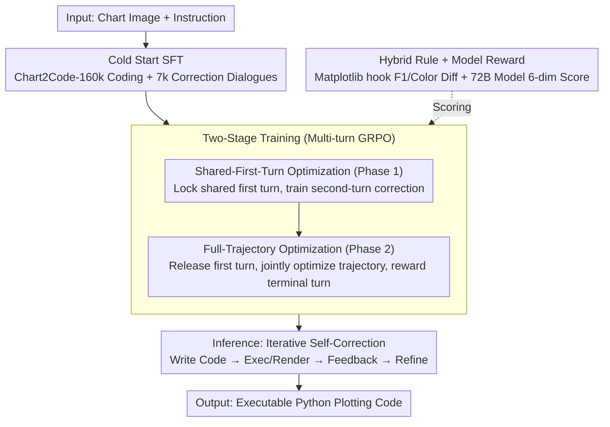

# MM-ReCoder: Advancing Chart-to-Code Generation with Reinforcement Learning and Self-Correction

**Conference**: CVPR 2026  
**arXiv**: [2604.01600](https://arxiv.org/abs/2604.01600)  
**Code**: [https://zitiantang.github.io/MM-ReCoder](https://zitiantang.github.io/MM-ReCoder)  
**Area**: Multi-modal VLM / Code Generation  
**Keywords**: Chart-to-code, Reinforcement Learning, Self-correction, Multi-turn dialogue, GRPO  

## TL;DR

Ours proposes MM-ReCoder, the first Multi-modal LLM (MLLM) for chart-to-code generation with self-correction capabilities. Through a two-stage multi-turn GRPO reinforcement learning framework (Shared-First-Turn optimization of correction followed by Full-Trajectory optimization of coding), it achieves an 86.5% low-level score on ChartMimic with only 7B parameters, comparable to Qwen3-VL-235B.

## Background & Motivation

1. **Background**: The Chart2Code task requires generating executable Python plotting code from chart images. Existing methods primarily rely on SFT (e.g., ChartCoder trained with 160k chart-code pairs), while limited works (ChartMaster) have begun exploring RL.
2. **Limitations of Prior Work**: SFT methods do not interact with the code execution environment, failing to guarantee code executability and visual fidelity. Prior RL methods (ChartMaster) only perform single-turn generation without supporting iterative correction.
3. **Key Challenge**: Human programming is iterative (write code → execute → view results → correct), but existing MLLMs focus on one-shot generation. Experiments reveal that even large models like Qwen3-VL-235B show a slight decrease in executable code quality (-0.26%) during self-correction.
4. **Goal**: How to enable MLLMs to perform genuine self-correction—not only fixing execution errors but also improving the visual quality of already executable code.
5. **Key Insight**: Authors found that "improvements" in existing models often stem from repairing crashed code to make it executable, rather than truly enhancing quality. Consequently, a two-stage RL training is designed to resolve this step-by-step.
6. **Core Idea**: Utilize a two-stage multi-turn GRPO training—first learning correction capabilities and then optimizing overall coding capabilities.

## Method

### Overall Architecture

MM-ReCoder addresses how to make a 7B multi-modal model emulate human behavior: "write, execute, observe results, and refine," ensuring improvements go beyond simply making code runnable to making it visually identical to the original image. The overall training follows a two-step process. First, Cold Start: foundational coding ability is supplemented via SFT on Chart2Code-160k, followed by fine-tuning on 7k filtered two-turn correction dialogues to familiarize the model with the "first-turn code + feedback → second-turn correction" format. Then comes the core two-stage multi-turn GRPO reinforcement learning—Stage 1 fixes the first-turn output and only trains the correction step; Stage 2 releases the first turn for joint optimization of the entire trajectory. During inference, the model can iteratively correct for arbitrary turns, feeding the rendered image (or error message) back as input for the next turn.

### Key Designs

**1. Shared-First-Turn Optimization: Locking the first turn to force genuine code revision**

If GRPO is applied to full two-turn trajectories immediately, the model may "cheat." The authors observed two types of reward hacking: 1) simple duplication of first-turn code in the second turn (46.9% of samples), as modifying runnable code often yields negative expected returns; 2) intentionally generating poor first-turn code to make the second turn appear as a "huge improvement." Shared-First-Turn optimization eliminates these shortcuts: for each chart, **one** shared first-turn output $o^{(1)}$ is sampled, and $G$ distinct second-turn candidates $o_i^{(2)}$ are generated based on it. RL gradients only update the second turn:

$$\mathcal{J}^{(shared)} = \mathbb{E}\Big[\tfrac{1}{G}\textstyle\sum_i \tfrac{\pi_\theta(o_i^{(2)}\mid q,\,o^{(1)},\,f^{(1)})}{\text{SG}[\pi_{\theta_{old}}(o_i^{(2)}\mid q,\,o^{(1)},\,f^{(1)})]}\,A_i\Big]$$

Since the first turn is shared and fixed, the model cannot gain advantage through duplication or by sabotaging the first turn. The only way to achieve high advantage is to genuinely produce a better version from the given code.

**2. Hybrid Rule + Model Reward: Complementing precision with visual perception**

Automatic chart scoring is difficult: pixel-level comparison is distracted by irrelevant differences, while model scoring is noisy. The authors use a dual-reward system. Rule-based rewards use hooks in Matplotlib functions to intercept structured elements (type, text, color, layout), calculating F1 scores and CIE Lab color distances against GT, normalized to $[0,1]$. Model-based rewards use Qwen2.5-VL-72B to score the image across six dimensions (1-100, normalized to $[0,1]$) to capture visual nuances that rules miss (e.g., overlapping text). These are combined with a format reward:

$$R = (1-\alpha-\beta)\cdot R_{\text{Format}} + \alpha\cdot R_{\text{Rule}} + \beta\cdot R_{\text{Model}}$$

**3. Two-Stage Training: Learning to correct before learning to code**

Correction and coding are distinct capabilities; optimizing them simultaneously leads to competition. Only performing full-trajectory optimization results in code repetition and reward exploitation. Stage 1 uses Shared-First-Turn optimization to isolate correction skills. Stage 2 switches back to full-trajectory optimization, jointly training both turns where the reward only considers the final turn (performance is best when discount $\gamma=0$, avoiding bonuses for intermediate turns that might re-induce sabotaged first turns).

### Loss & Training

- Cold Start: SFT on Chart2Code-160k for 1 epoch + correction data for 2 epochs, batch=128, lr=$10^{-5}$.
- Correction Data: Generated by Qwen3-VL-235B, filtering for samples where second-turn low-level scores exceed the first by >0.02 (approx. 7k).
- GRPO: Group size $G=8$, 1 epoch per stage, batch=128, lr=$10^{-6}$, max response 4096 tokens.
- Format reward encourages `<think>...</think>'''python...'''` structure.

## Key Experimental Results

### Main Results

| Model | Params | Turns | ChartMimic Low↑ | ChartMimic High↑ | Plot2Code Text-Match↑ |
|------|--------|------|------------------|-------------------|----------------------|
| ChartCoder | 7B | 1 | 77.4 | 74.0 | 54.5 |
| Qwen2.5-VL-7B | 7B | 1 | 56.2 | 49.6 | 47.8 |
| Qwen3-VL-235B | 235B | 1 | 80.9 | 85.9 | 60.9 |
| GPT-4o | - | 1 | 81.8 | 83.7 | 59.8 |
| **MM-ReCoder** | **7B** | **1** | **83.5** | **81.2** | **63.2** |
| **MM-ReCoder** | **7B** | **4** | **86.5** | **84.9** | **62.7** |

### Ablation Study

RL Strategy Comparison (ChartMimic):

| Strategy | Turn 1 Low | Turn 2 Low | Avg Gain | Improve Rate | Code Duplication |
|------|---------|---------|----------|---------|-----------|
| Full-traj ($\gamma=0, \eta=0$) | 81.8 | 83.9 | +0.21 | 3.4% | 46.9% |
| Full-traj ($\gamma=0, \eta=0.1$) | 66.7 | 84.3 | +10.11 | 87.5% | 0.3% |
| Shared-first + Full-traj | **83.7** | **86.0** | +0.55 | 12.1% | 21.6% |

### Key Findings

- **Existing LLMs fail to truly self-correct**: Qwen3-VL quality improvements on executable code are negative (-0.26%), with gains coming only from fixing crashes.
- Improving correction bonuses ($\eta=0.1$) leads to "cheating"—generating poor first turns to maximize relative gain (Turn 1 Low falls to 66.7).
- Multi-turn correction shows diminishing returns: 1→2 turns gained 1.3%, but no significant gain after 4 turns.
- **Code repetition is a bottleneck**: After single-turn SFT, 81.5% of second-turn outputs were simple copies of the first.

## Highlights & Insights

- **Diagnosis before Treatment**: Authors demonstrate the "pseudo self-correction" problem in existing models before proposing a targeted solution.
- **Shared-First-Turn Policy**: Decouples correction training from overall coding, avoiding reward hacking in RL. This is transferable to other iterative multi-modal tasks (e.g., SVG/Web generation).
- **Hybrid Reward Architecture**: The use of Matplotlib hooks to extract structured elements provides a clever solution to the difficulty of automatic chart evaluation.

## Limitations & Future Work

- RL training only explored one turn of correction; multi-turn RL training might yield further gains.
- The model reward relies on a 72B model, incurring high training costs.
- Lack of richer feedback from the execution environment (e.g., visual diff information of rendered charts).

## Related Work & Insights

- **vs ChartMaster**: ChartMaster introduced GRPO to Chart2Code for single generation. MM-ReCoder extends this to multi-turn self-correction.
- **vs SCoRe (Kumar et al.)**: SCoRe used two-stage RL for self-correction in text LLMs. MM-ReCoder extends this to multi-modal coding and adapts it for GRPO (SCoRe used REINFORCE/PPO).
- **vs ChartCoder**: MM-ReCoder improves low-level scores from 77.4 (SFT baseline) to 86.5 (+9.1%) using RL on the same dataset.

## Rating

- Novelty: ⭐⭐⭐⭐ 
- Experimental Thoroughness: ⭐⭐⭐⭐⭐ 
- Writing Quality: ⭐⭐⭐⭐ 
- Value: ⭐⭐⭐⭐ 

<!-- RELATED:START -->

## Related Papers

- [\[ICLR 2026\] Breaking the SFT Plateau: Multimodal Structured Reinforcement Learning for Chart-to-Code Generation](../../ICLR2026/multimodal_vlm/breaking_the_sft_plateau_multimodal_structured_reinforcement_learning_for_chart-.md)
- [\[CVPR 2026\] GeoTikzBridge: Advancing Multimodal Code Generation for Geometric Perception and Reasoning](geotikzbridge_advancing_multimodal_code_generation_for_geometric_perception_and_.md)
- [\[CVPR 2026\] TempR1: Improving Temporal Understanding of MLLMs via Temporal-Aware Multi-Task Reinforcement Learning](tempr1_improving_temporal_understanding_of_mllms_via_temporal-aware_multi-task_r.md)
- [\[ACL 2025\] ChartCoder: Advancing Multimodal Large Language Model for Chart-to-Code Generation](../../ACL2025/multimodal_vlm/chartcoder_chart_to_code.md)
- [\[ACL 2026\] CharTide: Data-Centric Chart-to-Code Generation via Tri-Perspective Tuning and Inquiry-Driven Evolution](../../ACL2026/multimodal_vlm/chartide_data-centric_chart-to-code_generation_via_tri-perspective_tuning_and_in.md)

<!-- RELATED:END -->
