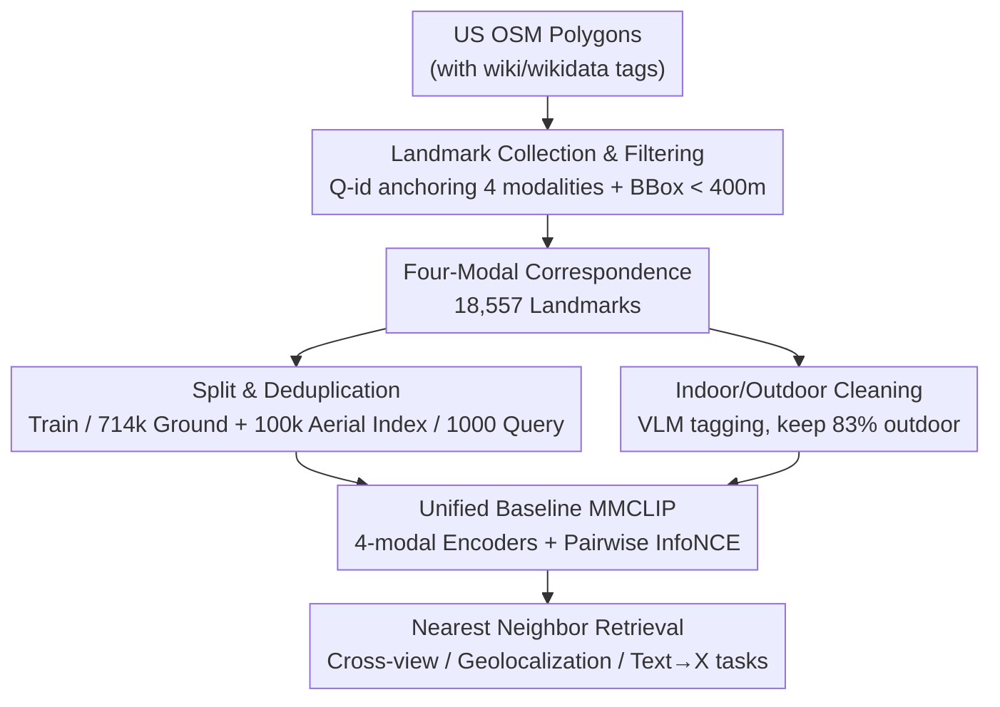

# MMLandmarks: a Cross-View Instance-Level Benchmark for Geo-Spatial Understanding

**Conference**: CVPR 2026  
**arXiv**: [2512.17492](https://arxiv.org/abs/2512.17492)  
**Code**: https://mmlandmarks.compute.dtu.dk (Project Page)  
**Area**: Multimodal VLM / Remote Sensing Geospatial / Cross-View Retrieval / Benchmark Datasets  
**Keywords**: Geospatial Understanding, Cross-View Retrieval, Instance-Level Benchmark, Multimodal Alignment, Geolocalization

## TL;DR
MMLandmarks constructs the first large-scale instance-level geospatial benchmark with **one-to-one correspondence for every landmark** across four modalities: ground images, aerial images, text, and GPS (18,557 landmarks in the US, with 329k ground and 197k aerial images). It demonstrates that neither existing specialized models nor general foundation models solve it effectively, and provides a simple CLIP-style four-modal contrastive learning baseline (MMCLIP) to show that "training on this data allows a single model to sweep multiple tasks."

## Background & Motivation
**Background**: Geospatial understanding has long been split into disconnected subtasks—cross-view retrieval (ground ↔ satellite), image geolocalization (predicting GPS), and landmark retrieval (matching identical landmarks) each have their own datasets and specialized models. Although multimodal learning (CLIP, ImageBind, GeoCLIP) has entered this field, most only align paired modalities like "image-text" or "image-GPS."

**Limitations of Prior Work**: ① Existing remote sensing/aerial datasets (like DOTA or NAIP) focus on **coarse-grained, low-resolution** tasks such as object detection, classification, and land-cover segmentation, lacking **instance-level** annotations; ② Cross-view retrieval benchmarks (CVUSA, VIGOR, CVACT, etc.) rely heavily on Google Street View panoramas, covering only **roads and urban areas**, which leads to a lack of visual diversity and saturated benchmarks (where strong geometric correspondences simplify the task); ③ These datasets are often restricted by Google Street View/Satellite **licensing**, preventing free redistribution or large-scale machine learning training, which slows down research.

**Key Challenge**: There is a lack of a **fine-grained, instance-level, cross-modal, and cross-view** dataset that is simultaneously large-scale, ensures all modalities correspond to every landmark, and has a permissive license for free sharing of models and data. These three requirements are difficult to satisfy simultaneously, leading to current datasets having gaps in scale, diversity, or annotation granularity.

**Goal**: This is decomposed into three sub-problems: (1) How to reliably bind four modalities of the same landmark together; (2) How to construct a challenging evaluation protocol that is not artificially inflated by modal correlations; (3) What baseline can prove that such multimodal data enables a "single model for multiple tasks" capability.

**Key Insight**: The authors abandon the traditional "street view panorama + satellite sampling" approach in favor of a **landmark-centric** collection strategy. Using OpenStreetMap polygons with Wiki tags as anchors, they bind four modalities to a single Wiki entity (Q-id) via Wikimedia Commons (ground), Wikipedia (text), and NAIP (high-resolution aerial)—all **permissively licensed** sources. This bypasses Google's licensing hurdles and naturally introduces real-world diversity in perspective, lighting, and indoor/outdoor settings.

**Core Idea**: Create a four-modal geospatial benchmark using "Wiki entity IDs as anchors + four open data sources + one-to-one constraints," and use a simple baseline with "pairwise InfoNCE contrastive loss for all modalities" to unify all tasks into nearest neighbor retrieval within a unified embedding space.

## Method
This is a benchmark paper whose core contributions are the **dataset construction pipeline, evaluation protocol, and a unified baseline**, rather than a complex network architecture. The data flows from "OSM polygons across the US" to "18,557 landmarks aligned across four modalities," followed by evaluation design and the MMCLIP baseline.

### Overall Architecture
The input is public OpenStreetMap polygon metadata, and the output is a benchmark with four-modal correspondence (train set + index set + query set) plus a unified baseline, MMCLIP. The pipeline is divided into three stages: **① Landmark Collection & Filtering** (anchoring entities with Wiki tags and balancing via bounding box size) → **② Split & Deduplication** (constructing large-scale hard index sets and rigorous deduplication to prevent leakage) → **③ Unified Baseline MMCLIP** (independent encoders per modality + pairwise contrastive loss, using nearest neighbor retrieval at inference).

### Key Designs

**1. Wiki-Entity-Anchored Four-Modal Alignment: Addressing "Reliable Binding of Modalities"**

Traditional methods (CVUSA/VIGOR) use identical coordinates on Google Maps to sample "satellite + street view," which fails for natural landmarks—landmark photos are often **taken from a distance**, so sampling aerial imagery by coordinates might yield a region without the landmark. The authors use Wiki entities as anchors: they collect all US OSM polygons with `wikipedia ∪ wikidata` tags, extract the Wiki-identifier (e.g., `Q123456`), and require the entity to have both a Wikipedia page (for text) and a Wikimedia Commons page (for ground images). Ground images are from Wikimedia Commons (mostly Wiki Loves Monuments submissions, CC/Public Domain, resized to 800px on the longest side); aerial images are from NAIP (1–2m resolution, public domain, via Google Earth Engine at $800\times800$); GPS is the bounding box center; text is the Wikipedia body (excluding References/See also). This ensures all four modalities belong to the same Q-id with **one-to-one correspondence** and permissive licensing.

**2. BBox Size Filtering + Real-world Diversity: Balancing and Challenging the Benchmark**

To avoid extreme scale variance (e.g., a bridge vs. a whole park), the authors apply a heuristic filter: only landmarks with a **bounding box longest side < 400 meters** are kept, ensuring landmarks occupy a consistent proportion of aerial images. This collection method naturally preserves challenging real-world attributes: ground images are crowdsourced with high **intra-class variance** (lighting, angles, indoor/outdoor, sketches/scans); NAIP provides **multi-temporal** aerial imagery (sometimes spanning a decade), serving as natural data augmentation and supporting temporal change detection research; landmark distribution is **long-tailed and geographically skewed** (California/Northeast clusters). This fills the gap left by existing benchmarks where high geometric correlation makes the task too easy; MMLandmarks re-introduces difficulty through large domain gaps (ground vs. aerial) and high intra-class variance.

**3. Anti-leakage Splits and Hard Index Sets: Ensuring Robust Metrics**

Retrieval tasks risk inflated metrics if the index and training sets overlap. The authors construct large **ground** and **aerial** index sets with strict deduplication: the ground index filters 762k images from GLDv2 for 17,804 US landmarks, then **removes 5,277 landmarks overlapping with MMLandmarks**, resulting in a gallery of 714.5k ground images. The aerial index samples random points from the training set, adds GPS noise for 100k new locations, and enforces that new coordinates are **>500 meters away** from training/index coordinates to prevent viewing the same landmark. For queries, 1000 landmarks are sampled: ground images have high variance, so **all ground images act as queries** (18,688 images), while aerial images of the same landmark are highly correlated, so **only the latest aerial image is used as a query** (1000 images). Additionally, a VLM (LLaVA-1.5-7B) labels ground images as indoor/outdoor, creating an outdoor-only subset (83% of original ground images) to facilitate geospatial alignment.

**4. All-Pairwise Contrastive Baseline MMCLIP: Demonstrating "One Model for All Tasks"**

To demonstrate data value, the authors train a deliberately simple baseline: each modality has one **frozen** encoder (Ground/Aerial images share a frozen CLIP image encoder, Text uses a frozen CLIP text encoder, GPS uses a trainable GeoCLIP-style positional encoder). Each encoder is followed by a two-layer linear + ReLU projection head (512-dim). The loss extends InfoNCE to **all pairwise combinations** of $K=4$ modalities:

$$\mathcal{L}=\frac{1}{K(K-1)}\sum_{i=1}^{K}\sum_{\substack{j=1\\ j\neq i}}^{K}\mathcal{L}_{i,j}$$

where $\mathcal{L}_{i,j}$ is the contrastive loss between modality $i$ and $j$ (temperature fixed at 0.07). At inference, all tasks are unified as "$k$-nearest neighbor retrieval in the learned joint space." Its significance is not in beating SOTA but in using the same weights to solve cross-view retrieval, geolocalization, and Text→X retrieval—something current specialized models cannot do.

## Key Experimental Results

### Main Results: Cross-view Retrieval (Table 2)
Existing specialized cross-view models and general foundation models perform poorly zero-shot on MMLandmarks, while MMCLIP leads significantly (medR lower is better, mAP/R@K higher is better):

| Model | Type | Sat→Ground medR↓ | Sat→Ground mAP@1k↑ | Ground→Sat medR↓ | Ground→Sat mAP@1k↑ |
|------|------|------|------|------|------|
| Sample4Geo-UNI | Specialized | 34988 | 3.0 | 40056 | 1.1 |
| TransGeo-90° | Specialized | 40973 | 0.7 | 13425 | 0.9 |
| SigLIP2 (ViT-L/512) | Foundation | 682 | 8.6 | 140 | 18.7 |
| OAI-CLIP (ViT-L/336) | Foundation | 519 | 10.4 | 620 | 15.2 |
| **MMCLIP** | Ours | **23** | **18.8** | **48** | **26.2** |

Specialized cross-view models (trained on older benchmarks like CVUSA) fail almost entirely, with medR in the tens of thousands, confirming that "diversity in old datasets is insufficient." General LLMs do slightly better via scale but are far from saturating the benchmark.

### Geolocalization (Table 3 / Table 4)
Percentage of predictions falling within specific distance thresholds (higher is better):

| Task | Method | Street(1km) | City(25km) | Region(200km) | Country(750km) | Continent(2500km) |
|------|------|------|------|------|------|------|
| Ground→GPS | GeoCLIP | **21.37** | 36.44 | 48.57 | 71.45 | 91.50 |
| Ground→GPS | **MMCLIP** | 16.83 | 35.95 | **51.78** | **74.94** | 91.52 |
| Sat→GPS | GeoCLIP | 12.3 | 31.3 | 48.8 | 81.3 | 97.4 |
| Sat→GPS | **MMCLIP** | **36.9** | **61.5** | **81.1** | **95.5** | **99.7** |

On Ground→GPS, MMCLIP performs comparably to GeoCLIP/G3 with fewer training images. On Satellite→GPS, MMCLIP **dominates**—SatCLIP fails due to domain gaps between Sen-2 and NAIP, while MMCLIP leads significantly at every threshold.

### Text-to-Any Retrieval (Table 5)
To prevent inflation from location names in Wikipedia first sentences, GPT-3.5 was used to remove location clues with manual correction:

| Task | Method | medR↓ | mAP@1k↑ | R@1↑ |
|------|------|------|------|------|
| Text→Satellite | OAI-CLIP (ViT-L/336) | 1037 | 14.5 | 11.1 |
| Text→Satellite | **MMCLIP** | **388** | **17.3** | **13.4** |

### Ablation Study (Table 6)
| Configuration | mAP@1k S→G | mAP@1k G→S | G/S→GPS(1km) | Notes |
|------|------|------|------|------|
| all⇔all, G,S images only | 17.59 | 25.59 | — | Only two image modalities |
| all⇔all, G,S,T,C, 1st sent, random aerial | 17.39 | 25.05 | 15.63 / 27.7 | Full modalities |
| **MMCLIP** (G,S,T,C, rand sent, **latest aerial**, **outdoor subset**) | **18.79** | **26.20** | 16.83 / **36.9** | Final baseline |
| G⇔all (ImageBind-style), latest aerial, outdoor subset | 18.89 | 27.46 | 15.68 / 18.3 | Ground as anchor only |

### Key Findings
- **"Latest aerial + outdoor subset" drives improvement**: Switching from random aerial sampling to "latest" and using only outdoor images improved almost all tasks, notably boosting Sat→GPS(1km) from ~27 to **36.9**.
- **More modalities slightly decrease pure retrieval**: Adding modalities slightly lowers pure retrieval mAP but enables multi-task universality—a trade-off between "general vs. specialized."
- **All-pairwise Contrastive vs. ImageBind-style**: ImageBind-style (G⇔all) is slightly better for pure retrieval, while all-pairwise (all⇔all) is significantly stronger for **Geolocalization (especially Sat→GPS)** because GPS aligns directly with every modality.
- **Benchmark is far from saturated**: Even the best MMCLIP results in R@1 only around 20–30, leaving significant room for improvement.

## Highlights & Insights
- **Wiki Entity ID as "Multimodal Glue"**: Anchoring `Q-id` to OSM → Wikipedia → Wikimedia Commons → NAIP binds four heterogeneous open sources together. This approach is transferable to any entity-centric dataset construction (e.g., products, species, architecture).
- **Asymmetric Query Sampling to Prevent Inflation**: Designing the protocol where ground images are all used but only the latest aerial image is used accounts for the specific intra-modal variance differences.
- **Permissive Licensing as a First-class Citizen**: Treating redistribute-ability as a core design goal rather than an afterthought bypasses licensing issues and ensures long-term community utility.
- **The "Aha" Moment**: The medR of tens of thousands for specialized models on this new benchmark shatters the illusion that "saturated old benchmarks = solved tasks."

## Limitations & Future Work
- **Limited to the US**: Due to NAIP availability, the dataset only covers the US with geographical skew (California/Northeast), meaning cross-continental generalization is unverified.
- **Deliberately Simple Baseline**: Encoders are frozen; the authors state they do not pursue SOTA. Therefore, the "data potential" shown is a lower bound, and higher performance may require end-to-end training.
- **Weak Text Modality**: Text→X performance is lower than image-based queries because removing location names leaves Wikipedia sentences semantically thin.
- **Potential Data Leakage**: Some well-known landmarks might appear in GLDv2/MP16 training sets used by established models, potentially inflating their comparative numbers.
- **Future Directions**: Unfreezing/fine-tuning encoders, introducing temporal aerial imagery for change detection, and expanding the Wiki-anchor pipeline to other countries with open aerial data.

## Related Work & Insights
- **vs. Cross-view Retrieval Benchmarks**: Unlike CVUSA/VIGOR which use restricted Google data and are saturated, MMLandmarks uses landmark-centric collection with high diversity and permissively aligned four modalities.
- **vs. Geolocalization Models**: While GeoCLIP/SatCLIP specialize in "Image→GPS," MMLandmarks supports multi-tasking and outperforms SatCLIP on Sat→GPS due to the high-resolution NAIP domain.
- **vs. Multimodal Alignment (CLIP/ImageBind)**: Unlike web-crawled pairs with weak alignment, MMLandmarks provides **dense instance-level supervision** for all modal combinations.
- **vs. Landmark Retrieval (GLDv2)**: MMLandmarks reuses GLDv2 for ground indices but expands the task from ground-to-ground matching to "cross-view + cross-modal" scenarios.

## Rating
- Novelty: ⭐⭐⭐⭐⭐ First 4-modal one-to-one aligned, permissive, continental instance-level benchmark.
- Experimental Thoroughness: ⭐⭐⭐⭐ Covers various tasks and baselines, though the baseline itself is simple and restricted to the US.
- Writing Quality: ⭐⭐⭐⭐ Clear motivation and rigorous protocol design.
- Value: ⭐⭐⭐⭐⭐ Exposes benchmark saturation issues and provides a unified testbed for multimodal geospatial research.

<!-- RELATED:START -->

## Related Papers

- [\[CVPR 2026\] Beyond Single Images: A Comprehensive Benchmark for Album-Level Vision-Language Understanding](beyond_single_images_a_comprehensive_benchmark_for_album-level_vision-language_u.md)
- [\[CVPR 2026\] Socratic-Geo: Synthetic Data Generation and Cross-Modal Geometric Reasoning via Multi-Agent Interaction](socratic-geo_synthetic_data_generation_and_cross-modal_geometric_reasoning_via_m.md)
- [\[CVPR 2026\] STAR-R1: Multi-View Spatial TrAnsformation Reasoning by Reinforcing Multimodal LLMs](star-r1_multi-view_spatial_transformation_reasoning_by_reinforcing_multimodal_ll.md)
- [\[CVPR 2026\] SALMUBench: A Benchmark for Sensitive Association-Level Multimodal Unlearning](salmubench_a_benchmark_for_sensitive_association-level_multimodal_unlearning.md)
- [\[CVPR 2026\] UNI-OOD: Unified Object- and Image-level Out-of-Distribution Detection via Cross-Context Attentive Vision-Language Modeling](uni-ood_unified_object-_and_image-level_out-of-distribution_detection_via_cross-.md)

<!-- RELATED:END -->
