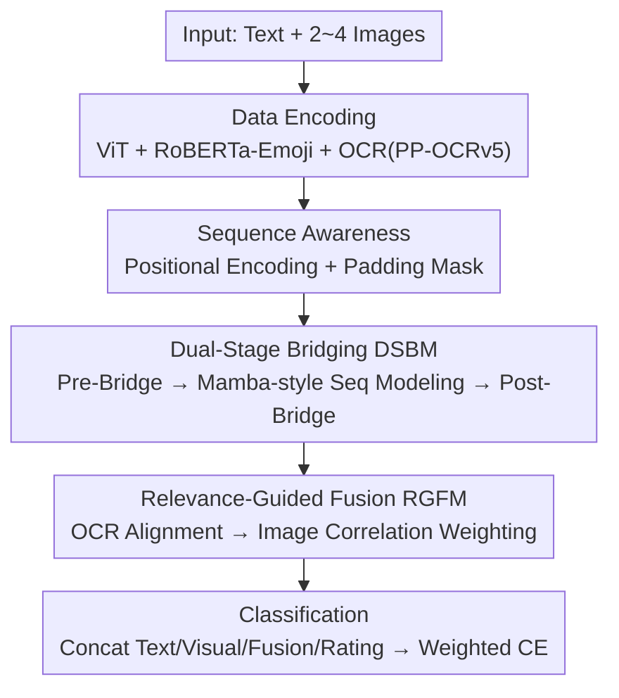

# MMSD3.0: A Multi-Image Benchmark for Real-World Multimodal Sarcasm Detection

**Conference**: CVPR 2026  
**Paper**: [CVF Open Access](https://openaccess.thecvf.com/content/CVPR2026/html/Zhao_MMSD3.0_A_Multi-Image_Benchmark_for_Real-World_Multimodal_Sarcasm_Detection_CVPR_2026_paper.html)  
**Code**: https://github.com/ZHCMOONWIND/MMSD3.0  
**Area**: Multimodal VLM / Multimodal Sarcasm Detection / Benchmark Datasets  
**Keywords**: Multimodal sarcasm detection, multi-image benchmark, cross-image reasoning, OCR alignment, dataset

## TL;DR
The authors observe that existing multimodal sarcasm detection datasets/methods are restricted to "single-image" settings, failing to capture sarcasm triggered by cross-image comparisons. Consequently, they construct MMSD3.0, the first real-world benchmark consisting entirely of multi-image samples (2–4 images each), and propose a companion Cross-Image Reasoning Model (CIRM) featuring dual-stage bridging and relevance-guided fusion, achieving SOTA performance on MMSD, MMSD2.0, and MMSD3.0.

## Background & Motivation

**Background**: Multimodal sarcasm detection aims to determine whether a "video/image + text" combination expresses sarcasm. This field originated with the MMSD benchmark built by Cai et al. from Twitter, with most subsequent works focusing on cross-modal incongruity modeling on MMSD. Qin et al. identified spurious correlation cues in MMSD (over-reliance on text due to #sarcasm hashtag sampling) and released the debiased MMSD2.0.

**Limitations of Prior Work**: Both MMSD and MMSD2.0 follow a **single-image setting**—one sample per image. However, a significant proportion of real-world tweets contain multiple images, where sarcasm often arises from semantic or emotional contrasts "between images" (e.g., Figure 1: Laura Loomer on the left, Count Dracula on the right; sarcasm is lost if either image is missing). Single-image datasets and methods cannot characterize such cross-image triggered sarcasm, failing to reflect real-world complexity.

**Key Challenge**: Sarcastic signals are often scattered across the inter-relationships of multiple images. Existing "single-image encoder + cross-modal fusion" paradigms lack mechanisms for cross-image relationship modeling, making visual signals "less useful"—as evidenced by the minimal advantage multimodal methods show over text-only methods in multi-image settings within the paper.

**Goal**: ① Transition sarcasm detection from single-image to multi-image, real-world settings by creating a high-quality multi-image benchmark; ② Design a model capable of explicitly modeling "cross-image dependence + cross-modal correspondence."

**Key Insight**: Sarcasm in multi-image posts relies on "latent semantic/emotional associations between images," and real-world social media images contain abundant OCR text and emojis (emotional cues often discarded). Thus, the benchmark deliberately preserves emojis and uses fairer sampling sources, while the model introduces OCR alignment and image sequence modeling.

**Core Idea**: Expose the difficulty of multi-image sarcasm using the "all multi-image" real-world benchmark MMSD3.0, and systematically establish multi-image relationships using CIRM (dual-stage bridging for cross-image/cross-modal dependencies and relevance-guided fusion for image-wise weighting).

## Method

This paper contributes both a benchmark and a model. The benchmark (MMSD3.0) is detailed under Key Designs. The CIRM model is a serial multi-module pipeline, with its overall architecture described below.

### Overall Architecture
CIRM (Cross-Image Reasoning Model) consists of five sequential modules: **Data Encoding → Positional Encoding & Masking → Dual-Stage Bridging Module (DSBM) → Relevance-Guided Fusion Module (RGFM) → Classification**. The input is a text $S$ and a set of images $I=(I_1,\dots,I_n)$ ($n\le 4$, padded with blank images and masked), outputting a binary label $y\in\{0,1\}$ (1=sarcasm).

In the data encoding stage: ViT extracts $V_{\text{origin}}$ for each image; PP-OCRv5 extracts OCR text $X$ per image; main text $S$ and OCR $X$ are **separately** encoded using RoBERTa-Emoji (not concatenated, as OCR is image-derived and preserves emojis) to obtain $T$ and OCR features $O$. Positional encodings are added to image features sequentially, with masks distinguishing valid vs. padded images. DSBM performs cross-modal bridging both before and after sequence modeling. RGFM uses OCR alignment and adaptive relevance weights to fuse multi-image visual evidence. Finally, text, visual, fused, and star-rating features are concatenated for classification.

### Key Designs

**1. MMSD3.0 Benchmark: First Multi-Image, Emoji/OCR-Preserved Real-World Sarcasm Dataset**

Addressing the limitations of single-image, biased datasets, MMSD3.0 is constructed from two sources: tweets without specific hashtags and Amazon reviews collected without extra constraints (introducing out-of-domain coverage and avoiding spurious bias in MMSD). The scale exceeds 10,000 samples, each with 2–4 images (Twitter's limit). Average text length is ~31 words (significantly longer than MMSD/MMSD2.0's 15/13 words, closer to real long-form text), with ~2.6 images per sample. Unlike MMSD which replaces emojis with placeholders, this dataset **preserves emojis** to maintain emotional signals; over 65% of images contain OCR-able text, and ~23–25% of samples contain emojis. Annotation followed two rounds by 9 graduate students with double-blind labeling, achieving a Cohen's Kappa of 0.816. Additionally, Qwen2.5-VL-32B was used as a generator and GPT-4o as a critic to generate and select optimal sarcastic candidates for 1,444 real samples to include AI-generated content.

**2. Dual-Stage Bridging Module (DSBM): Modeling Cross-Image/Cross-Modal Dependencies**

Targeting the lack of cross-image modeling in single-image encoders, DSBM wraps a Mamba-inspired sequence modeling module between Pre-Bridge and Post-Bridge layers. **Pre-Bridge**: Enables cross-modal attention before sequence modeling—$A^t_{\text{pre}}=\text{MHA}(T,V,V)$, $A^v_{\text{pre}}=\text{MHA}(V,T,T)$, followed by gated residual fusion $T_{\text{pre}}=\text{LN}(T+G^t_{\text{pre}}\odot A^t_{\text{pre}})$ (gate $G=\sigma(\cdot W)$ controls residual strength). **Sequence Modeling**: Performs state-space enhancement within each modality—LayerNorm projects into flows $U$ and $Z$, using depth-wise Conv1D + SiLU for local dependencies $\hat U=\text{SiLU}(\text{DWConv1D}(U))$, and selective state updates $S_t=f_\theta(S_{t-1},\hat u_t)$ for long-range dependencies. Finally, gated fusion $H_{\text{out}}=((Y+D\odot\hat U)\odot\text{SiLU}(Z))W_{\text{out}}+H$ allows the text stream to accumulate context and the image stream to encode coherent multi-image representations. **Post-Bridge**: Re-performs gated cross-modal attention $T_{\text{post}},V_{\text{post}}=\text{CrossModalBridge}(T_{\text{seq}},V_{\text{seq}})$ to reconstruct alignment.

**3. Relevance-Guided Fusion Module (RGFM): Suppressing Noise via OCR Alignment and Correlation Weighting**

RGFM addresses irrelevant or padding images in two steps. **OCR Alignment**: Enhances text/visual features using OCR embeddings via attention—$T^O=\text{Attn}(T,O,O)+T$ and $V^O=\text{Attn}(V,O,O)+V$. **Relevance Estimation**: Uses a global text summary $\bar t^o$ to calculate dual scores for each image—a cosine term $s^{\cos}_i=\cos(W_v v^O_i, W_t\bar t^o)$ and a learnable term $s^{\text{lrn}}_i=\text{MLP}([v^O_i;\bar t^o])$. These are mixed as $s_i=\alpha\,s^{\cos}_i+(1-\alpha)\,s^{\text{lrn}}_i$, softmaxed, and multiplied by an validity mask $c_i$ to get weights $w_i$. **Weighted Fusion**: $f=\sum_{i=1}^{N} w_i\,(\bar t^o\odot v^O_i)$ emphasizes semantically coherent visual evidence and suppresses uninformative images.

**4. Sequence Awareness: Positional Encoding and Padding Masks**

Multi-image posts often describe processes or comparative narratives where image order is a sarcastic cue. CIRM adds positional embeddings base on index: $V=V_{\text{origin}}+\text{PE}(\text{index})$. For samples with fewer than $N=4$ images, a mask $c=[1]_n\,\|\,[0]_{N-n}$ identifies valid (1) versus padded (0) images, excluding the latter during attention and pooling.

### Loss & Training
The classification head merges three representations: pooled text/visual $\bar t,\bar v$ from Post-Bridge (visual pooling is mask-weighted), relevance-guided features $f$, and optional star-rating embeddings $\text{Emb}(r)$. These are concatenated and passed through $\text{MLP}_{\text{fuse}}$ for a feature $z$. Linear classification $\hat y=W_{\text{cls}}z+b_{\text{cls}}$ is trained using **weighted cross-entropy** $\mathcal{L}=\text{CrossEntropy}(\hat y,y;w)$ to mitigate label imbalance. Standard parameters: AdamW, LR 2e-5, weight decay 1e-5, batch 8, 20 epochs on an H100 (80GB).

## Key Experimental Results

### Main Results
CIRM achieves SOTA on single-image benchmarks (MMSD / MMSD2.0), proving its efficacy even in simple settings:

| Dataset | Method | Acc (%) | F1 (%) |
|--------|------|---------|--------|
| MMSD | RCLMuFN (KBS'25) | 93.09 | 91.52 |
| MMSD | **CIRM** | **94.02** | **93.76** |
| MMSD2.0 | RCLMuFN (KBS'25) | 91.57 | 90.25 |
| MMSD2.0 | **CIRM** | **92.12** | **91.69** |

On the multi-image benchmark MMSD3.0, single-image methods (via tiling) degrade significantly, and MLLMs show moderate performance, while CIRM leads substantially:

| Modality | Method | Acc (%) | F1 (%) |
|------|------|---------|--------|
| Text-only | RoBERTa | 79.99 | 79.67 |
| Image-only | ViT | 64.09 | 51.30 |
| Multimodal | Tang et al. (NAACL'24) | 82.20 | 80.91 |
| MLLM | GPT-4o | 72.62 | 71.39 |
| MLLM | Qwen2.5-VL-32B | 71.94 | 71.52 |
| Ours | CIRM (shuffled) | 84.36 | 83.51 |
| Ours | **CIRM** | **85.16** | **84.42** |

### Ablation Study (MMSD3.0)

| Configuration | F1 (%) | Description |
|------|--------|------|
| CIRM Full | 84.42 | Full Model |
| w/o DSBM | 81.41 | Without dual-stage bridging (highest drop) |
| w/o RGFM | 81.36 | Without relevance fusion (equally critical) |
| w/o OCR | 81.59 | Without OCR cues |
| w/o PE | 83.25 | Without positional encoding |
| w/o Emoji | 82.31 | Without emoji preservation |

### Key Findings
- **DSBM and RGFM are the dual cores**: Removing either drops F1 to ~81.4 ($-3$ points), proving that cross-image dependency modeling and image relevance weighting are equally important and complementary.
- **Multi-image settings are inherently harder**: Image-only F1 is merely ~50%, and multimodal methods show almost no advantage over text-only (due to single-image encoders missing cross-image relationships). Even MLLMs like GPT-4o only reach 71-72% Acc.
- **Image order is useful but not dominant**: Shuffling reduces F1 by only 0.91 (84.42→83.51), suggesting CIRM utilizes sequence info while remaining robust to order perturbations.
- **OCR and emojis are effective emotional cues**: Removing OCR drops ~2.8 points, and removing emojis drops ~2.1 points, supporting the retention of native social media signals.

## Highlights & Insights
- **Defined a new research gap**: First to identify the "multi-image gap" in multimodal sarcasm detection and create a dedicated benchmark. Sarcasm triggered by cross-image contrast was previously unmeasurable.
- **Real-world alignment in benchmark design**: Preserving emojis/OCR, mixing in Amazon out-of-domain data, incorporating AI-generated content, and using longer texts all address the lack of realism in prior datasets.
- **Mamba-style integration via DSBM**: The structure of "bridging before and after sequence modeling" allows cross-modal alignment to be established initially and then reconstructed after sequential processing.
- **RGFM solves multi-image noise**: Using dual-path (cosine + learnable) scoring for image weighting and explicitly masking padding provides an adaptive mechanism applicable to any variable-length multi-image task.

## Limitations & Future Work
- **Absolute performance headroom**: The best Acc on MMSD3.0 is still only 85%, indicating multi-image sarcasm is far from solved.
- **External dependencies**: Precision is influenced by upstream tools like PP-OCRv5 and RoBERTa-Emoji; OCR extraction may be unstable on low-quality images.
- **Cross-paradigm comparison caveats**: Tiling images for single-image models inherently weakens them, so comparisons between CIRM and single-image baselines should be interpreted carefully.
- **Scale and Language**: The dataset contains ~10k samples from Twitter/Amazon and is currently limited to English.

## Related Work & Insights
- **vs. MMSD / MMSD2.0**: These established single-image foundations; MMSD3.0 pushes the task to real-world multi-image scenarios and restores discarded emoji/OCR signals.
- **vs. Single-image SOTA (RCLMuFN)**: While those focus on single-image incongruity, CIRM outperforms them on single-image tasks and possesses superior cross-image modeling capabilities.
- **vs. MLLMs (GPT-4o / Qwen2.5-VL)**: General MLLMs support multi-image input but struggle with fine-grained sarcastic reasoning (71-72% Acc), proving that specialized cross-image/cross-modal structures (DSBM+RGFM) remain necessary.

## Rating
- Novelty: ⭐⭐⭐⭐⭐ 
- Experimental Thoroughness: ⭐⭐⭐⭐ 
- Writing Quality: ⭐⭐⭐⭐ 
- Value: ⭐⭐⭐⭐⭐ 

<!-- RELATED:START -->

## Related Papers

- [\[CVPR 2026\] VinQA: Visual Elements Interleaved Long-form Answer Generation for Real-World Multimodal Document QA](vinqa_visual_elements_interleaved_long-form_answer_generation_for_real-world_mul.md)
- [\[CVPR 2026\] Towards Real-World Document Parsing via Realistic Scene Synthesis and Document-Aware Training](towards_real-world_document_parsing_via_realistic_scene_synthesis_and_document-a.md)
- [\[AAAI 2026\] Conditional Information Bottleneck for Multimodal Fusion: Overcoming Shortcut Learning in Sarcasm Detection](../../AAAI2026/multimodal_vlm/conditional_information_bottleneck_for_multimodal_fusion_overcoming_shortcut_lea.md)
- [\[CVPR 2026\] Rethinking VLMs for Image Forgery Detection and Localization](rethinking_vlms_for_image_forgery_detection_and_localization.md)
- [\[CVPR 2026\] RMIR: A Benchmark Dataset for Reasoning-Intensive Multimodal Image Retrieval](rmir_a_benchmark_dataset_for_reasoning-intensive_multimodal_image_retrieval.md)

<!-- RELATED:END -->
