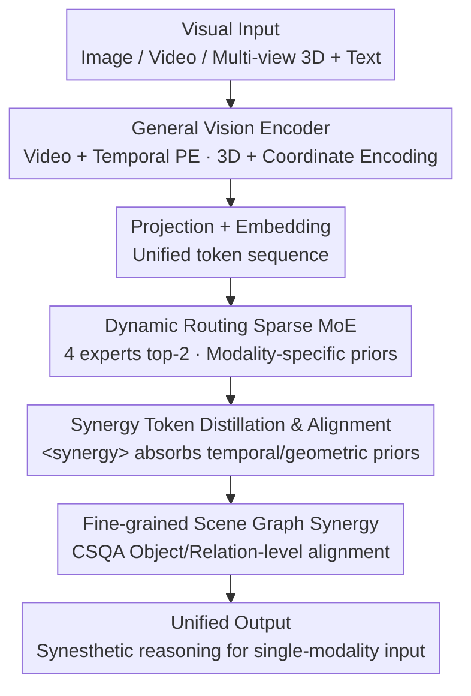

# Modeling Cross-vision Synergy for Unified Large Vision Model

**Conference**: CVPR 2026  
**Paper**: [CVF Open Access](https://openaccess.thecvf.com/content/CVPR2026/html/Wu_Modeling_Cross_vision_Synergy_for_Unified_Large_Vision_Model_CVPR_2026_paper.html)  
**Area**: Multimodal VLM  
**Keywords**: Unified Large Vision Model, Cross-vision Synergy, Sparse MoE, Knowledge Distillation, Scene Graph Alignment

## TL;DR
PolyV integrates image, video, and 3D modalities into a unified large vision model using "Dynamic Routing Sparse MoE + Synergy-aware Training." This enables the model to perform "synesthetic" inference, where temporal priors from video and geometric priors from 3D are transferred to complement static image reasoning. It achieves an average improvement of over 10% across 10 benchmarks relative to the Qwen2.5-VL-7B backbone.

## Background & Motivation

**Background**: Large Vision Models (LVMs) are evolving from modality-specific designs toward unified architectures that simultaneously process images, videos, and 3D data. Dominant approaches involve equipping each modality with independent encoders before feature concatenation, sharing an image encoder for video/image, or extending video encoders to support 3D.

**Limitations of Prior Work**: The authors argue that these unified models only achieve "functional integration"—where a system can handle heterogeneous inputs—but fail to achieve "cross-vision synergy." This is evidenced by two points: 1) Architecturally, models rely on shared encoders or feature concatenation without explicit cross-modal interaction modules, leaving features from different modalities **isolated** and unable to dynamically exchange priors during inference; 2) In training, most models use supervised fine-tuning where modality modules are either trained independently (no sharing) or via incremental tuning (leading to catastrophic forgetting and weak cross-modal generalization).

**Key Challenge**: True synergy should be **bidirectional and interactive**—video temporal/motion priors should assist static image dynamic inference, and 3D geometric priors should enhance video spatial reasoning. However, existing research tends toward **unidirectional** transfers from low-level to high-level modalities (e.g., video→3D), ignoring the essential reciprocal supplementation.

**Goal**: To build a unified LVM that supports cross-vision synergy at both the architectural and training levels, allowing the model to implicitly invoke priors learned from other modalities even when given single-modality input.

**Key Insight**: The authors draw an analogy to the human "synesthetic visual system"—when humans see a static photo of a golfer, they can imagine the trajectory of the ball (vision→temporal) and estimate the distance between the person and the ball (vision→spatial). Models should possess this "cross-modal analogy" capability because images, videos, and 3D are essentially different hierarchical forms of the same visual signal and should share underlying visual features.

**Core Idea**: Use "Sparse MoE + Dynamic Routing" to let each expert specialize in a modality prior while enabling bidirectional complementarity through routing. This is combined with "Synergy-aware Training" (modality-specific pre-training → coarse-grained distillation → fine-grained scene graph alignment) to inject cross-modal priors into a shared `<synergy>` latent token, achieving synesthetic visual reasoning.

## Method

### Overall Architecture
The overall structure of PolyV is concise: a **general vision encoder** + word embedding layer + projection layer + $N$ stacked LLM blocks (some FFNs replaced by MoE). Any visual input $I=\{I_1,\cdots,I_K\}$—single-frame images, video sequences, or multi-view 3D renderings—is processed by the same encoder into visual tokens $V\in\mathbb{R}^{P\times C}$ (video adds temporal PE; 3D injects pixel-wise 3D coordinate encoding). These are projected into the LLM latent space $H\in\mathbb{R}^{P\times D}$, concatenated with text tokens $T$, and fed into the LLM.

The key lies within the LLM: every 4 layers, a standard FFN is expanded into an MoE layer ($M=4$ experts, top-2 activation per token), with a sparse router determining token assignment. The layer-wise calculation follows standard residual structures: $X'_\ell=\mathrm{MSA}(\mathrm{LN}(X_{\ell-1}))+X_{\ell-1}$ and $X_\ell=\mathrm{MoE}(\mathrm{LN}(X'_\ell))+X'_\ell$. Training consists of two stages: first, allowing each expert **to learn a specific modality** (modality-specific pre-training), then integrating these modality-specific FFNs into MoE layers for **synergy-aware fine-tuning** (coarse-grained distillation + fine-grained scene graph alignment). After training, the model can perform synesthetic reasoning using learned priors even with single-modality inputs.

### Key Designs

**1. Dynamic Routing Sparse MoE: Specialized yet Complementary Experts**

To address the isolation of modality features, PolyV replaces FFNs every 4 layers with a set of parallel experts $E=\{E_1,\cdots,E_M\}$. A linear router predicts assignment probabilities for each token, activating the top-$k$ experts and calculating a weighted sum based on normalized scores: $P(X_\ell)_i=\dfrac{e^{f(X_\ell)_i}}{\sum_j e^{f(X_\ell)_j}}$, $\mathrm{MoE}(X_\ell)=\sum_{i=1}^{k}P(X_\ell)_i\cdot E(X_\ell)_i$. This allows experts to refine domain knowledge in their preferred modality sub-spaces while routing enables cross-expert flow. Experts maintain specialization (preventing representational collapse) while achieving bidirectional synergy through the shared router. Routing analysis (Fig. 5/6) confirms emergent specialization: Expert 1 for general image understanding, Expert 2 for spatial reasoning, Expert 3 for temporal/motion tasks, and Expert 4 for mixed reasoning. To prevent token congestion, a differentiable load-balancing loss is added: $L_{aux}=M\cdot\sum_{i=1}^{M}F_i\cdot G_i$.

**2. `<synergy>` Token: A "Mental State" Before Answer Generation**

Architectural synergy alone is insufficient. The authors introduce an explicit `<synergy>` token as a "cognitive mediator," forcing the model to form an intermediate "mental state" representation before generating the final answer. This token is crucial because it provides a **supervisable grounding point** for cross-modal priors. During coarse-grained training, the latent representation $F_{syn}$ is extracted from the last LLM layer and mapped via projection heads $F^v=f^t_{mlp}(F_{syn})$ and $F^g=f^g_{mlp}(F_{syn})$ to align with video/3D foundation model features. The `<synergy>` token acts as a container "internalizing" temporal motion cues and spatial geometric structures.

**3. Synergy-aware Two-stage Training: From Individual Mastery to Coarse-to-Fine Synergy**

To avoid catastrophic forgetting, PolyV employs a coarse-to-fine paradigm. **Stage-1 Modality-specific Pre-training** establishes vision-language connections (tuning projection layers with captioning and $L_{ce}$), then uses complex instruction data to let experts master modality-specific traits. **Stage-2 Synergy-aware Fine-tuning** integrates modality-specific FFNs into MoE layers via two steps:

- **Coarse-grained Synergy Distillation**: Priors from strong single-modality foundation models are injected. Video foundations (e.g., V-JEPA 2) provide temporal priors $F_{temporal}=f_{VFM}(V)$, and 3D foundations (e.g., VGGT) encode spatial structures $F_{spatial}=f_{3DFM}(3D)$. MSE loss aligns synergy features with teacher features: $L_{coarse}=\|F_{temporal}-F^v\|^2+\|F_{spatial}-F^g\|^2$. The total objective is $L=L_{coarse}+\alpha L_{aux}$.
- **Fine-grained Synergy Alignment**: To capture how objects and relations evolve across modalities, the authors construct the **CSQA (Cross-Vision Synergy QA) dataset**. Using scene graphs from image-video and image-3D pairs, GPT-4o generates 20K Q&A pairs focused on object-level (consistency, continuity) and relation-level (interaction, view-dependency) synergy. Training uses $L_{ce}+L_{aux}$, explicitly grounding reasoning in objects and relations.

### Key Experimental Results

#### Main Results
Using Qwen2.5-VL-7B as the backbone, PolyV was evaluated across 10 benchmarks.

| Task | Dataset | Metric | Backbone Qwen2.5-VL-7B | PolyV | Gain |
|------|--------|------|--------------------|-------|------|
| General Image | MMStar | Acc | 62.5 | 71.4 | +8.9 |
| Spatial Image | 3DSRBench-real | Acc | 48.4 | 63.4 | +15.0 |
| Spatial Image | MMSI-Bench | Acc | 24.7 | 31.7 | +7.0 |
| Spatial Video | VSI-Bench | Acc | 33.0 | 52.7 | +19.7 |
| Spatial Video | CVBench | Acc | 51.3 | 59.1 | +7.8 |
| General Video | VideoMME(w/o sub) | Acc | 65.1 | 69.6 | +4.5 |

Regarding 3D QA, PolyV consistently outperformed the backbone and specialized 3D models:

| Dataset | Metric | Backbone Qwen2.5-VL-7B | PolyV | Gain |
|--------|------|--------------------|-------|------|
| ScanQA(val) | CIDEr | 53.9 | 105.6 | +51.7 |
| ScanQA(val) | BLEU-1 | 27.8 | 50.2 | +22.4 |
| SQA3D(test) | EM-1 | 46.5 | 64.8 | +18.3 |
| Open-EQA(HM3D) | LLM-Match | 56.6 | 63.4 | +6.8 |

#### Ablation Study

| Configuration | MMStar | Open-EQA | VSI-Bench | Video-MME | Description |
|------|--------|----------|-----------|-----------|------|
| w/o expert (dense) | 68.9 | 60.3 | 45.8 | 66.4 | Performance drops without MoE |
| **w/ expert (full)** | **71.4** | **63.4** | **52.7** | **69.6** | Full MoE |
| 2 Experts | 69.5 | 61.2 | 48.3 | 67.5 | Performance scales with experts |
| MoE in Front Half | 69.7 | 61.0 | 49.4 | 67.6 | Placement ablation |
| Full MoE Conversion | 70.2 | 61.8 | 53.5 | 68.1 | Diminishing returns/high cost |

### Key Findings
- **MoE is the Performance Engine**: Removing experts to revert to a dense model caused a sharp drop in VSI-Bench (52.7 to 45.8), indicating that cross-modal synergy relies on expert specialization.
- **Diminishing Returns on Experts**: Performance improved from 2 to 4 experts; placing an MoE every 4 layers was found to be more efficient than Converting every layer.
- **Synergy Complementarity**: Coarse-grained distillation excels at global structure, while fine-grained scene graph alignment improves video detail reasoning.
- **Emergent Expert Specialization**: Routing distributions are interpretable, showing experts naturally specializing in imagery, spatial, or temporal domains.

## Highlights & Insights
- **Turning "Synesthesia" into a Supervisable Signal**: The `<synergy>` token combined with dual-teacher distillation provides a concrete ground for transferring video/3D temporal and geometric priors to images.
- **Unidirectional to Bidirectional Perspective**: While prior work moved knowledge from low to high levels (video→3D), this work emphasizes reciprocal interaction and implements bidirectional paths (video→image, 3D→image).
- **Scene-graph Driven QA Construction**: The 20K CSQA dataset shifts "cross-modal alignment" from instance-level to object/relation-level, a strategy applicable to various fine-grained alignment tasks.
- **Synergy Without Sacrificing Generality**: PolyV significantly outperformed specialized models like SpaceR on MMStar, proving that cross-modal priors enhance rather than dilute general image understanding.

## Limitations & Future Work
- **Scarcity of True Triple-modality Co-occurrence**: The lack of data containing images, video, and 3D of the same content necessitated a progressive independent/paired training strategy.
- **Dependency on Teacher Models**: Performance is capped by the quality of foundation models like V-JEPA 2 or VGGT.
- **Synthetic Data Noise**: The 20K CSQA samples were generated by GPT-4o without extensive manual verification, potentially propagating errors from scene graphs.
- **Scaling and Openness**: Future work could explore larger backbones, adaptive expert counts, or incorporating more modalities like native point clouds or audio.

## Related Work & Insights
- **vs. Early Unified Models**: Unlike models that concatenate isolated modality features, PolyV uses shared MoE routing for parameter-level prior exchange.
- **vs. Unidirectional Video→3D Transfer**: PolyV outperforms models like LLaVA-3D by emphasizing bidirectional interaction.
- **vs. Spatial-specific Models**: PolyV avoids the trade-off where specialized spatial models lose general image understanding performance.

## Rating
- Novelty: ⭐⭐⭐⭐ The combination of bidirectional synergy, explicit synergy tokens, and dual-teacher distillation is novel.
- Experimental Thoroughness: ⭐⭐⭐⭐ Extensive coverage across 10 benchmarks with multi-dimensional ablations.
- Writing Quality: ⭐⭐⭐⭐ Clear motivation, hierarchical explanation of methodology, and strong illustrative figures.
- Value: ⭐⭐⭐⭐ As a pioneering framework for explicit cross-vision synergy in unified LVMs, it offers a scalable paradigm for future research.

<!-- RELATED:START -->

## Related Papers

- [\[CVPR 2026\] UNI-OOD: Unified Object- and Image-level Out-of-Distribution Detection via Cross-Context Attentive Vision-Language Modeling](uni-ood_unified_object-_and_image-level_out-of-distribution_detection_via_cross-.md)
- [\[CVPR 2026\] UARE: A Unified Vision-Language Model for Image Quality Assessment, Restoration, and Enhancement](uare_a_unified_vision-language_model_for_image_quality_assessment_restoration_an.md)
- [\[ICLR 2026\] Unified Vision-Language Modeling via Concept Space Alignment](../../ICLR2026/multimodal_vlm/unified_vision-language_modeling_via_concept_space_alignment.md)
- [\[CVPR 2026\] AToken: A Unified Tokenizer for Vision](atoken_a_unified_tokenizer_for_vision.md)
- [\[CVPR 2026\] Grounded 3D-Aware Spatial Vision-Language Modeling](grounded_3d-aware_spatial_vision-language_modeling.md)

<!-- RELATED:END -->
