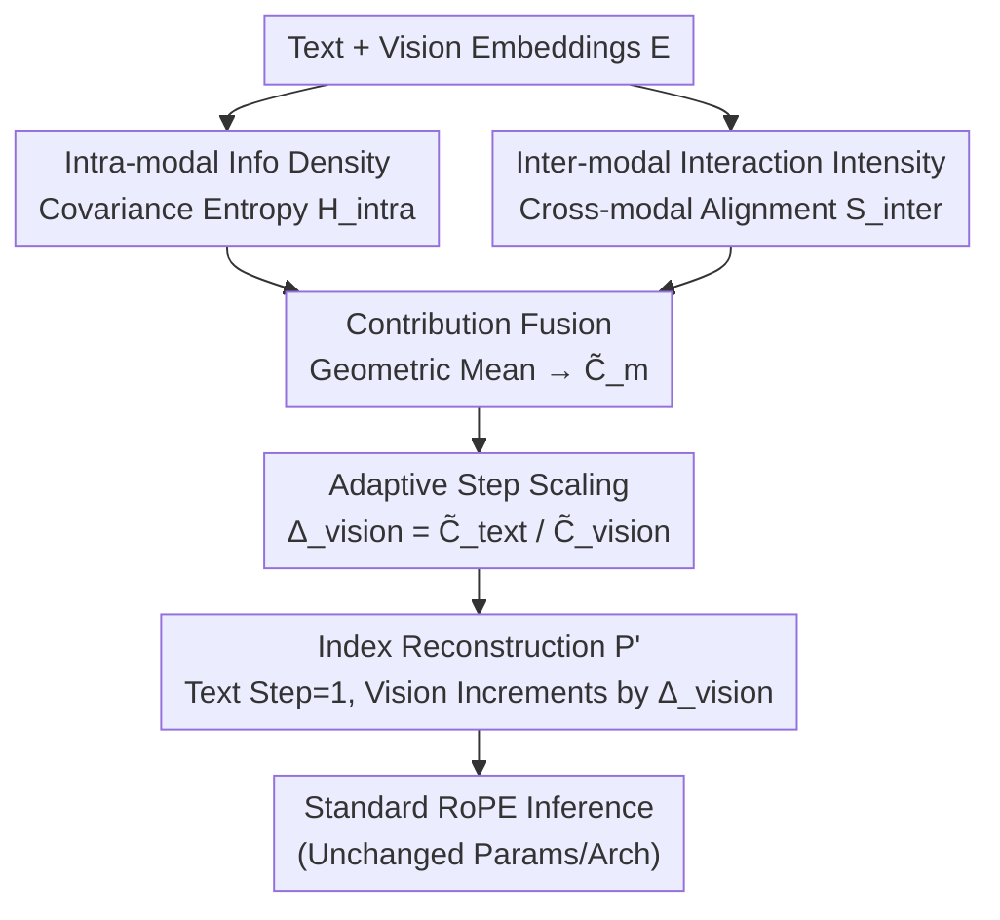

# MODIX: A Training-Free Multimodal Information-Driven Positional Index Scaling for Vision-Language Models

**Conference**: CVPR 2026  
**论文**: [CVF Open Access](https://openaccess.thecvf.com/content/CVPR2026/html/Huang_MODIX_A_Training-Free_Multimodal_Information-Driven_Positional_Index_Scaling_for_Vision-Language_CVPR_2026_paper.html)  
**Code**: None  
**Area**: Multimodal VLMs  
**Keywords**: Positional encoding, RoPE, training-free, information theory, vision-language models  

## TL;DR
MODIX treats "positional granularity" as an implicit resource. It calculates the informational contribution of both textual and visual modalities using covariance entropy (intra-modal information density) and cross-modal alignment (inter-modal interaction). Based on this, it **scales up only the RoPE step size of visual tokens while keeping the text step size as 1**. Without requiring training or parameter modifications, it rewrites the positional indices prior to inference, driving consistent performance gains for VLMs across multiple benchmarks.

## Background & Motivation
**Background**: Modern VLMs almost exclusively adopt Transformer backbones, relying on positional encodings (predominantly RoPE) to concatenate image patch tokens and text tokens into a unified sequence. RoPE employs rotational encoding via the relative distance $\Delta p = p_j - p_i$ between tokens, which is highly effective for pure text.

**Limitations of Prior Work**: All existing approaches treat every token equally by assigning positional indices $p_i = i$, granting **the same positional step size (stride=1)** to both text and vision tokens. However, multimodal data is inherently heterogeneous—text tokens are semantically dense, with each word carrying distinct information, whereas visual tokens originate from fixed-size image patches and exhibit significant spatial redundancy in uniform backgrounds or repetitive textures. Using a uniform step size wastes representational capacity on redundant visual content while "diluting" representation in information-rich regions.

**Key Challenge**: The attention in RoPE decays linearly with relative distance, and under softmax normalization, the attention budget for each query is fixed. Modalities with smaller step sizes span shorter positional intervals, thereby aggregating more attention. Currently, text and redundant background patches receive **the exact same positional granularity (discriminative power)**, leading to a mismatch between attention allocation and information content. Moreover, the modal contributions differ drastically across tasks (vision-dominant scene understanding vs. text-dominant chart/diagram reading). Static positional encodings cannot adapt to such task-dependent shifts.

**Goal**: Without retraining or altering the architecture, this paper aims to make positional granularity adapt dynamically to "informational contribution"—allocating finer positional resolution to modalities with higher information density, while tolerating coarser intervals for redundant content.

**Key Insight**: The authors conceptualize **positional granularity as an allocatable implicit resource**, and quantize how much granularity each modality should receive by simultaneously profiling "intra-modal information density" and "inter-modal interaction intensity" as two complementary dimensions using information theory.

**Core Idea**: During inference, a lightweight preprocessing layer computes the visual step size $\Delta_\text{vision}$ based on the contribution ratio $\tilde C_\text{text}/\tilde C_\text{vision}$, and rewrites the positional indices before feeding them into standard RoPE—plug-and-play replacing the "uniform step size" with an "information-driven adaptive step size".

## Method

### Overall Architecture
MODIX is a pure inference preprocessing module added **before** RoPE. The inputs are text embeddings $E_\text{text}\in\mathbb{R}^{n_t\times d}$ and visual embeddings $E_\text{vision}\in\mathbb{R}^{n_v\times d}$ already projected into a unified embedding space. The output is a set of rewritten positional indices $P'$. It analyzes embeddings via two parallel paths: the **intra-modal path** uses covariance entropy to estimate the information density of each modality, and the **inter-modal path** uses cross-modal similarity to measure the interaction intensity between the two modalities. The scores from both paths are fused into a unified contribution metric $\tilde C_m$ using geometric mean, from which the visual step size $\Delta_\text{vision}$ is derived via the contribution ratio. Finally, the positional indices $P'$ are reconstructed in a segmented manner (text retains $p'_i=i$, while vision increments equidistantly by $\Delta_\text{vision}$) and seamlessly fed into RoPE. The entire pipeline runs only once per input, with a complexity independent of the number of layers.

### Key Designs

**1. Treating Positional Granularity as an Allocatable Resource: Formalization of Information Asymmetry**

Instead of modifying the RoPE frequencies once again, MODIX redefines the problem. The authors point out that as RoPE attention decays with relative distance and softmax constrains each query's attention to a fixed budget, the "step size" essentially allocates attention bandwidth: smaller step size $\rightarrow$ smaller positional span $\rightarrow$ more aggregated attention. Therefore, assigning the same step size to redundant vision and dense text is a resource misallocation. Formally, this work seeks a mapping $f:\mathbb{R}^{N\times d}\to\mathbb{R}^N$ to output modality-aware indices $P' = f(E)$, subject to the constraint that visual tokens with lower informational contribution receive a coarser granularity, text tokens retain their original indices, and monotonicity is strictly maintained as $p'_i < p'_j\ (i<j)$. Consequently, attention scores depend on the adjusted relative distance $|p'_i - p'_j|$, reflecting both token intervals and modal contributions. This perspective of "positional granularity = implicit resource" forms the foundation of all subsequent designs.

**2. Intra-modal Information Density: Covariance Determinant as an Entropy Proxy**

To answer "how information-rich a modality is internally", MODIX quantifies it via the **covariance entropy** of the embedding distribution. Let the centralized embeddings of modality $m$ be $\tilde e^m_i = e^m_i - \bar e^m$, and compute the empirical covariance matrix:

$$\Sigma_m = \frac{1}{n_m}\sum_{i=1}^{n_m}\tilde e^m_i (\tilde e^m_i)^\top \in \mathbb{R}^{d\times d}$$

Under a Gaussian approximation, the differential entropy is then computed as a proxy for information density:

$$H^\text{intra}_m = \tfrac{1}{2}\log\det(\Sigma_m + \epsilon I_d)$$

where $\epsilon=10^{-6}$ ensures numerical stability. The authors justify this approximation: although the embedding dimension is very high ($d\approx 1000$), contrastive learning objectives exert a regularizing effect, making the Gaussian approximation acceptable. More importantly, the covariance determinant $\det(\Sigma_m)$ is itself a distribution-free metric of embedding variability—a larger determinant indicates that the embeddings of this modality are "wider spread," indicating richer information. Finally, normalization across modalities yields the intra-modal contribution $I^\text{intra}_m = H^\text{intra}_m / \sum_{m'} H^\text{intra}_{m'}$. The intuition is that text embeddings tend to be independent across dimensions with large covariance volumes and high entropy, whereas redundant visual embeddings cluster together, resulting in smaller volumes and lower entropy.

**3. Inter-modal Interaction Intensity: Directional Metric of Cross-modal Maximal Alignment**

The value of a modality depends not only on its internal richness but also on the strength of its interaction with other modalities. MODIX computes the L2-normalized token similarity matrix $S = \hat E_\text{text}\hat E_\text{vision}^\top \in\mathbb{R}^{n_t\times n_v}$, and defines two **directional** interaction scores using the "mean of the maximum similarity of each token to the opposing modality":

$$S^\text{inter}_{\text{text}\to\text{vision}} = \frac{1}{n_t}\sum_{i=1}^{n_t}\max_{j}S_{ij},\qquad S^\text{inter}_{\text{vision}\to\text{text}} = \frac{1}{n_v}\sum_{j=1}^{n_v}\max_{i}S_{ij}$$

The former measures "whether each text token can find supporting evidence in the image," while the latter measures "whether each visual token aligns with textual semantics." Using the max function instead of the mean captures the "best-matching pair" without dilution from a large number of irrelevant tokens. Normalizing across modalities likewise yields $I^\text{inter}_m$. This path penalizes scenarios where a single modality is internally rich but irrelevant to the other.

**4. Geometric Mean Fusion + Adaptive Step Scaling and Index Reconstruction**

The two scores are fused via a **geometric mean** rather than an arithmetic mean: $C_m = (I^\text{intra}_m)^\alpha (I^\text{inter}_m)^{1-\alpha}$, which is then normalized to $\tilde C_m$. The advantage of the geometric mean lies in the "limiting factor" effect—a modality achieves high contribution only when it exhibits **both** rich internal information and strong cross-modal alignment; failing in either metric severely pulls down the overall score. $\alpha$ balances the two components, with $\alpha = 0.5$ found to be optimal in experiments.

Based on these contributions, the authors derive the step size from RoPE theory: attention bandwidth is inversely proportional to the positional span. To match the bandwidth ratio to the contribution ratio, $A^\text{total}_\text{text}/A^\text{total}_\text{vision}\approx \tilde C_\text{text}/\tilde C_\text{vision}$, and **fixing the text step size $\Delta_\text{text}=1$**, they solve for the visual step size:

$$\Delta_\text{vision} = \frac{\tilde C_\text{text}}{\tilde C_\text{vision}}$$

When the visual contribution is lower than the text contribution, $\Delta_\text{vision}>1$ (coarser visual spacing); otherwise, $\Delta_\text{vision}<1$ (finer visual spacing). The rationale for fixing the text step size is concrete: the linguistic backbone's syntactic, semantic, and textual dependencies learned during pretraining are strongly bound to the original ordered indices; changing the text step size would corrupt these relationships. Conversely, visual tokens are introduced via a projection interface without pre-trained positional priors, making their step size a naturally flexible degree of freedom. Finally, the indices are reconstructed in blocks:

$$p'_i = \begin{cases} i, & i < n_t \\ p'_{n_t-1} + \Delta_\text{vision}\cdot(i - n_t + 1), & i \ge n_t \end{cases}$$

The text segment maintains original indices, and the visual segment advances by a constant step starting from $n_t$, with $\Delta_\text{vision}>0$ ensuring strict monotonicity. The reconstruction requires only a single linear scan over the sequence, after which $P'$ replaces the original indices for RoPE. Entirely training-free and architecture-neutral.

### A Complete Example
Taking the four task categories reported in Figure 2 as examples, we can see how contributions translate into step sizes:
- **RealWorldQA (Vision-dominant)**: Visual intra=0.685, fusion $\tilde C_\text{vision}=0.648$ > text, resulting in $\Delta_\text{vision}\approx 0.54$ (<1, visual spacing becomes **finer**), directing more attention bandwidth to vision.
- **DocVQA (Text-dominant)**: Text fusion $\tilde C_\text{text}=0.698$, vision is only 0.302, resulting in $\Delta_\text{vision}\approx 2.31$ (visual spacing becomes **coarser**), compressing redundant document backgrounds.
- **AI2D / ChartQA (Text-leaning)**: Step sizes are approximately 2.09 / 1.51, situated in between.

This demonstrates how a single mechanism automatically adjusts the visual granularity to different levels between 0.54 and 2.31 across different tasks, achieving instance-specific adaptation—a direct realization of treating positional encoding as an adaptive resource.

## Key Experimental Results

### Main Results
3 VLM architectures (Qwen3-VL, InternVL3.5, LFM2-VL, 1.6B–8B) $\times$ 6 benchmarks. Each result is averaged over 10 random seeds with Wilcoxon signed-rank test ($p<0.05$), standard deviations all <0.5%.

| Model | Scale | ScienceQA | RealWorldQA | DocVQA | ChartQA | AI2D | BLINK |
|------|------|-----------|-------------|--------|---------|------|-------|
| Qwen3-VL | 2B | 72.18→**78.28** (+6.10) | 64.31→65.75 (+1.44) | 83.27→86.37 (+3.10) | 62.64→**68.76** (+6.12) | 67.20→72.96 (+5.76) | 49.18→51.22 (+2.04) |
| Qwen3-VL | 8B | 88.41→90.16 (+1.75) | 66.93→69.15 (+2.22) | 90.39→91.02 (+0.63) | 70.60→72.80 (+2.20) | 78.59→83.44 (+4.85) | 62.80→61.05 (−1.75) |
| InternVL3.5 | 2B | 68.83→70.05 (+1.22) | 58.82→60.26 (+1.44) | 82.15→84.68 (+2.53) | 55.92→57.89 (+1.97) | 70.91→72.44 (+1.53) | 49.76→51.97 (+2.21) |
| InternVL3.5 | 8B | 89.70→91.13 (+1.43) | 63.79→63.01 (−0.78) | 85.92→85.63 (−0.31) | 59.00→59.57 (+0.57) | 78.14→81.38 (+3.24) | 53.50→54.79 (+1.29) |
| LFM2-VL | 1.6B | 65.41→**73.83** (+8.42) | 56.99→63.79 (+6.80) | 66.14→71.36 (+5.22) | 59.83→63.64 (+3.81) | 52.10→56.54 (+4.44) | 41.68→45.08 (+3.40) |
| LFM2-VL | 3B | 84.20→84.67 (+0.47) | 67.32→68.76 (+1.44) | 71.75→79.33 (+7.58) | 73.23→75.08 (+1.85) | 72.33→75.36 (+3.03) | 47.56→51.08 (+3.52) |
| **Average Δ** | | **+3.23** | **+2.09** | **+3.13** | **+2.75** | **+3.80** | **+1.79** |

Smaller models show the largest gains (LFM2-VL-1.6B on ScienceQA +8.42, Qwen3-VL-2B on ChartQA +6.12); larger models exhibit narrower gains, with InternVL3.5-8B showing insignificant small fluctuations of -0.78/-0.31 on RealWorldQA/DocVQA (remaining within measurement noise). On the video task Video-MME, gains are most pronounced for medium/long videos (+2.23~+2.66), validating the efficacy of compressing temporal redundancy and directing attention to long-range dependencies.

Comparing horizontally with multimodal PE variants (Table 3, under the same backbone and settings): on Qwen3-VL-8B, MODIX achieves +1.75 on ScienceQA and +2.20 on ChartQA, outperforming CircleRoPE (+0.46/+0.23) and MHRoPE (+0.74/+2.07); on InternVL3.5-8B, MODIX (+1.43/+0.57) outperforms V2PE (-0.43/+0.12), all without parameter adjustments.

### Ablation Study
Sweeping the fusion weight $\alpha$ on Qwen3-VL-2B ($\alpha=0$ represents pure inter-modal, $\alpha=1$ represents pure intra-modal):

| $\alpha$ | ScienceQA | RealWorldQA | DocVQA | ChartQA | AI2D | BLINK |
|------|-----------|-------------|--------|---------|------|-------|
| 0.00 | 78.05 | 65.70 | 86.80 | 66.00 | 68.83 | 45.79 |
| 0.25 | 78.07 | 62.56 | **90.67** | 65.60 | 68.67 | 47.26 |
| **0.50** | **78.28** | 65.75 | 86.37 | **68.76** | **72.96** | **51.22** |
| 0.75 | 77.92 | 65.60 | 86.08 | 62.83 | 71.75 | 49.74 |
| 1.00 | 76.90 | 64.89 | 87.35 | 64.42 | 71.43 | 48.86 |

$\alpha=0.5$ achieves the best overall performance, demonstrating a clear lead on ChartQA, AI2D, and BLINK. $\alpha=0$ (pure inter-modal) performs weaker on spatially dense tasks like RealWorldQA, indicating that internal information density cannot be ignored; $\alpha=1$ (pure intra-modal) drops to 76.90 on text-centric tasks like ScienceQA, indicating that cross-modal alignment is equally vital—both components of the geometric mean fusion are indispensable.

### Key Findings
- **Smaller models benefit the most**: 1.6B–2B models consistently show gains of +4~+8, while 8B models narrow down to +0.6~+4, indicating that larger models utilize position information more adequately on their own, and MODIX provides the most significant relief to "positionally constrained" smaller models.
- **Task-adaptive scaling is indeed active** (Table 5): Text contribution $\tilde C_\text{text}$ ranges from 0.469 on BLINK to 0.698 on DocVQA. Document and chart tasks are text-dominant, whereas RealWorldQA is vision-dominant. MODIX automatically adjusts the step size inversely in response.
- **Negligible overhead**: The additional operations run only once before inference and are independent of model layers; on Qwen3-VL-8B, ScienceQA/ChartQA incur only an extra 0.0014s/0.0018s (1.1%/0.7% wall-clock), consuming only a few megabytes of memory.
- **Transferability to training** (Preliminary): Fine-tuning Qwen3-VL-2B with MODIX on ScienceQA yields 93.23% accuracy, outperforming the baseline fine-tuning baseline of 92.30%, though this was only validated on a single task and scale.

## Highlights & Insights
- **Reinterpreting "positional step size" as attention bandwidth resource**: By deriving "smaller step size = more bandwidth" from RoPE distance decay and a fixed softmax budget, and subsequently matching the bandwidth ratio to the information contribution ratio, this causal chain provides a clear theoretical grounding for scaling step sizes instead of empirical tuning.
- **Restricting modification to vision while locking text is a restrained asymmetric design**: Capitalizing on the insight that the language backbone's positional priors are deeply ingrained during pretraining, while visual tokens lack such pretraining priors, this method designates the visual step size as the sole degree of freedom. This successfully avoids damaging existing textual relationships, which is crucial for its training-free stable gains.
- **Using covariance determinant as an information density proxy is a reusable trick**: No knowledge of the true distribution is required; $\det(\Sigma)$ provides a coarse measure of how "spread out" the embeddings are. This can be adapted to any scenario comparing the informational density of two embedding sets (e.g., token pruning, modal weighting).
- **Clever use of the geometric mean's limiting factor effect**: Forcing high contribution to require BOTH internal richness AND cross-modal alignment is far more effective at filtering out "self-absorbed" modalities than an arithmetic mean.

## Limitations & Future Work
- **Coarse modality-level granularity**: MODIX assigns a single step size to the entire visual modality, thus failing to capture informational discrepancies across heterogeneous regions (foreground vs. background) within the same image. The authors acknowledge token-level adaptive step sizes as a finer direction.
- **Bound to RoPE**: This method is inherently tied to the distance-decay properties of RoPE. It has not been verified on mechanisms like ALiBi or learnable positional encodings, which require tailored designs.
- **Fragile training-aware evidence**: Training-aware MODIX achieves a modest +0.93 gain only on a single task at 2B scale. Preliminary compatibility tests were performed at the 32B scale, but its impact on >70B scales and full pretraining remains unexplored.
- **Personal Observations**: The step size is driven by global covariance and similarity statistics. There is a lack of rigorous failure-mode analysis regarding stability in short sequences or extreme modal ratios (e.g., pure text with virtually no vision), as well as occasional negative fluctuations observed on 8B models (e.g., −0.78 on InternVL3.5-8B).

## Related Work & Insights
- **vs. Standard RoPE / V2PE / CircleRoPE / MHRoPE**: These methods either enforce a uniform step size $p_i=i$ or design fixed rules at the architectural/frequency level (additionally, V2PE/MHRoPE mostly require training). MODIX is completely training-free and determines step sizes dynamically based on **task-dependent informational contributions** rather than static rules, performing comparably or better in direct comparisons.
- **vs. Token Pruning (e.g., visual token pruning variants)**: Pruning **physically discards** redundant visual tokens, sacrificing spatial structural information and often requiring architectural changes. MODIX **retains all tokens** and only scales position intervals. Thus, it preserves all information without model alterations, facilitating direct deployment to pretrained VLMs.
- **vs. Multimodal Information Theory Methods (Information Bottleneck / Mutual Information Maximization)**: Previously utilized mostly for representation learning or modal fusion, MODIX systematically applies informational principles to **positional step size design** for the first time, introducing a novel perspective of allocating positional granularity based on informational contributions.

## Rating
- Novelty: ⭐⭐⭐⭐⭐ Reconceptualizing positional granularity as an allocatable resource and using information theory to drive step sizes represents a fresh perspective on PE design, which is also training-free.
- Experimental Thoroughness: ⭐⭐⭐⭐ Solid evaluation across 3 architectures $\times$ 7 benchmarks + video + horizontal comparison + overhead analysis with 10 seeds for significance testing; however, training-state and ultra-large model validations remain weak.
- Writing Quality: ⭐⭐⭐⭐⭐ The theoretical derivation of the bandwidth-to-step relationship is clear, the case analysis is intuitive, and the framework diagrams map cleanly to the mathematical formulations.
- Value: ⭐⭐⭐⭐ Plug-and-play with near-zero overhead, delivering notable gains for smaller models, making it highly engineering-friendly; however, performance gains narrow as the model size increases.

<!-- RELATED:START -->

## Related Papers

- [\[ICLR 2026\] Revisiting Multimodal Positional Encoding in Vision-Language Models](../../ICLR2026/multimodal_vlm/revisiting_multimodal_positional_encoding_in_visionlanguage_models.md)
- [\[CVPR 2026\] LLMind: Bio-inspired Training-free Adaptive Visual Representations for Vision-Language Models](llmind_bio-inspired_training-free_adaptive_visual_representations_for_vision-lan.md)
- [\[CVPR 2026\] Aligning What Vision-Language Models See and Perceive with Adaptive Information Flow](aif_adaptive_information_flow_vlm.md)
- [\[ICML 2026\] Circle-RoPE: Cone-like Decoupled Rotary Positional Embedding for Vision-Language Models](../../ICML2026/multimodal_vlm/circle-rope_cone-like_decoupled_rotary_positional_embedding_for_large_vision-lan.md)
- [\[CVPR 2026\] Pointing at Parts: Training-Free Few-Shot Grounding in Multimodal LLMs](pointing_at_parts_training-free_few-shot_grounding_in_multimodal_llms.md)

<!-- RELATED:END -->
