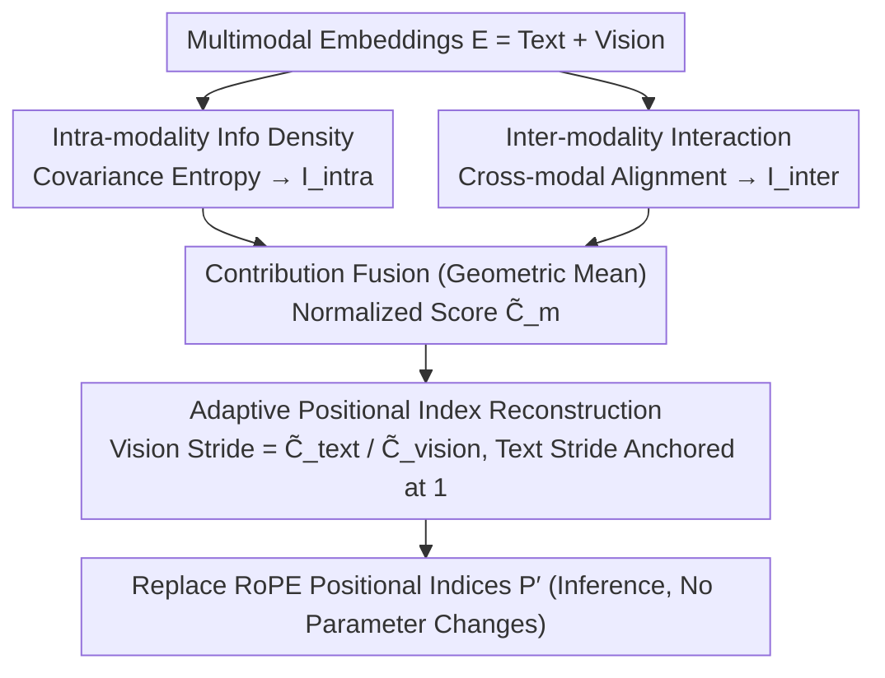

# MODIX: Training-Free Multimodal Information-Driven Positional Index Scaling for VLMs

**Conference**: CVPR 2026 Highlight  
**arXiv**: [2604.12537](https://arxiv.org/abs/2604.12537)  
**Code**: None  
**Area**: Multimodal VLM  
**Keywords**: Positional Encoding, RoPE, Information Density, Training-Free, Vision-Language Models

## TL;DR

MODIX is proposed as a training-free framework that dynamically adjusts the positional encoding strides of visual and text tokens in VLMs through information-theoretic analysis (covariance entropy + cross-modal alignment). It allocates positional granularity to information-dense modalities to enhance multimodal reasoning.

## Background & Motivation

**Background**: VLMs commonly employ Rotary Positional Embedding (RoPE), assigning uniform positional indices $p_i = i$ to all tokens regardless of their information content or cross-modal importance.

**Limitations of Prior Work**: Text tokens are semantically dense (each word contributes unique information), whereas visual tokens (fixed-size image patches) frequently exhibit significant spatial redundancy in uniform backgrounds or repetitive textures. Uniform positional encoding wastes representation capacity on redundant content while under-representing information-rich regions. Furthermore, modality contributions vary drastically across different tasks.

**Key Challenge**: There is an asymmetry in information density both between and within modalities, yet existing RoPE schemes treat all tokens with a unified stride.

**Goal**: To treat positional granularity as an implicit resource and allocate it dynamically based on information contribution—modalities with higher information density receive finer positional resolution.

**Key Insight**: Information-theoretic analysis: covariance entropy measures intra-modal information density, while cross-modal alignment measures the strength of inter-modal interactions.

**Core Idea**: Adaptive stride $\Delta_m \propto 1/\tilde{C}_m$, where modalities with larger information contributions are assigned finer positional intervals.

## Method

### Overall Architecture

During inference, MODIX analyzes multimodal embeddings $\mathbf{E}=[\mathbf{E}_{text};\mathbf{E}_{vision}]$ and measures the information contribution of each modality through **two parallel paths**: the intra-modality path uses covariance entropy to assess "sufficiency of self-information," while the inter-modality path uses cross-modal alignment to assess "task relevance." The results are fused into a normalized contribution score $\tilde{C}_m$. The text stride is anchored at 1, while the visual token stride is adaptively scaled based on the contribution ratio to reconstruct new positional indices $\mathbf{P}'$. These replace the standard RoPE indices without modifying any parameters or architecture.

### Key Designs

**1. Intra-modality Information Density Estimation: Quantifying "Information Volume"**

To allocate positional granularity based on information, a metric is required to measure the information within each modality. MODIX extracts all token embeddings for a modality, calculates their covariance matrix, and computes entropy based on the eigenvalue distribution. The intuition is that if information is concentrated in a few dimensions, eigenvalues will be highly concentrated and entropy will be low, indicating high redundancy. Conversely, if information is spread across many dimensions, entropy will be high, indicating each token contributes unique information. This aligns with the differences between vision and text—vision patches in redundant textures are highly correlated (low entropy), while semantically dense text tokens are more independent (high entropy).

**2. Inter-modality Interaction Strength: Aligning Information with the Task**

Self-information alone is insufficient, as the value of a modality also depends on its coupling with other modalities. MODIX calculates a cross-modal alignment score by L2-normalizing the vision and text embeddings and computing the similarity matrix $S=\hat{E}_{text}\hat{E}_{vision}^{\top}$. For each token, the **maximum similarity to the other modality is taken and then averaged within the modality** to obtain directional interaction strengths. The intuition is that if a token finds strong support in the opposing modality, it is deeply involved in cross-modal understanding and deserves finer positional resolution.

The two paths are fused using a **geometric mean**: $C_m=(I_m^{intra})^{\alpha}(I_m^{inter})^{1-\alpha}$, followed by normalization to obtain the contribution score $\tilde{C}_m$. The geometric mean ensures that a modality receives a high score **only if it is both internally information-rich and strongly cross-modally relevant**.

**3. Adaptive Positional Index Reconstruction: Finer Strides for Denser Information**

The contribution score $\tilde{C}_m$ is translated into positional indices for RoPE. MODIX fixes the text stride $\Delta_{text}=1$ to preserve the language backbone's pre-trained structure and scales the visual stride:

$$\Delta_{vision} = \frac{\tilde{C}_{text}}{\tilde{C}_{vision}}$$

Lower visual contribution leads to larger strides (coarser positions), while higher contribution leads to smaller strides (finer positions). This follows the principle that stride is inversely proportional to information contribution. During reconstruction, text tokens retain original indices $p'_i=i$, while visual tokens are accumulated starting from $n_t$ with the fixed stride $\Delta_{vision}$. Since $\Delta_{vision}>0$, the sequence remains strictly monotonic ($i<j\Rightarrow p'_i<p'_j$), preserving RoPE's reliance on relative order.

This rule is based on the RoPE attention mechanism: softmax normalizes the attention of each query into a "fixed budget," and RoPE attention decays with relative distance. Therefore, a modality occupying a smaller positional span accumulates more attention. MODIX ensures the ratio of attention matches the ratio of contributions. This entire replacement occurs at inference time without changing a single parameter.

## Loss & Training

MODIX is a completely training-free method. It operates only during inference and does not modify model parameters or architecture. The positional indices of RoPE are directly replaced.

## Key Experimental Results

### Main Results

| Model | Method | ScienceQA↑ | DocVQA↑ | ChartQA↑ | Video-MME↑ |
|------|------|-----------|---------|----------|-----------|
| Qwen3-VL-4B | Baseline | 85.2 | 89.1 | 78.3 | 62.5 |
| Qwen3-VL-4B | +MODIX | **87.1** | **90.5** | **80.2** | **64.3** |
| InternVL3.5-8B | Baseline | 88.5 | 91.3 | 82.1 | 66.8 |
| InternVL3.5-8B | +MODIX | **90.2** | **92.6** | **83.8** | **68.5** |

### Ablation Study

| Configuration | Avg. Improvement | Description |
|------|---------|------|
| Full MODIX | +1.8% | Intra-modal + Inter-modal |
| Intra-modal Density Only | +1.2% | No cross-modal interaction |
| Inter-modal Alignment Only | +0.9% | No internal density |
| Fixed Stride (0.5) | +0.5% | No adaptation |

### Key Findings

- MODIX favors finer granularity for text in text-intensive tasks (DocVQA) and for vision in vision-intensive tasks (ChartQA), automatically adapting to task characteristics.
- Consistent improvements across three architectures (1B-8B) and seven benchmarks demonstrate generalizability.
- The dual-path analysis outperforms either single path.

## Highlights & Insights

- The perspective of "positional granularity as an implicit resource" is highly novel; prior work has not linked positional encoding with information density.
- The training-free nature allows for plug-and-play application to any RoPE-based VLM.
- The ability to adapt to task characteristics suggests that information-theoretic analysis effectively captures dynamic shifts in modality contribution.

## Limitations & Future Work

- Currently only supports RoPE positional encoding; not applicable to absolute or learnable positional encodings.
- Information density estimation relies on the covariance structure of embeddings, which might not be suitable for all layers.
- Performance on ultra-long sequences (e.g., long videos) has not been evaluated.
- Potential for extension to more modalities (e.g., audio).

## Related Work & Insights

- **vs V2PE**: V2PE improves multimodal long context via variable visual positional encoding but requires training. MODIX is training-free.
- **vs CircleRoPE**: CircleRoPE alleviates cross-modal positional bias, whereas MODIX adaptively allocates based on information theory.

## Rating

- Novelty: ⭐⭐⭐⭐⭐ The concept of treating positional encoding as an information resource is very novel.
- Experimental Thoroughness: ⭐⭐⭐⭐ Validation across three architectures and seven benchmarks.
- Writing Quality: ⭐⭐⭐⭐ Clear theoretical derivation.
- Value: ⭐⭐⭐⭐ A practical, training-free, plug-and-play method.

<!-- RELATED:START -->

## Related Papers

- [\[CVPR 2026\] Pointing at Parts: Training-Free Few-Shot Grounding in Multimodal LLMs](pointing_at_parts_training-free_few-shot_grounding_in_multimodal_llms.md)
- [\[ICCV 2025\] Training-free Generation of Temporally Consistent Rewards from VLMs](../../ICCV2025/multimodal_vlm/training-free_generation_of_temporally_consistent_rewards_from_vlms.md)
- [\[CVPR 2026\] SoPE: Spherical Coordinate-Based Positional Embedding for 3D LVLMs](sope_spherical_positional_encoding_3d_lvlm.md)
- [\[ICML 2026\] Circle-RoPE: Cone-like Decoupled Rotary Positional Embedding for Vision-Language Models](../../ICML2026/multimodal_vlm/circle-rope_cone-like_decoupled_rotary_positional_embedding_for_large_vision-lan.md)
- [\[CVPR 2026\] PAS: A Training-Free Stabilizer for Temporal Encoding in Video LLMs](pas_a_training-free_stabilizer_for_temporal_encoding_in_video_llms.md)

<!-- RELATED:END -->
