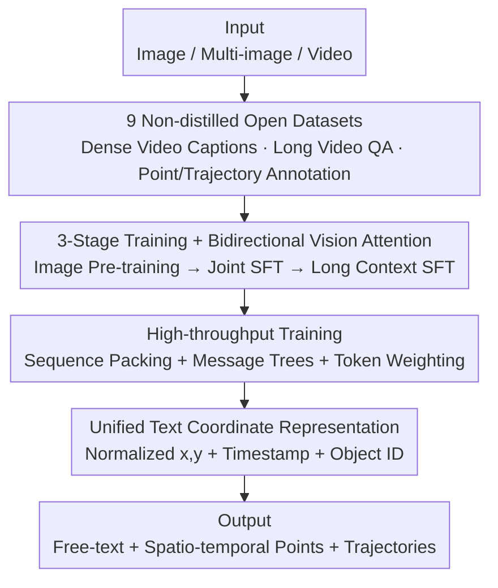

# Molmo2: Open Weights and Data for Vision-Language Models with Video Understanding and Grounding

**Conference**: CVPR 2026  
**Paper**: [CVF Open Access](https://openaccess.thecvf.com/content/CVPR2026/html/Clark_Molmo2_Open_Weights_and_Data_for_Vision-Language_Models_with_Video_CVPR_2026_paper.html)  
**Code**: https://allenai.org/blog/molmo2  
**Area**: Multimodal VLM  
**Keywords**: Video-Language Model, Open Weights and Data, Video Grounding, Point Localization and Tracking, No-distillation Data

## TL;DR
Molmo2 is a **fully open** family of Video-Language Models (weights, data, code, and training recipes are all open, with no data distilled from closed-source VLMs). By building 9 new datasets and utilizing a three-stage training strategy, it fills the missing capability of "video grounding using points and trajectories" even found in closed-source models. The 8B model significantly outperforms comparable open-source models in video counting, pointing, and tracking, even surpassing Gemini 3 Pro in certain tasks.

## Background & Motivation
**Background**: Currently, the strongest Video-Language Models (VLMs) are almost entirely closed-source—weights, data, and recipes are not public. Models in the open-source community that perform well often rely heavily on synthetic data distilled from closed VLMs, and they lack transparency regarding training data and recipes.

**Limitations of Prior Work**: This has left the open-source community without the foundation required to improve SOTA video/image language models from scratch. Crucially, many downstream applications (video retrieval, robotics, assistive tech, sports analysis, security, autonomous driving) require **grounding**—either pointing out "where and when events/objects occur" or continuously tracking targets at the pixel level. This **spatio-temporal grounding** is only partially supported and functionally limited even in closed-source systems.

**Key Challenge**: While image grounding (pointing in single images) is standard, **video grounding** (simultaneous localization in time and space) is extremely scarce. The root cause is the lack of high-quality public training data, as most current large-scale video datasets are distilled and cannot form a "clean open foundation."

**Goal**: To create a fully open VLM family capable of grounding in single-image, multi-image, and video contexts, while making the complete recipe for "data generation + model training" public for community replication and improvement.

**Key Insight**: The authors argue that what open-source video VLMs truly lack is not model architecture (the standard ViT + connector + LLM is sufficient), but **targeted training data** and a **training recipe** capable of efficiently digesting that data. Consequently, effort was focused on creating 9 new datasets (none distilled from closed models) and designing an engineering solution for high-throughput training.

**Core Idea**: Extend the "2D pointing" paradigm from images to the temporal and multi-image domains using a **unified plain-text coordinate format** for points and trajectories. Combined with three-stage training and techniques such as bidirectional attention, token weighting, sequence packing, and message trees, a standard VLM learns video pointing, counting, and tracking.

## Method

### Overall Architecture
Molmo2 is not a new architecture but a combination of "**fully open data + standard VLM + efficient training recipe**." The model follows a general design: visual inputs are tiled into fixed-size crops, encoded by a ViT into patch features, pooled and projected by a connector into visual tokens, and fed to the LLM alongside text tokens. Video is sampled at $S{=}2$ fps (each frame as a single crop), up to $F{=}128$ frames (and $F{=}384$ during long-context training). The pipeline's core contributions lie in the **input data** (9 non-distilled datasets) and **how to efficiently train on it** (three-stage training + engineering tricks + unified grounding format).

### Key Designs

**1. Nine "Non-distilled" Fully Open Datasets: Filling Skill Gaps with Data**

Video VLMs lack data more than architecture. The authors created 9 new datasets (plus 2 derived from existing academic data), all **without distillation from closed VLMs**. Key categories include: ① **Molmo2-Cap** (104k video-level + 431k clip-level dense captions) – annotators narrated descriptions (speech allows more detail than typing), transcribed via Whisper-1, rewritten by a text LLM, and merged with frame-level captions from Molmo to capture low-level details, averaging **924 words per video** (most dense in its class); ② **Molmo2-AskModelAnything** (140k human-written video QAs), intentionally excluding counting (handled by pointing data); ③ **Molmo2-VideoPoint** (280k videos, 650k+ pointing queries across 8 categories: object/action/referring/spatial/comparison/visual artifacts), where annotators found the frame and clicked the precise location; ④ **Molmo2-VideoTrack** (point-based tracking following the Ref-VOS paradigm). These datasets target "under-valued skills in open data."

**2. Unified Text Coordinate Representation: Unifying Counting, Pointing, and Tracking**

Grounding outputs are unified into a **compact plain-text format**: each point includes normalized $x, y$ coordinates, a timestamp (video) or image index (multi-image), and an **integer ID unique to each distinct object**. This ID naturally unifies "counting" (number of unique IDs) and "tracking" (linking the same ID across frames). Points are sorted by time/index and then by $x, y$. A key discovery: **point-then-count** strategies perform much better than "directly predicting a number" (MVC 34.5 vs 28.1 in ablation) because pointing grounds "counting" in locatable positions. This representation allows one token sequence to handle three distinct grounding tasks.

**3. Three-Stage Training + Bidirectional Vision Attention: Transferring Image Skills to Video**

Training is split into three phases: ① **Image-only lightweight pre-training** (60% dense captions + 30% pointing + 10% text, 32k steps) – pointing pre-training was found to improve SFT performance; ② **Joint SFT** (mixed image/video/multi-image, using manual sampling rates, 30k steps, sequence length 16,384); ③ **Short-and-Long Context SFT** (same mix, sequence length 36,864, $F{=}384$, 2k steps, using Ulysses attention for parallelism). A critical modeling change is **allowing visual tokens to attend to each other bidirectionally** (even across different frames/images), which significantly improved performance (caption F1 dropped from 32.6 to 30.8 without it). The curriculum logic is: solidify image captioning/pointing first, then expand to video and multi-image.

**4. High-throughput Training: Sequence Packing, Message Trees, and Token Weighting**

Video data sample lengths vary wildly (text-only 100s vs long video 16k+). Three tricks solve this: ① **Sequence Packing** – an on-the-fly algorithm packs multiple short samples into a long sequence with custom masks to prevent cross-contamination; ② **Message Trees** – encodes "one visual input + multiple annotations" as a tree (visual is the root, each annotation a branch), linearized into a sequence with branch masks, enabling ~**15×** training efficiency; ③ **Token Weighting** – dense captions with 4000+ tokens could drown out loss for short QA. Capacities are balanced by setting caption weights to 0.1, pointing to 0.2, and others to $\frac{4}{\sqrt{n}}$ ($n$ is the number of answer tokens). Token weighting improves QA but slightly degrades caption F1 (32.6 vs 34.0 without weighting).

### Loss & Training
Standard autoregressive language modeling loss is used throughout, combined with the token weighting described above. Pre-training uses full-parameter fine-tuning with a batch size of 128. For SFT, sampling uses the square root of dataset size with manual re-balancing (downsampling large synthetic sets). Sampling rates per category:

| Data Group | Sampling Rate | # Datasets | Sample Count |
|------------|---------------|------------|--------------|
| Captions/Long QA | 13.6% | 6 | 1.2M |
| Image QA | 22.7% | 32 | 2.4M |
| Video QA | 18.2% | 32 | 2.4M |
| Image Pointing | 9.1% | 4 | 1.1M |
| Video Pointing | 13.6% | 7 | 0.37M |
| Video Tracking | 13.6% | 22 | 0.8M |
| NLP (Text-only) | 9.1% | 1 | 0.99M |

## Key Experimental Results

Three versions were released: 4B/8B based on Qwen3, and a 7B version based on OLMo (Molmo2-O). Inference uses 384 frames with greedy decoding.

**Metric Definitions**: **Caption F1** uses an LLM-as-judge to compare precision/recall of statements. **Count close acc.** counts as correct if $|pred-gt|\le \Delta$ where $\Delta=1+\lfloor 0.05\times gt\rfloor$. **Video Pointing F1** measures the match between generated points and GT masks. **J&F** measures mask quality (after point-to-mask conversion), **F1@1fps** measures point accuracy, and **HOTA** measures tracking association accuracy. **Elo** is fitted from 105k+ human pairwise preferences via Bradley-Terry.

### Main Results (Video Understanding)

| Model | Type | Short QA avg. | Long QA avg. | Caption F1 | Count acc. | Elo |
|-------|------|--------------|-------------|-----------|-----------|-----|
| GPT-5 (o1 type) | Closed API | 73.1 | 76.3 | 50.1 | 35.8 | 1031 |
| Gemini 2.5 Pro | Closed API | 71.1 | 80.4 | 42.1 | 35.8 | 1096 |
| Qwen3-VL-8B | Open Weights | 65.3 | 63.5 | 26.7 | 29.6 | 1054 |
| Eagle2.5-8B | Open Weights | 67.0 | 65.2 | 22.8 | 28.9 | 1019 |
| **Ours (8B)** | Fully Open | 69.9 | 64.1 | **43.2** | **35.5** | 1057 |
| **Ours (4B)** | Fully Open | 69.3 | 64.5 | 39.9 | 34.3 | 1041 |

Insights: Ours is the SOTA among non-closed models for **short video, captioning, and counting**. Caption F1 (43.2) and Counting (35.5) approach or match the strongest closed models. Performance on long videos slightly trails top open-weight models due to lack of 10-minute+ open-source training data and compute limits.

### Main Results (Video Grounding)

| Task / Metric | Molmo2-8B | Best Comparison | Notes |
|---------------|-----------|-----------------|-------|
| Video Count MVC acc. | 35.5 | Qwen3-VL-8B: 29.6 | Significant gain over open SOTA |
| Video Pointing Molmo2-VP F1 | 38.4 | Gemini 3 Pro: 20.0 | Surpasses strongest closed models |
| BURST-VideoCount close acc. | 75.0 | GPT-5: 73.7 | Slightly exceeds GPT-5 |
| Video Tracking Molmo2-Track J&F | 56.2 | Gemini 3 Pro: 41.1 | Outperforms API and specialized models |

Across 5 tracking benchmarks (MeViS / Ref-YT / Ref-Davis / ReasonVOS / Molmo2-Track), Molmo2 **consistently outperforms** API models, open-weight models, and even specialized segmentation models (e.g., Sa2VA-8B). Gains are especially large on ReasonVOS and Molmo2-Track, which require complex reasoning and occlusion handling.

### Ablation Study

| Config | QA avg. | Cap. F1 | Conclusion |
|--------|---------|---------|------------|
| bidir + weighting (Default) | 64.8 | 32.6 | Full setting |
| no bidir | 64.4 | 30.8 | Bidirectional attention helps captioning |
| no weighting | 64.0 | 34.0 | Weighting boosts QA but hurts captioning |
| Academic data only | 62.9 | 4.7 | Captioning fails |
| + QA data | 64.5 | 17.2 | Molmo2-QA is beneficial |
| + Cap data | 65.3 | 30.3 | Molmo2-Cap is critical |

### Key Findings
- **"Point-then-count" is the key to counting ability**: Point-then-count (34.5 MVC) significantly outperformed direct counting (28.1), showing that grounding counting in locatable points is more reliable.
- **Specialized models > Joint models (in grounding)**: Specialized pointing models still outperform joint models, indicating these tasks are difficult to learn in a joint setting—an honest disclosure of the "generalist vs. specialist" trade-off.
- **Captions require "Video + Frame-merged" versions**: Using only narrated transcriptions (V) yielded only 22.1 F1. Merging frame-level details (VF) pushed it to 33.2.
- **Video training benefits images**: The 4B model trained only on images scored 79.8 on Molmo 11. Adding video data (Molmo2-4B) increased it to 80.7, indicating positive transfer.

## Highlights & Insights
- **The rarity of "Fully Open and Non-Distilled"**: While others use closed models to distill data, Molmo2 builds from scratch, providing a clean foundation for the community.
- **Unified text coordinates + IDs**: Using a unique integer ID to support both counting and tracking is a clever "glue" for incorporating spatio-temporal grounding into autoregressive outputs.
- **Message Trees + Packing for 15× efficiency**: Modeling "one image, multiple annotations" as a tree is a practical engineering paradigm for VLM training.
- **Transparent negative results**: Disclosing that weighting hurts captions and joint training lags behind specialists makes the recipe more credible for further research.

## Limitations & Future Work
- **Long video performance gap**: Ours lags behind top open-weight models on Long QA due to lack of 10min+ open data and compute constraints for ultra-long context training.
- **Joint vs. specialized performance**: Current recipes haven't fully reconciled the conflict between general capability and precise grounding; future work requires better task balancing or routing.
- **Evaluation comparability**: The authors note that the evaluation details of many comparison models are not public, and some results were supplemented by internal tests.
- **Future directions**: Incorporating more open long-video data and extending "point-then-count" to other discrete measurement tasks.

## Related Work & Insights
- **vs. Molmo / VideoMolmo**: Molmo2 extends 2D pointing to **spatio-temporal + multi-image** domains and adds tracking/counting with significantly larger and denser data (Track J&F 56.2 vs 12.7).
- **vs. Qwen3-VL / InternVL3.5**: These provide weights but not full data/recipes and rely partly on distillation. Molmo2 is fully transparent and leads grounding (Pointing F1 38.4 vs 1.5).
- **vs. Sa2VA / VideoLISA**: These are specialized segmentation models. Ours uses a general VLM for both language and grounding, surpassing them on benchmarks like Molmo2-Track involving complex motion.

## Rating
- Novelty: ⭐⭐⭐⭐ Architecture is standard, but the "open non-distilled data + unified point representation" formula for video grounding is pioneering.
- Experimental Thoroughness: ⭐⭐⭐⭐⭐ Covers 10+ benchmarks + 100k human preference tests + honest ablations.
- Writing Quality: ⭐⭐⭐⭐ Recipes are clear and negative results are addressed; slight discrepancies in a few grounding figures.
- Value: ⭐⭐⭐⭐⭐ Provides a replicable and improvable open-source foundation for video VLMs.

<!-- RELATED:START -->

## Related Papers

- [\[CVPR 2025\] Molmo and PixMo: Open Weights and Open Data for State-of-the-Art Vision-Language Models](../../CVPR2025/multimodal_vlm/molmo_and_pixmo_open_weights_and_open_data_for_state-of-the-art_vision-language_.md)
- [\[CVPR 2026\] GroundVTS: Visual Token Sampling in Multimodal Large Language Models for Video Temporal Grounding](groundvts_visual_token_sampling_in_multimodal_large_language_models_for_video_te.md)
- [\[CVPR 2026\] TimeLens: Rethinking Video Temporal Grounding with Multimodal LLMs](timelens_rethinking_video_temporal_grounding_with_multimodal_llms.md)
- [\[CVPR 2026\] Enhancing Part-Level Point Grounding for Any Open-Source MLLMs](enhancing_part-level_point_grounding_for_any_open-source_mllms.md)
- [\[CVPR 2026\] TimeViper: A Hybrid Mamba-Transformer Vision-Language Model for Efficient Long Video Understanding](timeviper_a_hybrid_mamba-transformer_vision-language_model_for_efficient_long_vi.md)

<!-- RELATED:END -->
