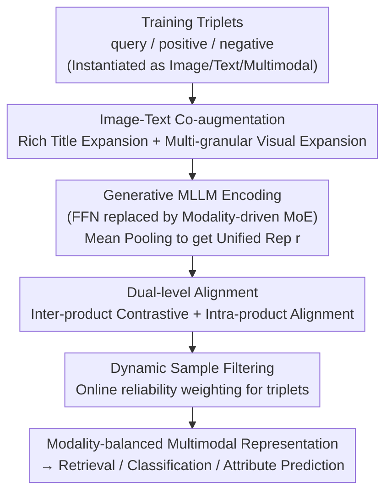

# MOON2.0: Dynamic Modality-balanced Multimodal Representation Learning for E-commerce Product Understanding

**Conference**: CVPR 2026  
**Paper**: [CVF Open Access](https://openaccess.thecvf.com/content/CVPR2026/html/Nie_MOON2.0_Dynamic_Modality-balanced_Multimodal_Representation_Learning_for_E-commerce_Product_Understanding_CVPR_2026_paper.html)  
**Code**: None (Open-sourced MBE2.0 dataset: https://huggingface.co/datasets/ZHNie/MBE2.0)  
**Area**: Multimodal VLM  
**Keywords**: E-commerce Representation Learning, Modality Imbalance, Modality-driven MoE, Dual-level Alignment, Contrastive Learning

## TL;DR
To address the pain points in e-commerce multimodal representation learning—"fixed-ratio mixed training leading to modality imbalance, neglect of intra-product image-text alignment, and high noise in raw data"—MOON2.0 utilizes a modality-driven MoE for end-to-end multimodal joint learning. It employs dual-level alignment to simultaneously align inter-product and intra-product relations, coupled with image-text co-augmentation and dynamic sample filtering to purify data. The authors released the MBE2.0 benchmark with 6.4 million samples, achieving zero-shot SOTA on various e-commerce retrieval, classification, and attribute prediction tasks.

## Background & Motivation

**Background**: E-commerce product understanding (retrieval, recommendation, classification) increasingly relies on task-agnostic multimodal representation learning. Early mainstream approaches favored dual-stream architectures (independent vision and text encoders mapped to a shared space). Recently, the shift has moved towards Multi-modal Large Language Models (MLLM) to project heterogeneous inputs into a unified embedding space, accommodating the typical e-commerce "many-to-one" relationship (one product title corresponding to multiple images like SKU images or creative images).

**Limitations of Prior Work**: The authors point out three major flaws in existing e-commerce MLLMs. First is the **training paradigm**: they commonly use fixed-ratio "modality mixture training" (e.g., the predecessor MOON used a 12:3:2 image-text-multimodal query ratio). This fixed mixture fails to match the real modality distribution of downstream tasks, inducing modality imbalance—where certain retrieval directions are systematically weakened (Fig. 2 shows a trade-off between image and text retrieval as ratios change). Second is the **supervision signal**: existing methods focus on **inter-product** relations while failing to explicitly model **intra-product** alignment within a single product, wasting natural semantic alignment signals. Third is **data quality**: current works only perform deduplication and category rebalancing, lacking thorough denoising and diversity expansion, while e-commerce text is often redundant and images are cluttered with limited perspectives.

**Key Challenge**: Fixed training mixture ratios vs. diverse modality distributions in downstream tasks—a one-size-fits-all ratio inevitably leads to underfitting in certain modality directions, which is the root cause of modality imbalance.

**Goal**: Split into three sub-problems: (1) design an adaptive, single-stage end-to-end training paradigm to eliminate modality imbalance; (2) explicitly incorporate intra-product image-text alignment into the optimization objective; (3) perform online purification of noisy triplets within the training pipeline.

**Key Insight**: Instead of manually tuning mixture ratios, the model should **adaptively route to different experts based on the modality composition of samples**, while learning "which expert should be used for which alignment objective." Meanwhile, contrastive learning should be extended from purely inter-product to "inter-product + intra-product" dual levels.

**Core Idea**: Utilize a modality-driven MoE to implement "multimodal joint learning" as a replacement for fixed-ratio mixture training, integrated with dual-level alignment, image-text co-augmentation, and dynamic sample filtering for modality-balanced e-commerce representations.

## Method

### Overall Architecture
MOON2.0 is an end-to-end, single-stage contrastive training pipeline centered around "triplets (query, positive, negative)." Each element is instantiated into three input modalities: multimodal (image+text $x^{mm}$), image-only ($x^{i}$), and text-only ($x^{t}$). Positive and negative samples are further enhanced with "rich titles" and "expanded images." The **image-text co-augmentation** first performs title expansion and multi-granular visual expansion to improve data diversity and robustness. Augmented triplets are fed into a generative MLLM backbone where feed-forward layers are replaced by a **modality-driven MoE**. This routes experts dynamically based on modality composition and performs mean pooling on the last hidden states to obtain a unified representation $r\in\mathbb{R}^{D}$. Representations are then optimized via **dual-level alignment** for inter-product contrastive and intra-product alignment objectives, with **dynamic sample filtering** assigning reliability weights to triplets online to suppress false positive/negative samples. The entire system requires only one round of supervised fine-tuning.

### Key Designs

**1. Modality-driven MoE: Coupling Expert Routing with Modality-aware Objectives to Replace Fixed-ratio Mixture Training**

This design directly addresses the "modality imbalance induced by fixed mixture ratios." The MoE is integrated into the LLM backbone's FFN layers: given a hidden state $h$, the gating network generates expert activations $G=\mathrm{softmax}(W_g h)$, and the token-level expert output is $\hat h=\sum_{z=1}^{Z}\tilde G_z\cdot f_z(h)$, where $f_z$ is the $z$-th expert MLP and $\tilde G_z$ is the normalized routing weight. However, the authors emphasize that pure token-level routing is agnostic to the "modality composition of the input," leading to poor specialization across different alignment objectives (e.g., $q^{i}\!\to\!p^{mm}$). To solve this, a learnable **dual-alignment matrix** $W^{*}\in\mathbb{R}^{Z\times M}$ ($M$ is the number of alignment objectives) is introduced, where $W^{*}_{z,m}$ quantifies the intrinsic preference of expert $z$ for objective $m$. After softmax normalization to get $p_{z,m}$, the token-level routing and learned expert preferences are aggregated into objective-specific weights $\omega_m=\frac{1}{|B_m|}\sum_{b\in B_m}\sum_z p_{z,m}\cdot\tilde G_{z,b}$, reflecting the "collective support of all experts for optimization objective $m$." Additionally, a **sparsity regularization** $L_{sparsity}=\frac{1}{Z}\sum_z\big[-\sum_m p_{z,m}\log p_{z,m}\big]$ is added alongside the standard load balancing term $L_{aux}$ to force experts toward a peak distribution where they specialize in only a few modality alignment objectives. This allows joint optimization of text, image, and multimodal queries in a single stage, turning "mixture ratios" from hyperparameters into a self-learned routing strategy.

**2. Dual-level Alignment: Supplementing Inter-product Contrastive with Intra-product Image-text Alignment**

Addressing the "neglect of intra-product alignment," this objective splits contrastive learning into two layers. **Inter-product alignment** uses the contrastive loss $L^{\vartheta}_{inter}=-\log\frac{\exp(r^{\vartheta}_q\cdot r^{mm}_p/\varepsilon)}{\exp(r^{\vartheta}_q\cdot r^{mm}_p/\varepsilon)+\sum_{N_q}\exp(r^{\vartheta}_q\cdot r^{mm}_n/\varepsilon)}$ for triplets $(q,p,n)$, where $\vartheta\in\{t,i,mm\}$ denotes text/image/multimodal queries and $\varepsilon$ is the temperature. The total inter-product loss is $L_{inter}=\omega^{t}_{inter}L^{t}_{inter}+\omega^{i}_{inter}L^{i}_{inter}+\omega^{mm}_{inter}L^{mm}_{inter}$. **Intra-product alignment** focuses on image-text consistency within a single product: given an image $i_\varpi$, its caption $t_\varpi$, and an irrelevant caption $t_{\varpi-1}$ from another product, $L^{\varpi}_{intra}=-\log\frac{\exp(r^{i}_\varpi\cdot r^{t}_\varpi/\tilde\varepsilon)}{\exp(r^{i}_\varpi\cdot r^{t}_\varpi/\tilde\varepsilon)+\sum_{t_{\varpi-1}}\exp(r^{i}_\varpi\cdot r^{t}_{\varpi-1}/\tilde\varepsilon)}$ pulls together image-text pairs of the same product while pushing away those from different products. The combined objective is $L_{total}=L_{inter}+L_{intra}+\rho L_{aux}+\varsigma L_{sparsity}$. Its value is most evident in experiments: removing dual-level alignment leads to the sharpest performance drop in non-traditional cross-modal directions ($q^{t}\!\to\!c^{i}$, $q^{i}\!\to\!c^{t}$), indicating that intra-product semantics are crucial for these directions.

**3. Co-augmentation & Dynamic Sample Filtering: Sourcing Diverse Data and Purifying Training Noise**

These two designs tackle "data noise and insufficient diversity." **Image-text co-augmentation** uses the MLLM in a dual approach: on the text side, entity-aware expansion extracts salient entities $E$ from title $T$ and description $D$ using internal tools, then the MLLM expands $T$ into a rich title $T^{+}=\mathrm{MLLM}_{text}(T,I,E)$ under controlled prompts. On the vision side, it conducts two-stage multi-granular expansion—first editing out irrelevant content to keep core attributes for a standardized main image $I_m$, then using $I_m$ as an anchor for context-guided editing to generate variants $I^{c}_k=\mathrm{MLLM}_{edit}(I_m,T,\text{prompt}_k)$ with varying backgrounds/perspectives but consistent semantics. CLIP is used to filter low-quality samples. **Dynamic sample filtering** online estimates triplet reliability: weighting $\phi=\sigma\big(\kappa((r_q\cdot r_p)-(r_q\cdot r_n)-\bar m)\big)$, where $\sigma$ is sigmoid and $\kappa$ controls sharpness. The threshold is fixed at $\tau=0.6$, while the margin $\bar m$ decays during training to shift focus from "high-confidence samples" to "hard samples." Triplets with $\phi<\tau$ are down-weighted in the loss, suppressing false positives/negatives.

### Loss & Training
The final objective is $L_{total}=L_{inter}+L_{intra}+\rho L_{aux}+\varsigma L_{sparsity}$. Based on a self-developed e-commerce generative MLLM, **single-stage** supervised fine-tuning is performed. Learning rate is $1\times10^{-5}$ with a cosine scheduler, trained on 64 A100 GPUs with a batch size of 4 per card for approximately 18 hours. All downstream evaluations are in a **zero-shot** setting (no text expansion/visual augmentation used during testing to ensure fair evaluation of generalization).

## Key Experimental Results

### Main Results
Zero-shot evaluation on the self-built MBE2.0 benchmark. Retrieval uses Recall@$k$ (probability of truth in top-$k$), while classification/attribute prediction uses Acc/Prec/Rec/F1. Selection of R@10 and Acc (where $t/i/mm$ in $q\!\to\!c$ denotes text/image/multimodal):

| Task (Metric) | MOON2.0 | MOON | GME | Gain (vs MOON) |
|--------------|---------|------|------|---------------|
| $q^{mm}\!\to\!c^{mm}$ R@10 | **94.21** | 80.78 | 73.90 | +13.4 |
| $q^{i}\!\to\!c^{mm}$ R@10 | **91.08** | 78.11 | 64.98 | +12.9 |
| $q^{t}\!\to\!c^{i}$ R@10 | **73.12** | 44.02 | 41.77 | +29.1 |
| Product Class Acc | **68.08** | 59.70 | 64.92 | +8.4 |
| Attribute Pred Acc | **84.29** | 63.55 | 70.76 | +20.7 |

⚠️ One caveat: In the text-only retrieval direction $q^{t}\!\to\!c^{mm}$ R@10, the general retrieval model GME (64.41) is slightly higher than MOON2.0 (63.09), indicating that MOON2.0's advantages are primarily in cross-modal/multi-modal directions and classification/attribute tasks, rather than ranking first in every single direction. MOON2.0 also leads in M5Product and Fashion200K public benchmarks (e.g., M5Product Class Acc 95.50 vs MOON 73.12), validating cross-distribution generalization.

### Ablation Study
Removing components one by one on MBE2.0 (R@10 / Acc):

| Configuration | $q^{t}\!\to\!c^{mm}$ | $q^{i}\!\to\!c^{t}$ | Class Acc | Attr Acc | Note |
|------|------|------|------|------|------|
| Full MOON2.0 | 63.09 | 64.91 | 68.08 | 84.29 | — |
| w/o Modality-driven MoE | 51.29 | 56.21 | 62.55 | 75.62 | Replaces with MLP; general drop |
| w/o Dual Alignment | 37.99 | 23.35 | 57.12 | 67.24 | **Biggest drop**; cross-modality failure |
| w/o Co-augmentation | 59.69 | 58.68 | 66.21 | 77.77 | Reduced info; moderate drop |
| w/o Dynamic Filtering | 60.63 | 63.21 | 67.99 | 84.04 | Sensitive to noise; smallest impact |

### Key Findings
- **Dual-level alignment is the largest contributor**: Removing it causes $q^{i}\!\to\!c^{t}$ to plummet from 64.91 to 23.35, proving that intra-product image-text alignment is the lifeblood for non-traditional cross-modal retrieval directions.
- **MoE is the second pillar**: Replacing it with standard MLP leads to widespread drops, showing that expert specialization based on modality composition is indeed superior to a single FFN.
- **Augmentation and filtering provide incremental gains**: Their removal leads to moderate declines (filtering having the least impact), acting as data-side robustness gains rather than the primary performance engine.
- Attention heatmap visualization shows MOON2.0 shifts attention from non-keywords like "high quality" or "women" to core attributes and brand terms like "knitted cardigan" or "polo-neck," qualitatively confirming finer image-text alignment.

## Highlights & Insights
- **Turning "training ratios" from hyperparameters into learned routing**: Modality-driven MoE + dual alignment matrix + sparse regularization allows the model to learn "which expert is good at which modality alignment," an elegant solution for eliminating modality imbalance transferable to any multi-objective contrastive training.
- **Intra-product alignment is severely undervalued**: A seemingly simple "pull-together same-product image-text" objective yields massive gains in cross-modal directions, serving as a reminder not to focus solely on inter-sample relations in retrieval.
- **Co-augmentation and online filtering as a pair**: Multi-granular expansion provides data diversity, while dynamic filtering with decaying margins removes noise. This "add diversity, subtract noise" combination is a reusable paradigm.
- **MBE2.0 Benchmark as a contribution**: 6.4 million real e-commerce triplets (5,751,594 train + 636,241 test) supporting retrieval/classification/attribute prediction; test set uses no augmentation to ensure fair zero-shot evaluation.

## Limitations & Future Work
- **Dependency on proprietary MLLM and entity tools**: Core results rely on Alibaba's internal e-commerce MLLM and entity extraction tools, posing a high barrier for external replication (code not open-sourced, only dataset released).
- **High augmentation cost**: Co-augmentation involves MLLM text expansion + two-stage visual editing + CLIP filtering; the offline cost is significant and not detailed in terms of compute overhead.
- **Generalization boundaries**: The method is designed for "many-to-one product-title" e-commerce scenarios. Whether "intra-product" concepts hold for non-e-commerce general multimodal retrieval has not been validated.
- Future directions: Jointly scheduling the margin decay of dynamic filtering and MoE sparse regularization, or exploring online augmentation alternatives to lower the cost of offline MLLM editing.

## Related Work & Insights
- **vs. Dual-stream (FashionCLIP / SigLIP2)**: These use independent encoders + $\ell_2$ normalized embeddings, struggling with "many-to-one" product-title relationships. MOON2.0's unified encoding significantly outperforms them in multimodal retrieval.
- **vs. Predecessor MOON**: MOON suffered from modality imbalance due to fixed 12:3:2 training ratios. MOON2.0 uses modality-driven MoE for single-stage joint learning and adds intra-product alignment, surpassing it in almost all tasks.
- **vs. General Multimodal Retrieval (GME / MM-Embed)**: These focus on general retrieval/clustering and lack domain-specific e-commerce knowledge. MOON2.0 is stronger in classification/attribute prediction and cross-modal tasks, though general models remain competitive in certain text-only retrieval directions.

## Rating
- Novelty: ⭐⭐⭐⭐ Transforming "modality mixture" into learned routing via MoE is clever, though MoE and dual contrastive learning are known components.
- Experimental Thoroughness: ⭐⭐⭐⭐⭐ Three benchmarks + multi-task zero-shot + four-component ablation + visualization, plus a 6.4 million sample benchmark.
- Writing Quality: ⭐⭐⭐⭐ Clear logic from motivation to experiment; formulas are complete, though some symbols ($\bar m$, $\varpi$) are defined somewhat loosely.
- Value: ⭐⭐⭐⭐ High industrial value for e-commerce and provides a large-scale benchmark, but lack of open-source model code limits academic replication.

<!-- RELATED:START -->

## Related Papers

- [\[CVPR 2026\] Towards Dynamic Modality Alignment in Multimodal Continual Learning](towards_dynamic_modality_alignment_in_multimodal_continual_learning.md)
- [\[CVPR 2026\] Label What Matters: Modality-Balanced and Difficulty-Aware Multimodal Active Learning](label_what_matters_modality-balanced_and_difficulty-aware_multimodal_active_lear.md)
- [\[CVPR 2026\] Guiding Diffusion-based Reconstruction with Contrastive Signals for Balanced Visual Representation](guiding_diffusion-based_reconstruction_with_contrastive_signals_for_balanced_vis.md)
- [\[ACL 2026\] AFMRL: Attribute-Enhanced Fine-Grained Multi-Modal Representation Learning in E-commerce](../../ACL2026/multimodal_vlm/afmrl_attribute-enhanced_fine-grained_multi-modal_representation_learning_in_e-c.md)
- [\[CVPR 2026\] BALM: A Model-Agnostic Framework for Balanced Multimodal Learning under Imbalanced Missing Rates](balm_a_model-agnostic_framework_for_balanced_multimodal_learning_under_imbalance.md)

<!-- RELATED:END -->
