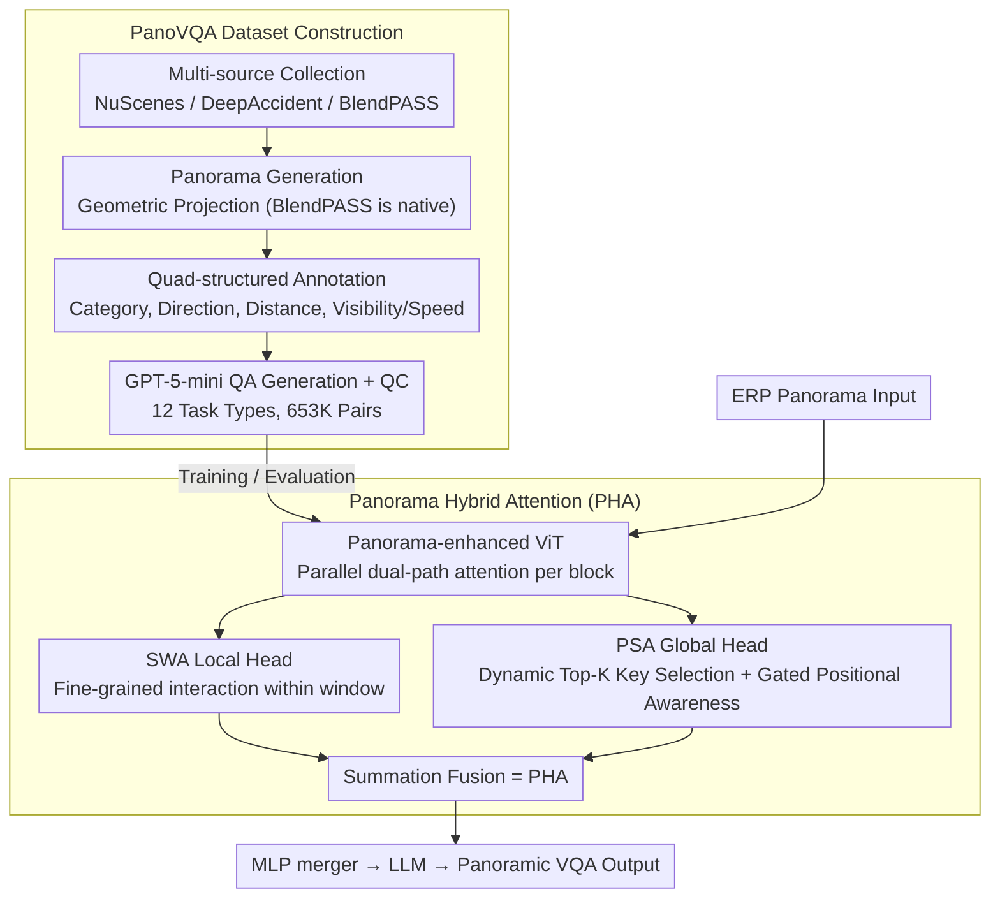

# More than the Sum: Panorama-Language Models for Adverse Omni-Scenes

**Conference**: CVPR 2026  
**arXiv**: [2603.09573](https://arxiv.org/abs/2603.09573)  
**Code**: [https://github.com/InSAI-Lab/PanoVQA](https://github.com/InSAI-Lab/PanoVQA)  
**Area**: Multi-modal VLM  
**Keywords**: Panoramic image understanding, 360-degree vision, VQA, Sparse attention, Autonomous driving

## TL;DR
This paper proposes the Panorama-Language Modeling (PLM) paradigm and the PanoVQA large-scale panoramic VQA dataset (653K QA pairs). It designs a plug-and-play Panorama Sparse Attention (PSA) module that allows existing VLMs to handle equirectangular projection (ERP) panoramas without retraining, achieving global reasoning superior to multi-view stitching schemes in adverse scenarios such as occlusions and accidents.

## Background & Motivation

**Background**: VLMs (LLaVA, BLIP-2, etc.) have achieved excellent results on pinhole images, but realistic scenarios—such as autonomous driving, robotics, and AR/VR—increasingly involve panoramic (360°) inputs. Current methods adopt a "stitching" strategy: sampling multiple narrow-view crops to be processed separately and then combined.

**Limitations of Prior Work**: Multi-view stitching breaks the continuity of 360° scenes, ignores global spatial relationships (e.g., horizontal boundary connectivity), and fails to model "wrap-around" characteristics. For example, a multi-camera setup might miss a dangerous vehicle on the front-left because it spans the boundary between two views.

**Key Challenge**: (1) Lack of large-scale panoramic VQA benchmarks—existing datasets are either multi-view pinhole VQA or panoramic data without QA pairs; (2) Architectural incompatibility—Equirectangular Projection (ERP) suffers from severe geometric distortion and significantly higher resolution than pinhole images, making the $O(n^2)$ complexity of dense attention unaffordable.

**Goal**: To verify the hypothesis that "panoramic language understanding > sum of multi-view stitching" and build infrastructure for 360° VLMs.

**Key Insight**: Experimental observation shows 1 Panoram (41.42%) outperforms 6 camera images (40.22%).

**Core Idea**: Construct the PanoVQA dataset + design Panorama Sparse Attention (PSA) to enable existing VLMs to process panoramic inputs directly.

## Method

### Overall Architecture
This paper addresses a straightforward question: is feeding the entire 360° scene as a single panorama to a VLM truly stronger than cutting it into several narrow views? To this end, it accomplishes two tasks. First, it fills the data gap by constructing the PanoVQA dataset using a pipeline: "multi-source collection → panorama generation → quad-structured annotation → GPT-generated QA → cleaning and quality control," incorporating 653K VQA pairs across normal, occlusion, and accident scenarios. Second, it resolves architectural incompatibility by retrofitting the visual encoder of existing VLMs into a panorama-enhanced ViT: parallel local Sliding Window Attention (SWA) and global Panorama Sparse Attention (PSA) are added to each ViT block to form Panorama Hybrid Attention (PHA). This allows the model to process high-resolution ERP panoramas directly without retraining from scratch, maintaining the tripartite structure (ViT + MLP merger + LLM) of the original VLM. Data validates the hypothesis, while PHA ensures feasibility regarding computation and distortion.

### Key Designs

**1. PanoVQA Dataset Construction: The first large-scale QA benchmark for 360° understanding**

Previously, there was a gap between multi-view pinhole VQA and panoramic images without QA labels, leaving panoramic VLMs without a foundation for training or evaluation. PanoVQA bridges this gap via a reusable pipeline. Data is sourced from three complementary origins: PanoVQA-N (normal driving from NuScenes, tasks N1–N4), PanoVQA-O (occluded scenes from BlendPASS, O1–O3), and PanoVQA-D (accident scenes from DeepAccident, D1–D5), totaling 12 VQA tasks, 44.6K frames, and 653K QA pairs.

The pipeline comprises four steps: ① Panorama Generation—using the OneBEV geometric projection pipeline for NuScenes and DeepAccident, while BlendPASS is inherently panoramic; ② Quad-structured Annotation—parsing each object into a quad (category, direction, distance, visibility/speed). This format is both machine-readable and intuitive: direction and distance support spatial reasoning, visibility supports occlusion reasoning, and the accident subset uses speed for collision risk assessment; ③ QA Generation—batch generation using GPT-5-mini based on structured annotations; ④ Quality Control—automatic keyword-based cleaning followed by human evaluation. The average lengths are approximately 19 words for questions and 42 words for answers, offering more depth than single-word benchmarks.

**2. Panorama Hybrid Attention (PHA): Enabling VLMs to ingest ERP panoramas via local+global paths**

ERP panorama resolutions are much higher than pinhole images; using dense attention results in $O(L^2)$ costs that exceed memory limits. Fixed sparse patterns (like SSA) fail to fit the unique topology of ERP—tokens adjacent on a 2D plane may not be adjacent on a sphere, and distortion increases with latitude. PHA parallelizes two attention paths within each ViT block:

- **Local Head (SWA)**: Partitions the token sequence into non-overlapping windows for fine-grained self-attention, reducing complexity from $O(L^2)$ to $O(L \cdot L_w)$ ($L_w$ is window size) to handle local details.
- **Global Head (PSA)**: Uses a dynamic selector to calculate correlation scores between queries and all keys, selecting only the Top-K most relevant keys. A gated mechanism incorporates learnable positional encodings $\text{PE}_{t,s}$, making the key selection position-aware and allowing it to connect distant but topologically relevant tokens (e.g., left-right boundaries) while filtering useless patches from distorted regions.

Summing these paths forms PHA, which can replace existing attention layers in pre-trained VLMs. By preserving the original ViT + MLP + LLM architecture, existing VLMs can handle panoramas without retraining from scratch.

### Loss & Training
The PHA module can be fine-tuned on PanoVQA or used as a plug-and-play component in existing inference pipelines. Evaluation is conducted across PanoVQA-N/O/D subsets to test performance in normal, occluded, and accident scenarios.

## Key Experimental Results

### Main Results

| Method | Input | PanoVQA Accuracy | Note |
|------|------|---------------|------|
| Prev. VLM (6-cam) | 6 Pinhole Images | 40.22% | Multi-view stitching |
| PLM (1-Pano) | 1 Panorama | **41.42%** | Panoramic Model (Ours) |
| All other models | - | Lower than PLM | Lagging in all categories |

### Performance by Scene Type

| Scene | Description | PLM Advantage |
|------|------|---------|
| Normal (N) | Scene description, object recognition, spatial relations | Significant advantage in spatial reasoning |
| Occlusion (O) | Occlusion relationship reasoning | Global context helps infer occluded objects |
| Accident (D) | Collision risk, avoidance decisions | 360° FOV prevents missing blind spots |

### Ablation Study
- Removing PSA and using dense attention results in a surge in inference cost and a drop in accuracy.
- 1-Pano significantly outperforms 6-cam in orientation tasks (the latter frequently misjudges directions).
- All three scenarios in the dataset are challenging, with accident scenarios being the most difficult.

## Highlights & Insights
- Proposes the first panoramic VLM paradigm (PLM), proving that panoramic understanding > sum of multi-view stitching.
- PanoVQA is the first large-scale benchmark combining panoramas and VQA, including rare occlusion and accident scenes.
- PSA module is plug-and-play, avoiding the need to retrain existing VLMs and lowering adoption barriers.
- The dataset construction pipeline is reusable (NuScenes/BlendPASS/DeepAccident → Panoramic VQA).
- 12 VQA task types cover scene description, spatial reasoning, occlusion reasoning, and collision assessment.
- The triple/quad representation for objects is both machine-readable and intuitive, facilitating future research.

## Limitations & Future Work
- Panorama stitching quality is limited by original multi-camera alignment precision and handling of occluded regions.
- Selection of specific attention patterns and hyperparameters for PSA requires more ablation.
- PanoVQA currently focuses on driving; coverage of indoor, pedestrian, and AR/VR scenes is insufficient.
- Further exploration could merge PLM with BEV representations, combining global panoramic advantages with precise BEV positioning.
- Severe distortion of ERP projection at polar regions (sky/ground) may affect understanding in those areas.
- Sample sizes for PanoVQA-O (occlusion) and PanoVQA-D (accident) are relatively small (<1.3K and <144K), which may be insufficient for training very large models.

**QA Generation Quality**
- Generated using GPT-5-mini with dual quality control (automated cleaning and manual evaluation).
- Average question length is ~19 words and answer length is ~42 words, significantly exceeding single-word answer benchmarks.

<!-- RELATED:START -->

## Related Papers

- [\[ACL 2026\] More Than Meets the Eye: Measuring the Semiotic Gap in Vision-Language Models via Semantic Anchorage](../../ACL2026/multimodal_vlm/more_than_meets_the_eye_measuring_the_semiotic_gap_in_vision-language_models_via.md)
- [\[CVPR 2026\] Multimodal RewardBench 2: Evaluating Omni Reward Models for Interleaved Text and Image](multimodal_rewardbench_2_evaluating_omni_reward_models_for_interleaved_text_and_.md)
- [\[CVPR 2026\] Efficient and High-Fidelity Omni Modality Retrieval](efficient_and_high-fidelity_omni_modality_retrieval.md)
- [\[CVPR 2026\] VisualOverload: Probing Visual Understanding of VLMs in Really Dense Scenes](visualoverload_probing_visual_understanding_of_vlms_in_really_dense_scenes.md)
- [\[CVPR 2026\] A More Word-like Image Tokenization for MLLMs](a_more_word-like_image_tokenization_for_mllms.md)

<!-- RELATED:END -->
