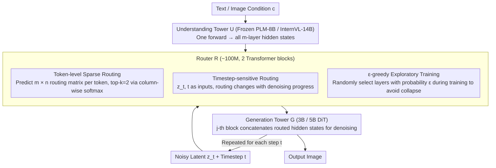

# Mixture of States (MoS): Routing Token-Level Dynamics for Multimodal Generation

**Conference**: CVPR 2026  
**arXiv**: [2511.12207](https://arxiv.org/abs/2511.12207)  
**Code**: None (but based on open-source components)  
**Area**: Image Generation / Multimodal Fusion / Diffusion Models  
**Keywords**: Multimodal Fusion, State Routing, T2I/Image Editing, Asymmetric Transformer, Token-level Dynamics  

## TL;DR
The paper proposes Mixture of States (MoS), a new fusion paradigm for multimodal diffusion models. It uses a learnable token-level router to dynamically route hidden states from any layer of an understanding tower (frozen LLM/VLM) to any layer of a generation tower (DiT). With 3-5B parameters, it matches or exceeds the 20B Qwen-Image in image generation and editing tasks.

## Background & Motivation
The core challenge in multimodal diffusion models is the effective alignment of text/visual signals. Current fusion methods have limitations: (1) Cross-Attention uses only the final layer features, providing limited information; (2) Self-Attention concatenates text and visual tokens, which is computationally expensive ($O(n^2)$); (3) MoT (Mixture-of-Transformers) shares KV layer-by-layer, requiring the two towers to be symmetric and of equal depth, which is highly inflexible. Three key design principles are often ignored: layer selection should be adaptive rather than fixed, conditional signals should change dynamically with the denoising timestep, and conditional signals should be personalized at the token level.

## Core Problem
Can a flexible cross-modal fusion mechanism be designed to allow the understanding and generation towers to be completely asymmetric (different depths and widths), while the fusion method dynamically adapts to input content and denoising progress?

## Method

### Overall Architecture
MoS addresses the flexible fusion of text/visual signals in multimodal diffusion models using a dual-tower design: an understanding tower $\mathcal{U}$ (frozen PLM-8B/InternVL-14B) performs a single forward pass to output all $m$ layers of hidden states, and a generation tower $\mathcal{G}$ (a 3B/5B DiT trained from scratch) performs diffusion denoising. A lightweight router $\mathcal{R}$ (~100M parameters, 2 Transformer blocks) is inserted between the towers. It receives hidden states from the understanding tower, the noisy latent $z_t$, and the timestep $t$ to predict a routing matrix for each context token. This dynamically determines which layers of the understanding tower's hidden states are aggregated and sent to which layer of the generation tower. During training, the understanding tower is frozen while the generation tower and router are trained. Routing is re-calculated at each denoising step, achieving "timestep-varying" dynamic fusion.

### Key Designs

**1. Token-level Sparse Routing: Letting each token decide which layers to read**

Existing fusion methods either use only the final layer features (limited info) or concatenate all layers (high cost), both of which are static and treat all tokens equally. MoS allows each context token to independently predict a logit matrix $\mathcal{W} \in \mathbb{R}^{m \times n}$ (where $m$ is the number of layers in the understanding tower and $n$ is the number of layers in the generation tower). The value $w_{ij}$ represents the weight for routing the $i$-th layer of the understanding tower to the $j$-th layer of the generation tower. After softmax normalization, only the top-k ($k=2$) most relevant layers are transmitted. Ablations confirm that token-level routing significantly outperforms sample-level routing (FID 20.17 vs. 21.66), as different tokens require features from different depths; $k=2$ is found to be optimal, as $k=1$ is too local and $k \geq 3$ dilutes information.

**2. Timestep-sensitive Routing: Letting conditional signals evolve with denoising**

Using a single embedding for all denoising steps is a common flaw in old paradigms. The router receives the text prompt, noisy latent $z_t$, and timestep $t$ simultaneously. Ablations prove all three are indispensable (FID: prompt only 21.12 $\rightarrow$ +latent 21.89 $\rightarrow$ **+timestep 20.15**). Visualizations show that routing patterns change as denoising progresses: selecting specific layers sparsely in early stages and tending toward average weights in later stages—consistent with the "structure first, details later" rhythm of diffusion models.

**3. $\epsilon$-greedy Exploratory Training: Preventing the router from local optima locking**

Top-k selection can cause the router to converge prematurely to specific layers. MoS uses a probability $\epsilon=0.05$ to randomly select layers (instead of top-k) during training to provide exploration space. $\epsilon$-greedy not only accelerates convergence but also improves final performance.

### Loss & Training
The model uses standard Rectified Flow Matching training: $\mathbb{E}[\|v_t - \mathcal{G}(z_t, t, \mathcal{R}(\cdot))\|^2]$. It follows a four-stage progressive training: 512² (1400 A100-days) $\rightarrow$ 1024² (same amount) $\rightarrow$ Aesthetic fine-tuning (100 A100-days) $\rightarrow$ 2048² super-resolution (80 A100-days). Total training cost is ~3000 A100-days—significantly lower than the 6250 A100-days of SD1.5.

## Key Experimental Results

| Method | Parameters | Fusion Type | GenEval↑ | DPG↑ | oneIG↑ | ImgEdit↑ |
|--------|------|------|------|----------|------|------|
| FLUX.1[Dev] | 12B | Self-Attn | 0.66 | 83.84 | 0.43 | — |
| SANA-1.5 | 4.8B | Cross-Attn | 0.81 | 84.70 | 0.33 | — |
| Bagel | 14B | MoT | 0.88 | — | 0.36 | 3.20 |
| Qwen-Image | **20B** | Self-Attn | 0.87 | 88.32 | 0.54 | 4.27 |
| **MoS-S** | **3B** | MoS | 0.89 | 86.33 | 0.50 | 4.17 |
| **MoS-L** | **5B** | MoS | **0.90** | **87.01** | **0.52** | **4.33** |

MoS-L (5B) surpasses Qwen-Image (20B) on GenEval (0.90) and ImgEdit (4.33), despite having only 1/4 of the parameters.

### Ablation Study
- **MoS > MoT > Cross-Attn**: FID 17.77 vs 21.66 (manual), GenEval 0.79 vs 0.74 (Cross-Attn).
- **Advantages of Asymmetric Towers**: The understanding tower can be independently scaled (consistent gains from 8B $\rightarrow$ 14B), which MoT cannot achieve.
- **Minimal Router Overhead**: Only 0.008s/iter, virtually negligible.
- **Lower Total Latency**: MoS < Qwen-Image $\approx$ Bagel (since the understanding tower executes only once).
- **Effectiveness in Editing**: The dual towers extract different granularities of information (semantics vs. pixels) from the reference image.

## Highlights & Insights
- **MoS breaks the symmetry constraints of MoT**, allowing the free combination of completely heterogeneous understanding and generation towers, which is highly valuable for deployment.
- The "frozen understanding tower + trained generation tower" strategy drastically reduces training costs—creating a SOTA-level model in 3000 A100-days.
- Token-level, timestep-sensitive routing is a paradigm shift for diffusion model fusion—no longer using a "one-size-fits-all" embedding for all denoising steps.
- Router visualization provides an interpretability window into cross-modal interaction—showing that different tokens and timesteps genuinely require different layer features.
- The 5B > 20B efficiency narrative is highly compelling for the industry.

## Limitations & Future Work
- Currently supports only unidirectional routing (Understanding $\rightarrow$ Generation); bidirectional MoS might be stronger.
- Human preference alignment techniques like RLHF/GRPO have not been explored.
- Small object generation still has minor flaws (visual artifacts).
- Potential combinations with efficiency techniques like quantization, distillation, or feature caching remain un-investigated.
- Only validated on image generation/editing; MoS for video generation is pending.

## Related Work & Insights
- **vs MoT (Bagel/LMFusion)**: MoT requires symmetric towers and layer-by-layer correspondence, limiting flexibility. MoS achieves sparse connections from any layer to any layer via a router, and 3B MoS outperforms 14B Bagel.
- **vs Cross-Attention (SANA/PixArt)**: Cross-Attn uses only the final layer embedding, which is static and limited in information. MoS dynamically selects hidden states from all layers.
- **vs Self-Attention (FLUX/SD3)**: Self-Attn is computationally expensive and uses static embeddings. MoS is more efficient (smaller generation tower) and adapts dynamically.
- **vs Qwen-Image (20B)**: While Qwen-Image is powerful, it has 4x the parameters. MoS-L (5B) matches or exceeds its performance.

## Related Papers
- **MoT**: Mixture-of-Transformers for flexible layer-wise fusion.
- **LinVideo**: Uses linear attention to accelerate video generation.
- **SANA/PixArt**: Linear-centric Transformer for efficient high-resolution generation.

## Rating
- Novelty: ⭐⭐⭐⭐⭐ MoS serves as a new fusion paradigm, breaking symmetry constraints with original token/timestep-level routing.
- Experimental Thoroughness: ⭐⭐⭐⭐⭐ Comprehensive ablations (routing inputs/outputs/architectures/sparsity/scaling), multi-task (generation + editing), and multiple benchmarks (GenEval/DPG/WISE/oneIG/ImgEdit/GEdit).
- Writing Quality: ⭐⭐⭐⭐⭐ Perfect logical chain from design principles to MoS mechanics, systematic ablations, and SOTA results.
- Value: ⭐⭐⭐⭐⭐ The 5B=20B efficiency story, interpretable routing, and paradigm innovation represent a significant impact on the image generation field.

<!-- RELATED:START -->

## Related Papers

- [\[CVPR 2026\] Thinking in Dynamics: How Multimodal Large Language Models Perceive, Track, and Reason Dynamics in Physical 4D World](thinking_in_dynamics_how_multimodal_large_language_models_perceive_track_and_rea.md)
- [\[CVPR 2026\] UniCompress: Token Compression for Unified Vision-Language Understanding and Generation](unicompress_token_compression_for_unified_vision-language_understanding_and_gene.md)
- [\[CVPR 2026\] VL-RouterBench: A Benchmark for Vision-Language Model Routing](vl-routerbench_a_benchmark_for_vision-language_model_routing.md)
- [\[ICML 2025\] RollingQ: Reviving the Cooperation Dynamics in Multimodal Transformer](../../ICML2025/multimodal_vlm/rollingq_reviving_the_cooperation_dynamics_in_multimodal_transformer.md)
- [\[CVPR 2026\] Where MLLMs Attend and What They Rely On: Explaining Autoregressive Token Generation](where_mllms_attend_and_what_they_rely_on_explaining_autoregressive_token_generat.md)

<!-- RELATED:END -->
