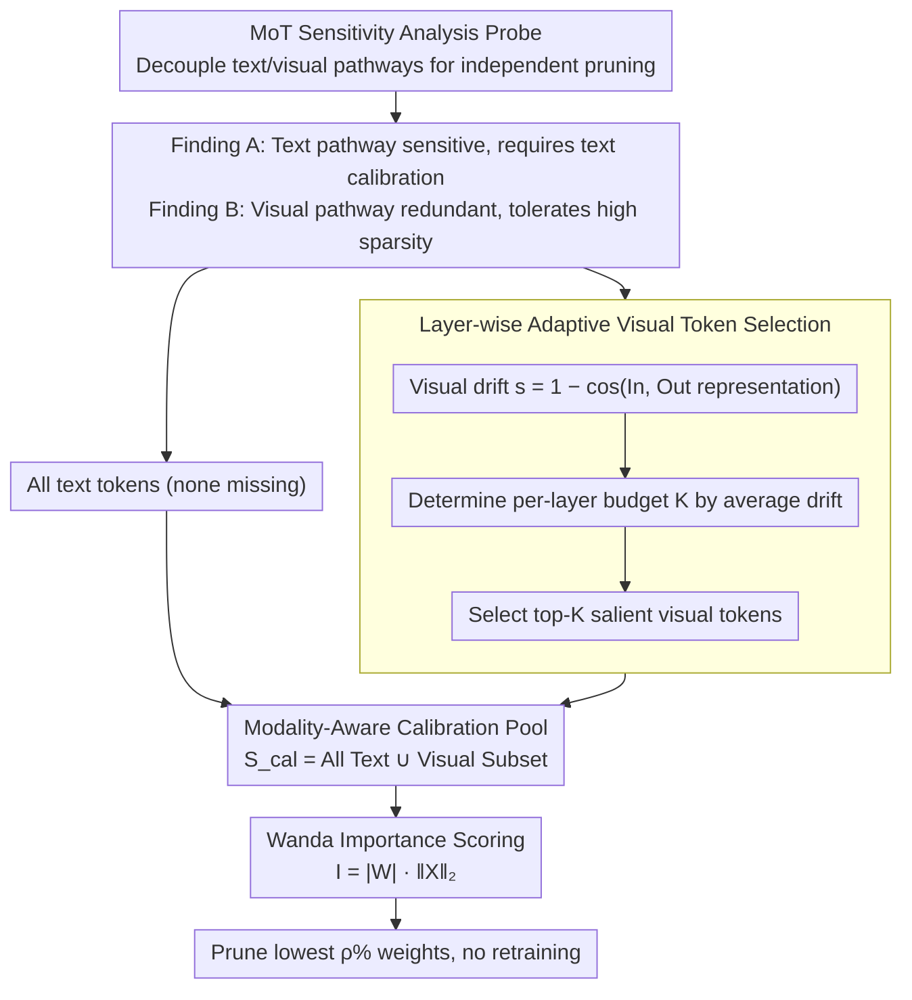

# Mostly Text, Smart Visuals: Asymmetric Text-Visual Pruning for Large Vision-Language Models

**Conference**: CVPR 2026  
**arXiv**: [2603.16001](https://arxiv.org/abs/2603.16001)  
**Code**: [https://github.com/LezJ/ATV-Pruning](https://github.com/LezJ/ATV-Pruning)  
**Area**: Multimodal VLM  
**Keywords**: Weight Pruning, LVLM, Modal Asymmetry, Calibration Strategy, Sparsification

## TL;DR
MoT probe experiments reveal asymmetric pruning sensitivity between text and visual pathways in LVLMs—text pathways are highly sensitive and must be calibrated with text tokens, while visual pathways are highly redundant and can withstand 60% sparsity. Based on this, ATV-Pruning is proposed using all text tokens + a small number of layer-wise adaptively selected visual tokens to construct the calibration pool.

## Background & Motivation

**Background**: LVLMs have a vast number of parameters, and weight pruning is an effective means to reduce deployment costs. SparseGPT and Wanda perform well on text-only LLMs; the latter evaluates importance via weight magnitude × activation norm. However, direct application to LVLMs yields suboptimal results.

**Limitations of Prior Work**: Existing LVLM pruning methods (e.g., TAMP), although considering multiple modalities, still process text and visual tokens mixed within a unified framework, ignoring the fundamental behavioral differences between the two modalities under pruning—(1) Text and visual activations occupy different clustering regions in the representation space (t-SNE visualization); (2) Pruning mask IoU distributions obtained from only text vs. only visual calibration are wide.

**Key Challenge**: Modality-agnostic calibration strategies dilute the linguistic signals necessary to protect text-related weights.

**Goal**: How to design calibration strategies targeting the different sensitivities of different modal pathways?

**Key Insight**: Explicitly decouple text and visual pathways through MoT (Mixture-of-Transformer) analysis probes to independently study their respective pruning sensitivities.

**Core Idea**: Use all text tokens for the text pathway (to preserve sensitivity) and only supplement with a few high-saliency visual tokens for the visual pathway (to exploit redundancy).

## Method

### Overall Architecture
This paper addresses the problem of which tokens to use to "calibrate" activation norms when pruning LVLM weights without damaging linguistic capabilities. Activation-aware pruning like Wanda relies on calibration data to estimate the norm of each activation column, then scores weights using "weight magnitude × activation norm"—the tokens fed into the calibration pool directly determine which weights are judged important. ATV-Pruning does not change the scoring formula but modifies the composition of the calibration pool: first, a probe experiment identifies that the text pathway is pruning-sensitive while the visual pathway is pruning-tolerant. Accordingly, all text tokens are retained, and a few most "active" visual tokens are adaptively selected per layer to construct the calibration pool $\mathcal{S}_{cal} = \mathcal{T} \cup \mathcal{V}_{sub}$ (where $\mathcal{T}$ is all text tokens and $\mathcal{V}_{sub}$ is the subset of visual tokens selected layer-wise). Wanda pruning is then executed as usual without retraining.

### Key Designs

**1. MoT Sensitivity Analysis Probe: Quantifying sensitivity before calibration**

The basis for the method comes from this motivational experiment. The limitation of previous LVLM pruning was mixing text and visual tokens in one calibration pool, making it impossible to know which modality was being harmed. The authors replicate the QKV projections and FFN of Transformer blocks into independent text and visual pathways (the decoupled form of Mixture-of-Transformer). Text tokens only pass through the text pathway, and visual tokens only through the visual pathway. This allows for independent observation of performance collapse when pruning the same pathway using "pure text / pure visual / mixed" calibration sources. The conclusion is straightforward: the text pathway is extremely sensitive—at 60% sparsity, text calibration maintains 84.65%, whereas visual calibration drops to 50.92% and mixed calibration to 64.97%. Conversely, the visual pathway is almost insensitive, maintaining over 99.25% at 60% sparsity regardless of the calibration source. These findings (Finding A and Finding B) turn the intuition of "who to protect" into a quantifiable fact.

**2. Modality-Aware Calibration Pool: All text tokens, minimal visual tokens**

Based on the probe conclusions, the composition of the calibration pool becomes asymmetric. Finding A suggests that important weights in the text pathway highly depend on linguistic signals, so all text tokens are included—missing even some could lead to linguistic-protecting weights being misjudged as unimportant. Finding B suggests that the visual pathway is redundant and many visual tokens provide repetitive information; hence, only a small subset is needed. This is the origin of the title "Mostly Text, Smart Visuals": text dominates the calibration pool, while visual tokens are curated. A visual token ratio of approximately 10% yielded the best trade-off.

**3. Layer-wise Adaptive Visual Token Selection: Selecting "active" visual tokens via representation drift**

Since only a few visual tokens are kept, the selection is critical. The authors use a saliency measure called "visual drift," defined as the change in representation direction of a visual token as it enters and exits the current block:

$$s_v = 1 - \cos(\mathbf{X}_{in,v}, \mathbf{X}_{out,v})$$

The intuition is simple: if a block significantly alters the representation of a visual token (low cosine similarity, high $s_v$), it indicates that the token was actively processed in that layer and interacted most fully with those weights. Tokens with minor changes are essentially "passing through" and act as noise. Crucially, the "adaptive" aspect means both $s_v$ and the number of tokens kept vary per layer: the average drift $\bar{s}$ for a layer is calculated, and the budget $K$ is set as $K=\lfloor\alpha\cdot\bar{s}\cdot n_{\text{text}}\rfloor$ ($\alpha$ is a global scaling hyperparameter). Empirically, $\bar{s}$ is small in shallow layers and increases in mid-to-late layers; thus, $K$ is larger where visual processing is more active. After determining $K$, the top-$K$ visual tokens by $s_v$ are combined with all text tokens to form $\mathcal{S}_{cal}=\mathcal{T}\cup\mathcal{V}_{sub}$. This step incurs almost zero extra training cost, as it only requires logging representations during a single calibration forward pass.

### Loss & Training
- Follows the Wanda importance score: $\mathbf{I}_{ij} = |\mathbf{W}_{ij}| \cdot \|\mathbf{X}_j\|_2$, where $\|\mathbf{X}_j\|_2$ is estimated using the constructed calibration pool.
- Prunes the lowest $\rho\%$ of weights per row to obtain an unstructured sparse model.
- Entirely post-hoc and training-free; all gains come from the improved calibration pool composition.

## Key Experimental Results

### MoT Probe Experiment (LLaVA-NeXT)

| Pathway | Calibration Source | Mean at 50% Sparsity | Mean at 60% Sparsity |
| :--- | :--- | :--- | :--- |
| Text Pathway | Text | 98.26% | 84.65% |
| Text Pathway | Visual | 94.33% | 50.92% |
| Text Pathway | Mixed | 95.86% | 64.97% |
| Visual Pathway | Text | 100.27% | 100.05% |
| Visual Pathway | Visual | 99.37% | 99.25% |
| Visual Pathway | Mixed | 100.14% | 99.57% |

### Main Results (9 Multimodal Benchmarks)

| Method | Sparsity | Multi-benchmark Avg | vs Wanda | vs TAMP |
| :--- | :--- | :--- | :--- | :--- |
| ATV-Pruning | 50% | **Optimal** | Significantly Outperforms | Outperforms |
| ATV-Pruning | 60% | **Optimal** | Substantially Outperforms | Outperforms |

## Highlights & Insights
- The MoT probe experiment design is ingenious, quantitatively revealing asymmetric pruning sensitivity in LVLMs for the first time.
- The method is extremely concise—modifying only the calibration token selection on top of Wanda, making it simple yet effective.
- Finding B demonstrates that performance is almost uncompromised at 60% sparsity for the visual pathway, a valuable empirical discovery.
- Visual drift serves as an intuitive, effective, and computationally inexpensive saliency metric.
- Comprehensively outperforms baselines like Wanda, SparseGPT, and TAMP across 9 standard multimodal benchmarks.
- Finding B indicates massive redundancy in vision-processing parameters of LVLMs, providing a new perspective for model compression.

### Experimental Thoroughness
- Validated across multiple models including LLaVA-NeXT and Qwen2-VL with consistent results.
- At 50% sparsity, ATV-Pruning retains 90%+ performance on MMBench, clearly superior to vanilla Wanda.
- Gain is most prominent on SQA-img, which requires the highest text reasoning capability.
- Visual token ratios from 5% to 30% all work well, with 10% being the default trade-off point.

## Limitations & Future Work
- Visual drift calculation requires an additional forward pass overhead (though only during the one-time calibration phase).
- The top-$K$ ratio for visual token selection requires hyperparameter tuning; optimal ratios may vary across models/tasks.
- Only unstructured sparsity has been validated; structured pruning scenarios (e.g., channel pruning) deserve exploration.
- The asymmetric concept could be extended to other compression techniques like quantization and knowledge distillation.
- MoT probes are for analysis; actual pruning occurs on shared weights, creating a potential gap between analysis and implementation.
- For video LVLMs where visual tokens increase dramatically, the scalability of the selection strategy needs verification.
- The phenomenon where performance increases after pruning on VizWiz requires deeper understanding.

<!-- RELATED:START -->

## Related Papers

- [\[CVPR 2026\] Text-Printed Image：把文本「印」成图片来弥合图文模态鸿沟](text-printed_image_bridging_the_image-text_modality_gap_for_text-centric_trainin.md)
- [\[CVPR 2026\] TIPSv2: Advancing Vision-Language Pretraining with Enhanced Patch-Text Alignment](tipsv2_patch_text_alignment.md)
- [\[CVPR 2026\] β-CLIP: Text-Conditioned Contrastive Learning for Multi-Granular Vision-Language Alignment](b-clip_text-conditioned_contrastive_learning_for_multi-granular_vision-language_.md)
- [\[CVPR 2026\] TANGO: Text-Anchored Guided Optimization for Robust Fine-tuning Vision-Language Models under Label Noise](tango_text-anchored_guided_optimization_for_robust_fine-tuning_vision-language_m.md)
- [\[CVPR 2026\] Multimodal RewardBench 2: Evaluating Omni Reward Models for Interleaved Text and Image](multimodal_rewardbench_2_evaluating_omni_reward_models_for_interleaved_text_and_.md)

<!-- RELATED:END -->
