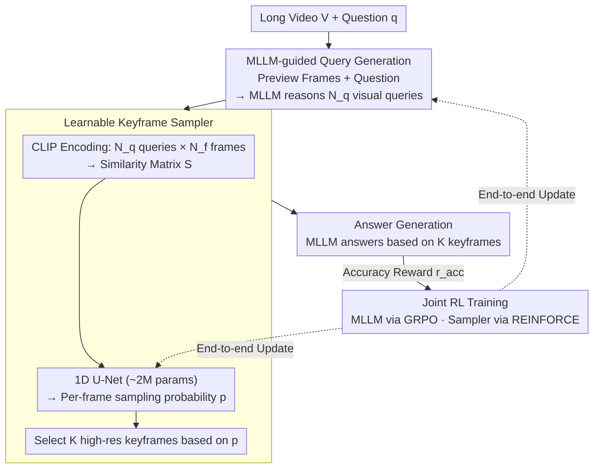

# MSJoE: Jointly Evolving MLLM and Sampler for Efficient Long-Form Video Understanding

**Conference**: CVPR 2026  
**arXiv**: [2602.22932](https://arxiv.org/abs/2602.22932)  
**Code**: To be confirmed  
**Area**: Multimodal VLM  
**Keywords**: Long-form Video Understanding, Keyframe Sampling, Reinforcement Learning, GRPO, Joint Optimization

## TL;DR
The MSJoE framework is proposed to jointly evolve an MLLM and a lightweight keyframe sampler via reinforcement learning. The MLLM generates visual queries to guide frame retrieval, and a 1D U-Net sampler learns to select frames from a CLIP similarity matrix. End-to-end joint optimization achieves an +8% accuracy improvement in long-form video QA.

## Background & Motivation

**Background**: MLLMs perform excellently in short video understanding. However, in long-form video scenarios, visual context increases linearly while attention computation grows quadratically. Uniform sampling is inefficient and prone to missing key events. Sampling methods based on CLIP similarity (e.g., Q-Frame, AKS) are emerging.

**Limitations of Prior Work**: Three critical issues exist: (Q1) Is the question itself sufficient to retrieve all relevant frames? (Insufficient information: questions are often interrogative and lack visual cues); (Q2) How to convert similarity scores into sampling weights? (Naive top-k selection results in redundant frames); (Q3) Can the MLLM and sampler truly collaborate without joint evolution? (Existing methods freeze the MLLM while training the sampler, lacking bidirectional adaptation).

**Key Challenge**: The sampler and MLLM are optimized independently; the sampler does not know what visual evidence the MLLM needs, and the MLLM is not adapted to the sparse frame distribution selected by the sampler.

**Goal**: Achieve joint evolution of the sampler and MLLM, enabling the MLLM to generate queries that guide sampling while adapting to sparse keyframe inputs.

**Key Insight**: RL (GRPO + REINFORCE) provides zero-shot feedback signals, allowing both components to be optimized simultaneously.

**Core Idea**: The MLLM first reasons out multiple visual queries → CLIP constructs a query-frame similarity matrix → a lightweight 1D U-Net learns sampling weights → selected keyframes are fed back to the MLLM to generate the answer → end-to-end RL joint training.

## Method

### Overall Architecture
MSJoE addresses the problem of "which frames to look at" in long-form video QA. A video may contain tens of thousands of frames, but only a few are truly relevant to the question. Since the question itself ("Where did he put the keys at the end?") lacks visual content, using it directly to retrieve frames is ineffective. MSJoE enables the MLLM to first "translate" the question into several descriptive visual queries, then uses a lightweight sampler to select keyframes based on the similarity between these queries and all frames.

The inference pipeline consists of four steps: 1) A small set of low-resolution preview frames is uniformly sampled and sent to the MLLM with the question to reason $N_q$ visual queries; 2) CLIP encodes these queries and all densely sampled frames into a similarity matrix; 3) A 1D U-Net with ~2M parameters compresses the matrix into per-frame sampling probabilities to select keyframes; 4) The MLLM generates the final answer using the high-resolution keyframes. The sampler and MLLM are jointly evolved via end-to-end reinforcement learning.

### Key Designs

**1. MLLM-guided Query Generation: Clarifying "what to look for"**

The first bottleneck (Q1) is insufficient information in the question—interrogative sentences lack visual cues for CLIP matching. MSJoE does not use the question for retrieval directly. Instead, it uniformly samples $N_{init}$ preview frames at low resolution (each frame encoded as only 32 tokens). These previews and the question are given to the MLLM to reason $N_q$ specific visual queries, such as expanding "Where did he put the keys?" into "A hand holding keys" or "Close-up of a desk or drawer." This step leverages the MLLM's world knowledge to complete the missing visual semantics.

**2. Learnable Keyframe Sampler: Learning weights from the similarity matrix**

The second bottleneck (Q2) is converting similarity into sampling decisions—naive top-k often selects redundant adjacent frames. MSJoE uses CLIP to encode $N_q$ queries and $N_f$ dense frames into a similarity matrix $\mathbf{S} \in \mathbb{R}^{N_q \times N_f}$. A 1D U-Net maps this to per-frame sampling probabilities $\mathbf{p} \in \mathbb{R}^{N_f}$. The U-Net is chosen for its dense prediction along the temporal axis and multi-scale local receptive fields, allowing it to perceive both the combined score of a frame across queries and the redundancy/complementarity of neighboring frames.

**3. Joint RL Training: Mutual adaptation under a unified reward**

The third bottleneck (Q3) is the lack of bidirectional adaptation in frozen MLLM approaches. MSJoE jointly evolves them via RL: the MLLM is optimized using GRPO (sampling $G$ outputs per question and updating with group-relative advantage), while the sampler is optimized via REINFORCE. They share an accuracy reward $r_{acc}$. The total reward is defined as:

$$r = r_{acc} + r_{format} + r_{info}$$

where $r_{acc}=0.8$ is the primary signal, $r_{format}=0.1$ constrains output format, and $r_{info}=0.1$ encourages informative queries with sharp similarity distributions. To ensure stability, the sampler is pre-trained with a difficulty-aware reward: for difficult questions (pass rate $c=0$), a high reward $A=10$ is given if answered correctly; otherwise, it is scaled by $A=1/c$ (correct) or $A=-1/(1-c)$ (incorrect).

### Main Mechanism Example
Consider a 10-minute video sampled at 1 FPS (600 frames). The question is "What is the title of the speaker's last slide?". First, 8 preview frames are sent to the MLLM, which generates 4 visual queries (e.g., "Close-up of projection screen"). Second, CLIP encodes these into a $4 \times 600$ similarity matrix. Third, the 1D U-Net compresses this into probabilities, selecting 32 keyframes concentrated in the latter half of the video where slides appear. Finally, the MLLM reads the title from these 32 frames.

### Training Strategy
The sampler is first pre-trained independently using the difficulty-aware reward before end-to-end joint optimization with the MLLM. A new long-video QA dataset was constructed for training, containing ~2.8K videos and 7.1K QA pairs, filtered to ensure long duration and multi-event reasoning.

## Key Experimental Results

### Main Results (Based on Qwen2.5-VL-7B)

| Method | Frames | MLVU | LVB | VideoMME-Long | LVBench |
|------|------|------|-----|-------------|---------|
| Uniform Sampling | 32 | 61.5 | 55.0 | 49.9 | 36.5 |
| Q-Frame | 32 | 66.8 | 58.7 | 53.1 | - |
| **MSJoE** | **32** | **69.3** | **60.1** | **54.1** | **46.4** |
| Uniform Sampling | 64 | 65.3 | 57.3 | 52.2 | 39.2 |
| TSPO | 64 | 74.3 | 64.2 | 56.4 | 46.4 |
| **MSJoE** | **64** | **75.1** | **62.2** | **57.4** | - |

### Gain

| Metric | Description |
|------|------|
| vs Base MLLM | +8.0% Average Accuracy |
| vs Strongest Baseline | +1.1% Average Accuracy |
| LVBench (32 frames) | +9.9% Improvement (36.5→46.4) |

### Ablation Study
- Query generation is critical; performance drops significantly when using the question directly for retrieval.
- Joint training outperforms separate training across all benchmarks.
- 1D U-Net provides better multi-scale local perception compared to a simple MLP.

## Highlights & Insights
- First framework to jointly evolve an MLLM and sampler via RL, solving the bidirectional adaptation problem.
- MLLM-guided query generation elegantly addresses the lack of visual cues in textual questions.
- A lightweight sampler (2M parameters) achieves robust frame selection.
- Difficulty-aware reward design prevents the sampler from being misled by easy samples during training.

## Limitations & Future Work
- Inference requires two-stage forward passes (preview for query generation + keyframe answering), increasing latency.
- CLIP encoding overhead for dense frames (1 FPS) remains significant for hour-long videos.
- Fixed query count $N_q$ could be made adaptive based on question complexity.
- Joint RL stability depends heavily on sampler initialization, requiring pre-training.
- Dataset size (2.8K videos) is relatively small, potentially limiting RL exploration.

### Dataset Details
- The LongVideoQA dataset features an average video duration of over 10 minutes.
- Multi-stage filtering removes low-difficulty or low-quality QA pairs.
- Difficulty labels are automatically calculated using base MLLM pass rates.

<!-- RELATED:START -->

## Related Papers

- [\[CVPR 2026\] VisPlay: Self-Evolving Vision-Language Models](visplay_self-evolving_vision-language_models.md)
- [\[ICML 2026\] FlowNar: Scalable Streaming Narration for Long-Form Videos](../../ICML2026/multimodal_vlm/flownar_scalable_streaming_narration_for_long-form_videos.md)
- [\[CVPR 2026\] ReMoRa: Multimodal Large Language Model based on Refined Motion Representation for Long-Video Understanding](remora_multimodal_large_language_model_based_on_refined_motion_representation_fo.md)
- [\[CVPR 2026\] VinQA: Visual Elements Interleaved Long-form Answer Generation for Real-World Multimodal Document QA](vinqa_visual_elements_interleaved_long-form_answer_generation_for_real-world_mul.md)
- [\[CVPR 2025\] Efficient Motion-Aware Video MLLM](../../CVPR2025/multimodal_vlm/efficient_motion-aware_video_mllm.md)

<!-- RELATED:END -->
