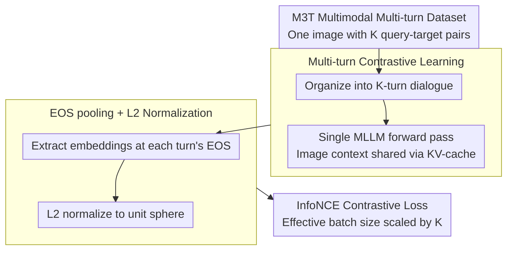

# MuCo: Multi-turn Contrastive Learning for Multimodal Embedding Model

**Conference**: CVPR 2026  
**arXiv**: [2602.06393](https://arxiv.org/abs/2602.06393)  
**Code**: [https://github.com/naver-ai/muco](https://github.com/naver-ai/muco)  
**Area**: Information Retrieval  
**Keywords**: Multimodal Embedding, Contrastive Learning, Multi-turn Dialogue, Retrieval, Multimodal Large Language Models

## TL;DR

MuCo proposes a multi-turn contrastive learning framework that leverages the conversational capabilities of MLLMs to process multiple associated query-target pairs in a single forward pass. This significantly improves training efficiency and achieves SOTA performance on MMEB and M-BEIR retrieval benchmarks.

## Background & Motivation

**Background**: Universal Multimodal Embedding Models, built on Multimodal Large Language Models (MLLMs), typically employ contrastive learning to align representations of query-target pairs across different modalities. These models have achieved significant success in tasks such as image-text retrieval and visual question-answering retrieval.

**Limitations of Prior Work**: Existing methods are based on a "single-turn" paradigm, where each query-target pair is treated as an independent data point. This results in two core issues: (1) low computational efficiency, as each pair requires a separate forward pass; and (2) neglect of potential contextual relationships between multiple queries associated with the same context (e.g., the same image).

**Key Challenge**: MLLMs inherently possess multi-turn dialogue capabilities, yet existing multimodal embedding training paradigms completely fail to exploit this feature. The single-turn paradigm limits the effective batch size and fails to capture shared contextual information across multiple semantic dimensions associated with the same image.

**Goal**: To design a training framework capable of processing multiple sets of query-target pairs associated with the same image in a single forward pass while extracting multiple embedding representations, thereby amplifying the effective batch size and enhancing the coherence of cross-modal representations.

**Key Insight**: It is observed that MLLMs support multi-turn dialogues during inference, where each response is conditioned on a shared context. If each query-target pair in embedding learning is analogized to a turn of interaction in a dialogue, multiple embeddings can be extracted in one forward pass.

**Core Idea**: Upgrade contrastive learning from "single-turn independent" to "multi-turn dialogue." By simultaneously encoding multiple associated queries and targets in a single MLLM forward pass and sharing the image context representation, both training efficiency and representation quality are improved.

## Method

### Overall Architecture

MuCo addresses the inefficiency of single-turn contrastive learning. Traditional paradigms treat each query-target pair as an independent data point, leading to redundant image encoding and batch size limitations. MuCo analogizes each pair in embedding learning to a "turn" in a conversation. Given an image and its multiple associated query-target pairs, they are organized into a multi-turn dialogue and fed into the MLLM for a **single** forward pass. The model extracts embeddings at the EOS position of each turn. Consequently, one forward pass yields multiple query and target embeddings, which are then used in a contrastive loss with in-batch negative sampling. This pipeline requires almost no modifications to the MLLM architecture, only changing data organization and embedding extraction.

### Key Designs

**1. Multi-turn Contrastive Learning: Generating $K$ times the contrastive signals per pass**

The bottleneck of the single-turn paradigm is that each query-target pair requires a separate forward pass, repeatedly re-encoding the image context, which is slow and limits the effective batch size. The MuCo mechanism takes an image $I$ and $K$ associated pairs $\{(q_k, t_k)\}_{k=1}^K$, organizes them into a $K$-turn dialogue for simultaneous input, and encodes each query and target into embeddings. A single forward pass retrieves all $K$ pairs of embeddings:

$$\{(q_k, t_k)\}_{k=1}^K \xrightarrow{\text{Single Forward Pass}} \{(\mathbf{e}_{q_k}, \mathbf{e}_{t_k})\}_{k=1}^K$$

This effectively scales the batch size by $K$, as each sample contributes $K$ contrastive pairs. Efficiency is gained by reusing the KV-cache; the image context is encoded once and shared across subsequent turns, eliminating $(K-1)/K$ of redundant image computation. Additionally, multi-turn contextual dependencies force the model to learn coherent representations across different semantic dimensions of the same image.

**2. M3T Multimodal Multi-turn Dataset: Raw materials for multi-turn training**

Multi-turn contrastive learning requires "one image with multiple pairs" data, which is not provided by existing single-turn datasets. The authors constructed the M3T (Multimodal Multi-Turn) dataset with 5 million samples. Each sample contains one image and multiple associated query-target pairs covering tasks like image-text retrieval, VQA, and captioning. These are integrated from existing sources and expanded to ensure that multiple pairs under the same image focus on different semantic dimensions, providing comparative value across turns.

**3. EOS pooling + L2 Normalization: Extracting comparable embeddings from multi-turn outputs**

As multi-turn dialogues result in long hidden states, a specific position must represent the semantics of each turn. MuCo performs pooling at the EOS token of each turn, where the response is complete and semantics are most integrated. The extracted representations are L2-normalized to ensure all embeddings reside on the same unit sphere with consistent geometric scales. During inference, this approach is compatible with both single-turn queries used in standard benchmarks and multi-turn batch queries.

### Loss & Training

The training objective is the standard InfoNCE contrastive loss, with the critical difference that the effective batch size is amplified by $K$. All query-target pairs extracted from all samples and turns within a batch participate in in-batch negative sampling. Each query treats all targets in the batch other than its corresponding target as negative examples. Training is performed using DeepSpeed for distribution, covering model scales of 2B and 7B.

## Key Experimental Results

### Main Results

| Benchmark | Metric | MuCo-2B | MuCo-7B | Prev. SOTA | Gain |
|------|------|---------|---------|----------|------|
| MMEB | Avg Score | 70.1 | 74.2 | ~69 | +1.1 / +5.2 |
| M-BEIR | Recall@10 | - | SOTA | - | Significant |

### Ablation Study

| Configuration | MMEB Score | Description |
|------|-----------|------|
| Single-turn baseline | ~68 | Traditional single-turn contrastive learning |
| MuCo (K=2) | ~69.5 | 2 dialogue turns per sample |
| MuCo (K=4) | 70.1 | 4 dialogue turns per sample, optimal config |
| MuCo w/o M3T | ~68.5 | Without using M3T dataset |
| MuCo full (7B) | 74.2 | Full configuration + Large model |

### Key Findings

- Improvements from multi-turn contrastive learning scale with the number of turns $K$, reaching an optimal balance at approximately $K=4$.
- The multi-turn format of the M3T dataset is crucial; using the multi-turn framework with single-turn data yields limited gains.
- The 2B model reaches a score of 70.1, and the 7B model further improves to 74.2, demonstrating the framework's effectiveness across different scales.
- Training efficiency is significantly enhanced: compared to processing $K$ times the number of single-turn samples, MuCo reduces image encoding computation by approximately $(K-1)/K$.

## Highlights & Insights

- The **dialogue-as-batch** concept is ingenious: reinterpreting the multi-turn capability of MLLMs as "batch embedding extraction" is simple yet effective, requiring nearly no architectural changes.
- Sharing image context naturally encourages the model to learn multifaceted representations of an image. Different queries focus on different semantic dimensions of the same image, facilitating the learning of a richer embedding space.
- This approach can be migrated to any MLLM-based embedding learning scenario, such as document or code retrieval, provided that multiple query-target pairs can be constructed for a single context.

## Limitations & Future Work

- Multi-turn training requires multiple high-quality query-target pairs per sample, which increases the cost of data construction.
- The scale and diversity of the current M3T dataset still have room for improvement; larger-scale multi-turn data may yield further benefits.
- Validation was primarily focused on retrieval tasks; embedding quality in generative tasks (e.g., VQA generation, captioning) remains to be explored.
- Whether the order of turns affects embedding quality was not deeply analyzed regarding sensitivity to turn permutation.

## Related Work & Insights

- **vs E5-V / VLM2Vec**: These methods use single-turn contrastive learning where each pair is encoded independently. MuCo achieves higher efficiency and performance by obtaining more contrastive signals under the same computational constraints.
- **vs CLIP**: CLIP is a classic cross-modal method using independent encoders. MuCo is based on a unified MLLM, inherently supporting multimodal fusion reasoning.
- **vs UniIR**: UniIR unifies various retrieval tasks but still follows a single-turn paradigm. MuCo's multi-turn strategy could serve as an upgrade for its training efficiency.
- The core idea—"leveraging existing model capabilities (dialogue) to enhance training efficiency"—offers inspiration for other MLLM fine-tuning scenarios.

## Rating

- Novelty: ⭐⭐⭐⭐ The perspective of multi-turn dialogue contrastive learning is novel, though the technical implementation is relatively direct.
- Experimental Thoroughness: ⭐⭐⭐⭐ Validated on MMEB and M-BEIR, though ablation analysis could be more granular.
- Writing Quality: ⭐⭐⭐⭐ Clear methodology and a complete logical chain for motivation.
- Value: ⭐⭐⭐⭐ Provides a general solution for improving multimodal embedding training efficiency with high practicality.

<!-- RELATED:START -->

## Related Papers

- [\[CVPR 2026\] β-CLIP: Text-Conditioned Contrastive Learning for Multi-Granular Vision-Language Alignment](b-clip_text-conditioned_contrastive_learning_for_multi-granular_vision-language_.md)
- [\[CVPR 2026\] Multi-Hierarchical Contrastive Spectral Fusion for Multi-View Clustering](multi-hierarchical_contrastive_spectral_fusion_for_multi-view_clustering.md)
- [\[CVPR 2026\] ProM3E: Probabilistic Masked MultiModal Embedding Model for Ecology](prom3e_probabilistic_masked_multimodal_embedding_model_for_ecology.md)
- [\[CVPR 2026\] LLaVAShield: Safeguarding Multimodal Multi-Turn Dialogues in Vision-Language Models](llavashield_multimodal_multiturn_safety.md)
- [\[CVPR 2026\] Global-Graph Guided and Local-Graph Weighted Contrastive Learning for Unified Clustering on Incomplete and Noise Multi-View Data](global-graph_guided_and_local-graph_weighted_contrastive_learning_for_unified_cl.md)

<!-- RELATED:END -->
