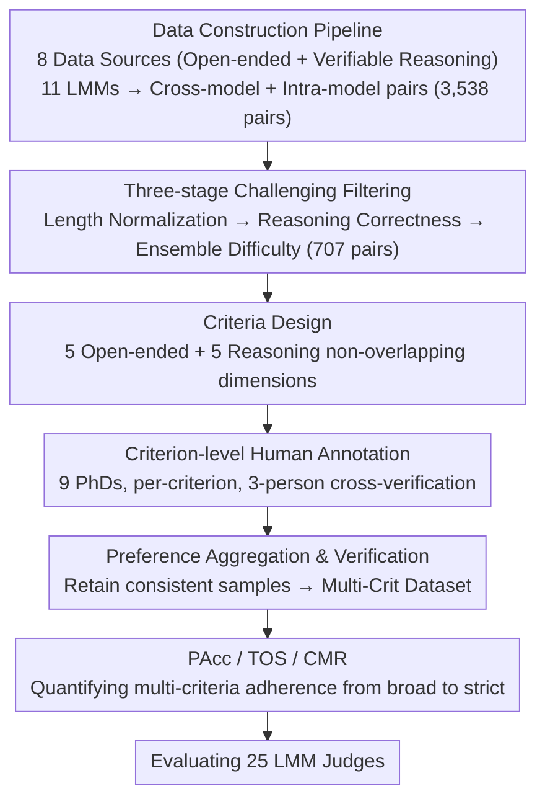

# Multi-Crit: Benchmarking Multimodal Judges on Pluralistic Criteria-Following

**Conference**: CVPR 2026  
**arXiv**: [2511.21662](https://arxiv.org/abs/2511.21662)  
**Code**: [https://multi-crit.github.io](https://multi-crit.github.io)  
**Area**: Multimodal VLM  
**Keywords**: LMM-as-Judge, multi-criteria evaluation, benchmark, preference conflict, evaluation reliability

## TL;DR

The authors construct Multi-Crit, the first benchmark for evaluating the multi-criteria following capabilities of multimodal Judge models. It includes criterion-level human annotations and preference conflict samples. Using three new metrics—PAcc, TOS, and CMR—they evaluate 25 LMMs, revealing that even the strongest closed-source model achieves only 32.78% multi-criteria consistency on open-ended generation tasks.

## Background & Motivation

**Background**: The LMM-as-a-Judge paradigm is widely used for automated evaluation and RLHF feedback. Given a multimodal prompt, model responses, and predefined evaluation criteria, the Judge model outputs preference judgments with natural language justifications. This paradigm has been adopted by numerous multimodal benchmarks and specialized Judge/Critic models fine-tuned to provide AI feedback.

**Limitations of Prior Work**: Existing multimodal Judge benchmarks (e.g., VL-Rewardbench, MM-RLHF Bench) only provide a single holistic preference label. This coarse-grained annotation fails to capture the essence of multi-dimensional evaluation—trade-offs between responses across different criteria, such as one response being concise but containing factual errors, while another is detailed but redundant. A single label obscures these nuances.

**Key Challenge**: The reliability of a Judge model depends on two factors: (1) alignment with human judgment; and (2) flexible adherence to diverse, task-specific evaluation criteria. While prior work focuses on the former, it significantly neglects the latter. Whether Judge models truly follow given criteria or can correctly judge in the face of preference conflicts across criteria remains systematically unstudied.

**Goal**: (1) Construct evaluation data containing multi-criteria human annotations and inter-criteria preference conflicts. (2) Systematically measure the multi-criteria following capabilities of Judge models.

**Key Insight**: Multi-criteria evaluation + conflict detection—allowing human annotators to independently label preferences for each criterion naturally exposes preference conflicts between dimensions.

**Core Idea**: Build a challenging benchmark, Multi-Crit, with criterion-level human annotations, and design three new metrics—PAcc, TOS, and CMR—to systematically evaluate the performance and bottlenecks of 25 models in multi-criteria following.

## Method

### Overall Architecture

Multi-Crit addresses a question avoided by existing Judge benchmarks: can a Judge make judgments consistent with humans on a per-criterion basis when two responses have strengths in different dimensions? It decomposes traditional pairwise preference evaluation from a "single holistic label" into "one label per criterion." While traditional benchmarks use the format $(q, l_a, l_b, y)$, Multi-Crit extends this to $(q, l_a, l_b, \{(c_i, y_i)\}_{i=1}^{K_q})$, where $c_i$ represents an evaluation criterion and $y_i$ indicates the preferred response under that criterion. This allows the same pair of responses to point to different winners across criteria, explicitly preserving inter-criteria conflicts.

The construction pipeline begins with collecting prompts from multiple sources, generating and pairing candidate responses using various LMMs, filtering out "obvious" samples through three stages, and finally employing 9 CS PhDs for per-criterion human annotation.

### Key Designs

**1. Data Construction Pipeline: Covering distinct multimodal tasks**
Prompts span two major scenarios: open-ended generation (ImageInWords, DOCCI, WildVision-Bench/-Battle) and verifiable reasoning (MathVerse, MM-K12, EMMA-mini, VisualPuzzles), totaling 8 datasets. Candidate responses are generated by 11 high-performance LMMs (e.g., GPT-4o, Gemini-1.5-Flash, Qwen2.5-VL, InternVL2). Pairs include both cross-model pairs to capture systematic differences and intra-model pairs (generated via temperature sampling) to capture quality fluctuations within the same model, resulting in 3,538 initial pairs.

**2. Three-stage Challenging Filtering: Removing "obvious" samples**
Filtering is performed in three layers: First, length normalization excludes response pairs with length ratios outside $[0.7, 1.4]$ to prevent Judges from using length as a shortcut. Second, reasoning correctness filtering uses GPT-4o-mini to verify answers, retaining only samples where both responses are either simultaneously correct or incorrect, ensuring the evaluation focuses on response quality rather than factual correctness. Third, ensemble difficulty filtering excludes samples where GPT-4o, Gemini-1.5-Flash, and Claude-3.5-Sonnet show unanimous agreement, leaving 707 challenging samples with fine-grained criterion differences.

**3. Criteria Design: Non-overlapping capability dimensions**
Criteria were selected based on utility, specificity (non-overlap), and generality. Five criteria were defined for open-ended generation: Completeness & Coverage, Visual Grounding & Details, Factuality / No Hallucination, Creativity & Expressiveness, and Clarity & Coherence. Five separate criteria were defined for verifiable reasoning: Visual Grounding, Logic Coherence & Consistency, Factuality / No Hallucination, Reflection & Exploration, and Conciseness & Efficiency.

**4. PAcc / TOS / CMR: Hierarchical metrics for multi-criteria adherence**
- **PAcc (Pluralistic Adherence Accuracy)**: Requires the Judge to be correct on **all** criteria for a given prompt:
  $$\text{PAcc} = \frac{1}{|X|} \sum_{x \in X} \mathbb{I}\Big[\bigwedge_{c \in C_x} \hat{y}_{x,c} = y_{x,c}\Big]$$
- **TOS (Trade-Off Sensitivity)**: Measures if the Judge "realizes" that different criteria should point to different winners in samples with conflicts. It checks if the Judge outputs opposite preference directions for at least one pair of conflicting criteria.
- **CMR (Conflict Matching Rate)**: The strictest metric, requiring the Judge to not only detect a conflict but also match the human preference direction for those specific conflicting criteria.

### Loss & Training

(Note: The paper focuses on benchmarking. The following describes annotation quality control.)
The annotation team consisted of 9 CS PhDs with backgrounds in Multimodal AI and STEM. After a 20-sample calibration phase, each sample was cross-verified by 3 annotators. Ties were limited to under 10%. Only samples with full consensus or majority consensus (with the third being a tie) were retained. The final dataset involved 289 hours of annotation, achieving a Cohen's $\kappa$ of 0.718 (Open-ended) and 0.805 (Reasoning).

## Key Experimental Results

### Main Results: Open-Ended Split

| Model | PAcc(%) | CMR(%) | TOS(%) | Avg. Criteria(%) |
|------|---------|--------|--------|------------|
| o4-mini | **32.78** | **43.11** | 64.56 | **69.67** |
| Claude-3.7-Sonnet | 31.77 | 42.32 | 64.08 | 67.37 |
| GPT-4o | 31.44 | 44.91 | **66.02** | 69.57 |
| InternVL3.5-38B (Best Open-source) | 30.43 | 33.73 | 64.08 | 65.10 |
| R1-Reward-7B (Best Fine-tuned) | 17.73 | 20.36 | 45.63 | 55.83 |

### Main Results: Reasoning Split

| Model | PAcc(%) | CMR(%) | TOS(%) | Avg. Criteria(%) |
|------|---------|--------|--------|------------|
| o4-mini | **53.17** | **65.84** | 83.49 | **80.85** |
| GPT-5 | 45.24 | 56.58 | 78.90 | 77.41 |
| InternVL3.5-38B (Best Open-source) | 37.30 | 47.69 | 75.23 | 69.82 |

### Ablation Study: Impact of Critic Fine-tuning (Open-Ended)

| Model | Completeness | Grounding | Hallucination | Expressiveness | Clarity | Avg |
|------|-------------|-----------|---------------|----------------|---------|-----|
| Qwen2.5-VL-7B (base) | 56.12 | 51.70 | 48.20 | 64.12 | 51.82 | 54.39 |
| R1-Reward-7B | 59.29 | **60.71** | 49.72 | 55.44 | 53.98 | 55.83 |
| LLaVA-Critic-R1-7B | 55.31 | **57.59** | 46.96 | 63.73 | 55.11 | 55.74 |

All Qwen-based fine-tuned Judges show consistent improvements in Visual Grounding (51.70 → 57.59~60.71), but performance on other criteria is inconsistent or declines.

### Key Findings

- **Multi-criteria judgment is extremely difficult**: The strongest model (o4-mini) achieves only 32.78% PAcc in open-ended tasks, indicating that SOTA models fail to judge correctly across all criteria simultaneously.
- **Open-ended tasks are harder than reasoning**: Performance is significantly lower on open-ended tasks, reflecting their subjective nature and higher demand for fine-grained visual perception.
- **Open-source models struggle with conflict detection**: CMR drops by ~9.4 points (open) and 18.1 points (reasoning) when moving from closed to open-source models, a much larger gap than seen in per-criterion accuracy.
- **Critic fine-tuning only benefits Visual Grounding**: Fine-tuned Judges improve in Grounding but show limited or negative results in other criteria and conflict resolution, likely because training signals rely on holistic preferences.
- **Reasoning fine-tuning weakens trade-off awareness**: Models fine-tuned with GRPO show improved logic but lower TOS and CMR, suggesting that holistic accuracy rewards may harm multi-criteria sensitivity.

## Highlights & Insights

- First multimodal Judge benchmark with criterion-level annotations; 68.9% (open) and 86.5% (reasoning) of samples contain preference conflicts.
- The PAcc/TOS/CMR metrics provide a tiered evaluation of capabilities, exposing systematic flaws that holistic accuracy cannot reflect.
- 289 hours of high-quality human annotation with substantial agreement (Cohen's $\kappa$ 0.718/0.805).
- Insights into "Critic fine-tuning only improving Grounding" suggest that future Judge training requires criterion-level signals rather than holistic preferences.

## Limitations & Future Work

- Restricted to pairwise comparison; multi-criteria pointwise scoring remains to be explored.
- Criteria are general; domain-specific criteria (medical, legal) should be extended.
- High annotation costs necessitate semi-automated pipelines for scaling.
- Limited only to generative Judges; the multi-criteria capability of BT-style reward models requires study.

## Related Work & Insights

- **LMM-as-a-Judge**: Prior work (LLaVA-Critic, R1-Reward) successfully fine-tuned open-source alternatives, but relied on holistic preference signals.
- **Judge Benchmarks**: VL-Rewardbench and MM-RLHF Bench expanded evaluation scenarios but remained limited to single preference labels.
- **Criteria Following**: Multi-Crit extends concepts from the text LLM domain to the multimodal space, introducing explicit conflict detection.

## Rating

- Novelty: ⭐⭐⭐⭐
- Experimental Thoroughness: ⭐⭐⭐⭐⭐
- Writing Quality: ⭐⭐⭐⭐
- Value: ⭐⭐⭐⭐

<!-- RELATED:START -->

## Related Papers

- [\[CVPR 2026\] GraphVLM: Benchmarking Vision Language Models for Multimodal Graph Learning](graphvlm_benchmark_vlm_graph_learning.md)
- [\[CVPR 2026\] ARGUS: Defending Against Multimodal Indirect Prompt Injection via Steering Instruction-Following Behavior](argus_defending_against_multimodal_indirect_prompt_injection_via_steering_instru.md)
- [\[CVPR 2026\] VLIC: Vision-Language Models As Perceptual Judges for Human-Aligned Image Compression](vlic_vision-language_models_as_perceptual_judges_for_human-aligned_image_compres.md)
- [\[CVPR 2026\] ProSoftArena: Benchmarking Hierarchical Capabilities of Multi-modal Agents in Professional Software Environments](prosoftarena_benchmarking_hierarchical_capabilities_of_multi-modal_agents_in_pro.md)
- [\[ICCV 2025\] MM-IFEngine: Towards Multimodal Instruction Following](../../ICCV2025/multimodal_vlm/mm-ifengine_towards_multimodal_instruction_following.md)

<!-- RELATED:END -->
## Related Papers

- [\[CVPR 2026\] CRIT: Graph-Based Automatic Data Synthesis to Enhance Cross-Modal Multi-Hop Reasoning](crit_graph-based_automatic_data_synthesis_to_enhance_cross-modal_multi-hop_reaso.md)
- [\[CVPR 2026\] GraphVLM: Benchmarking Vision Language Models for Multimodal Graph Learning](graphvlm_benchmark_vlm_graph_learning.md)
- [\[CVPR 2026\] ARGUS: Defending Against Multimodal Indirect Prompt Injection via Steering Instruction-Following Behavior](argus_defending_against_multimodal_indirect_prompt_injection_via_steering_instru.md)
- [\[ICCV 2025\] MM-IFEngine: Towards Multimodal Instruction Following](../../ICCV2025/multimodal_vlm/mm-ifengine_towards_multimodal_instruction_following.md)
- [\[CVPR 2026\] ProSoftArena: Benchmarking Hierarchical Capabilities of Multi-modal Agents in Professional Software Environments](prosoftarena_benchmarking_hierarchical_capabilities_of_multi-modal_agents_in_pro.md)

<!-- RELATED:END -->
